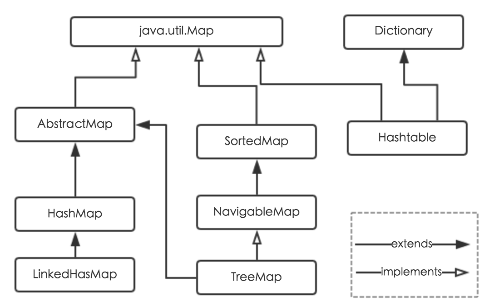

# Java JDK源码解析 #

*声明:*

*本文档系作者自己的理解，如有纰漏欢迎指出，请联系[jerehao@126.com](mailto:jerehao@126.com)。*

*本文档中若有引用，出处作者已尽可能标明，如有漏标、误标或侵权，请联系作者更改。*

*转载请注明作者 [jerehao](http://jerehao.com) 谢谢。*

## 1. 集合类型--Map ##

各Map类的继承图：

<div align=center></div>

### 1.1 AbstractMap (JDK 1.8) ###

Map类的 entrySet, values 和 keySet 都不是采用同步（插入删除同步）的方法实现的，而是根据迭代器生成集合的方法实现的。

**entrySet**

entrySet 是根据抽象方法获得，需要子类实现。

```java
public abstract Set<Entry<K,V>> entrySet();
```

**values**

values 由 AbstractCollection 和 entrySet().iterator() 生成。

```java
public Collection<V> values() {
    Collection<V> vals = values;
    if (vals == null) {
        vals = new AbstractCollection<V>() { //抽象集合
            public Iterator<V> iterator() {
                return new Iterator<V>() {
                    private Iterator<Entry<K,V>> i = entrySet().iterator();

                    public boolean hasNext() {
                        return i.hasNext();
                    }

                    public V next() {
                        return i.next().getValue();
                    }

                    public void remove() {
                        i.remove();
                    }
                };
            }

            public int size() {
                return AbstractMap.this.size();
            }

            public boolean isEmpty() {
                return AbstractMap.this.isEmpty();
            }

            public void clear() {
                AbstractMap.this.clear();
            }

            public boolean contains(Object v) {
                return AbstractMap.this.containsValue(v);
            }
        };
        values = vals;
    }
    return vals;
}
```

**keySet**

values 由 AbstractSet和 entrySet().iterator() 生成。

```java
public Set<K> keySet() {
    Set<K> ks = keySet;
    if (ks == null) {
        ks = new AbstractSet<K>() {	// 抽象Set
            public Iterator<K> iterator() {
                return new Iterator<K>() {
                    private Iterator<Entry<K,V>> i = entrySet().iterator();

                    public boolean hasNext() {
                        return i.hasNext();
                    }

                    public K next() {
                        return i.next().getKey();
                    }

                    public void remove() {
                        i.remove();
                    }
                };
            }

            public int size() {
                return AbstractMap.this.size();
            }

            public boolean isEmpty() {
                return AbstractMap.this.isEmpty();
            }

            public void clear() {
                AbstractMap.this.clear();
            }

            public boolean contains(Object k) {
                return AbstractMap.this.containsKey(k);
            }
        };
        keySet = ks;
    }
    return ks;
}
```


### 1.1 HashMap（JDK 1.8） ###

**存储结构**

HashMap使用数组+链表+红黑树的方式存储，链表和红黑树是用来处理哈希冲突的数据结构。

数组的每个元素称之为桶（bucket）或箱（bin），以下统一称之为箱，每个箱通过链表或红黑树的结构可以容纳若干个结点值。使用`Node<K,V>[] table`表示箱数组，存储链表的第一个结点或红黑树的根结点，当没有结点是存储`null`，具体结构和结构实现：

```java
transient Node<K,V>[] table;	//箱数组

static class Node<K,V> implements Map.Entry<K,V> {
    final int hash;
    final K key;
    V value;
    Node<K,V> next;		//链表的next指针

    //方法省略......
}
```

箱数组有默认的初始化大小`static final int DEFAULT_INITIAL_CAPACITY = 1 << 4`，也可以通过构造函数设置初始化大小，若这个值不为2的次幂，则会通过一系列位移操作，使之转化为比这个值大且最接近这个值的2次幂值，具体实现看下面的源码：

```java
static final int tableSizeFor(int cap) {
    int n = cap - 1;
    n |= n >>> 1;
    n |= n >>> 2;
    n |= n >>> 4;
    n |= n >>> 8;
    n |= n >>> 16;
    return (n < 0) ? 1 : (n >= MAXIMUM_CAPACITY) ? MAXIMUM_CAPACITY : n + 1;
}
```

上面的源码的一系列位移操作实质就是将`cap - 1`二进制表示最高位的1之后全部用1填满，最后再加1就得到了大于等于cap且最近进cap的2次幂数。第8行源码也可以看出箱数组长度最小为1，最大为`static final int MAXIMUM_CAPACITY = 1 << 30;`。

理想情况下，箱数组中每个箱最多装有一个结点，查找复杂度为 O(1) 。但哈希冲突目前是不可避免的，一旦冲突每个箱就要存多个结点，当结点个数越多，平均查找长度就越大。当结点较少时，HashMap使用链表处理冲突，当结点数超过一定的个数时，HashMap就会执行树形化或扩容的操作（请查看[树形化](树形化)和[扩容](扩容)），树形化后的树结点结构要比链表结点复杂，树结点继承了链表结点，具体源码：

```java
static final class TreeNode<K,V> extends LinkedHashMap.Entry<K,V> {
    TreeNode<K,V> parent;  	// 父结点
    TreeNode<K,V> left;		// 左子结点
    TreeNode<K,V> right;	// 右子结点
    TreeNode<K,V> prev;    	// 前一个结点，与next相对
    boolean red; 			// 颜色
    
    //方法省略......
}

//LinkedHashMap.Entry<K,V> 实现
static class Entry<K,V> extends HashMap.Node<K,V> {
    Entry<K,V> before, after;	//记录插入顺序
    
    //方法省略......
}
```

**构造函数**

HashMap有4个构造函数，其中前三个功能相同，只是默认参数的重载，第四个是根据一个已有Map初始化HashMap。

```java
	public HashMap(int initialCapacity, float loadFactor) {
        if (initialCapacity < 0)	//初始化容量不合法，这里容量即箱数组长度
            throw new IllegalArgumentException("Illegal initial capacity: " +
                                               initialCapacity);
        if (initialCapacity > MAXIMUM_CAPACITY)	//初始化容量超过最大值
            initialCapacity = MAXIMUM_CAPACITY;
        if (loadFactor <= 0 || Float.isNaN(loadFactor))	//装填因子不合法
            throw new IllegalArgumentException("Illegal load factor: " +
                                               loadFactor);
        this.loadFactor = loadFactor;
        this.threshold = tableSizeFor(initialCapacity);
    }

    public HashMap(int initialCapacity) {
        this(initialCapacity, DEFAULT_LOAD_FACTOR);
    }

    public HashMap() {
        this.loadFactor = DEFAULT_LOAD_FACTOR;
    }

    public HashMap(Map<? extends K, ? extends V> m) {	//根据已有Map初始化
        this.loadFactor = DEFAULT_LOAD_FACTOR;
        putMapEntries(m, false);
    }

    final void putMapEntries(Map<? extends K, ? extends V> m, boolean evict) {
        int s = m.size();
        if (s > 0) {
            if (table == null) { // 初始化参数
                float ft = ((float)s / loadFactor) + 1.0F; //求初始化箱数组长度
                int t = ((ft < (float)MAXIMUM_CAPACITY) ?
                         (int)ft : MAXIMUM_CAPACITY);
                if (t > threshold)	//重置门限值，即初始化箱数组长度
                    threshold = tableSizeFor(t);
            }
            else if (s > threshold) //扩容
                resize();
            for (Map.Entry<? extends K, ? extends V> e : m.entrySet()) {
                K key = e.getKey();
                V value = e.getValue();
                putVal(hash(key), key, value, false, evict);
            }
        }
    }
```

可以看到HashMap的构造函数只是设置了初始化参数，实际申请箱数组空间是在第一次 put/merge/compute/computeIfAbsent 值之后。

**put 操作**

这里直接看源码，注意哈希值的计算方法。

```java
public V put(K key, V value) {
    return putVal(hash(key), key, value, false, true);
}

//重新计算哈希值
static final int hash(Object key) {
    int h;
    //使用高16位异或低16位，确保在箱数组大小小于2的16次方前让高位也参与到哈希中来
    //好处是当低位相同时，高位可以避免过早的冲突发生
    return (key == null) ? 0 : (h = key.hashCode()) ^ (h >>> 16);
}

final V putVal(int hash, K key, V value, boolean onlyIfAbsent,
               boolean evict) {
    Node<K,V>[] tab; Node<K,V> p; int n, i;
    if ((tab = table) == null || (n = tab.length) == 0)	//箱数组长度为0时初始化
        n = (tab = resize()).length;
    if ((p = tab[i = (n - 1) & hash]) == null)	// (n - 1) & hash 相当于 hash % n
        tab[i] = newNode(hash, key, value, null);	// 此箱还没有结点
    else {
        Node<K,V> e; K k;
        if (p.hash == hash &&
            ((k = p.key) == key || (key != null && key.equals(k)))) //存在完全相同的key
            e = p;
        else if (p instanceof TreeNode)	//树型箱
            e = ((TreeNode<K,V>)p).putTreeVal(this, tab, hash, key, value);
        else {	//链型箱
            for (int binCount = 0; ; ++binCount) { //遍历链表找链表最后一个元素插入
                if ((e = p.next) == null) {
                    p.next = newNode(hash, key, value, null);
                    if (binCount >= TREEIFY_THRESHOLD - 1) // 插入后，此箱达到树形化阈值
                        treeifyBin(tab, hash);
                    break;
                }
                if (e.hash == hash &&
                    ((k = e.key) == key || (key != null && key.equals(k))))
                    break;
                p = e;
            }
        }
        if (e != null) { //存在完全相同的key，更新value值
            V oldValue = e.value;
            if (!onlyIfAbsent || oldValue == null)	//仅空缺时更改位false 或 value为null
                e.value = value;
            afterNodeAccess(e);
            return oldValue;
        }
    }
    ++modCount;
    if (++size > threshold) //总结点数达到门限值
        resize();
    afterNodeInsertion(evict);
    return null;
}
```

以上可以知道，保证箱数组长度（源码中使用 n 表示）为2的次幂大小的优点之一就是，可以使用位操作`(n - 1) & hash`代替求余操作`hash % n`。另一个比较重要的优点就是优化了扩容时重新分配结点位置的操作。

```
// 下面的hash值都是经过高16位异或低16位后的值
hash1 = 00000000 00000000 00000000 10100101
hash2 = 00000000 00000000 00000000 10110101
// n = 16 时，hash1和hash2的箱数组下标分别为
hash1 & 16 - 1 = hash1 & 1111 = 0101
hash2 & 16 - 1 = hash2 & 1111 = 0101
//此时它们在一个箱中，当发生扩容时，n = 32，hash1和hash2的箱数组下标又分别为
hash1 & 32 - 1 = hash1 & 11111 = 00101
hash2 & 32 - 1 = hash2 & 11111 = 10101
//也就是hash1仍在原来的箱中，而hash2位于原来的箱数组下标+16位置的箱中
//每次扩容时，每个结点只有两种可能，要么在原来的箱中，要么在原来的位置+原箱数组大小的位置的箱中，
//取决于而这求余最高为位0还是为1，这个判断只需要用 hash & n 即可，
//对于上例，也就是hash & 16，得到0则扩容32后仍在原箱，否则在原位+16后的高位箱
```

**删除操作**

```java
public V remove(Object key) {
    Node<K,V> e;
    return (e = removeNode(hash(key), key, null, false, true)) == null ?
        null : e.value;
}

final Node<K,V> removeNode(int hash, Object key, Object value,
                           boolean matchValue, boolean movable) {
    Node<K,V>[] tab; Node<K,V> p; int n, index;
    if ((tab = table) != null && (n = tab.length) > 0 &&
        (p = tab[index = (n - 1) & hash]) != null) { //可能含有要删除的Key
        Node<K,V> node = null, e; K k; V v;
        if (p.hash == hash &&
            ((k = p.key) == key || (key != null && key.equals(k))))	//找到完全相同的Key
            node = p;
        else if ((e = p.next) != null) {	//遍历查找
            if (p instanceof TreeNode)
                node = ((TreeNode<K,V>)p).getTreeNode(hash, key);	//树型查找
            else {
                do {	//链型查找
                    if (e.hash == hash &&
                        ((k = e.key) == key ||
                         (key != null && key.equals(k)))) {
                        node = e;
                        break;
                    }
                    p = e;
                } while ((e = e.next) != null);
            }
        }
        if (node != null && (!matchValue || (v = node.value) == value ||
                             (value != null && value.equals(v)))) {	//符合结点删除条件
            if (node instanceof TreeNode)
                ((TreeNode<K,V>)node).removeTreeNode(this, tab, movable);	//树型删除，
            												//可能会有逆树型化操作
            else if (node == p)	//是头结点
                tab[index] = node.next;
            else
                p.next = node.next;
            ++modCount;
            --size;
            afterNodeRemoval(node);
            return node;
        }
    }
    return null;
}

//删除所有元素
public void clear() {
    Node<K,V>[] tab;
    modCount++;
    if ((tab = table) != null && size > 0) {
        size = 0;
        for (int i = 0; i < tab.length; ++i)	//直接遍历清空置null
            tab[i] = null;
    }
}
```

清空所有元素时，直接遍历数组设 null 值即可。

**查找操作**

```java
public V get(Object key) {
    Node<K,V> e;
    return (e = getNode(hash(key), key)) == null ? null : e.value;
}

final Node<K,V> getNode(int hash, Object key) {
    Node<K,V>[] tab; Node<K,V> first, e; int n; K k;
    if ((tab = table) != null && (n = tab.length) > 0 &&
        (first = tab[(n - 1) & hash]) != null) {
        if (first.hash == hash && // 总是检查第一个结点是否是目标结点
            ((k = first.key) == key || (key != null && key.equals(k))))
            return first;
        if ((e = first.next) != null) {
            if (first instanceof TreeNode)
                return ((TreeNode<K,V>)first).getTreeNode(hash, key);	//树型查找
            do { //链型查找
                if (e.hash == hash &&
                    ((k = e.key) == key || (key != null && key.equals(k))))
                    return e;
            } while ((e = e.next) != null);
        }
    }
    return null;
}

static final class TreeNode<K,V> extends LinkedHashMap.Entry<K,V> {
    
    final TreeNode<K,V> getTreeNode(int h, Object k) {
        return ((parent != null) ? root() : this).find(h, k, null);
    }
    
    final TreeNode<K,V> find(int h, Object k, Class<?> kc) {
        TreeNode<K,V> p = this;
        do {
            int ph, dir; K pk;
            TreeNode<K,V> pl = p.left, pr = p.right, q;
            if ((ph = p.hash) > h) // h 小
                p = pl;
            else if (ph < h) //h 大
                p = pr;
            else if ((pk = p.key) == k || (k != null && k.equals(pk))) // h 相同，且值相同
                return p;
            else if (pl == null) //h 相同，值不同
                p = pr;
            else if (pr == null) //h 相同，值不同
                p = pl;
            else if ((kc != null ||
                      (kc = comparableClassFor(k)) != null) &&	 //h 相同，左右子都不为 null
                     (dir = compareComparables(kc, k, pk)) != 0) //根据Comparable接口比大小
                p = (dir < 0) ? pl : pr;
            else if ((q = pr.find(h, k, kc)) != null) 	//h 相同，也没实现Comparable接口，
                return q;                				//右子树遍历查找
            else //h 相同，也没实现Comparable接口，左子树遍历查找
                p = pl;
        } while (p != null);
        return null;
    }
}
```

**树形化**

树形化有两个关键的参数，一个是树形化限值`static final int TREEIFY_THRESHOLD = 8`，一个是最小树形化容量`static final int MIN_TREEIFY_CAPACITY = 64`。当冲突的结点数达到 TREEIFY_THRESHOLD 时，并不一定会树形化，若箱数组长度小于 MIN_TREEIFY_CAPACITY 则会执行扩容操作（扩容后若冲突结点数量未发生变化即仍达到 TREEIFY_THRESHOLD ，则会等到下一次插入到此冲突箱时执行树形化，所以树形化时冲突结点数目可能为 8,9,10或11，当然 9,10,11 的情况发生概率很小）。

所以**树形化条件**是：<u>某次 put/merge/compute/computeIfAbsent 后，某个箱的链表长度大于等于 TREEIFY_THRESHOLD 且 箱数组长度大于等于 MIN_TREEIFY_CAPACITY</u>。

树形化源码：

```java
final void treeifyBin(Node<K,V>[] tab, int hash) {
    int n, index; Node<K,V> e;
    if (tab == null || (n = tab.length) < MIN_TREEIFY_CAPACITY) 
        resize();								//小于MIN_TREEIFY_CAPACITY执行扩容
    else if ((e = tab[index = (n - 1) & hash]) != null) {
        TreeNode<K,V> hd = null, tl = null;
        //do while 循环主要将链表转化为双链表
        do {
            TreeNode<K,V> p = replacementTreeNode(e, null);	//转化链表结点为树结点
            if (tl == null)
                hd = p;		//头结点
            else {
                p.prev = tl;
                tl.next = p;
            }
            tl = p;		//记录当前结点，供下一个结点设置 prev 域
        } while ((e = e.next) != null);
        if ((tab[index] = hd) != null)
            hd.treeify(tab);	//双链表转红黑树，同时会将红黑树的根结点放在箱数组上
    }
}

// For treeifyBin
TreeNode<K,V> replacementTreeNode(Node<K,V> p, Node<K,V> next) {
    return new TreeNode<>(p.hash, p.key, p.value, next);
}
```

由源码总结树形化具体操作为：

1. 将链表转为双链表（同时链表结点转为树结点）
2. 双链表转红黑树
3. 将红黑树根结点放到箱数组上

**逆树形化（链表化）**

当删除一个树结点或扩容时，箱的树结点数目可能会减小，当数目小于等于`static final int UNTREEIFY_THRESHOLD = 6`时会发生逆树形化，即将红黑树转为链表，UNTREEIFY_THRESHOLD 为 6 不为 8 是防止频繁的发生树形化和逆树形化。

可知**逆树形化条件**是：<u>删除一个树结点或扩容时，箱的树结点数目小于等于 UNTREEIFY_THRESHOLD 。</u>

逆树形化源码：

```java
final Node<K,V> untreeify(HashMap<K,V> map) {
    Node<K,V> hd = null, tl = null;
    for (Node<K,V> q = this; q != null; q = q.next) {
        Node<K,V> p = map.replacementNode(q, null);
        if (tl == null)
            hd = p;
        else
            tl.next = p;
        tl = p;
    }
    return hd;
}
```

可以看到红黑树转为链表非常容易，遍历 next 指针即可。

> *为什么不直接使用红黑树，而要使用链表和红黑树的组合呢？而且链表转红黑树的阈值为什么是8？*
>
> 不直接使用红黑树因为在结点数目较少时，链表和红黑树的查找相差很小，而红黑树的插入和删除要比链表复杂，相比较对性能就会大点，且一般认为需要使用红黑树的几率很小，使用红黑树JDK是希望当最坏情况下也有较好的查询性能。
>
> 那为什么是8呢？个人认为是经验数值还有程序员对2的次幂数的偏爱。///TODO

**扩容**

上面的树形化已经说明了一种发生扩容的时机是，某次 put/merge/compute/computeIfAbsent 时某个箱冲突结点达到 TREEIFY_THRESHOLD，但箱箱数组长度小于 MIN_TREEIFY_CAPACITY。另一个发生扩容的时机是，当某次 put/merge/compute/computeIfAbsent 后，HashMap的总结点数量大于 门限值 threshold 时，会发生扩容。这个门限值初始就为 DEFAULT_INITIAL_CAPACITY 或自定义大小，当第一次 put/merge/compute/computeIfAbsent时（第一 put/merge/compute/computeIfAbsent 之前箱数组不会被设置，一直为空），会执行下面这个 resize 方法，执行后生成的新箱箱数组长度就为这个旧门限值，新门限值为新箱箱数组长度乘以装填因子（可以再构造函数自定义，默认为`static final float DEFAULT_LOAD_FACTOR = 0.75f`），此后每次扩容都将箱箱数组长度扩大一倍，门下值扩大一倍，即可以使用左移代替乘以2。

扩容源码：

```java
final Node<K,V>[] resize() {
    Node<K,V>[] oldTab = table;
    int oldCap = (oldTab == null) ? 0 : oldTab.length;	//旧箱箱数组长度
    int oldThr = threshold;		//旧门限值
    int newCap, newThr = 0;
    if (oldCap > 0) {	//若旧箱数组不为空
        if (oldCap >= MAXIMUM_CAPACITY) {	//若旧箱箱数组长度达到MAXIMUM_CAPACITY，无法扩容
            threshold = Integer.MAX_VALUE;	//将门限值设为最大int
            return oldTab;
        }
        else if ((newCap = oldCap << 1) < MAXIMUM_CAPACITY && 	//新箱箱数组长度增加一倍
                 oldCap >= DEFAULT_INITIAL_CAPACITY)	//若新箱箱数组长度未到最大，
            											//且旧箱箱数组长度大于等于8	
            newThr = oldThr << 1; 						//设新门限值为旧门限值的2倍
        												//否则门限值将在第23行根据装填因子设置
    }
    else if (oldThr > 0)	//若旧箱数组为空，但旧门限值不为0
        newCap = oldThr;	//设新箱箱数组长度为旧门限值
    else {	//若旧箱数组为空，且旧门限值也为0，那么使用默认参数初始化新箱箱数组长度和新门限值
        newCap = DEFAULT_INITIAL_CAPACITY;
        newThr = (int)(DEFAULT_LOAD_FACTOR * DEFAULT_INITIAL_CAPACITY);
    }
    if (newThr == 0) {
        float ft = (float)newCap * loadFactor;
        newThr = (newCap < MAXIMUM_CAPACITY && ft < (float)MAXIMUM_CAPACITY ?
                  (int)ft : Integer.MAX_VALUE);	//门限值不能超过最大int值
    }
    threshold = newThr;
    @SuppressWarnings({"rawtypes","unchecked"})
    Node<K,V>[] newTab = (Node<K,V>[])new Node[newCap];	//新箱数组
    table = newTab;
    if (oldTab != null) {	//对旧箱的所有结点重新计算位置，
        					//只有两种情况，保留原位，或者原位置向后移oldCap
        for (int j = 0; j < oldCap; ++j) {
            Node<K,V> e;
            if ((e = oldTab[j]) != null) {// 获取每个箱的第一个元素，为null则跳过
                oldTab[j] = null;
                if (e.next == null)	//箱子只有一个元素
                    newTab[e.hash & (newCap - 1)] = e;
                else if (e instanceof TreeNode)	//树型箱
                    ((TreeNode<K,V>)e).split(this, newTab, j, oldCap);	//可能会逆树形化
                else { // 链型箱
                    Node<K,V> loHead = null, loTail = null;
                    Node<K,V> hiHead = null, hiTail = null;
                    Node<K,V> next;
                    do { //遍历链表，根据哈希取余的最高为，划分为两个链表
                        next = e.next;
                        if ((e.hash & oldCap) == 0) {	//保留原位的
                            if (loTail == null)
                                loHead = e;
                            else
                                loTail.next = e;
                            loTail = e;
                        }
                        else {	//向高位移动oldCap的
                            if (hiTail == null)
                                hiHead = e;
                            else
                                hiTail.next = e;
                            hiTail = e;
                        }
                    } while ((e = next) != null);
                    if (loTail != null) {
                        loTail.next = null;
                        newTab[j] = loHead;
                    }
                    if (hiTail != null) {
                        hiTail.next = null;
                        newTab[j + oldCap] = hiHead;
                    }
                }
            }
        }
    }
    return newTab;
}
```

从上面源码总结扩容时有四种情况：

1. 旧箱箱数组长度达到 MAXIMUM_CAPACITY 时，设门限值为最大int
2. 旧箱箱数组长度小于 MAXIMUM_CAPACITY 且大于 0 时，箱数组和门限值同时扩大2倍
3. 旧箱箱数组长度为0，但门限值不为 0 时，新箱数组长度为旧门限值，新门限值为新箱数组长度乘以装填因子
4. 旧箱箱数组长度为0，且门限值为 0 时，新箱数组长度为默认大小，新门限值为新箱数组长度乘以默认装填因子

**entrySet**

```java
public Set<Map.Entry<K,V>> entrySet() {
    Set<Map.Entry<K,V>> es;
    return (es = entrySet) == null ? (entrySet = new EntrySet()) : es;
}

final class EntrySet extends AbstractSet<Map.Entry<K,V>> {
    public final int size()                 { return size; }
    public final void clear()               { HashMap.this.clear(); }
    public final Iterator<Map.Entry<K,V>> iterator() {
        return new EntryIterator();
    }
    public final boolean contains(Object o) {
        if (!(o instanceof Map.Entry))
            return false;
        Map.Entry<?,?> e = (Map.Entry<?,?>) o;
        Object key = e.getKey();
        Node<K,V> candidate = getNode(hash(key), key);
        return candidate != null && candidate.equals(e);
    }
    public final boolean remove(Object o) {
        if (o instanceof Map.Entry) {
            Map.Entry<?,?> e = (Map.Entry<?,?>) o;
            Object key = e.getKey();
            Object value = e.getValue();
            return removeNode(hash(key), key, value, true, true) != null;
        }
        return false;
    }
    public final Spliterator<Map.Entry<K,V>> spliterator() {
        return new EntrySpliterator<>(HashMap.this, 0, -1, 0, 0);
    }
    public final void forEach(Consumer<? super Map.Entry<K,V>> action) {
        Node<K,V>[] tab;
        if (action == null)
            throw new NullPointerException();
        if (size > 0 && (tab = table) != null) {
            int mc = modCount;
            for (int i = 0; i < tab.length; ++i) {
                for (Node<K,V> e = tab[i]; e != null; e = e.next)
                    action.accept(e);
            }
            if (modCount != mc)
                throw new ConcurrentModificationException();
        }
    }
}

final class EntryIterator extends HashIterator
            implements Iterator<Map.Entry<K,V>> {
        public final Map.Entry<K,V> next() { return nextNode(); }
    }

abstract class HashIterator {
	Node<K,V> next;        // next entry to return
	Node<K,V> current;     // current entry
 	int expectedModCount;  // for fast-fail
	int index;             // current slot

	HashIterator() {
        expectedModCount = modCount;
        Node<K,V>[] t = table; 	//直接获取原table生成iterator
        current = next = null;
        index = 0;
        if (t != null && size > 0) { // advance to first entry
        	do {} while (index < t.length && (next = t[index++]) == null);
        }
	}

	public final boolean hasNext() {
 		return next != null;
	}

    final Node<K,V> nextNode() { 	// 调用next指针生成next
		Node<K,V>[] t;
		Node<K,V> e = next;
		if (modCount != expectedModCount)
      		throw new ConcurrentModificationException();
    	if (e == null)
    		throw new NoSuchElementException();
    	if ((next = (current = e).next) == null && (t = table) != null) {
    		do {} while (index < t.length && (next = t[index++]) == null);
    	}
    	return e;
    }

	public final void remove() {
		Node<K,V> p = current;
		if (p == null)
			throw new IllegalStateException();
		if (modCount != expectedModCount)
			throw new ConcurrentModificationException();
		current = null;
		K key = p.key;
		removeNode(hash(key), key, null, false, false);
		expectedModCount = modCount;
	}
}
```

