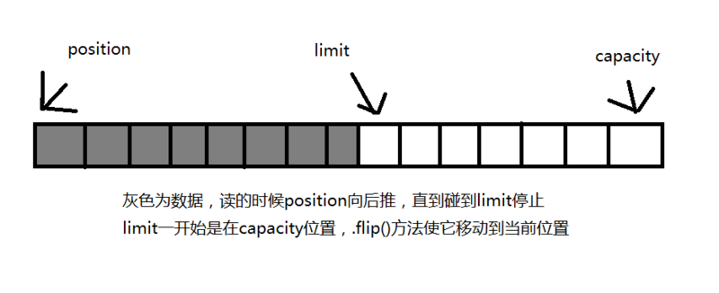

# Java 基础

## 1. 关键字

### 1.1 final

final 可以修饰变量，方法和类，使得被修饰对象不能被作用于某项行为。

**变量**

使得变量不能被赋值，使得变量在声明时必须给出初始值（成员变量也可以在类或对象初始化时给定初始值），之后不能再对此变量赋值。

具体来说：

- 对于基本类型，final 使数值不变；
- 对于引用类型，final 使引用不变，也就不能引用其它对象，但是被引用的对象本身是可以修改的。

```java
final int x = 1;
// x = 2;  // cannot assign value to final variable 'x'
final AObject y = new AObject();
y.a = 1;
```

**方法**

使得方法不能被重写，使得子类不能重写该方法。

private 方法隐式地被指定为 final，如果在子类中定义的方法和基类中的一个 private 方法签名相同，此时子类的方法不是覆盖基类方法，而是在子类中定义了一个新的方法。

**类**

使得类不能被继承，声明类不允许被其他类继承。

### 1.2 static

statcit 关键字可以作用于变量、方法、语句块和内部类，将被修饰对象的行为提升到类，被修饰后通常称之为静态变量、静态方法、静态语句块和静态内部类。也可以用在导包时 import 后，导入静态方法和变量。

**静态变量**

静态变量在内存中只存在一份，只在类初始化时赋值一次。

- 静态变量：类所有的实例都共享静态变量，可以直接通过类名来访问它；
- 实例变量：每创建一个实例就会产生一个实例变量，它与该实例同生共死。

```java
public class A {
    private int x;        // 实例变量
    public static int y;  // 静态变量
}
```

**静态方法**

静态方法在类加载的时候就存在了，它不依赖于任何实例，所以 static 方法必须实现，也就是说它不能是抽象方法（abstract）。

静态方法不能直接访问该类的非 static 变量和方法。

**静态语句块**

静态语句块在类初始化时运行一次。

**静态内部类**

内部类的一种，静态内部类不依赖外部类，且不能直接访问外部类的非 static 变量和方法。

**静态导包**

```java
import static com.xxx.ClassName.StaticMethod
import static com.xxx.ClassName.StaticVariable
```

静态导包可以在使用静态变量和方法时不用再指明 ClassName，从而简化代码，但可读性大大降低。

> 静态变量和普通变量的赋值顺序
>
> **静态变量**的赋值和**静态语句块**的运行**优先于实例变量**的赋值和**普通语句块**的运行，变量的赋值和语句块的运行哪个先执行取决于它们在代码中的顺序。
>
> 存在继承的情况下，初始化顺序为：
>
> 1. 父类（静态变量、静态语句块）
> 2. 子类（静态变量、静态语句块）
> 3. 父类（实例变量、普通语句块）
> 4. 父类（构造函数）
> 5. 子类（实例变量、普通语句块）
> 6. 子类（构造函数）

## 2. Object 的通用方法

**Object 方法概览**

```java
//工具方法
public final native Class<?> getClass()

public native int hashCode()

public boolean equals(Object obj)

protected native Object clone() throws CloneNotSupportedException

public String toString()

//线程相关
public final native void notify()

public final native void notifyAll()

public final native void wait(long timeout) throws InterruptedException

public final void wait(long timeout, int nanos) throws InterruptedException

public final void wait() throws InterruptedException

//析构
protected void finalize() throws Throwable {}
```

### 2.1 equals()

**equals() 与 == 的区别**

- 对于基本类型，== 判断两个值是否相等，基本类型没有 equals() 方法。
- 对于引用类型，== 判断两个实例是否引用同一个对象，而 equals() 判断引用的对象是否等价。

```java
Integer x = new Integer(1);
Integer y = new Integer(1);
System.out.println(x.equals(y)); // true
System.out.println(x == y);      // false
```

**等价关系**

（一）自反性

```java
x.equals(x); // true
```

（二）对称性

```java
x.equals(y) == y.equals(x) // true
```

（三）传递性

```java
if(x.equals(y) && y.equals(z)) {
    x.equals(z); // true;
}
```

（四）一致性

多次调用 equals() 方法结果不变

```java
x.equals(y) == x.equals(y); // true
```

（五）与 null 的比较

对任何不是 null 的对象 x 调用 x.equals(null) 结果都为 false

```java
x.euqals(null); // false;
```

**实现**

- 检查是否为同一个对象的引用，如果是直接返回 true；
- 检查是否是同一个类型，如果不是，直接返回 false；
- 将 Object 实例进行转型；
- 判断每个关键域是否相等。

```java
public class EqualExample {
    private int x;
    private int y;
    private int z;

    public EqualExample(int x, int y, int z) {
        this.x = x;
        this.y = y;
        this.z = z;
    }

    @Override
    public boolean equals(Object o) {
        if (this == o) return true;
        if (o == null || getClass() != o.getClass()) return false;

        EqualExample that = (EqualExample) o;

        if (x != that.x) return false;
        if (y != that.y) return false;
        return z == that.z;
    }
}
```

### 2.2 hashCode()

hasCode() 返回散列值，而 equals() 是用来判断两个实例是否等价。等价的两个实例散列值一定要相同，但是散列值相同的两个实例不一定等价。

在覆盖 equals() 方法时应当总是覆盖 hashCode() 方法，保证相等的两个实例散列值也等价。

下面的代码中，新建了两个等价的实例，并将它们添加到 HashSet 中。我们希望将这两个实例当成一样的，只在集合中添加一个实例，但是因为 EqualExample 没有实现 hasCode() 方法，因此这两个实例的散列值是不同的，最终导致集合添加了两个等价的实例。

```java
EqualExample e1 = new EqualExample(1, 1, 1);
EqualExample e2 = new EqualExample(1, 1, 1);
System.out.println(e1.equals(e2)); // true
HashSet<EqualExample> set = new HashSet<>();
set.add(e1);
set.add(e2);
System.out.println(set.size()); // 2
```

理想的散列函数应当具有均匀性，即不相等的实例应当均匀分不到所有可能的散列值上。这就要求了散列函数要把所有域的值都考虑进来，可以将每个域都当成 R 进制的某一位，然后组成一个 R 进制的整数。R 一般取 31，因为它是一个奇素数，如果是偶数的话，当出现乘法溢出，信息就会丢失，因为与 2 相乘相当于向左移一位。

一个数与 31 相乘可以转换成移位和减法：31\*x == (x<<5)-x。

```java
@Override
public int hashCode() {
    int result = 17;
    result = 31 * result + x;
    result = 31 * result + y;
    result = 31 * result + z;
    return result;
}
```

### 2.3 toString()

默认返回 ToStringExample@4554617c 这种形式，其中 @ 后面的数值为散列码的无符号十六进制表示。

```java
public class ToStringExample {
    private int number;

    public ToStringExample(int number) {
        this.number = number;
    }
}
```

```java
ToStringExample example = new ToStringExample(123);
System.out.println(example.toString());
```

```html
ToStringExample@4554617c
```

### 2.4 clone()

**cloneable**

clone() 是 Object 的受保护方法，这意味着，如果一个类不显式去覆盖 clone() 就没有这个方法。

```java
public class CloneExample {
    private int a;
    private int b;
}
```

```java
CloneExample e1 = new CloneExample();
// CloneExample e2 = e1.clone(); // 'clone()' has protected access in 'java.lang.Object'
```

接下来覆盖 Object 的 clone() 得到以下实现：

```java
public class CloneExample {
    private int a;
    private int b;

    @Override
    protected CloneExample clone() throws CloneNotSupportedException {
        return (CloneExample)super.clone();
    }
}
```

```java
CloneExample e1 = new CloneExample();
try {
    CloneExample e2 = e1.clone();
} catch (CloneNotSupportedException e) {
    e.printStackTrace();
}
```

```html
java.lang.CloneNotSupportedException: CloneTest
```

以上抛出了 CloneNotSupportedException，这是因为 CloneTest 没有实现 Cloneable 接口。

```java
public class CloneExample implements Cloneable {
    private int a;
    private int b;

    @Override
    protected Object clone() throws CloneNotSupportedException {
        return super.clone();
    }
}
```

应该注意的是，clone() 方法并不是 Cloneable 接口的方法，而是 Object 的一个 protected 方法。Cloneable 接口只是规定，如果一个类没有实现 Cloneable 接口又调用了 clone() 方法，就会抛出 CloneNotSupportedException。

**深拷贝与浅拷贝**

- 浅拷贝：拷贝实例和原始实例的引用类型引用同一个对象；
- 深拷贝：拷贝实例和原始实例的引用类型引用不同对象。

浅拷贝样例：

```java
public class ShallowCloneExample implements Cloneable {
    private int[] arr;

    public ShallowCloneExample() {
        arr = new int[10];
        for (int i = 0; i < arr.length; i++) {
            arr[i] = i;
        }
    }

    public void set(int index, int value) {
        arr[index] = value;
    }

    public int get(int index) {
        return arr[index];
    }

    @Override
    protected ShallowCloneExample clone() throws CloneNotSupportedException {
        return (ShallowCloneExample) super.clone();
    }
}
```

```java
ShallowCloneExample e1 = new ShallowCloneExample();
ShallowCloneExample e2 = null;
try {
    e2 = e1.clone();
} catch (CloneNotSupportedException e) {
    e.printStackTrace();
}
e1.set(2, 222);
System.out.println(e2.get(2)); // 222
```

深拷贝样例：

```java
public class DeepCloneExample implements Cloneable {
    private int[] arr;

    public DeepCloneExample() {
        arr = new int[10];
        for (int i = 0; i < arr.length; i++) {
            arr[i] = i;
        }
    }

    public void set(int index, int value) {
        arr[index] = value;
    }

    public int get(int index) {
        return arr[index];
    }

    @Override
    protected DeepCloneExample clone() throws CloneNotSupportedException {
        DeepCloneExample result = (DeepCloneExample) super.clone();
        result.arr = new int[arr.length];
        for (int i = 0; i < arr.length; i++) {
            result.arr[i] = arr[i];
        }
        return result;
    }
}
```

```java
DeepCloneExample e1 = new DeepCloneExample();
DeepCloneExample e2 = null;
try {
    e2 = e1.clone();
} catch (CloneNotSupportedException e) {
    e.printStackTrace();
}
e1.set(2, 222);
System.out.println(e2.get(2)); // 2
```

使用 clone() 方法来拷贝一个对象即复杂又有风险，它会抛出异常，并且还需要类型转换。Effective Java 书上讲到，最好不要去使用 clone()，可以使用拷贝构造函数或者拷贝工厂来拷贝一个对象。

```java
public class CloneConstructorExample {
    private int[] arr;

    public CloneConstructorExample() {
        arr = new int[10];
        for (int i = 0; i < arr.length; i++) {
            arr[i] = i;
        }
    }

    public CloneConstructorExample(CloneConstructorExample original) {
        arr = new int[original.arr.length];
        for (int i = 0; i < original.arr.length; i++) {
            arr[i] = original.arr[i];
        }
    }

    public void set(int index, int value) {
        arr[index] = value;
    }

    public int get(int index) {
        return arr[index];
    }
}
```

```java
CloneConstructorExample e1 = new CloneConstructorExample();
CloneConstructorExample e2 = new CloneConstructorExample(e1);
e1.set(2, 222);
System.out.println(e2.get(2)); // 2
```

## 3. 继承

### 3.1 访问权限

Java 中有三个访问权限修饰符：private、protected 以及 public，如果不加访问修饰符，表示包级可见。

可以对类或类中的成员（字段以及方法）加上访问修饰符。

- 成员可见表示其它类可以用这个类的实例访问到该成员；
- 类可见表示其它类可以用这个类创建对象。

protected 用于修饰成员，表示在继承体系中成员对于子类可见，但是这个访问修饰符对于类没有意义。

设计良好的模块会隐藏所有的实现细节，把它的 API 与它的实现清晰地隔离开来。模块之间只通过它们的 API 进行通信，一个模块不需要知道其他模块的内部工作情况，这个概念被称为信息隐藏或封装。因此访问权限应当尽可能地使每个类或者成员不被外界访问。

如果子类的方法覆盖了父类的方法，那么子类中该方法的访问级别不允许低于父类的访问级别。这是为了确保可以使用父类实例的地方都可以使用子类实例，也就是确保满足里式替换原则。

字段决不能是公有的，因为这么做的话就失去了对这个字段修改行为的控制，客户端可以对其随意修改。可以使用公有的 getter 和 setter 方法来替换公有字段。

```java
public class AccessExample {
    public int x;
}
```

```java
public class AccessExample {
    private int x;

    public int getX() {
        return x;
    }

    public void setX(int x) {
        this.x = x;
    }
}
```

但是也有例外，如果是包级私有的类或者私有的嵌套类，那么直接暴露成员不会有特别大的影响。

```java
public class AccessWithInnerClassExample {
    private class InnerClass {
        int x;
    }

    private InnerClass innerClass;

    public AccessWithInnerClassExample() {
        innerClass = new InnerClass();
    }

    public int getValue() {
        return innerClass.x; // 直接访问
    }
}
```

### 3.2 抽象类与接口

**抽象类**

抽象类和抽象方法都使用 abstract 进行声明。抽象类一般会包含抽象方法，抽象方法一定位于抽象类中。

抽象类和普通类最大的区别是，抽象类不能被实例化，需要继承抽象类才能实例化其子类。

```java
public abstract class AbstractClassExample {

    protected int x;
    private int y;

    public abstract void func1();

    public void func2() {
        System.out.println("func2");
    }
}
```

```java
public class AbstractExtendClassExample extends AbstractClassExample{
    @Override
    public void func1() {
        System.out.println("func1");
    }
}
```

```java
// AbstractClassExample ac1 = new AbstractClassExample(); // 'AbstractClassExample' is abstract; cannot be instantiated
AbstractClassExample ac2 = new AbstractExtendClassExample();
ac2.func1();
```

**接口**

接口是抽象类的延伸，在 Java 8 之前，它可以看成是一个完全抽象的类，也就是说它不能有任何的方法实现。

从 Java 8 开始，接口也可以拥有默认的方法实现，这是因为不支持默认方法的接口的维护成本太高了。在 Java 8 之前，如果一个接口想要添加新的方法，那么要修改所有实现了该接口的类。

接口也可以包含字段，并且这些字段隐式都是 static 和 final 的。

接口中的方法默认都是 public 的，并且不允许定义为 private 或者 protected。

```java
public interface InterfaceExample {
    void func1();

    default void func2(){
        System.out.println("func2");
    }

    int x = 123;
    //int y;                // Variable 'y' might not have been initialized
    public int z = 0;       // Modifier 'public' is redundant for interface fields
    // private int k = 0;   // Modifier 'private' not allowed here
    // protected int l = 0; // Modifier 'protected' not allowed here
    // private void fun3(); // Modifier 'private' not allowed here
}
```

```java
public class InterfaceImplementExample implements InterfaceExample {
    @Override
    public void func1() {
        System.out.println("func1");
    }
}
```

```java
// InterfaceExample ie1 = new InterfaceExample(); // 'InterfaceExample' is abstract; cannot be instantiated
InterfaceExample ie2 = new InterfaceImplementExample();
ie2.func1();
System.out.println(InterfaceExample.x);
```

**抽象类与接口的不同**

- 从设计层面上看，抽象类提供了一种 IS-A 关系，那么就必须满足里式替换原则，即子类对象必须能够替换掉所有父类对象。而接口更像是一种 LIKE-A 关系，它只是提供一种方法实现契约，并不要求接口和实现接口的类具有 IS-A 关系。
- 从使用上来看，一个类可以实现多个接口，但是不能继承多个抽象类。
- 接口的字段只能是 static 和 final 类型的，而抽象类的字段没有这种限制。
- 接口的方法只能是 public 的，而抽象类的方法可以由多种访问权限。

**使用选择**

使用抽象类：

- 需要在几个相关的类中共享代码。
- 需要能控制继承来的方法和域的访问权限，而不是都为 public。
- 需要继承非静态（non-static）和非常量（non-final）字段。

使用接口：

- 需要让不相关的类都实现一个方法，例如不相关的类都可以实现 Compareable 接口中的 compareTo() 方法；
- 需要使用多重继承。

在很多情况下，接口优先于抽象类，因为接口没有抽象类严格的类层次结构要求，可以灵活地为一个类添加行为。并且从 Java 8 开始，接口也可以有默认的方法实现，使得修改接口的成本也变的很低。

> [深入理解 abstract class 和 interface](https://www.ibm.com/developerworks/cn/java/l-javainterface-abstract/) <br />[When to Use Abstract Class and Interface](https://dzone.com/articles/when-to-use-abstract-class-and-intreface)

### 3.3 super

- 访问父类的构造函数：可以使用 super() 函数访问父类的构造函数，从而完成一些初始化的工作。
- 访问父类的成员：如果子类覆盖了父类的中某个方法的实现，可以通过使用 super 关键字来引用父类的方法实现。

> [Using the Keyword super](https://docs.oracle.com/javase/tutorial/java/IandI/super.html)

### 3.4 覆盖与重载

- 覆盖（Override）存在于继承体系中，指子类实现了一个与父类在方法声明上完全相同的一个方法；

- 重载（Overload）存在于同一个类中，指一个方法与已经存在的方法名称上相同，但是参数类型、个数、顺序至少有一个不同。应该注意的是，返回值不同，其它都相同不算是重载。

## 4. String

### 4.1 String, StringBuffer and StringBuilder

**是否可变**

- String 不可变
- StringBuffer 和 StringBuilder 可变

**是否线程安全**

- String 不可变，因此是线程安全的
- StringBuilder 不是线程安全的
- StringBuffer 是线程安全的，内部使用 synchronized 来同步

> [String, StringBuffer, and StringBuilder](https://stackoverflow.com/questions/2971315/string-stringbuffer-and-stringbuilder)

### 4.1 String 不可变的原因

**可以缓存 hash 值**

因为 String 的 hash 值经常被使用，例如 String 用做 HashMap 的 key。不可变的特性可以使得 hash 值也不可变，因此只需要进行一次计算。

**String Pool**

如果一个 String 对象已经被创建过了，那么就会从 String Pool 中取得引用。只有 String 是不可变的，才可能使用 String Pool。

**安全性**

String 经常作为参数，String 不可变性可以保证参数不可变。例如在作为网络连接参数的情况下如果 String 是可变的，那么在网络连接过程中，String 被改变，改变 String 对象的那一方以为现在连接的是其它主机，而实际情况却不一定是。

**线程安全**

String 不可变性天生具备线程安全，可以在多个线程中安全地使用。

> [Why String is immutable in Java?](https://www.programcreek.com/2013/04/why-string-is-immutable-in-java/)

### 4.2 String.intern()

使用 String.intern() 可以保证相同内容的字符串实例引用相同的内存对象。具体做法是，String.intern() 执行时，若当前字符串常量池中没有该字符串，则将此字符串加入字符串常量池。

所以有两种方式向字符串常量池增加字符串：

1. 第一次字面量出现时，
2. 第一次 String.intern() 方法被调用且当前字符串常量池中没有与之相同的字符串时。

需要注意的是，java中字面量之间的`+`操作会被编译器优化为一个字面量。如`"abc" + "def"`优化为`"abcdef"`，`"abc" + 123`优化为`"abc123"`，虚拟机看不到优化前的`"abc", "def", "123"`等字面量。

```java
String s1 = new String("aaa");
String s2 = new String("aaa");
String s3 = "aaa"
System.out.println(s1 == s2);           // false
System.out.println(s1 == s3);           // false
System.out.println(s1.intern() == s2);  // true

String s4 = new String("bbb");
String s5 = s4.intern();
System.out.println(s4 == s5);  		// false

String s6 = new String("bbb" + s1);
String s7 = s6.intern();
System.out.println(s6 == s7);  		// true
```

在 Java 7 之前，字符串常量池被放在运行时常量池中，它属于永久代。而在 Java 7，字符串常量池被放在堆中。这是因为永久代的空间有限，在大量使用字符串的场景下会导致 OutOfMemoryError 错误。

> [What is String interning?](https://stackoverflow.com/questions/10578984/what-is-string-interning) <br/>[深入解析 String#intern](https://tech.meituan.com/in_depth_understanding_string_intern.html)

## 5. 基本类型与运算

### 5.1 基本类型

八个基本类型：

- boolean/1
- byte/8
- char/16
- short/16
- int/32
- float/32
- long/64
- double/64

基本类型都有对应的包装类型，将基本类型与包装类型的自动转换成为自动装箱与自动拆箱，虚拟机会自动完成这些操作。

### 5.2 自动装箱与自动拆箱 ###

**自动装箱（Autoboxing）与自动拆箱（Unboxing）**

装箱即是把 Java 的基本类型转化为对应的包装类型的过程，拆箱正好相反。    
装箱调用的是对应包装类型的`valueOf`方法，拆箱调用的包装类型的`xxxValue`方法，如`intValue`,`doubleValue`等

**自动装箱的触发条件**：将一个基本类型的值赋给对应的包装类型时。
**自动拆箱的触发条件**：将一个包装类型赋值给对应的基本类型时，或着**有计算或比较发生时**，运算符有一方为基本类型时。

```java
Integer a = 10;   //自动装箱
Double b = 10.0;  //自动装箱

int c = a;        //自动拆箱
int d = a++;      //自动拆箱
int e = a + c;    //自动拆箱
double f = b;     //自动拆箱

Integer g = a + b; //a和b分别自动拆箱，相加后在自动装箱赋值给g
```

**自动装箱的缓存机制**

对于 byte,char,short,int,long 等整数类型来说，他们的装箱行为是一致的，默认当装箱数在闭区间 [-128,127] 内时，不会新建对象，而是返回缓存中的对象，这些缓存对象 jvm 在一启动就准备好了，这样做是为了方便重复调用和避免资源浪费。    
如`Integer.valueOf`方法：

```java
public static Integer valueOf(int i) {
    if (i >= IntegerCache.low && i <= IntegerCache.high)
        return IntegerCache.cache[i + (-IntegerCache.low)];
    return new Integer(i);
}
```

`Boolean.valueOf`方法：

```java
public static Boolean valueOf(boolean b) {
    return (b ? TRUE : FALSE);
}
```

在 Java 8 中，Integer 缓存池的大小默认为 -128\~127。

```java
static final int low = -128;
static final int high;
static final Integer cache[];

static {
    // high value may be configured by property
    int h = 127;
    String integerCacheHighPropValue =
        sun.misc.VM.getSavedProperty("java.lang.Integer.IntegerCache.high");
    if (integerCacheHighPropValue != null) {
        try {
            int i = parseInt(integerCacheHighPropValue);
            i = Math.max(i, 127);
            // Maximum array size is Integer.MAX_VALUE
            h = Math.min(i, Integer.MAX_VALUE - (-low) -1);
        } catch( NumberFormatException nfe) {
            // If the property cannot be parsed into an int, ignore it.
        }
    }
    high = h;

    cache = new Integer[(high - low) + 1];
    int j = low;
    for(int k = 0; k < cache.length; k++)
        cache[k] = new Integer(j++);

    // range [-128, 127] must be interned (JLS7 5.1.7)
    assert IntegerCache.high >= 127;
}
```

对于`float`,`double`的浮点类型，包装始终返回的是新的对象，因为很难预知常用的浮点数。

> [Differences between new Integer(123), Integer.valueOf(123) and just 123](https://stackoverflow.com/questions/9030817/differences-between-new-integer123-integer-valueof123-and-just-123)

### 5.3 基本数字类型的赋值 ###

整型的字面量如`1`,`10`默认类型为`int`，因此整型字面量的大小不能超过`int`的取值范围，否则会报错。    
对于取值范围比`int`小的类型（`byte`,`char`,`short`），可以在自己类型取值范围内直接使用整型字面赋值，超过自己类型的取值范围则需要使用强转，强转会发生截断。    
对于取值范围比`int`大的类型（`long`,`float`,`double`），在`int`范围内可以直接使用整型字面赋值，超过`int`取值范围需要加相应后缀（类型首字母的大写或小写）。

浮点型型的字面量如`1.0`,`25.9`以及`1.23E2`，默认的类型是`double`，如需赋值给`float`需要加`F`或`f`的后缀。

### 5.4 switch

从 Java 7 开始，可以在 switch 条件判断语句中使用 String 对象。

```java
String s = "a";

switch (s) {
    case "a":
        System.out.println("aaa");
        break;
    case "b":
        System.out.println("bbb");
        break;
}

```

switch 不支持 long，是因为 swicth 的设计初衷是为那些只需要对少数的几个值进行等值判断，如果值过于复杂，那么还是用 if 比较合适。

```java
//        long x = 111;
//        switch (x) { // Incompatible types. Found: 'long', required: 'char, byte, short, int, Character, Byte, Short, Integer, String, or an enum'
//            case 111:
//                System.out.println(111);
//                break;
//            case 222:
//                System.out.println(222);
//                break;
//        }
```

> [Why can't your switch statement data type be long, Java?](https://stackoverflow.com/questions/2676210/why-cant-your-switch-statement-data-type-be-long-java)

## 6. 集合类

### 6.1 Collection和Collections的差别

`java.util.Collection` 是一个集合接口，Collection接口在Java类库中有非常多详细的实现。比如List、Set

`java.util.Collections` 是针对集合类的一个帮助类，它提供了一系列的静态方法实现对各种集合的搜索、排序、线程安全化等操作。

### 6.2 常用集合类和它们之间的比较

#### 6.2.1 常用集合类

**List**, 保证插入先后顺序的集合类

* LinkedList  链表实现
* ArrayList  可变数组实现
* Vector   Synchronized 实现相当于线程同步的ArrayList
* Stack  继承Vector，保证后进先出

**Set**，保证数据唯一，无序

* HashSet  HashMap没有value
* LinkedHashSet  使用前后指针保证遍历按照插入顺序遍历
* TreeSet  TreeMap没有value

**Map**，键值对（所以不继承Collection）

* HashMap  数组 + 链表 + 红黑树
* LinkedHashMap  使用前后指针保证遍历按照插入顺序遍历
* WeakHashMap Key使用弱引用
* HashTable  Synchronized 实现线程同步的Map
* Properties  继承自HashTable，Key和Value只能是String
* TreeMap  Key排序，红黑树实现，Key必须实现Comparable或传入自定义Comparator

#### 6.2.2 ArrayList 与 vector

相同点：都实现了List接口 ，都相当于动态数组。

不同点：

* ArrayList 默认扩容0.5倍，Vector 默认扩容一倍
* ArrayList 线程不安全，Vector 使用 Synchronized 实现线程安全

#### 6.2.3 HashMap 与 HashTable

不同点：

* HashMap 支持 null 键和 null 值，HashTable 不支持（因为HashMap把null 的哈希值设为了0）
* HashMap线程不安全，HashTable 使用 Synchronized 实现线程安全

### 6.3 将线程不安全的集合转为线程安全的集合

```java
list = Collections.synchronizedList(list);	//转为内部用synchronized关键字实现的SynchronizedList类，下同
set = Collections.synchronizedSet(set);
map = Collections.synchronizedMap(map);
```

## 7. 多线程与并发

### 7.1 一些相关概念和关键字

**可重入锁**

线程可以进入任何一个它已经拥有的锁所同步着的代码块。

Java中常用的可重入锁

- **`synchronized`** 只能随机唤醒或全部唤醒，等待获取锁时不能中断，只能是不公平锁

  锁膨胀过程为 无锁 -> 偏向锁 -> 轻量锁（自旋）-> 重量锁，且不可逆

- **`java.util.concurrent.locks.ReentrantLock`** 可以分组唤醒，需要手动加锁解锁，等待时可以被中断，可以指定是否公平锁

**可见性**

当一个线程修改一个值时，这个值是否能立即被其他线程读到。

Java保证可见性的关键字：`volatile`（详见[JAVA 虚拟机 - Java 内存模型](JVM)）

**synchronized**

synchronized 可以锁定一个对象或一个类。

* 锁定对象：当 synchronize 作用在一个普通对象或一个非静态方法（相当于synchronize(this) {//整个方法体}）时
* 锁定类：当 synchronize 作用在一个类或静态方法（相当于synchronize(ClassName.class) {//整个方法体}）时

需要注意的是，类的锁和该类对象的锁并不冲突，或者说没有关系，互不影响。也就是说，当一个线程锁定了某个类，其他线程仍可以锁定该类的某个对象，反之亦然。

在 synchronized 内部可以通过 Object.wait() 释放锁，同时线程在当前位置休眠，直到其他线程调用 Object.notify() 唤醒该线程，才能继续锁定该对象，并继续执行。Object.notify() 并不会立即释放锁，而是在当前线程退出 synchronized 块后，随机选择一个 wait 线程去唤醒。Object.notifyAll() 会唤醒所有 wait 线程， 被唤醒的线程按照随机的顺序执行。

**Object.wait() 与 Thread.sleep()**

* wait() 会释放锁然后进入等待锁定队列，sleep() 不释放锁
* wait() 必须在同步块中使用，sleep() 可以在任意位置使用

>如果某个线程拥有某个或某些对象的同步锁，那么在调用了wait()后，这个线程就会释放它持有的所有同步资源，而不限于这个被调用了wait()方法的对象。 
>
>Thread.sleep() 表示让一个线程进入睡眠状态，等待一定的时间之后，自动醒来进入到可运行状态，不会马上进入运行状态，因为线程调度机制恢复线程的运行也需要时间，一个线程对象调用了sleep方法之后 

### 7.2 并发容器

**使用 synchronized 实现同步的类**

Timer，TimerTask，
Vector，Stack，HashTable，
SynchronizedList，SynchronizedSet，SynchronizedMap
StringBuffer

**原子类 Atomicxxx — 包装类的线程安全类** 

如AtomicLong，AtomicInteger等等 
Atomicxxx 是通过Unsafe 类的native方法（CAS）实现线程安全的

**ConcurrentHashMap**

Java1.7和1.6分段锁实现的线程安全的HashMap，能够有效的进行高并发的访问。对于`size()`和`isEmpty()`等需要访问整个哈希表的操作采取了较弱的语义。

1.8基本完全重写了 ConcurrentHashmap，大量使用CAS操作进行属性的修改，实现上也和分段锁有很大不同，主要有以下几点：

1. 使用sizeCtl控制扩容和初始化，负值 -N 表示当前 N - 1 个线程正在进行扩容，-1 表示正在初始化，0 表示未初始化，正数表示初始化完成，大小为容量的0.75倍
2. 不采用segment而采用node，锁住node（使用 synchronized）来实现减小锁粒度。
3. 插入时，若正在扩容则辅助扩容，当前hash位为null，则直接CAS插入，否则对当前hash位node加 synchronized 锁，再插入
4. 读取时，直接读取
5. 扩容时的rehash操作，使用forwad结点标记实现并发扩容
6. size 方法采用动态计算

> 分段锁原理
>
> ConcurrentHashMap由多个Segment构成，每个Segment都对于一段哈希值，包含一张哈希表。每次操作只将操作数据所属的Segment使用ReentrantLock锁起来，从而避免将整个锁住。 

**ConcurrentSkipListMap / ConcurrentSkipListSet ** 

使用跳表实现的有序高并发Map。

**CopyOnWriteArrayList / CopyOnWriteArraySet**

只对写操作同步，读操作可能会读到稍旧的数据副本。适用于读多写少，数据量不大的操作。修改容器的代价是昂贵的，因此建议批量增加和删除。线程安全的实现：

1. 使用volatile修饰数组引用：确保数组引用的内存可见性。
2. 写操作使用ReentrantLock同步，先复制数组，再修改，再将修改后的数组替换当前数组

CopyOnWriteArraySet 去重使用的是遍历比较。

**Queue / BlockingQueue**

- ConcurrentLinkedQueue：线程安全的无界队列。底层采用单链表。支持FIFO。
- ConcurrentLinkedDeque：线程安全的无界双端队列。底层采用双向链表。支持FIFO和FILO。
- ArrayBlockingQueue：数组实现的阻塞队列。
- LinkedBlockingQueue：链表实现的阻塞队列。
- LinkedBlockingDeque：双向链表实现的双端阻塞队列。

### 7.3 同步工具类

**阻塞队列**

阻塞队列提供可阻塞的put和take方法，以及支持定时的offer和poll方法。    
当队列满时，put方法会阻塞自己直到有空间可用；当队列空时，take方法会阻塞自己直到有元素可取。

eg：LinkedBlockingQueue, ArrayBlockingQueue

**闭锁**

闭锁是一种同步工具类，它可以一直等待需要发生的事件，直到满足要求后再让指定线程执行。   
`CountDownLatch`是一种灵活的闭锁实现，它可以使一个线程或多个线程等待一组事件发生，内部维护了一个方法递减计数器，每当一个事件发生就调用`countDown()`方法递减，当递减为零时说明所有等待事件都已发生。如果计数器一直没有递减到零，那么`await()`会一直等到或者线程中断，或者等待超时。   
`FutureTask`也是一种闭锁，用来获取线程执行的返回值（通过Runable），使用方法如下：

```
FutureTask<T> f = new FutureTask<T>(new Callable<T>() {
        public T call() throws SomeException {
            //dosomethion
            return t;
        }
    })

Thread t = new Thread(f);
t.start();
f.get(); //阻塞直到callable返回结果（正常，异常）


```

**信号量**

信号量控制并发过程中资源的使用量，使用`Semaphore`实现。

**栅栏**

栅栏类似于闭锁，也能阻塞一组线程直到某个事件发生，与闭锁不同的是所有线程必须都到了栅栏的位置才能继续执行。   
`CyclicBarrier`可以让一组线程反复在栅栏位置集合，当线程到达栅栏位置时会调用await方法，阻塞直到所有线程到达栅栏，然后栅栏打开并返回给每个线程唯一的索引号后重置。若await等待超时或某个线程被中断，就会认为栅栏被打破，从而抛出`BrokenBarriarException`。   
`Exchanger`是一种两方栅栏，各方在栅栏上交换数据。如当一个线程向缓存区写入数据，另一个线程从缓冲区读取数据，可以通过`Exchanger`汇合，将满的缓冲区与空的缓冲区交换。

### 7.4 线程

**新建线程的三种方法**

1. 继承 Thread() 重写 run() 方法

2. 实现 Runable 接口，然后传入Thread 构造函数

3. 使用 Callable 和 Future 接口创建线程。具体是先实现 Callable 接口，再用 FutureTask 类来包装 Callable实现类的对象，再把 FutureTask对象传入Thread 构造函数。示例：

   ```java
   Callable<Integer> myCallable = new Callable<Integer>() {
       @Override
       public Integer call() throws Exception {
           return 1;
       }
   };
   FutureTask<Integer> ft = new FutureTask<Integer>(myCallable);
   Thread thread = new Thread(ft);
   ```

**Thread类的方法**

- run()，同步调用，和调用正常方法没有区别。

- start()，启动线程

- join()，同步线程，如`t.join()`，主线程阻塞等到t线程调用完成后才向后执行

- interrupt()，中断一个处于sleep()/wait()/join()阻塞状态的线程，如`t.join()`，会将 t 线程中断标记设为 true，同时再 t 线程内部抛出 InterruptedException 异常。将 InterruptedException 放在适当的位置就能终止线程，形式如下： 

  ```java
  try {
      object.wait();
  } catch (InterruptedException ie) {  
      return;
  }
  ```

- yield()，线程让步，将当前线程由运行转为就绪态

### 7.5 线程池

**ThreadPoolExecutor**

ThreadPoolExecutor 的完整构造方法的签名是：

```
ThreadPoolExecutor(
    int corePoolSize, // 池中所保存的线程基本线程数，包括空闲线程。
    int maximumPoolSize, // 池中允许的最大线程数
    long keepAliveTime, // 当线程数大于基本大小时，此为终止前多余的空闲线程等待新任务的最长时间
    TimeUnit unit, // 参数的时间单位
    BlockingQueue<Runnable> workQueue, // 执行前用于保持任务的队列。将交由execute方法
    ThreadFactory threadFactory, // 执行程序创建新线程时使用的工厂
    RejectedExecutionHandler handler // 拒绝策略，由于超出线程范围和队列容量而使执行被阻塞时所使用的处理程序
    ) 
```

BlockingQueue 可以使用无界队列，那么任务队列可以无限制的增加；也可以使用有界队列，可以避免资源耗尽。   
当使用有界队列当队列满时就会调用 handler 执行拒绝策略，拒绝策略有四种：

- 丢弃策略，有两种，一种为`DiscardPolicy`，方式是丢弃自己；另一种为`DiscardOldestPolicy`，方式是丢弃任务队列的头一个，自己加入队尾。
- 异常策略，称之为`AbortPolicy`，抛出`RejectedExecutionException`拒绝执行异常。
- 执行策略，称之为`CallerRunsPolicy`，由调用者线程去执行。

**Executors**

还可以通过Executors静态方法创建线程池：

- **`Executors.newSingleThreadExecutor`**  创建一个单线程的ExecutorService，如果这个线程异常结束会创建另一个线程替代
- **`Executors.newFixedThreadPool`**  创建一个固定大小的线程池，每次任务创建一个线程，直到达到最大数量。若某个线程异常结束会创建另一个线程替代
- **`Executors.newScheduledThreadPool`**  也是固定大小的线程池，但可以以延迟或定时的方式执行任务
- **`Executors.newCachedThreadPool`**  创建一个可缓存的线程池，会回收空闲线程，当需求很大时也可以无限制新建线程

`Executor`的`execute`方法用来执行实现`Runable`接口的方法；继承了`Executor`的`ExecutorService`可以用`submit`方法执行`Runable`和`Callable`接口的方法，使用`Future<?>`保存返回结果。`Future<?>`的`get`方法为一种阻塞等待方法。

`CompletionService<>`接口用来完成并行计算任务。`ExecutorCompletionService<>`使用了阻塞队列来完成任务，每次调用它的`submit`方法可以添加一项任务，之后可以通过`take`方法获取这些任务的`Futrue<>`结果。

### 7.6 锁

**CAS**

`Compare And Set`，由JNI实现，操作系统底层控制对某一块内存操作的原子性。

**乐观锁与悲观锁**

乐观锁，每次操作都认为不发生冲突，直到提交阶段进行验证。失败则重试。有脏读问题。
悲观锁，每次操作都认为会发生冲突，每次操作加锁

**自旋锁**

线程的阻塞和唤醒切换CPU从用户态转为核心态，频繁的切换会加重CPU的负担，自旋锁是时线程再等待的过程中执行一些无意义的循环，直到等待时间发生。但应该避免长时间的忙等待。

**阻塞锁**

**ReentrantReadWriterLock**

读写锁，读锁可重入读锁，写锁不可被重入，写锁可降级为读锁。

**synchronized 相关锁**

* **偏向锁**

  偏向锁主要解决的是提升无竞争状态下的锁性能。一旦线程第一次获得了监视对象，之后让监视对象“偏向”这个线程，之后的多次调用则可以避免CAS操作

* **轻量级锁**

  正常CAS获取偏向锁，若获取失败，继续自旋获取，超过一定次数，膨胀为重量级锁

* **重量级锁**

  重量级锁，就是让争抢锁的线程从用户态转换成内核态。让cpu借助操作系统进行线程协调。

## 8. IO 与 NIO

### 8.1 流

Java流分布字节流和字符流两种，它们的主要区别为：

1. 字节流读取的时候，读到一个字节就返回一个字节；字符流使用了字节流读到一个或多个字节（中文对应的字节数是两个，在UTF-8码表中是3个字节）时。先去查指定的编码表，将查到的字符返回。
2. 字节流可以处理所有类型数据，如：图片，MP3，AVI视频文件，而字符流只能处理字符数据。只要是处理纯文本数据，就要优先考虑使用字符流，除此之外都用字节流。

**字节流**

* FileInputStream/FileOutputStream：此类用于从本地文件系统中读取文件内容。

  ```java
  //打开一个到实际文件的连接来创建一个FileInputStream，该文件通过文件系统中的File对象file指定。
  FileInputStream/FileOutputStream(File file)
      
  //打开一个到实际文件的连接来创建一个FileInputStream，该文件通过文件系统中的路径名name指定。
  FileInputStream/FileOutputStream(String name)	
  ```

* BufferedInputStream/BufferedOutputStream：此类本身带有一个缓冲区，在读取数据时，先放到缓冲区中，可以减少对数据源的访问，提高运行的效率。 

  ```java
  //创建一个BufferedInputStream并保存其参数，即输入流in，以便将来使用。
  BufferedInputStream/BufferedOutputStream(InputStream in)
  
  //创建一个具有指定缓冲区大小的BufferedInputStream并保存其参数，即输入流in，以便将来使用。
  BufferedInputStream/BufferedOutputStream(InputStream in,int size)
  ```

* DataInputStream/DataOutputStream:该类提供一些基于多字节读取方法，从而可以读取基本数据类型的数据。 

  ```java
  //使用指定的底层InputStream创建一个DataInputStream。
  DataInputStream/DataOutputStream(InputStream in)
  ```

**字符流**

* FileReader/FileWriter：用来读取字符文件的便捷类。此类的构造方法假定默认字符编码和默认字节缓冲区大小都是适当的。

  ```java
  //在给定从中读取数据的File的情况下创建一个新的FileReader。
  FileReader/FileWriter(File file)
  
  //在给定从中读取数据的文件名的情况下创建一个新的FileReader。
  FileReader/FileWriter(String fileName)
  ```

* BufferedReader/BufferedWriter：类是Reader类的子类，为Reader对象添加字符缓冲器，为数据输入分配内存存储空间，存取数据更为有效。

  ```java
  //创建一个使用默认大小输入缓冲区的缓冲字符输入流。
  BufferedReader/BufferedWriter(Reader in)
      
  //创建一个使用指定大小输入缓冲区的缓冲字符输入流。
  BufferedReader/BufferedWriter(Reader in,int sz)
  ```

### 8.2 什么是NIO

首先来讲一下传统的IO和NIO的区别，传统的IO又称BIO，即阻塞式IO，NIO就是非阻塞IO了。还有一种[AIO](http://stevex.blog.51cto.com/4300375/1284437)就是异步IO。NIO可以自动控制阻塞或非阻塞。

Java IO的各种流是阻塞的。这意味着，当一个线程调用read() 或 write()时，该线程被阻塞，直到有一些数据被读取，或数据完全写入。该线程在此期间不能再干任何事情了。 Java NIO的非阻塞模式，使一个线程从某通道发送请求读取数据，但是它仅能得到目前可用的数据，如果目前没有数据可用时，就什么都不会获取。而不是保持线程阻塞，所以直至数据变的可以读取之前，该线程可以继续做其他的事情。 非阻塞写也是如此。一个线程请求写入一些数据到某通道，但不需要等待它完全写入，这个线程同时可以去做别的事情。 线程通常将非阻塞IO的空闲时间用于在其它通道上执行IO操作，所以一个单独的线程现在可以管理多个输入和输出通道（channel）。

### 8.3 NIO三大核心

#### 8.3.1 Buffer

在NIO中数据交互不再像IO机制那样使用流，而是使用Buffer（缓冲区） 。NIO下客户端向服务端传送数据过程可以描述为：客户端写数据到buffer，buffer通过channel传数据到服务器buffer，服务器从buffer读数据。

buffer实际上是一个容器，一个连续数组，它通过几个变量来保存这个数据的当前位置状态： 

1. capacity：容量，缓冲区能容纳元素的数量 
2. position：当前位置，是缓冲区中下一次发生读取和写入操作的索引，当前位置通过大多数读写操作向前推进
3. limit：界限，是缓冲区中最后一个有效位置之后下一个位置的索引 

 

**主要buffer实现类：**

CharBuffer，ByteBuffer ，ShortBuffer，IntBuffer，LongBuffer，FloatBuffer，DoubleBuffer，还有个 MappedByteBuffer，用于表示内存映射文件。

**常用方法：**

```java
.flip()    //反转写buffer为读buffer，将limit设置为position，然后position重置为0，返回对缓冲区的引用
.clear()   //清空调用缓冲区并返回对缓冲区的引用
```

#### 8.3.2 Channal

共有四种通道：

* FileChannel：作用于IO文件流

  可以通过下面方法获取文件流通道

  ```java
  FileOutputStream("data.txt").getChannel();	//只写
  FileInputStream("data.txt").getChannel();	//只读
  RandomAccessFile("data.txt", "rw").getChannel();	//读写
  ```

  

* DatagramChannel：作用于UDP协议 

* SocketChannel：作用于TCP协议 

* ServerSocketChannel：作用于TCP协议 

#### 8.3.3 Selector

选择器是NIO的核心，它是channel的管理者。通过执行select()阻塞方法，监听是否有channel准备好。一旦有数据可读，此方法的返回值是SelectionKey的数量。

所以服务端通常会死循环执行select()方法，直到有channl准备就绪，然后开始工作。每个channel都会和Selector绑定一个事件，然后生成一个SelectionKey的对象。

需要注意的是：

* channel和Selector绑定时，channel必须是非阻塞模式
* FileChannel不能切换到非阻塞模式，因为它不是套接字通道，所以FileChannel不能和Selector绑定事件

在NIO中一共有四种事件：

1. SelectionKey.OP_CONNECT：连接事件
2. SelectionKey.OP_ACCEPT：接收事件
3. SelectionKey.OP_READ：读事件
4. SelectionKey.OP_WRITE：写事件

## 9. 反射与代理

### 9.1 反射

每个类都有一个  **Class**  对象，包含了与类有关的信息。当编译一个新类时，会产生一个同名的 .class 文件，该文件内容保存着 Class 对象。

类加载相当于 Class 对象的加载。类在第一次使用时才动态加载到 JVM 中，可以使用 Class.forName("com.mysql.jdbc.Driver") 这种方式来控制类的加载，该方法会返回一个 Class 对象。

反射可以提供运行时的类信息，并且这个类可以在运行时才加载进来，甚至在编译时期该类的 .class 不存在也可以加载进来。

Class 和 java.lang.reflect 一起对反射提供了支持，java.lang.reflect 类库主要包含了以下三个类：

1.  **Field** ：可以使用 get() 和 set() 方法读取和修改 Field 对象关联的字段；
2.  **Method** ：可以使用 invoke() 方法调用与 Method 对象关联的方法；
3.  **Constructor** ：可以用 Constructor 创建新的对象。

IDE 使用反射机制获取类的信息，在使用一个类的对象时，能够把类的字段、方法和构造函数等信息列出来供用户选择。

**Advantages of Using Reflection:** 

-  **Extensibility Features**  : An application may make use of external, user-defined classes by creating instances of extensibility objects using their fully-qualified names.
-  **Class Browsers and Visual Development Environments**  :  A class browser needs to be able to enumerate the members of classes. Visual development environments can benefit from making use of type information available in reflection to aid the developer in writing correct code.
-  **Debuggers and Test Tools**  : Debuggers need to be able to examine private members on classes. Test harnesses can make use of reflection to systematically call a discoverable set APIs defined on a class, to insure a high level of code coverage in a test suite.

**Drawbacks of Reflection:** 

Reflection is powerful, but should not be used indiscriminately. If it is possible to perform an operation without using reflection, then it is preferable to avoid using it. The following concerns should be kept in mind when accessing code via reflection.

-  **Performance Overhead**  : Because reflection involves types that are dynamically resolved, certain Java virtual machine optimizations can not be performed. Consequently, reflective operations have slower performance than their non-reflective counterparts, and should be avoided in sections of code which are called frequently in performance-sensitive applications.
-  **Security Restrictions**  : Reflection requires a runtime permission which may not be present when running under a security manager. This is in an important consideration for code which has to run in a restricted security context, such as in an Applet.
-  **Exposure of Internals**  :Since reflection allows code to perform operations that would be illegal in non-reflective code, such as accessing private fields and methods, the use of reflection can result in unexpected side-effects, which may render code dysfunctional and may destroy portability. Reflective code breaks abstractions and therefore may change behavior with upgrades of the platform.

> [Trail: The Reflection API](https://docs.oracle.com/javase/tutorial/reflect/index.html) <br />[深入解析 Java 反射（1）- 基础](http://www.sczyh30.com/posts/Java/java-reflection-1/)

### 9.2 静态代理

静态代理就是手动实现对一个类的增强，可以让被代理类作为代理类的成员变量，这样就可以控制被代理类的方法前处理后处理。

```java
public class UserServiceProxy{ 

    private UserService userService; 

    public UserServiceProxy(UserService userService) { 
        this.userService = userService; 
    } 

    public void addUser() { 
        
        //前处理; 
        userService.addUser(); 
        //后处理
    
    } 
} 
```

### 9.3 动态代理

静态代理只能对一个类代理，当需要对大量的代理时就可以用动态代理。

#### 9.3.1 JDK动态代理

JDK自带的代理模式，要求被代理类必须实现接口。生成的代理类和被代理类有共同的接口。具体操作如下：

```java
public class MyJDKProxy implements InvocationHandler {  
    
    public static void main(String[] args) {
        
        final Object targetObject;//需要代理的目标对象
        
        //实现一个InvocationHandler
        InvocationHandler handler = new InvocationHandler() {
            @Override
            public Object invoke(Object proxy, 
                                 Method method, Object[] args) throws Throwable {
                //调用前处理
            	Object ret = method.invoke(targetObject, args);  //执行原method
                //调用后处理
        		return ret;
            }
        }
        
        //创建代理对象
        Object proxyObject = Proxy.newProxyInstance(
            targetObject.getClass().getClassLoader(),  
            targetObject.getClass().getInterfaces(), //必须要有接口
            handler);
        
    }
  
} 
```

#### 9.3.2 CGLIB动态代理

cglib生成目标对象的子类为代理类。具体实现如下：

```java
public class MyCGlibProxy implements InvocationHandler {  
    
    public static void main(String[] args) {
        
        final Object targetObject;//需要代理的目标对象
        
        //实现一个MethodInterceptor
        MethodInterceptor inteceptor = new MethodInterceptor() {
            @Override
            public Object intercept(Object proxy, Method method, 
                                    Object[] args, 
                                    MethodProxy methodProxy) throws Throwable {
                //调用前处理
            	Object ret = method.invoke(targetObject, args);  //执行原method
                //调用后处理
        		return ret;
            }
        }
        
        //创建代理对象
        Enhancer enhancer = new Enhancer();  
        enhancer.setSuperclass(targetObject.getClass());  
        enhancer.setCallback(inteceptor);  
        Object proxyObject = enhancer.create()
    }
  
}
```

两种代理方式的区别：

1. JDK代理的类必须实现接口，CGlib代理类不能是final类，方法不能是final方法
2. JDK代理生成的类和被代理类有共同的接口，是Proxy的子类（所以JDK不能生成代理类的子类）；CGLib代理生成的类是被代理类的子类

## 10. 异常

Throwable 可以用来表示任何可以作为异常抛出的类，分为两种： **Error**  和 **Exception**。其中 Error 用来表示 JVM 无法处理的错误，Exception 分为两种：

1.  **受检异常** ：需要用 try...catch... 语句捕获并进行处理，并且可以从异常中恢复；
2.  **非受检异常** ：是程序运行时错误，例如除 0 会引发 Arithmetic Exception，此时程序奔溃并且无法恢复。

<div align="center">

</div>

> [Java 入门之异常处理](https://www.tianmaying.com/tutorial/Java-Exception) <br />[Java 异常的面试问题及答案 -Part 1](http://www.importnew.com/7383.html)

## 11. 泛型

```java
public class Box<T> {
    // T stands for "Type"
    private T t;
    public void set(T t) { this.t = t; }
    public T get() { return t; }
}
```

> [Java 泛型详解](https://www.ziwenxie.site/2017/03/01/java-generic/)<br />[10 道 Java 泛型面试题](https://cloud.tencent.com/developer/article/1033693)

## 12. 注解

Java 注解是附加在代码中的一些元信息，用于一些工具在编译、运行时进行解析和使用，起到说明、配置的功能。注解不会也不能影响代码的实际逻辑，仅仅起到辅助性的作用。

> [注解 Annotation 实现原理与自定义注解例子](https://www.cnblogs.com/acm-bingzi/p/javaAnnotation.html)

## 13. 特性

### 13.1 面向对象三大特性

> [封装、继承、多态](https://github.com/CyC2018/Interview-Notebook/blob/master/notes/%E9%9D%A2%E5%90%91%E5%AF%B9%E8%B1%A1%E6%80%9D%E6%83%B3.md#%E5%B0%81%E8%A3%85%E7%BB%A7%E6%89%BF%E5%A4%9A%E6%80%81)

### 13.2 Java 各版本的新特性

**New highlights in Java SE 8**

1. Lambda Expressions
2. Pipelines and Streams
3. Date and Time API
4. Default Methods
5. Type Annotations
6. Nashhorn JavaScript Engine
7. Concurrent Accumulators
8. Parallel operations
9. PermGen Error Removed

**New highlights in Java SE 7**

1. Strings in Switch Statement
2. Type Inference for Generic Instance Creation
3. Multiple Exception Handling
4. Support for Dynamic Languages
5. Try with Resources
6. Java nio Package
7. Binary Literals, Underscore in literals
8. Diamond Syntax

> [Difference between Java 1.8 and Java 1.7?](http://www.selfgrowth.com/articles/difference-between-java-18-and-java-17)<br />[Java 8 特性 ](http://www.importnew.com/19345.html)

### 13.3 Java 与 C++ 的区别

Java 是纯粹的面向对象语言，所有的对象都继承自 java.lang.Object，C++ 为了兼容 C 即支持面向对象也支持面向过程。

| Java | C++ |
| -- | -- |
| Java does not support pointers, templates, unions, operator overloading, structures etc. The Java language promoters initially said "No pointers!", but when many programmers questioned how you can work without pointers, the promoters began saying "Restricted pointers." Java supports what it calls "references". References act a lot like pointers in C++ languages but you cannot perform arithmetic on pointers in Java. References have types, and they're type-safe. These references cannot be interpreted as raw address and unsafe conversion is not allowed. | C++ supports structures, unions, templates, operator overloading, pointers and pointer arithmetic.|
| Java support automatic garbage collection. It does not support destructors as C++ does. | C++ support destructors, which is automatically invoked when the object is destroyed. |
| Java does not support conditional compilation and inclusion. | Conditional inclusion (#ifdef #ifndef type) is one of the main features of C++. |
| Java has built in support for threads. In Java, there is a `Thread` class that you inherit to create a new thread and override the `run()` method. | C++ has no built in support for threads. C++ relies on non-standard third-party libraries for thread support. |
| Java does not support default arguments. There is no scope resolution operator (::) in Java. The method definitions must always occur within a class, so there is no need for scope resolution there either. | C++ supports default arguments. C++ has scope resolution operator (::) which is used to to define a method outside a class and to access a global variable within from the scope where a local variable also exists with the same name. |
| There is no _goto_ statement in Java. The keywords `const` and `goto` are reserved, even though they are not used. | C++ has _goto_ statement. However, it is not considered good practice to use of _goto_ statement. |
| Java doesn't provide multiple inheritance, at least not in the same sense that C++ does. | C++ does support multiple inheritance. The keyword `virtual` is used to resolve ambiguities during multiple inheritance if there is any. |
| Exception handling in Java is different because there are no destructors. Also, in Java, try/catch must be defined if the function declares that it may throw an exception. | While in C++, you may not include the try/catch even if the function throws an exception. |
| Java has method overloading, but no operator overloading. The `String` class does use the `+` and `+=` operators to concatenate strings and `String`expressions use automatic type conversion, but that's a special built-in case. | C++ supports both method overloading and operator overloading. |
| Java has built-in support for documentation comments (`/** ... */`); therefore, Java source files can contain their own documentation, which is read by a separate tool usually `javadoc` and reformatted into HTML. This helps keeping documentation maintained in easy way. | C++ does not support documentation comments. |
| Java is interpreted for the most part and hence platform independent. | C++ generates object code and the same code may not run on different platforms. |

> [What are the main differences between Java and C++?](http://cs-fundamentals.com/tech-interview/java/differences-between-java-and-cpp.php)

### 13.4 JRE or JDK

- JRE is the JVM program, Java application need to run on JRE.
- JDK is a superset of JRE, JRE + tools for developing java programs. e.g, it provides the compiler "javac"

## 14. 其他常见问题

### 14.1 类重名问题

* 如果精确导入两个重名类，则编译错误
* 如果精确导入一个类，该类再本包或其他导入包有重名，那么使用精确导入的类
* 如果使用`.*`导入类，
  * 本包中含有和导入包的重名类，则使用本包的类
  * 导入包之间含有重名类，且本包不含有，则编译报错

## 参考资料

- Eckel B. Java 编程思想[M]. 机械工业出版社, 2002.
- Bloch J. Effective java[M]. Addison-Wesley Professional, 2017.

```

```