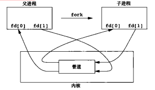

[TOC]

# Linux基础 #

## 1. 命令 ##

### 1.1 搜索命令 ###

**文本搜索**

* **grep**  使用正则表示式进行全文查找并打印，可接受管道传入

  * -c :  显示计数
  * -n:  显示行号
  * -v:  反向选择，即显示出没有搜寻字符串内容的那一行

  ```
  $ grep [-cinv] <regex> <filename>
  ```

**文件搜索**

* **whereis**  速度比较快，因为它只搜索几个特定的目录。

  ```
  $ whereis <dirname/filename>
  ```

* **locate**  使用 `/var/lib/mlocate/` 这个数据库来进行搜索，它存储在内存中，并且每天更新一次。

  ```
  $ locate <keyword>
  $ locate -r <regex>
  ```

* **find**  指定目录搜索（默认当前目录），可以使用文件的属性和权限进行搜索

  ```
  $ find [basedir] -name <filename>

  $ find [basedir] -mtime <n> 	//列出在 n 天前的那一天修改过内容的文件
  $ find [basedir] -mtime -<n> 	//列出在 n 天之前 (不含 n 天本身) 修改过内容的文件
  $ find [basedir] -mtime +<n>   	//列出在 n 天之内 (含 n 天本身) 修改过内容的文件

  $ find [basedir] -uid <n>
  $ find [basedir] -gid <n>
  $ find [basedir] -[no]user <username>
  $ find [basedir] -[no]group <usergroup>

  $ find [basedir] -size <[+-]SIZE>	//搜寻比 SIZE 还要大 (+) 或小 (-) 的文件。
  									//这个 SIZE 的规格有：c: 代表 byte，k: 代表 1024bytes
  $ find [basedir] -type <TYPE>
  $ find [basedir] -perm <mode>  		//搜索权限等于 mode 的文件
  $ find [basedir] -perm -<mode> 		//搜索权限包含 mode 的文件
  $ find [basedir] -perm /<mode> 		//搜索权限包含任一 mode 的文件
  ```

**指令搜索**

* **which** 搜索PATH中**可执行**指令的文件存放位置
  ```
  $ which [-a] command 	//-a ：将所有指令列出，而不是只列第一个
  ```

* **type**  显示指定PATH中的命令的类型 

  ```
  //内建指令返回 command is a shell builtin
  //别名返回具体全名
  //外部指令显示路径
  //PATH下文件显示路径
  $ type command
  ```

### 1.2 压缩命令 ###

* **gzip**  对应后缀为`.Z,.zip,.gz`，不保留源文件

  ```
  $ gzip [-# <number>] <filename> 	//以number等级压缩
  $ gzip -d <filename>				//解压
  ```

* **bzip2**  对应后缀为`.bz`，可使用`-k`保留源文件

  ```
  $ bzip2 [-# <number>] [-k] <filename>
  $ bzip2 -d <filename>
  ```

* **xz**  对应后缀为`.xz`，可使用`-k`保留源文件

  ```
  $ xz [-# <number>] [-k] <filename>
  $ xz -d <filename>
  ```

* **tar**  打包，参数`-z`使用 gzip 压缩，参数`-j`使用 bzip2 压缩，参数`-J`使用 xz 压缩。

  ```
  $ tar -[z|j|J][cv]f <tar name> <dirname/filename> // 归档并压缩，-v 可视，-f 指定tar文件
  $ tar -[z|j|J][xv]f <tar name> [-C <dirname>] // 解压缩并解归档，-C 解压到目录
  $ tar -[z|j|J][tv]f <tar name> // 查看内容
  ```

### 1.3 管道命令 ###

以下这些命令经常用来向管道传递数据或处理管道传进来的数据。

**文本提取命令**

* **cut**  对数据进行切分，取出想要的部分。切分过程一行一行地进行。

  ```
  $ command | cut -d <s> -f <n> 	//取出经过s分割后第n和区间，区间从1开始
  $ command | cut -c <n-m> 	//取出第n到m的字符，包含n和m，从1开始，当n或m为行首或行末时可省略
  ```

* **printf**   用于格式化输出。它不属于管道命令，在给 printf 传数据时需要使用 $( ) 形式。

  ```
  $ printf '%10s %5i %5i %5i %8.2f \n' $(cat printf.txt)	// 格式控制字符类似C语言
  ```

* **awk**  每次处理一行，处理的最小单位是字段，每个字段的命名方式为：$n，n 为字段号，从 1 开始，$0 表示一整行。

  ```
  $ command | awk {printf $1 "\t" $3}		//打印每行的第一和第三个字段
  $ command | awk 'condition1 {action1} condition2 {action2} ...'  	// 根据条件打印
  $ command | awk 'BEGIN {FS=":"} NR > 1 {NF}'  	//BEGIN为开始变量条件，FS为分割字符，默认空格
  												//FS为拥有的字段总数，NR为当前行号
  ```

**文本辅助命令**

* **sort**  对数据进行排序

  * -n 使用数字排序
  * -r 反向排序
  * -u 去重

  ```
  $ sort [options] <filename/stdin>
  $ command | sort [-t <s>] -k <n>  //以s分割（默认'\t'）后的第n区间为排序列进行排序
  ```

* **uniq**  去除重复行

  * -c 显示计数
  * -i 忽略大小写

  ```
  $ command | uniq [options]
  ```

* **tee**  双向输出重定向，一个输出会同时传送到文件和屏幕上。

  ```
  tee [-a] file	// -a 追加到文件
  $ command | tee [-a] file
  ```

**字符转换命令**

* **tr**  删除行中的字符或替换

  ```
  $ command | tr [-ds] <str> ... -d ： 删除行中 str 这个字符串
  $ command | tr <abc> <def> ： a替换为d，b替换为e，c替换为f
  ```


* **col**  将 tab 字符转为等长的空格字符

  ```
  $ command | col [-x]	// -x ： 将 tab 键转换成对等的空格键
  ```

* **expand**  将 tab 转换一定数量的空格，默认是 8 个。

  ```
  $ command | expand [-t] file 	// -t ：tab 转为空格的数量
  ```

* **join**  将有相同数据区间的那一行合并在一起。默认匹配空格分割的第一区间。

  * -i 忽略大小写

  ```
  join [-t <c>] [-46] <file1> <file2> //匹配c分割的file1的第4区间，file2的第6区间，合并相同行
  ```

* **paste**  直接将两行粘贴在一起。

  ```
  $ paste [-d <c>] <file1> <file2> //将file1和file2行号相同的行合并，以c分割，默认为'\t'
  ```

**文件分割**

* **split**  分割单个文件为多个文件

  * -b  以文件大小分割，可加单位，例如 b, k, m 等
  * -l 以行数分割

  ```
  $ split [-bl] file PREFIX	//PREFIX为分割后文件的前缀，生成分割文件名为aa,ab,ac...
  ```

**字符统计**

* **wc**  统计文本中的字符数

  ```
  $ wc -c <filename>	//统计字节数
  $ wc -l <filename>	//统计行数
  $ wc -w <filename>	//统计单词数
  ```

  ​

### 1.4 进程管理 ###

* **ps**  查看当前时间点的进程信息

  ```
  $ ps -l		//查看自己的进程
  $ ps -u <username>	//查看username的进程
  $ ps aux	//查看系统所有进程	au:显示较详细的资讯, x:显示其他用户进程
  ```

* **pstree** 查看进程树

  ```
  $ pstree [-A]	//-A 显示所有进程
  ```

* **top**  实时显示进程信息

  ```
  $ top [-d <time>]	//以time间隔刷新显示
  ```

* **netstat**  查看占用端口的进程

  ```
  # netstat -anp | grep <port>
  ```

  ​

### 1.5 常用基础命令 ###

以下命令已经用的比较久，比较熟，不详细笔记了，只记录一下。

```
$ ls [-al]
$ cd <' '|~|-|dirname>
$ ipconfig
$ more/less
$ head/tail
$ rm [-rf]
$ mv [-f]
$ cp [-r]
$ touch
$ mkdir
$ ln [-s] <sourceFile> <CreatedLinkFile>
$ chmod -<[ugoa] [+-=] [rwx]> <dirname/filename>
$ chmod -R <mode> <dirname/filename>
$ cat/tac
$ echo $argname
$ exit
$ pwd
$ clear
$ last
$ whoami
$ history
$ df -hl
$ env $PATH
$ shutdown
$ who
```

**组合键操作**

* **Ctrl + C**：彻底退出
* **Ctrl + Z**：挂起当前进程

### 1.6 高级指令 ###

**周期执行指令**

* **crontab**  

## 2. 文件系统 ##

### 2.1 文件系统组成 ###


最主要的几个组成部分如下：

- inode：一个文件占用一个 inode，记录文件的属性，同时记录此文件的内容所在的 block 编号；
- block：记录文件的内容，文件太大时，会占用多个 block。

除此之外还包括：

- superblock：记录文件系统的整体信息，包括 inode 和 block 的总量、使用量、剩余量，以及文件系统的格式与相关信息等；
- block bitmap：记录 block 是否被使用的位域；

**block**

在 Ext2 文件系统中所支持的 block 大小有 1K，2K 及 4K 三种，不同的大小限制了单个文件和文件系统的最大大小。

| 大小         | 1KB  | 2KB   | 4KB  |
| ------------ | ---- | ----- | ---- |
| 最大单一文件 | 16GB | 256GB | 2TB  |
| 最大文件系统 | 2TB  | 8TB   | 16TB |

一个 block 只能被一个文件所使用，未使用的部分直接浪费了。因此如果需要存储大量的小文件，那么最好选用比较小的 block。

**inode**

inode 具体包含以下信息：

- 权限 (read/write/excute)；
- 拥有者与群组 (owner/group)；
- 容量；
- 建立或状态改变的时间 (ctime)；
- 最近一次的读取时间 (atime)；
- 最近修改的时间 (mtime)；
- 定义文件特性的旗标 (flag)，如 SetUID...；
- 该文件真正内容的指向 (pointer)。

inode 具有以下特点：

- 每个 inode 大小均固定为 128 bytes (新的 ext4 与 xfs 可设定到 256 bytes)；
- 每个文件都仅会占用一个 inode。

inode 中记录了文件内容所在的 block 编号，但是每个 block 非常小，一个大文件随便都需要几十万的 block。而一个 inode 大小有限，无法直接引用这么多 block 编号。因此引入了间接、双间接、三间接引用。间接引用是指，让 inode 记录的引用 block 块记录引用信息。


### 2.2 linux文件目录 ###

建立一个目录时，会分配一个 inode 与至少一个 block。block 记录的内容是目录下所有文件的 inode 编号以及文件名。可以看出文件的 inode 本身不记录文件名，文件名记录在目录中，因此新增文件、删除文件、更改文件名这些操作与目录的 w 权限有关。

**linux目录结构**

为了使不同 Linux 发行版本的目录结构保持一致性，Filesystem Hierarchy Standard (FHS) 规定了 Linux 的目录结构。最基础的三个目录如下：

- / (root, 根目录)
- /usr (unix software resource)：所有系统默认软件都会安装到这个目录；
- /var (variable)：存放系统或程序运行过程中的数据文件


## 3. 进程管理 ##

### 3.1 进程状态 ###

[](https://github.com/CyC2018/Interview-Notebook/blob/master/pics/76a49594323247f21c9b3a69945445ee.png)

| 状态 | 说明                                                         |
| ---- | ------------------------------------------------------------ |
| R    | running or runnable (on run queue)                           |
| D    | uninterruptible sleep (usually I/O)  不可终端，指进程不响应异步信号 |
| S    | interruptible sleep (waiting for an event to complete)       |
| Z    | zombie (terminated but not reaped by its parent)             |
| T    | stopped (either by a job control signal or because it is being traced) |

### 3.2 子进程创建 ###

**父子进程资源关系**

独立关系：独立PCB，子进程获得父进程数据空间、堆和栈的**副本**

共享关系：父子进程共享代码段，共享已打开的文件句柄

**fork()**

fork()函数是Unix中派生新进程的一个方法，声明如下：

```cpp
#include <unistd.h>  
  
pid_t fork(void); 
```

我们需要理解的是，调用一次fork()方法，该方法会返回两次。此后的代码段都会在父子进程中执行。

* 一次是在父进程中，返回值是新派生的进程的进程ID。
* 一次是在子进程中返回，返回值是0，代表当前进程为子进程。

如果返回值为-1的话，则代表在派生新进程的过程中出错。**fork出错可能有两种原因：**

* 当前的进程数已经达到了系统规定的上限，这时errno的值被设置为EAGAIN。
* 系统内存不足，这时errno的值被设置为ENOMEM。

fork() 典型使用方法：

```c
#include <stdio.h>
#include <unistd.h>


int main(void) {
    int count = 1;
    int pid;

    if((pid = fork()) < 0)
        printf("fork error : ");
    else if(pid == 0)	// 子进程
        printf("SON, count = %d (%p), pid = %d\n", ++count, &count, getpid());
    else	//父进程
        printf("FATHER, count = %d (%p), pid = %d\n", ++count, &count, getpid());
    
    return 0;
}
```

fork() 系统调用的不足：

子进程拷贝父进程所拥有的所有资源，这种方法创建慢且效率低，因为子进程需要拷贝父进程所拥有的所有资源，实际上，子进程几乎不必读或修改父进程所拥有的所有资源。 <br />**写时复制技术**很好的解决了上述问题。写时复制技术允许父子进程读相同物理页，只要两者中有一个试图写一个物理页，内核就把这个页的内容拷贝到一个新的物理页，并把这个物理页分配给正在写的进程。 

**vfork()**

vfork()也是用来解决创建新进程再用exec函数执行另外的程序，实际上，在没调用exec或exit之前子进程与父进程共享数据段，避免了只进行exec而进行不必要的数据段复制。在vfork调用中，子进程先运行，父进程阻塞（会导致挂起），直到子进程调用exec或exit，在这以后，父子进程的执行顺序不再有限制。

> exec()函数簇
>
> 在Linux中要使用exec函数族。系统调用execve（）对当前进程进行替换，替换者为一个指定的程序，其参数包括文件名（filename）、参数列表（argv）以及环境变量（envp）。exec函数族当然不止一个，但它们大致相同，在 Linux中，它们分别是：execl，execlp，execle，execv，execve和execvp，请通过manexec命令来了解它们的具体情况。
>
> 一个进程一旦调用exec类函数，它本身就"死亡"了，系统把代码段替换成新的程序的代码，废弃原有的数据段和堆栈段，并为新程序分配新的数据段与堆栈段，唯一留下的，就是进程号，也就是说，对系统而言，还是同一个进程，不过已经是另一个程序了。（不过exec类函数中有的还允许继承环境变量之类的信息。）

vfork() 典型使用：

```c
#include <stdio.h>
#include <unistd.h>

int main(void) {
    int pid;

    if((pid = fork()) < 0)
        printf("fork error : ");
    else if(pid == 0)	// 子进程
        execl(const char *path, const char *arg, ...);	//path 为程序位置，arg为启动参数
    else	//父进程
        printf("FATHER, pid = %d\n", getpid());
    
    return 0;
}
```

vfork() 缺点：

vfork带来效率提升的同时，也引入了一些麻烦。首先是数据段与堆栈的共享。子进程数据改变可能影响父进程的执行。为了降低风险，vfork调用后父进程会阻塞到子进程exec被调用。所以能够避免父进程影响子进程。而子进程对父进程的影响则要靠程序员自己控制。所以应该在vfork之后尽快调用exec。

**clone()**

clone函数功能强大，带了众多参数，因此由他创建的进程要比前面2种方法要复杂。

clone可以让你有选择性的继承父进程的资源，你可以选择想vfork一样和父进程共享一个虚存空间，从而使创造的是线程，你也可以不和父进程共享，你甚至可以选择创造出来的进程和父进程不再是父子关系，而是兄弟关系。

先有必要说下这个函数的结构 

```c 
int clone(int (fn)(void ), void *child_stack, int flags, void *arg); 
```

这里fn是函数指针，我们知道进程的4要素，这个就是指向程序的指针，就是所谓的“剧本”, child_stack明显是为子进程分配系统堆栈空间（在linux下系统堆栈空间是2页面，就是8K的内存，其中在这块内存中，低地址上放入了值，这个值就是进程控制块task_struct的值）,flags就是标志用来描述你需要从父进程继承那些资源， arg就是传给子进程的参数）。下面是flags可以取的值

| 标志          | 含义                                                         |
| ------------- | ------------------------------------------------------------ |
| CLONE_PARENT  | 创建的子进程的父进程是调用者的父进程，新进程与创建它的进程成了“兄弟”而不是“父子” |
| CLONE_FS      | 子进程与父进程共享相同的文件系统，包括root、当前目录、umask  |
| CLONE_FILES   | 子进程与父进程共享相同的文件描述符（file descriptor）表      |
| CLONE_NEWNS   | 在新的namespace启动子进程，namespace描述了进程的文件hierarchy |
| CLONE_SIGHAND | 子进程与父进程共享相同的信号处理（signal handler）表         |
| CLONE_PTRACE  | 若父进程被trace，子进程也被trace                             |
| CLONE_VFORK   | 父进程被挂起，直至子进程释放虚拟内存资源                     |
| CLONE_VM      | 子进程与父进程运行于相同的内存空间                           |
| CLONE_PID     | 子进程在创建时PID与父进程一致                                |
| CLONE_THREAD  | Linux 2.4中增加以支持POSIX线程标准，子进程与父进程共享相同的线程群 |

### 3.3 子进程管理 ###

**SIGCHLD**

当一个子进程改变了它的下列状态时：停止运行，继续运行或者退出，有两件事会发生在父进程中：

- 得到 SIGCHLD 信号；
- waitpid() 或者 wait() 调用会返回。

[](https://github.com/CyC2018/Interview-Notebook/blob/master/pics/flow.png)

其中子进程发送的 SIGCHLD 信号包含了子进程的信息，包含了进程 ID、进程状态、进程使用 CPU 的时间等。

在子进程退出时，它的进程描述符不会立即释放，这是为了让父进程得到子进程信息。父进程通过 wait() 和 waitpid() 来获得一个已经退出的子进程的信息。

wait

```
pid_t wait(int *status)
```

父进程调用 wait() 会一直阻塞，直到收到一个子进程退出的 SIGCHLD 信号，之后 wait() 函数会销毁子进程并返回。

如果成功，返回被收集的子进程的进程 ID；如果调用进程没有子进程，调用就会失败，此时返回 -1，同时 errno 被置为 ECHILD。

参数 status 用来保存被收集的子进程退出时的一些状态，如果我们对这个子进程是如何死掉的毫不在意，只想把这个子进程消灭掉，可以设置这个参数为 NULL：

```
pid = wait(NULL);
```

**waitpid()**

```
pid_t waitpid(pid_t pid, int *status, int options)
```

作用和 wait() 完全相同，但是多了两个可由用户控制的参数 pid 和 options。

pid 参数指示一个子进程的 ID，表示只关心这个子进程的退出 SIGCHLD 信号。如果 pid=-1 时，那么和 wait() 作用相同，都是关心所有子进程退出的 SIGCHLD 信号。

options 参数主要有 WNOHANG 和 WUNTRACED 两个选项，WNOHANG 可以使 waitpid() 调用变成非阻塞的，也就是说它会立即返回，父进程可以继续执行其它任务。

**孤儿进程**

一个父进程退出，而它的一个或多个子进程还在运行，那么这些子进程将成为孤儿进程。

孤儿进程将被 init 进程（进程号为 1）所收养，并由 init 进程对它们完成状态收集工作。

由于孤儿进程会被 init 进程收养，所以孤儿进程不会对系统造成危害。

**僵尸进程**

一个子进程的进程描述符在子进程退出时不会释放，只有当父进程通过 wait() 或 waitpid() 获取了子进程信息后才会释放。如果子进程退出，而父进程并没有调用 wait() 或 waitpid()，那么子进程的进程描述符仍然保存在系统中，这种进程称之为僵尸进程。

僵尸进程通过 ps 命令显示出来的状态为 Z（zombie）。

系统所能使用的进程号是有限的，如果大量的产生僵尸进程，将因为没有可用的进程号而导致系统不能产生新的进程。

要消灭系统中大量的僵尸进程，只需要将其父进程杀死，此时所有的僵尸进程就会变成孤儿进程，从而被 init 所收养，这样 init 就会释放所有的僵死进程所占有的资源，从而结束僵尸进程。

## 4. 进程通信IPC与线程通信 ##

### 4.1 linux进程间通信 ###

linux右6种进程通信方式：

* **管道（Pipe）及有名管道（named pipe）**：管道可用于具有亲缘关系进程间的通信，有名管道克服了管道没有名字的限制，因此，除具有管道所具有的功能外，它还允许无亲缘关系进程间的通信；
* **信号（Signal）**：信号是比较复杂的通信方式，用于通知接受进程有某种事件生，除了用于进程间通信外，进程还可以发送信号给进程本身；linux除了支持Unix早期 信号语义函数sigal外，还支持语义符合Posix.1标准的信号函数sigaction（实际上， 该函数是基于BSD的，BSD为了实现可靠信号机制，又能够统一对外接口，sigaction函数重新实现了signal函数）；
* **消息队列（MQ）**：消息队列是消息的链接表，包括Posix消息队列system V消息队列。有足够权限的进程可以向队列中添加消息，被赋予读权限的进程则可以读走队列中的消息。消息队列克服了信号承载信息量少，管道只能承载无格式字节流以及缓冲区大小受限等缺点。
* **共享内存**：使得多个进程可以访问同一块内存空间，是最快的可用IPC形式。是针其他通信机制运行效率较低设计的。往往与其它通信机制，如信号量结合使用， 来达到进程间的同步及互斥。
* **信号量（semaphore）**：主要作为进程间以及同一进程不同线程之间的同步手段。
* **套接字（Socket）**：更为一般的进程间通信机制，可用于不同机器之间的进程间通信。起初是由Unix系统的BSD分支开发出来的，但现在一般可以移植到其它类Unix 系统上：Linux和System V的变种都支持套接字。

#### 4.1.1 管道通信 ####

管道是Unix系统IPC的最古老方式，有两种局限性：

1. 历史上它们是半双工的（即数据只能在一个方向上流动），虽然现在某些系统提供了全双工管道，但是为了可移植性，不要抱有绝对的全双工假设。
2. （无名）管道只能在具有公共祖先的两个进程之间使用（一般都是用于父子进程之间）。

**无名管道PIPE**

无名管道实质上是一段共享内存。linux无名管道创建：

```cpp
#include <unistd.h>

int main() {
    int fd[2];
    
    pipe(fd);	//管道创建，fd[0]用于读，fd[1]用于写
    fork();	//生成父子管道
}
```

如下给出了两种描绘**半双工管道**的方法，左图中管道的两端在一个进程中相互连接，右图中则强调数据需要通过内核在管道中流动：

 

管道通常在单个进程中没有太大用处，下图显示了父子进程之间的管道：**进程先调用pipe，接着调用fork，从而创建从父进程到子进程的IPC管道**：

 

当管道的一端被关闭后，下列两条规则起作用：

1. 当read一个写端已被关闭的管道时，在所有数据都被读取后，read返回0，表示文件结束。
2. 当write一个读端已被关闭的管道时，则产生信号SIGPIPE，如果忽略该信号或者捕捉该信号并从其处理程序返回，则write返回-1，errno设置为EPIPE。

**命名管道FIFO**

命名管道，去除了管道只能在父子进程中使用的限制，linux以文件形式存储命名管道（即共享文件）。命名管道函数原型：

```c
#include <sys/stat.h>
int mkfifo(const char *path, mode_t mode);	
int mkfifoat(int fd, const char *path, mode_t mode);
//fd 参见*at函数簇
//path 是命名管道文件位置
//mode 指明命名管道存取权限
//成功返回0 失败返回-1
```

命名管道的使用方法：

```c
// write端
#include<stdlib.h>  
#include<stdio.h>  
#include<sys/types.h>  
#include<sys/stat.h>  
#include<fcntl.h>  
#include<errno.h>  

#define PATH "./fifo"  
#define SIZE 128  

int main() {  
    //read端创建命名管道文件
    int fd = open(PATH,O_RDONLY);	//打开命名管道文件  
    if (fd < 0) {  
        printf("open fd is error\n");  
        return 0;  
    }  
  
    char Buf[SIZE];  
    while(1){  
        printf("please Enter#:");
        fflush(stdout);  
        ssize_t s = read(0,Buf,sizeof(Buf));  //从标准输入读取字符
    	if (s < 0) {  
        	perror("read error");  
        	exit(1);  
    	}  
    	else if (s == 0) {	//写完了
        	printf("write close!\n");  
        	return 1;  
    	} 
        else { //读到标准输入
        	Buf[s] = '\0'; //增加字符串结尾  
        	write(fd,Buf,strlen(Buf));  
    	}  
    }  
    close (fd); 
    
  	return 0;  
} 
```


```c
// read端
#include<stdlib.h>  
#include<stdio.h>  
#include<sys/types.h>  
#include<sys/stat.h>  
#include<fcntl.h>  
#include<errno.h>  

#define PATH "./fifo"  
#define SIZE 128  

int main() {  
    umask(0);  //设置文件默认掩码权限
    
    if (mkfifo (PATH,0666|S_IFIFO) == -1) {  
    	perror ("mkefifo error");  
    	exit(0);  
    }  
    
    int fd = open(PATH,O_RDONLY);	//打开命名管道文件  
    if (fd < 0) {  
        printf("open fd is error\n");  
        return 0;  
    }  
  
    char Buf[SIZE];  
    while(1){  
    	ssize_t s = read(fd,Buf,sizeof(Buf));  
    	if (s<0) {  
        	perror("read error");  
        	exit(1);  
    	}  
    	else if (s == 0) {//write端退出
        	printf("client quit! i shoud quit!\n");  
        	break;  
    	} 
        else {//读到写数据
        	Buf[s] = '\0';//增加字符串结尾  
        	printf("client# %s ",Buf);  
        	fflush(stdout);  
    	}  
    }  
    close (fd); 
    
  	return 3;  
} 
```

命名管道应用：

FIFO 常用于客户-服务器应用程序中，FIFO 用作汇聚点，在客户进程和服务器进程之间传递数据。


**管道通信特征和不足**

无名管道：

* 一般只能单向通信
* 通信进程之前要有血缘关系

#### 4.1.2 信号

**信号基础知识**

**信号本质**：信号的本质是软件层次上对中断的一种模拟（软中断）。它是一种异步通信的处理机制，事实上，进程并不知道信号何时到来。

**信号来源**：常见的有

1. 程序错误，如非法访问内存
2. 外部信号，如按下了CTRL+C
3. 通过kill或sigqueue向另外一个进程发送信号
4. 软件产生

**信号分类**：信号分为可靠信号与不可靠信号,可靠信号又称为实时信号，非可靠信号又称为非实时信号。

信号代码从SIGRTMIN到SIGRTMAX之间的信号是可靠信号。可靠信号不存在丢失，由sigqueue发送，可靠信号支持排队 

信号代码从1到32是不可靠信号,不可靠信号主要有以下问题:

1. 每次信号处理完之后，就会恢复成默认处理，这可能是调用者不希望看到的（早期的signal函数，linux2.6.35.6内核经验证已经不再恢复默认动作）。
2. 存在信号丢失的问题（进程收到的信号不作排队处理，相同的信号多次到来会合并为一个）。

现在的Linux对信号机制进行了改进，因此，不可靠信号主要是指信号丢失。

**信号列表：**我们可以用**kill -l**命令查看系统中定义的信号列表：


乍一看，好像有64种信号，但如果仔细观察，你就会发现并非如此。没有32和33号信号。一共只有62个信号

**信号响应方式：**主要有三种

1. 采用系统默认处理SIG_DFL,执行缺省操作
2. 捕捉信号处理，即用户自定义的信号处理函数来处理
3. 忽略信号SIG_IGN ,但有两种信号不能被忽略SIGKILL，SIGSTOP

**信号的生命周期：**信号产生->信号注册－>信号在进程中注销->信号处理函数执行完毕

* 信号的产生是指触发信号的事件的发生 
* 信号注册的过程就是将信号值加入到未决信号集中 

信号处理过程的参考图

 

**信号的阻塞：**实际执行信号的处理动作称为信号抵达，信号从产生到抵达之间的状态 ，称为信号未决.进程可以选择阻塞某个信号。 被阻塞的信号产生时将保持在未决状态，直到进程解除对此信号的阻塞，才执行抵达的动作. 阻塞和忽略是不相同的，只要信号被阻塞就不会抵达，而忽略是在抵达之后可选的一种处理动作.

**信号处理函数**

```c
#include<signal.h>

//sigset_t类型对于每种信号用一个bit表示 "有效"或者"无效" 接下来我们来认识一下信号集操作函数

//初始化set所指向的信号集,使其中所有信号的对应的bit清零，表示该信号集不包含任何有效信号.
int sigemptyset(sigset_t *set);

//初始化set所指向的信号集，使其中所有信号的对应bit置位，表示该信号机的有效信号包括系统支持的所有信号.
int sigfillset(sigset_t *set)；

//在该信号集中添加某种有效信号.
int sigaddset(sigset_t *set,int signo);

//在该信号集中删除某种有效信号
int sigdelset(sigset_t *set,int signo);

//是一个布尔函数，用于判断一个信号集的有效信号中是否包含某种信号，若包含贼返回1，不包含则返回0，出错返回-1
int sigismemeber(const sigset_t *set,int signo);

//读取或更改进程的信号屏蔽字(阻塞信号集)如果成功返回0 失败返回-1
int sigprocmask(int how,const sigset_t *set,sigset_t *oset);

//读取当前进程的未决信号集,通过set参数传出，调用成功则返回0，出错则返回-1.
int sigpending(sigset_t *set);

//指定信号的sig的自定义处理函数为handle
void signal(int sig, void (*) handle(int));
```

下面看一个例子：

```c
#include<stdio.h>
#include<signal.h>
#include<unistd.h>
 
void printsigset(sigset_t *set) {
	int i = 0;
	for(;i<32;i++) {
		if(sigismember(set,i))	//信号i存在信号集set中打印1，否则打印0
			putchar('1');
		else
			putchar('0');
	}
	puts("");//换行
}
 
int main() {
	sigset_t s,p;
	sigemptyset(&s);	//初始化信号集为空
	sigaddset(&s,SIGINT);	//添加SIGINT到信号集
	sigprocmask(SIG_BLOCK,&s,NULL);	//设置信号阻塞集
	
    while(1) {//由于SIGINT被阻塞，所以Ctrl+C产生的信号不会抵达，但会进入未决集
		sigpending(&p);
		printsigset(&p);
		sleep(1);
	}
    
	return 0;
```

#### 4.1.3 消息队列

**什么是消息队列？**

消息队列提供了一种从一个进程向另一个进程发送一个数据块的方法。  每个数据块都被认为含有一个类型，接收进程可以独立地接收含有不同类型的数据结构。我们可以通过发送消息来避免命名管道的同步和阻塞问题。但是消息队列与命名管道一样，每个数据块都有一个最大长度的限制。

与命名管道相比，消息队列的**优势**在于，1、消息队列也可以独立于发送和接收进程而存在，从而消除了在同步命名管道的打开和关闭时可能产生的困难。2、同时通过发送消息还可以避免命名管道的同步和阻塞问题，不需要由进程自己来提供同步方法。3、接收程序可以通过消息类型有选择地接收数据，而不是像命名管道中那样，只能默认地接收。  

**消息队列相关函数原型**

```c
/**
 * 创建或获取一个消息队列
 * @return 消息标识符msgid
 * @param key 事先约定
 * @param msgflg 消息队列权限，可以与IPC_CREAT做或操作
 **/
int msgget(key_t key, int msgflg);

/**
 * 将消息添加到消息队列中
 * @return 如果调用成功，消息数据的一分副本将被放到消息队列中，并返回0，失败时返回-1
 * @param msgid msgget返回的消息队列标识符
 * @param msg_ptr 消息的指针, 指针msg_ptr所指向的消息结构一定要是以一个长整型成员变量开始的结构体
 * @param msg_sz 消息长度 不包括长整型消息类型成员变量的结构体长度
 *@param msgflg 用于控制当前消息队列满或队列消息到达系统范围的限制时将要发生的事情
 **/
int msgsend(int msgid, const void *msg_ptr, size_t msg_sz, int msgflg); 

/**
 * 获取消息队列中的消息
 * @return 获取消息成功返回消息长度，失败返回-1
 * @param msgtype 
 *	  如果msgtype为0，就获取队列中的第一个消息。
 *	  如果它的值大于零，将获取具有相同消息类型的第一个信息。
 *	  如果它小于零，就获取类型等于或小于msgtype的绝对值的第一个消息。
 * @param msgflg 控制当队列中没有相应类型的消息时将发生的事情
 **/
int msgrcv(int msgid, void *msg_ptr, size_t msg_st, long int msgtype, int msgflg);

/**
 * 消息队列控制
 * @return 成功返回0，失败返回-1
 * @param command 控制命令，有三个值
 *	  IPC_STAT：把msgid_ds结构中的数据设置为消息队列的当前关联值
 *	  IPC_SET：如果进程有足够的权限，就把消息列队的当前关联值设置为msgid_ds结构中给出的值
 *	  IPC_RMID：删除消息队列
 * @param buf 这个结构体至少含有以下结构
 *	  struct msgid_ds {    
 *	      uid_t shm_perm.uid;    
 *	      uid_t shm_perm.gid;    
 *	      mode_t shm_perm.mode;    
 *	  };  
 **/
int msgctl(int msgid, int command, struct msgid_ds *buf); 
```

**消息队列示例**

```c
/* 消息发送端：send.c */

#include <stdio.h>     
#include <sys/types.h>     
#include <sys/ipc.h>     
#include <sys/msg.h>     
#include <errno.h>     
  
#define MSGKEY 1024     
    
struct msgstru {    
   long msgtype;    
   char msgtext[2048];     
};    
    
int main() {    
	struct msgstru msgs;    
  	int msg_type;    
  	char str[256];    
  	int ret_value;    
  	int msqid;    
    
  	msqid = msgget(MSGKEY,IPC_EXCL);  /*检查消息队列是否存在*/    
  	if(msqid < 0){    
    	msqid = msgget(MSGKEY,IPC_CREAT|0666);/*创建消息队列*/    
    	if(msqid < 0){    
    		printf("failed to create msq | errno=%d [%s]\n",errno,strerror(errno));    
    		exit(-1);    
    	}    
  	}     
     
  	while (1){    
    	printf("input message type(end:0):");    
    	scanf("%d",&msg_type);    
    	if (msg_type == 0)    
       		break;    
    	printf("input message to be sent:");    
    	scanf ("%s",str);    
    	msgs.msgtype = msg_type;    
    	strcpy(msgs.msgtext, str);    
    	/* 发送消息队列 */    
    	ret_value = msgsnd(msqid,&msgs,sizeof(struct msgstru),IPC_NOWAIT);    
    	if ( ret_value < 0 ) {    
       		printf("msgsnd() write msg failed,errno=%d[%s]\n",errno,strerror(errno));    
       		exit(-1);    
    	}    
  	}    
  	msgctl(msqid,IPC_RMID,0); //删除消息队列    
    
    return 0;
}  
```
```c
/* 消息接收端 receive.c */

#include <stdio.h>     
#include <sys/types.h>     
#include <sys/ipc.h>     
#include <sys/msg.h>     
#include <errno.h>     
    
#define MSGKEY 1024     
    
struct msgstru    
{    
   long msgtype;    
   char msgtext[2048];    
};    
    
/*子进程，监听消息队列*/    
void childproc(){    
  	struct msgstru msgs;    
  	int msgid,ret_value;    
  	char str[512];    
      
  	while(1){    
     	msgid = msgget(MSGKEY,IPC_EXCL );/*检查消息队列是否存在 */    
     	if(msgid < 0){    
        	printf("msq not existed! errno=%d [%s]\n",errno,strerror(errno));    
        	sleep(2);    
        	continue;    
     	}    
     /*接收消息队列*/    
     	ret_value = msgrcv(msgid,&msgs,sizeof(struct msgstru),0,0);    
     	printf("text=[%s] pid=[%d]\n",msgs.msgtext,getpid());    
  	}    
  	return;    
}    
    
int main(){    
  	int i,cpid;    
    
  	/* create 5 child process */    
  	for (i=0;i<5;i++){    
     	cpid = fork();    
     	if (cpid < 0)    
        	printf("fork failed\n");    
     	else if (cpid ==0) /*child process*/    
        	childproc(); 
  	}    
    return 0;
}  
```

#### 4.1.4 共享内存

当一个程序想和另外一个程序通信的时候。那内存可以为这两个程序生成一块公共的内存区域（通过页表指向同一块物理内存实现）。这块被两个进程分享的内存区域叫做**共享内存**。

由于全部进程共享同一块内存，并不须要通过系统调用或者其他须要切入内核的过程来完毕。同一时候它也避免了对数据的各种不必要的复制。 所以共享内存在各种进程间通信方式中具有最高的效率。但是需要自己实现共享内存的同步访问。通常是通过使用**信号量（参见下一节）**进行同步。

**共享内存函数原型**

```c
/**
 * 创建共享内存
 * @param shmflg 创建标志
 *    IPC_CREAT：够创建一个具有指定键值的新共享内存块。
 *    IPC_EXCL：与 IPC_CREAT 一同使用。假设已有一个具有这个键值的共享内存块存在。则shmget会调用失败。
 * @return 成功返回标识符，失败返回-1
 **/
int shmget(key_t key ,int size,int shmflg);
    
/**
 * 映射共享内存
 * @param shmaddr 共享内存起始地址。0，则有内核指定，非0则为设定地址
 * @param shmflg 操作模式。SHM_RDONLY 只读。SHM_RND 将 shmaddr向下对齐到内存地址。
 * @return 成功返回共享内存起始，失败返回-1
 **/
int shmat(int shmid,char *shmaddr，int flag);
    
/**
 * 卸载共享内存
 * @return 成功返回0，失败返回-1
 **/
int shmdt(char *shmaddr);

/**
 * 控制共享内存
 * 应当在结束使用每一个共享内存块的时候都使用 shmctl 进行释放，以防止超过系统所同意的共享内存块的
 * 总数限制。调用 exit 和 exec 会使进程脱离共享内存块，但不会删除这个内存块。
 * 也可以在命令行通过ipcrm控制删除共享内存
 *
 * @param cmd，控制命令
 *	  IPC_STAT 获取共享内存到buf
 *    IPC_SET 将buf设置到共享内存中
 *    IPC_RMID 删除共享内存
 * @return 成功返回0，失败返回-1
 **/
int  shmctl( int shmid , int cmd , struct shmid_ds *buf );
```

#### 4.1.5 信号量

信号量主要通过PV操作控制线程间同步与互斥。

**函数原型**

```c
#include <sys/sem.h>

/**
 * 创建信号量
 * @param num_sems 信号量大小
 * @param sem_flags 创建标志 IPC_CREAT | IPC_EXCL
 * @return
 **/
int semget(key_t key, int num_sems, int sem_flags);

/**
 * 改变信号量
 * @param sem_opa 更改操作，其结构体如下
 *    struct sembuf{
 *		  short sem_num; //除非使用一组信号量，否则它为0 
 *		  short sem_op; //信号量在一次操作中需要改变的数据，通常是两个数，即-1和+1
 *		  short sem_flg;//通常为SEM_UNDO,使操作系统跟踪信号，并在进程没有释放该信号量而终止时，
 * 						//操作系统释放信号量
 *	  }
 * @return
 **/
int semop(int sem_id, struct sembuf *sem_opa, size_t num_sem_ops);

/**
 * 控制信号量
 * @param command 控制命令
 *	   SETVAL 通过第四个union参数的val初始化信号量值
 * 	   IPC_RMID 删除
 * @param 第四参数 通常为一个union
 * 	   union semun{ 
 * 		  int val; 
 *		  struct semid_ds *buf; 
 *		  unsigned short *arry; 
 *	   };
 * @return
 **/
int semctl(int sem_id, int sem_num, int command, ...);
```

#### 4.1.6 套接字

参见网络

### 4.2 linux线程间通信

### 4.3 linux进程与线程通信

## 5. linux 多路复用

### 5.1 IO多路复用

通信方法中经常需要监听文件描述符的状态变化，而且大多数情况要同时监听大量的这些变化，就需要一个高效的方法去完成。

#### 5.1.1 select

select就是用来监视某个或某些文件描述符的状态变化的。select函数原型如下：

```c
#include <sys/select.h>

/**
 * @param nfds 待测试的描述集的总个数，linux为fdmax + 1
 * @param readfds 当这些句柄的状态变成可读时系统就告诉select函数返回
 * @param writefds 当这些句柄的状态变成可写时系统就告诉select函数返回
 * @param exceptfds 句柄上有特殊情况发生时系统会告诉select函数返回。
 * @param timeout 设置超时，NULL为无限等待，其结构体如下
 * 		struct timeval {
 *			long tv_sec; //seconds
 *			long tv_usec; //microseconds
 * 		}
 * @return 监测到文件变化返回大于0，超时返回0，出错返回-1
 */
int select (int nfds, 
            fd_set *readfds, fd_set *writefds, fd_set *exceptfds, 
            struct timeval *timeout);

```

缺点：

1. 单个进程能够监视的文件描述符的数量存在最大限制，通常是1024 
2. 内核 / 用户空间内存拷贝问题，每次调用select都需要复制大量的句柄数据
3. 当返回时，仍需要遍历整个句柄数组才能知道那个句柄发生了事件
4. 只能水平触发 

#### 5.1.2 poll

```c
#include <poll.h>

/**
 * @param fds fd集，其结构如下
 * 		struct pollfd {
 *		    int fd;             //指定要监听的文件描述符
 *			short events;       //指定监听fd上的什么事件
 *   		short revents;      //fd上事件就绪后，用于保存实际发生的事件
 *		}
 * @param nfds 文件描述符的个数
 * @param timeout 监听超时
 * @param 与select相同
 **/

int poll(struct pollfd *fds, nfds_t nfds, int timeout);
```

poll的事件类型：

 

poll相比select只是使用链表表示fd集，因而没有了文件描述符数量的约束（最大65535）。

#### 5.1.3 epoll

epoll 与 select 和 poll 在使用和实现上有很大区别。首先，epoll 使用一组函数来完成，而不是单独的一个函数；其次，epoll 把用户关心的文件描述符上的事件放在内核里的一个事件表中，无须向select和poll那样每次调用都要重复传入文件描述符集合事件集。 

```c
#include<sys/epoll.h>

/**
 * 创建指定大小的epoll
 * @return 调用成功返回一个文件描述符，失败返回-1并设置errno。
 **/
int epoll_create(int size);

/**
 * 控制epoll
 * @param epfd epoll_create的返回值
 * @param op 操作类型，有三种：EPOLL_CTL_ADD/EPOLL_CTL_MOD/EPOLL_CTL_DEL分别为注册/修改/删除事件
 * @param fd 要修改事件的fd
 * @param event 其结构体为
 * 		struct epoll_event {
 *   		__int32_t events;       //epoll事件
 *	   		epoll_data_t data;      //用户数据
 * 		};
 * 		typedef union epoll_data {
 *   		void *ptr;
 *   		int  fd;
 *   		uint32_t u32;
 *   		uint64_t u64;
 * 		} epoll_data
 * @return 调用成功返回0，调用失败返回-1并设置errno。
 **/
int epoll_ctl(int epfd, int op, int fd, struct epoll_event *event);
    

/**
 * 获取事件发生列表
 * @param events 监测到的就绪事件
 * @param maxevents 最大监听事件数量
 * @return 函数调用成功返回就绪文件描述符个数，失败返回-1并设置errno。
 **/
int epoll_wait(int epfd, struct epoll_event *events, int maxevents, int timeout);
```

三种多路复用方法的比较：

 


