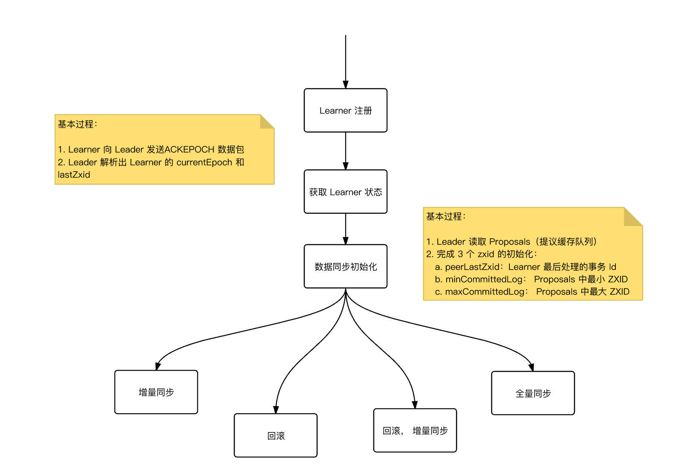
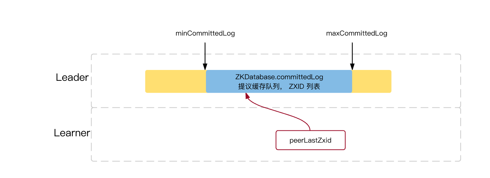
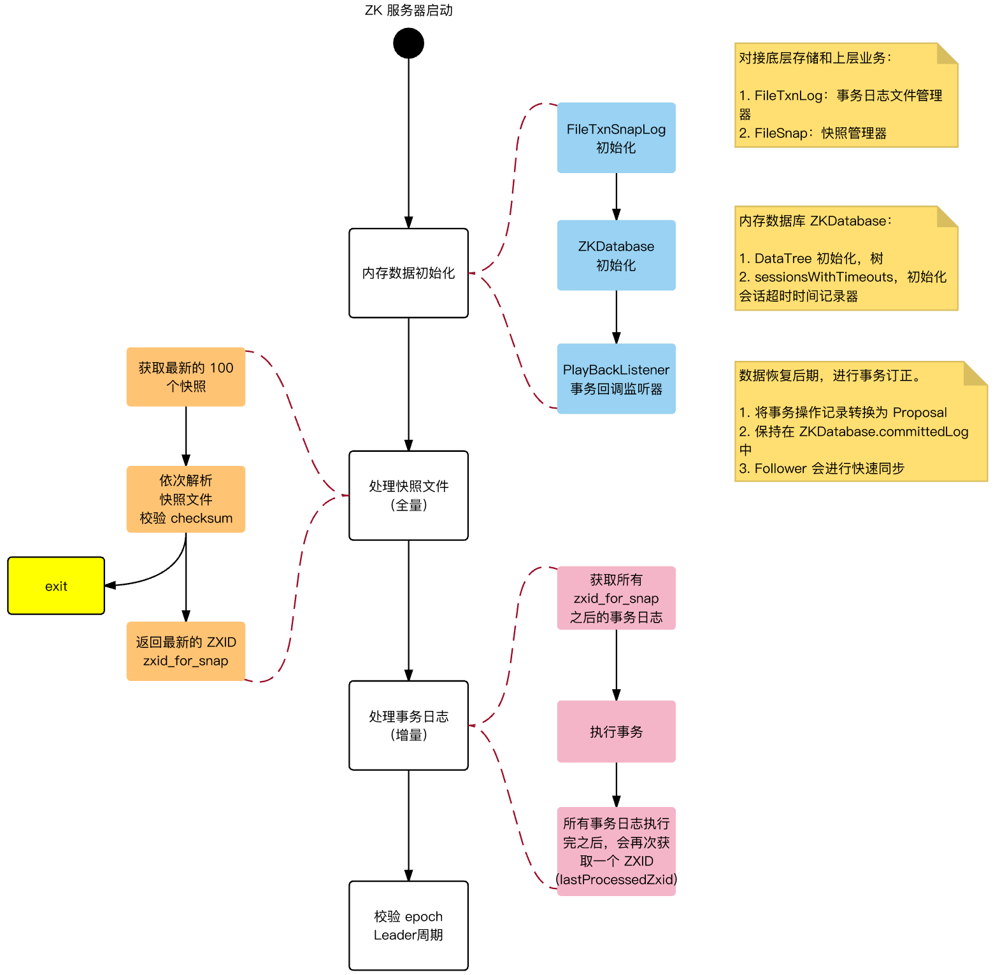
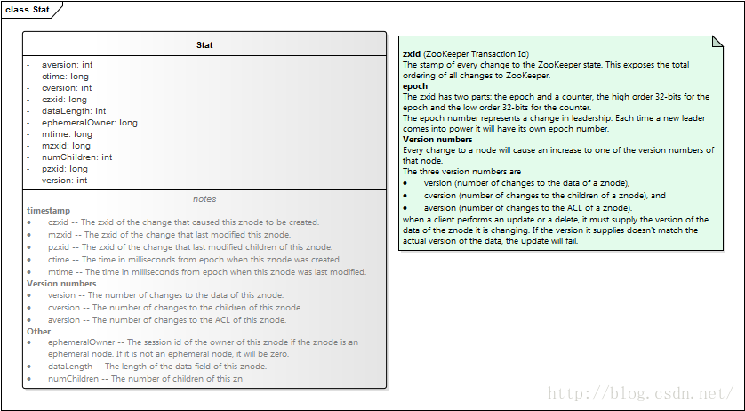
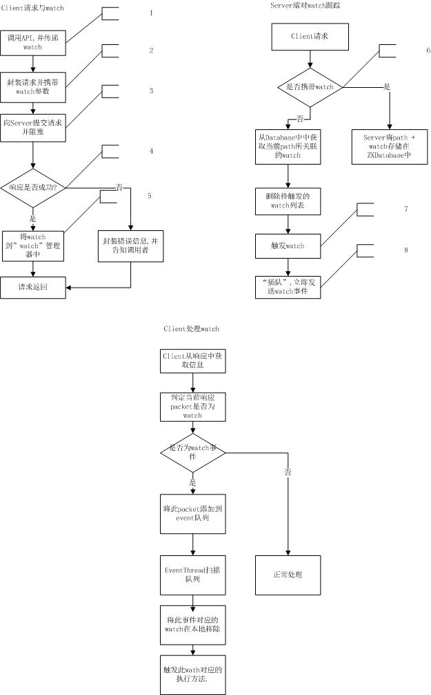

#  Zookeeper

## 1. 概述

### 1.1 什么是 zookeeper？

ZooKeeper是一个开源的分布式协调服务，他为分布式应用提供了高效且可靠的分布式协调服务，提供了诸如统一命名空间服务，配置服务和分布式锁等分布式基础服务。 

Zookeeper框架最初是在“Yahoo!”上构建的，用于以简单而稳健的方式访问他们的应用程序。后来，Apache Zookeeper成为 Hadoop，HBase和其他分布式框架使用的有组织服务的标准。例如，Apache HBase使用Zookeeper跟踪分布式数据的状态。

### 1.2 Zookeeper基础概念

在深入了解ZooKeeper的运作之前，让我们来看看ZooKeeper的基本概念。我们将在本章中讨论以下主题： 

1. Architecture（架构） 
2. Hierarchical namespace（层次命名空间） 
3. Session（会话） 
4. Watches（监视） 

#### 1.2.1 ZooKeeper的架构

看看下面的图表。它描述了ZooKeeper的“客户端-服务器架构”。


作为ZooKeeper架构的一部分的每个组件在下表中进行了说明。

| 部分             | 描述                                                         |
| ---------------- | ------------------------------------------------------------ |
| Client（客户端） | 客户端，我们的分布式应用集群中的一个节点，从服务器访问信息。对于特定的时间间隔，每个客户端向服务器发送消息以使服务器知道客户端是活跃的。类似地，当客户端连接时，服务器发送确认码。如果连接的服务器没有响应，客户端会自动将消息重定向到另一个服务器。 |
| Server（服务器） | 服务器，我们的ZooKeeper总体中的一个节点，为客户端提供所有的服务。向客户端发送确认码以告知服务器是活跃的。 |
| Ensemble         | ZooKeeper服务器组。形成ensemble所需的最小节点数为3。         |
| Leader           | 服务器节点，如果任何连接的节点失败，则执行自动恢复。Leader在服务启动时被选举。 |
| Follower         | 跟随leader指令的服务器节点。用于拓展集群。                   |

#### 1.2.2 层次命名空间

下图描述了用于内存表示的ZooKeeper文件系统的树结构。ZooKeeper节点称为 znode 。每个znode由一个名称标识，并用路径(/)序列分隔。

- 在图中，首先有一个由“/”分隔的znode。在根目录下，你有两个逻辑命名空间 config 和 workers 。
- config 命名空间用于集中式配置管理，workers 命名空间用于命名。
- 在 config 命名空间下，每个znode最多可存储1MB的数据。这与UNIX文件系统相类似，znode 也可以存储数据。这种结构的主要目的是存储同步数据并描述znode的元数据。此结构称为 ZooKeeper数据模型。


ZooKeeper数据模型中的每个znode都维护着一个 stat 结构。一个stat仅提供一个znode的元数据。它由版本号，操作控制列表(ACL)，时间戳和数据长度组成。

- **版本号** - 每个znode都有版本号，这意味着每当与znode相关联的数据发生变化时，其对应的版本号也会增加。当多个zookeeper客户端尝试在同一znode上执行操作时，版本号的使用就很重要。
- **操作控制列表(ACL)** - ACL基本上是访问znode的认证机制。它管理所有znode读取和写入操作。
- **时间戳** - 时间戳表示创建和修改znode所经过的时间。它通常以毫秒为单位。ZooKeeper从“事务ID"(zxid)标识znode的每个更改。Zxid 是唯一的，并且为每个事务保留时间，以便你可以轻松地确定从一个请求到另一个请求所经过的时间。
- **数据长度** - 存储在znode中的数据总量是数据长度。你最多可以存储1MB的数据。

**Znode的类型**

Znode被分为持久（persistent）节点，顺序（sequential）节点和临时（ephemeral）节点。

- **持久节点**  - 即使在创建该特定znode的客户端断开连接后，持久节点仍然存在。默认情况下，除非另有说明，否则所有znode都是持久的。
- **临时节点** - 客户端活跃时，临时节点就是有效的。当客户端与ZooKeeper集合断开连接时，临时节点会自动删除。因此，只有临时节点不允许有子节点。如果临时节点被删除，则下一个合适的节点将填充其位置。临时节点在leader选举中起着重要作用。
- **顺序节点** - 顺序节点可以是持久的或临时的。当一个新的znode被创建为一个顺序节点时，ZooKeeper通过将10位的序列号附加到原始名称来设置znode的路径。例如，如果将具有路径 **/myapp** 的znode创建为顺序节点，则ZooKeeper会将路径更改为 **/myapp0000000001** ，并将下一个序列号设置为0000000002。如果两个顺序节点是同时创建的，那么ZooKeeper不会对每个znode使用相同的数字。顺序节点在锁定和同步中起重要作用。

#### 1.2.3 Sessions（会话）

会话对于ZooKeeper的操作非常重要。会话中的请求按FIFO顺序执行。一旦客户端连接到服务器，将建立会话并向客户端分配会话ID 。

客户端以特定的时间间隔发送心跳以保持会话有效。如果ZooKeeper集合在超过服务器开启时指定的期间（会话超时）都没有从客户端接收到心跳，则它会判定客户端死机。

会话超时通常以毫秒为单位。当会话由于任何原因结束时，在该会话期间创建的临时节点也会被删除。

#### 1.2.4 Watches（监视）

监视是一种简单的机制，使客户端收到关于ZooKeeper集合中的更改的通知。客户端可以在读取特定znode时设置Watches。Watches会向注册的客户端发送任何znode（客户端注册表）更改的通知。

Znode更改是与znode相关的数据的修改或znode的子项中的更改。只触发一次watches。如果客户端想要再次通知，则必须通过另一个读取操作来完成。当连接会话过期时，客户端将与服务器断开连接，相关的watches也将被删除。

## 2. Zookeeper 集群工作过程

zookeeper的核心是原子广播,这个机制保证了各个server之间的同步,实现这个机制的协议叫做zab协议。zab协议有两种模式: 分别是恢复模式和广播模式。

- 恢复模式，zookeeper配置为集群模式时，系统启动或者是当前leader崩溃或者是当前leader丢失大多数的follower,zk进入恢复模式,恢复模式需要重新选举出一个新的leader,当领导者被选举出来，且大多数Server的完成了和leader的状态同步以后，恢复模式就结束了。
- 广播模式，状态同步保证了Leader和所有Server都具有相同的系统状态。这时候当Server加入Zookeeper集群后，会先在恢复模式下启动该Server，发现Leader后，并和Leader进行状态同步，待到同步结束，它也参与消息广播，即进入广播状态。Zookeeper服务一直维持在Broadcast状态，直到Leader崩溃了或者Leader失去了大部分的Followers支持，才会进入恢复模式，从新选举Leader。

### 2.1 Zookeeper 集群启动过程

**预启动**

1. 统一由QuorumPeerMain作为启动类
2. 读取zoo.cfg配置文件
3. 创建并启动历史文件清理器 DatadirCleanupManager
4. 判断当前是集群模式还是单机模式

**初始化**

1. 创建 ServerCnxnFactory，
2. 初始化 ServerCnxnFactory，初始化一个线程，作为整个 ServerCnxnFactory 的主线程然后在初始化NIO服务器
3. 创建Zookeeper数据管理器 FileTxnSnapLog,
4. 创建 QuorumPeer 实例，Quorum 是集群模式下特有的对象，是 Zookeeper 器实例的托管者，从集群层面来看 QuorumPeer 代表了 Zookeeper 集群中一台服务器，在运行期间它会不断检查当前服务器实例运行的状态。然后根据情况进行 Leader 选举。
5. 创建内存数据库 ZKDatabase
6. 初始化 QuorumPeer，这里把一些核心组件注册到QuorumPeer，这些核心组件包括 FileTxnSnapLog、ServerCnxnFactory 和 ZKDatabase，同时 Zookeeper 还会对 QuorumPeer 配置一些参数，包括服务器地址列表，选举算法和会话超时时间等。
7. **恢复本地数据库**
8. 启动ServerCnxnFactory主线程
9. **Leader选举**
10. 交互和数据同步
11. 创建会话管理器
12. 初始化Zookeeper的请求处理链
13. **注册JMX**

在Leader选举完成之后会有一个Leader和其他服务器（Follower和Observer 统称Learner学习者）进行交互，大致流程如下：

1. Leader服务器启动Follower接收器，LearnerCnxAcceptor，来接收所有非Leader服务器的连接
2. Leader与每一个Learner之间都会有一个 LearnerHandler 实例对应负载它们之间的消息通信和数据同步
3. Learner和Leader建立连接后，Learner 向 Leader 注册，就是发送自己的信息给Leader，包括当前服务器的SID和ZXID
4. Leader解析Learner发来的注册信息，在过半向Leader注册的服务器中找到最大的epoch，然后加1，用于确定当前集群的 epoch
5. Leader发送LEADERINFO给Learner
6. Learner收到LEADERINFO，解析出epoch和ZXID然后给Leader一个反馈
7. Leader收到Learner响应之后就开始与其进行数据同步
8. 启动Leader和Learner服务器，有过半数完成数据同步就可以启动了。

### 2.2 Leader 选举

Leader 选举的时机有两种，一种是Zookeeper启动时选举，一种是原有的 Leader 挂了。当选举时会标注自己的状态为 LOOKING。

#### 2.2.1 服务器状态

服务器具有四种状态，分别是LOOKING、FOLLOWING、LEADING、OBSERVING。

* LOOKING：寻找Leader状态。当服务器处于该状态时，它会认为当前集群中没有Leader，因此需要进入Leader选举状态。
* FOLLOWING：跟随者状态。表明当前服务器角色是Follower。
* LEADING：领导者状态。表明当前服务器角色是Leader。
* OBSERVING：观察者状态。表明当前服务器角色是Observer。

Follower 和 Observer 统称为 Learner。

#### 2.2.2 投票数据结构

　　每个投票中包含了两个最基本的信息，所推举服务器的SID和ZXID，投票（Vote）在Zookeeper中包含字段如下。

* id：被推举的Leader的SID。
* zxid：被推举的Leader事务ID。
* electionEpoch：逻辑时钟，用来判断多个投票是否在同一轮选举周期中，该值在服务端是一个自增序列，每次选出新的Leader，都会对该值进行加1操作。
* peerEpoch：被推举的Leader的epoch。
* state：当前服务器的状态。

#### 2.2.3 QuorumCnxManager：网络I/O

每台服务器在启动的过程中，会启动一个QuorumPeerManager，负责各台服务器之间的底层Leader选举过程中的网络通信。

 **（一）消息队列**

QuorumCnxManager内部维护了一系列的队列，用来保存接收到的、待发送的消息以及消息的发送器，除接收队列以外，其他队列都按照SID分组形成队列集合，如一个集群中除了自身还有3台机器，那么就会为这3台机器分别创建一个发送队列，互不干扰。

* recvQueue：消息接收队列，用于存放那些从其他服务器接收到的消息。
* queueSendMap：消息发送队列，用于保存那些待发送的消息，按照SID进行分组。
* senderWorkerMap：发送器集合，每个SenderWorker消息发送器，都对应一台远程Zookeeper服务器，负责消息的发送，也按照SID进行分组。
* lastMessageSent：最近发送过的消息，为每个SID保留最近发送过的一个消息。

**（二）建立连接**。

为了能够相互投票，Zookeeper集群中的所有机器都需要两两建立起网络连接。QuorumCnxManager在启动时会创建一个ServerSocket来监听Leader选举的通信端口(默认为3888)。开启监听后，Zookeeper能够不断地接收到来自其他服务器的创建连接请求，在接收到其他服务器的TCP连接请求时，会进行处理。为了避免两台机器之间重复地创建TCP连接，Zookeeper只允许SID大的服务器主动和其他机器建立连接，否则断开连接。在接收到创建连接请求后，服务器通过对比自己和远程服务器的SID值来判断是否接收连接请求，如果当前服务器发现自己的SID更大，那么会断开当前连接，然后自己主动和远程服务器建立连接。一旦连接建立，就会根据远程服务器的SID来创建相应的消息发送器SendWorker和消息接收器RecvWorker，并启动。

**（三）消息接收与发送**。

**消息接收**：由消息接收器RecvWorker负责，由于Zookeeper为每个远程服务器都分配一个单独的RecvWorker，因此，每个RecvWorker只需要不断地从这个TCP连接中读取消息，并将其保存到recvQueue队列中。

**消息发送**：由于Zookeeper为每个远程服务器都分配一个单独的SendWorker，因此，每个SendWorker只需要不断地从对应的消息发送队列中获取出一个消息发送即可，同时将这个消息放入lastMessageSent中。在SendWorker中，一旦Zookeeper发现针对当前服务器的消息发送队列为空，那么此时需要从lastMessageSent中取出一个最近发送过的消息来进行再次发送，这是为了解决接收方在消息接收前或者接收到消息后服务器挂了，导致消息尚未被正确处理。同时，Zookeeper能够保证接收方在处理消息时，会对重复消息进行正确的处理。

#### 2.2.4 FastLeaderElection：选举算法核心

再来了解几个概念。

* 外部投票：特指其他服务器发来的投票。
* 内部投票：服务器自身当前的投票。
* 选举轮次：Zookeeper服务器Leader选举的轮次，即logicalclock。
* PK：对内部投票和外部投票进行对比来确定是否需要变更内部投票。

　**（一）选票管理**

使用消息队列来发送和接收选票。

* sendqueue：选票发送队列，用于保存待发送的选票。
* recvqueue：选票接收队列，用于保存接收到的外部投票。
* WorkerReceiver：选票接收器。其会不断地从QuorumCnxManager中获取其他服务器发来的选举消息，并将其转换成一个选票，然后保存到recvqueue中，在选票接收过程中，如果发现该外部选票的选举轮次小于当前服务器的，那么忽略该外部投票，同时立即发送自己的内部投票。
* WorkerSender：选票发送器，不断地从sendqueue中获取待发送的选票，并将其传递到底层QuorumCnxManager中。

**（二）算法核心**


上图展示了FastLeaderElection模块是如何与底层网络I/O进行交互的。Leader选举的基本流程如下

* **自增选举轮次**。Zookeeper规定所有有效的投票都必须在同一轮次中，在开始新一轮投票时，会首先对logicalclock进行自增操作。
* **初始化选票**。在开始进行新一轮投票之前，每个服务器都会初始化自身的选票，并且在初始化阶段，每台服务器都会将自己推举为Leader。
* **发送初始化选票**。完成选票的初始化后，服务器就会发起第一次投票。Zookeeper会将刚刚初始化好的选票放入sendqueue中，由发送器WorkerSender负责发送出去。
* **接收外部投票**。每台服务器会不断地从recvqueue队列中获取外部选票。如果服务器发现无法获取到任何外部投票，那么就会立即确认自己是否和集群中其他服务器保持着有效的连接，如果没有连接，则马上建立连接，如果已经建立了连接，则再次发送自己当前的内部投票。
* **判断选举轮次**。在发送完初始化选票之后，接着开始处理外部投票。在处理外部投票时，会根据选举轮次来进行不同的处理。
    *  **外部投票的选举轮次大于内部投票**。若服务器自身的选举轮次落后于该外部投票对应服务器的选举轮次，那么就会立即更新自己的选举轮次(logicalclock)，并且清空所有已经收到的投票，然后使用初始化的投票来进行PK以确定是否变更内部投票。最终再将内部投票发送出去。
    * **外部投票的选举轮次小于内部投票**。若服务器接收的外选票的选举轮次落后于自身的选举轮次，那么Zookeeper就会直接忽略该外部投票，不做任何处理，继续接收选票。
    * **外部投票的选举轮次等于内部投票**。此时可以开始进行选票PK。
* **选票PK**。在进行选票PK时，符合任意一个条件就需要变更投票。
  * 若外部投票中推举的Leader服务器的选举轮次大于内部投票，那么需要变更投票。
  * 若选举轮次一致，那么就对比两者的ZXID，若外部投票的ZXID大，那么需要变更投票。
  * 若两者的ZXID一致，那么就对比两者的SID，若外部投票的SID大，那么就需要变更投票。
* **变更投票**。经过PK后，若确定了外部投票优于内部投票，那么就变更投票，即使用外部投票的选票信息来覆盖内部投票，变更完成后，再次将这个变更后的内部投票发送出去。
  * **选票归档**。无论是否变更了投票，都会将刚刚收到的那份外部投票放入选票集合recvset中进行归档。recvset用于记录当前服务器在本轮次的Leader选举中收到的所有外部投票（按照服务队的SID区别，如{(1, vote1), (2, vote2)...}）。

  * **统计投票**。完成选票归档后，就可以开始统计投票，统计投票是为了统计集群中是否已经有过半的服务器认可了当前的内部投票，如果确定已经有过半服务器认可了该投票，则终止投票。否则继续下一轮投票。

  * **更新服务器状态**。若已经确定可以终止投票，那么就开始更新服务器状态，服务器首选判断当前被过半服务器认可的投票所对应的Leader服务器是否是自己，若是自己，则将自己的服务器状态更新为LEADING，若不是，则根据具体情况来确定自己是FOLLOWING或是OBSERVING。

### 2.3 消息类型

**（一）Leader和Follower之间数据传输类型**

1. Leader.OBSERVERINFO    
   观察者发送，用于身份确认。
2. Leader.FOLLOWERINFO    
   跟随者发送，用于身份确认。此消息附带自己持有的最大ZXID 和 EPOCH。当新Leader 选举出来时 follower 主动发送 或 follower 主动连接 Leader 时发送。
3. Leader.LEADERINFO       
   领导者发送，用于身份确认。附带leader的 newEpoch 和 zxid。用于收到 FOLLOWERINFO  回复，或主动连接 Follower 时发送。
4. Leader.ACKEPOCH        
   Follower 收到 LEADERINFO  后对 EPOCH 确认。Leader 收到此确认后开始数据同步。
5. Leader.NEWLEADER       
   此信号通常在选举结束数据同步完成，leader 发送给 Follower，Follower 收到来确认 zxid 和 EPOCH，确认无误回复 ACK。
6. Leader.DIFF        
   用于在leader和follower之间进行数据同步时，”增量同步”的信号 
7. Leader.TRUNC        
   用于在leader和follower之间进行数据同步时，回滚事物的信号。一般在传递TRUNC类型的packet时,都会向follower交付需要删除数据的起始ZXID.。
8. Leader.SNAP        
   用于在leader和follower之间进行数据同步时，全量同步的信号。表示follower已经”落后”太远需要全量dump数据，此时follower所做的事情就是清空自己的所有数据，全权接受leader的snap内容。
9. Leader.UPTODATE    
   leader 向 follower 数据已经发送完毕，此时发送一个UPTODATE，”告知”follower已经持有了最新数据，可为 client 服务服务了。 
10. Leader.REQUEST        
    Follower 收到数据变更操作后向 Leader 转发。
11. Leader.PROPOSAL       
    Leader 收到数据变更请求后，向Follower/Observer发送的数据变更提议(基于2阶段提交)。此后Follower或者Observer将有机会接收到 packet，并等到COMMIT信息。
12. Leader.ACK 
    当Follower收到Leader的proposal信息之后，立即发送ACK确认信息。
13. Leader.COMMIT    
    当Leader的操作队列头部的packet收到过半数的ACK消息之后，将会向 Follower 发送 COMMIT。此后接收到此消息的Follower开始本地执行变更操作。如果 Follower 在发送 ACK 之后,没有收到 COMMIT，将一直阻塞直到收到COMMIT。如果不幸消息丢失或者当前接收到 COMMIT 消息的 ZXID 不是 Follower ”等待”的 zxid，将导致Follower异常退出,重新连接(重新同步)。
14. Leader.PING        
    leader和follower之间互相用来心跳感应，检测server存活性感知的信号。Follower也有主动向leader发送ping的线程，leader也有(在LeanderHandler中,会间歇性的发送ping)。如果follower丢失了leader的连接，将会导致”选举”(在ping一定次数之后)。如果leader丢失了follower连接,将有可能释放相应的IO资源。
15. Leader.REVALIDATE    
     此类型比较特殊,当Follower接受到一个client新连接时且client指定了sessionId,那么follower需要重新向Leader发送此session的校验信息(sessionId),用来决定session是否真正无效,如果无效进而移除session信息和绑定的watches. 如果leader检测有效,将会把sessionId与follower绑定(即设定session.owner(follower));同时leader向此follower回馈校验结果,follower将会初始化与session有关的数据以及IO操作. Follower之所以这么做,是因为,当一个session(每个client一个session)断开连接之后,尝试再次建立连接,在连接断开期间,极有可能session已经失效(session失效过程有Leader维护),对于当前follower而言此sessionId不在本地session集合中(已经失效或者此Client是从其他server重连的),那么follower将无法决定究竟在Global范围内session是否有效,那么它只能向Leader确认. 
16. Leader.SYNC        
    基于客户端的指令操作,期望在leader和follower之前刷新一下通道,经过查看,内部似乎没有做太多的工作,仅仅是此空packet往返了一次.难道是”标记”作用?查看通讯速度? 
17. Leader.INFORM    
    这个是为Observer专门享有的消息类型,因为对于 Observer 将不会对数据的提议有参与的权利，所以只有当Leader确认一个消息被正确执行之后，leader将会向所有的Observer发送一个INFORM类型的packet，当然此packet的内容，就是刚刚被执行成功的”变更”；对于Observer而言，将会忽略几乎所有类型的消息，只会对INFORM类型的消息做数据接收操作.。

**（二）ZK Cluster 与 Client 通讯的操作**

来自ZooDefs.Opcode:  

1. Opcode.create    节点创建操作，产生于Zookeeper.create(..) 
2. Opcode.delete 节点删除操作，产生于Zookeeper.delete(..)
3. Opcode.exists    节点检测操作，产生于Zookeeper.exists(..)
4. Opcode.getData 获取节点挂载的数据，产生于Zookeeper.getData(…)
5. Opcode.setData    重置节点数据，产生于Zookeeper.setData(…)
6. Opcode.getChildren    获取指定节点的子节点列表，产生于Zookeeper.getChildren(…) 
7. Opcode.sync    同步操作，产生于Zookeeper.sync(…)
8. Opcode.createSession    客户端新建回话，伴随着Zookeeper客户端实例的创建. 
9. Opcode.closeSession    客户端关闭回话，产生于Zookeeper.close()   

### 2.4 数据同步

数据同步的过程：

1. 新 Leader 选举出来后，会等待其他 server 的连接。
2. 其他 server 发现 Leader 已被选出来会向 Leader 发送 FOLLOWERINFO 数据，注册 Follower 身份。
3. Leader 将根据收到的 FOLLOWERINFO 将决定最终的 EPOCH，并向所有 Follower 发送 LEADERINFO。
4. Follower 收到 LEADERINFO 后将回复 ACKEPOCH 确认 EPOCH
5. Leader 会阻塞直到收到过半数的 ACKEPOCH。然后根据之前 FOLLOWERINFO 的各 follower 的 zxid 进行同步。接着会把 toBeApplied 队列的 Proposal 发送给 follower 进行同步。同步完成后才会加入 Leader的 forwardingFollowers 列表.。Leader 会为每个 Follower 启动一个 LearnerHandler 来完成所有同步。
6. 接着 Leader 会发送 NEWLEADER 的 packet 告知最新的 epoch 和 zxid。
7. Follower 收到 NEWLEADER 后会立即回复 ACK 确认。
8. Leader 会阻塞直到收到过半的 ACK 确认，然后向所有 Learner 发送 UPTODATE 消息。
9. Learner 收到 UPTODATE 就可以接收来自 Client 的连接了。
10. 此后再有数据变更，都有 Leader 先发起 PROPOSAL ，收到过半的 ACK 后，再发起 COMMIT。两阶段提交同步操作。

图述：

 

**四种同步策略**

1. 增量同步（DIFF同步，peerLastZxid介于minCommittedLog和maxCommittedLog之间）。Leader首先向这个Learner发送一个DIFF指令，用于通知Learner进入差异化数据同步阶段，Leader即将把一些Proposal同步给自己，针对每个Proposal，Leader都会通过发送PROPOSAL内容数据包和COMMIT指令数据包来完成。
2. 回滚（TRUNC同步，peerLastZxid大于maxCommittedLog ）。Leader要求Learner回滚到ZXID值为maxCommittedLog对应的事务操作。 
3. 回滚，增量同步（TRUNC+DIFF同步，Leader已经将事务记录到本地事务日志中，但是没有成功发起Proposal流程 ）。当Leader发现某个Learner包含了一条自己没有的事务记录，那么就需要该Learner进行事务回滚，回滚到Leader服务器上存在的，同时也是最接近于peerLastZxid的ZXID。 再进行增量同步
4. 全量同步（SNAP同步，peerLastZxid小于minCommittedLog或peerLastZxid不等于lastProcessedZxid）。Leader无法直接使用提议缓存队列和Learner进行同步，因此只能进行全量同步。Leader将本机的全量内存数据同步给Learner。Leader首先向Learner发送一个SNAP指令，通知Learner即将进行全量同步，随后，Leader会从内存数据库中获取到全量的数据节点和会话超时时间记录器，将他们序列化后传输给Learner。Learner接收到该全量数据后，会对其反序列化后载入到内存数据库中。 

下面一张图，能够清晰描述发生上述同步的时机

 

### 2.5 Zookeeper 工作流程

#### 2.5.1 Leader工作流程

Leader主要有三个功能：

​        1 .恢复数据；

​        2 .维持与Learner的心跳，接收Learner请求并判断Learner的请求消息类型；

​        3 .Learner的消息类型主要有PING消息、REQUEST消息、ACK消息、REVALIDATE消息，根据不同的消息类型，进行不同的处理。

​        PING消息是指Learner的心跳信息；REQUEST消息是Follower发送的提议信息，包括写请求及同步请求；ACK消息是 Follower的对提议的回复，超过半数的Follower通过，则commit该提议；REVALIDATE消息是用来延长SESSION有效时间。
Leader的工作流程简图如下所示，在实际实现中，流程要比下图复杂得多，启动了三个线程来实现功能。

​                                 

#### 2.5.2 Follower工作流程

Follower主要有四个功能：

​        1. 向Leader发送请求（PING消息、REQUEST消息、ACK消息、REVALIDATE消息）；

​        2 .接收Leader消息并进行处理；

​        3 .接收Client的请求，如果为写请求，发送给Leader进行投票；

​        4 .返回Client结果。

Follower的消息循环处理如下几种来自Leader的消息：

​        1 .PING消息： 心跳消息；

​        2 .PROPOSAL消息：Leader发起的提案，要求Follower投票；

​        3 .COMMIT消息：服务器端最新一次提案的信息；

​        4 .UPTODATE消息：表明同步完成；

​        5 .REVALIDATE消息：根据Leader的REVALIDATE结果，关闭待revalidate的session还是允许其接受消息；

​        6 .SYNC消息：返回SYNC结果到客户端，这个消息最初由客户端发起，用来强制得到最新的更新。

Follower的工作流程简图如下所示，在实际实现中，Follower是通过5个线程来实现功能的。

​                         

对于observer的流程不再叙述，observer流程和Follower的唯一不同的地方就是observer不会参加leader发起的投票。

## 3. 数据与存储

Zookeeper的数据模型是树结构，Znode 是其核心，它的命名方式就像是一个文件系统。"/" 是所有 Znode 的根，Znode 也只能以绝对路径进行创建和查找。并且每个Znode都可以存储数据。

### 3.1 zookeeper 数据初始化

下面时总体的初始化流程图：

 

数据初始化工作其实就是从磁盘中加载数据的过程，大体上可以分为四个过程：

1. 初始化对象
2. 处理快照文件
3. 数据订正
4. 校验epoch

**（一）初始化对象**

**FileTxnSnapLog （事物日志和快照访问类）**

FileTxnSnapLog 是 ZooKeeper 事务日志和快照数据访问层，用于衔接上层业务与底层数据存储。底层数据包括了事务日志和快照两部分，因此 FileTxnSnapLog 内部分为 FileTxnLog 和 FileSnap 的初始化，分别代表事务日志管理器和快照数据管理器的初始化。

**初始化 ZKDatabase（内存数据库类）**

接下来就开始构建内存数据库 ZKDatabase 了。在初始化过程中，首先会构建一个初始化的 DataTree，同时将步骤1中初始化的 FileTxnSnapLog 交给 ZKDatabase，以便于内存数据库能够对事务日志和快照数据进行访问。

DataTree 是 ZooKeeper 内存模型的核心模型，简而言之就是一棵树，保存了 ZooKeeper 上的所有节点信息，在每个 ZooKeeper 服务器内部都是单例。在 ZKDatabase 初始化的时候，DataTree 也会进行相应的初始化工作：创建一些 ZooKeeper 的默认节点，包括 “/”、“/zookeeper”、“/zookeeper/quota” 三个节点的创建。

除了ZooKeeper的数据节点，在ZKDatabase的初始化阶段还会创建一个用于保存所有客户端会话超时时间的记录器：sessionsWithTimeouts——会话超时时间记录器。

**创建 PlayBackListener 监听器（数据订正监听器）**

PlayBackListener 监听器主要用来接收事务应用过程中的回调。在后面读者会看到，在 ZooKeeper 数据恢复后期，会有一个事务订正过程，在这个过程中会回调 PlayBackListener 监听器来进行对应的数据订正。

**（二）处理快照文件**

完成内存数据库的初始化之后，ZooKeeper 就开始从磁盘中恢复数据了。在上文中我们已经提到，每一个快照数据文件中都保存了 ZooKeeper 服务器近似全量的数据，因此首先从这些快照文件开始加载。

**获取最新的100个快照文件**

ZooKeeper 服务器运行一段时间之后，磁盘上会保留许多快照文件。另外由于每次数据快照过程中，ZooKeeper都会将全量数据 dump 到磁盘快照文件中，因此往往更新时间最晚的那个文件包含了最新的全量数据。那么是否我们只需要这个最新的快照文件就可以了呢？在 ZooKeeper 的实现中，会获取最新的至多100个快照文件。

**解析快照文件**

获取到这之多100个文件之后，ZooKeeper 会“逐个”进行解析每个快照文件都是内存数据序列化到磁盘的二进制文件，因此在这里需要对其进行反序列化，生成 DataTree 对象和 sessionsWithTimeouts 集合。同时在这个过程中，还会进行文件的 checkSum 校验以确认快照文件的正确性。

在“逐个”解析的过程中，如果正确性校验通过的话，通常只会解析最新的那个快照文件。换句话说，只有当最新的快照文件不可用的时候，才会逐个进行解析，直到将这100个文件全部解析完成。如果这100个快照文件都解析完成后还是无法完成恢复一个完整的 DataTree 和 sessionWithTimeouts，则认为无法从磁盘中加载数据，服务器启动失败。

成功解析到日志文件后，就已经构建了一个完整的 DataTree 实例和 sessionsWithTimeouts 集合了。此时根据这个快照文件的文件名（文件名包括了最后执行的事物id）就可以解析出一个最新的 ZXID：zxid_for_snap，它代表了 ZooKeeper 生成此数据快照的时刻。生成快照过程中及之后的数据并未保存到此快照中，只记录的事物日志中。

**（三）数据订正**

**获取所有 zxid_for_snap 之后提交的事务**

到这里，我们已经获取到了快照数据最后执行的ZXID。ZooKeeper数据的快照机制决定了快照文件中并非包含了所有的事务操作。但是未被包含在快照中的那部分事务操作是可以通过日志恢复实现的。因此这里我们只需要从事务日志中获取所有ZXID比zxid_for_snap大的事务操作即可。

**恢复所有 zxid_for_snap 之后的事务**

获取到所有ZXID大于zxid_for_snap的事务后，将其逐个应用到之前基于快照数据文件恢复出来的 DataTree 和sessionsWithTimeouts 中去。在事务应用的过程中，还有一个细节需要我们注意，每当有一个事务被应用到内存数据库中，ZooKeeper 同时会回调 PlayBackListener 监听器，将这一事务操作记录转换成Proposal，保存到ZKDatabase.committedLog 中，以便Follower进行快速同步。

恢复完后的ZXID就代表上次服务器正常运行时提交的最大事务ID。

**（四）校验epoch**

epoch 是 ZooKeeper中一个非常特别的变量，其字面意思是“时代”，在 ZooKeeper 中，epoch标识了当前Leader周期。每次选举产生一个新的 Leader 服务器之后，就会生成一个新的 epoch。在运行期间集群中机器互相通信的过程中，都会带上这个 epoch 确保彼此在同一个 Leader 周期内。

在完成数据加载后，ZooKeeper会从步骤11中确定的ZXID中解析出事务处理的Leader周期：epochOfZxid。同时会从磁盘的currentEpoch和acceptedEpoch文件中对去出上次记录的最新的epoch值，进行校验。

以上就是ZooKeeper服务器启动时期的数据初始化的全过程。

### 3.2 内存数据库

内存数据库ZKDatabase存储了整棵树的内容，包括所有的结点路径、结点数据、ACL控制信息，Zookeeper会定时将这些数据存储到磁盘上。

（一）ZKDatabase

ZKDatabase负责管理所有会话信息并存储日志和DataTree。ZKDatabase会定时向磁盘dump快照数据，同时在Zookeeper启动时，会通过磁盘的事务日志和快照文件恢复成一个完整的内存数据库。

- dataTree，DataTree的实例
- sessionsWithTimeouts，客户端的会话连接管理
- snapLog
- commitedLog 

（二）DataTree 与 DataNode

DataTree 存储所有节点的索引信息和监视信息；DataNode 存储每个节点的具体信息，包括权限，数据，修改时间，版本和子节点集合等。

以下是DataTree 和 DataNode 主要结构信息。

 

DataTree 结构解析：

* nodes，是结点的数据表，Key 为结点的绝对路径，Value 为 DataNode 。
* ephemerals，存储临时节点信息。Key为sessionID，Value 为该session的临时节点路径结合
* dataWatches，数据变更通知管理服务。
* childWatcher，节点增删通知管理服务。

DataNode 结构解析：

* parent，父节点指针

* children，子节点集合（不包括孙子节点）

* data，该节点存储的数据，大小限制为1M

* acl，控制权限。权限包括，增、读、写、子节点删除以及管理等五种，分别对应 crwda。

  设置方式：

  ```sh
  # 需要先用 addauth digest <user>:<明文pwd> 添加此用户
  setAcl auth:<username>:<明文pwd>:<[crwda]>  
  
  # 也可以不添加，直接用digest/密文使用SHA1加密再base64编码的
  setAcl digest:<username>:<密文pwd>:<[crwda]> 
  ```

* stat，节点状态，包括

  * czxid, ctime 节点创建的事物id和创建时从epoch过来的时间戳
  * mzxid, mtime 节点修改（数据和权限）时对应的事物id和修改时从epoch过来的时间戳
  * pzxid，子节点添加和删除的事物id
  * version，节点数据的版本号
  * cversion，子节点增加和删除的版本号
  * aversion，节点权限修改的版本号
  * ephemeralOwner，临时节点的sessionID，永久节点为0
  * dataLength，data的长度
  * numChildren，子节点数量

下面为stat的详细数据结构：



### 3.3 事物日志

事物日志的生成过程：

 

文字描述为：

1. 首先检查是否有可写的任务日志，如果没有则新建一个，文件后缀为当前事物id。
2. 检查事物日志剩余空间是否大于4KB，不是则需要增加64MB空间。空白使用0填充。直接扩容策略保证了数据在磁盘上是相邻的。
3. 当前事物操作的序列化。主要对事务头（TxnHeader）和事务体（Record）进行序列化生成一个字节数组。并根据序列化后的字节数据计算一个校验和。
4. 将序列化后的字节数组和校验和写到文件流，最后 flush 到磁盘。

**日志截断**

假如某种状态下（比如一个更新的旧 Learder 恢复），Learner 的机器上记录的 zxid 比 Leader 机器上的 zxid 大，这是非法状态；而原则上，只要集群中存在 Leader，所有机器都必须与 Leader 的数据保持同步。所以此时Leader 发送 TRUNC 命令给特定机器，要求进行日志截断，Learner 机器收到命令，会删除非法的事务日志。

### 3.3 快照

ZKDatabase会不定时的生成快照，那么生成的时机是什么呢？就是当事物日志的条数到达 snapCount （默认为10W）时进行快照生成。具体的生成过程如下：

1. 每完成一次事务操作 Zookeeper 都会检查是否达到 snapCount。注意：因为快照本身对机器性能有影响，要避免集群中所有节点都进行快照。所以有个随机条件来分割快照生成时机。

   随机条件：countLog  > snapCount / 2 + random(0, snapCount / 2)

   countLog 为当前已执行事务的个数, snapCount 为配置的阈值。当满足上面的逻辑关系时进行下一步。

2. 快照时首先就需要对事务日志进行截断然后切换。

3. 创建异步线程来执行快照操作（这一点又和Redis的bgsave一样）

4. 从 ZKDatabase 中获取全量数据和会话，因为要保存内存所有数据节点信息和会话信息。

5. 生成快照名称，会根据已提交的最大ZXID来生成快照名称

6. 数据序列化，首先会序列化文件头信息（魔数、版本、dbid信息），然后对会话信息和DataTree分别序列化，同时生成一个校验和，然后一起写入数据文件中。

**Zookeeper 与 Redis 快照的不同**

ZK 的快照文件是 Fuzzy 快照，不是精确到某一时刻的快照，而是某一时间段内的快照。ZK 使用「异步线程」生成快照：
由于线程之间共享内存空间，导致 Fuzzy 快照。这就要求 ZK 的所有事务操作是幂等的，否则产生数据不一致的问题。实际上 ZK 的所有操作都是幂等的。

Redis 中使用「异步进程」生成快照 RDB（Redis Dump Binary）
RDB 文件是精确的快照，原因：进程之间内存空间隔离。系统内核使用「写时复制」（Copy-On-Write）技术，节省大量内存空间。

## 4. Watcher

### 4.1 事件类型

| zookeeper事件                 | 事件含义                                                     |
| ----------------------------- | ------------------------------------------------------------ |
| EventType.NodeCreated         | 当node-x这个节点被创建时，该事件被触发                       |
| EventType.NodeChildrenChanged | 当node-x这个节点的直接子节点被创建、被删除、子节点数据发生变更时，该事件被触发。 |
| EventType.NodeDataChanged     | 当node-x这个节点的数据发生变更时，该事件被触发               |
| EventType.NodeDeleted         | 当node-x这个节点被删除时，该事件被触发。                     |
| EventType.None                | 当zookeeper客户端的连接状态发生变更时，即KeeperState.Expired、KeeperState.Disconnected、KeeperState.SyncConnected、KeeperState.AuthFailed状态切换时，描述的事件类型为EventType.None |

连接状态：

| 连接状态                  | 状态含义                                                     |
| ------------------------- | ------------------------------------------------------------ |
| KeeperState.Expired       | 客户端和服务器在ticktime的时间周期内，是要发送心跳通知的。这是租约协议的一个实现。客户端发送request，告诉服务器其上一个租约时间，服务器收到这个请求后，告诉客户端其下一个租约时间是哪个时间点。当客户端时间戳达到最后一个租约时间，而没有收到服务器发来的任何新租约时间，即认为自己下线（此后客户端会废弃这次连接，并试图重新建立连接）。这个过期状态就是Expired状态 |
| KeeperState.Disconnected  | 就像上面那个状态所述，当客户端断开一个连接（可能是租约期满，也可能是客户端主动断开）这是客户端和服务器的连接就是Disconnected状态 |
| KeeperState.SyncConnected | 一旦客户端和服务器的某一个节点建立连接（注意，虽然集群有多个节点，但是客户端一次连接到一个节点就行了），并完成一次version、zxid的同步，这时的客户端和服务器的连接状态就是SyncConnected |
| KeeperState.AuthFailed    | zookeeper客户端进行连接认证失败时，发生该状态                |

### 4.2 事件触发

**方法 - 事件 **

setData() 与 setAcl() 会触发操作节点的 NodeDataChanged 事件

create() 与 delete() 会触发操作节点和操作节点的父节点（不包括爷爷辈的）的 NodeCreated 与 NodeDeleted 事件

连接状态改变触发 None 事件

**事件 - Watcher**

NodeCreated 与 NodeDeleted 会触发 exsits() 方法的 Watcher

NodeDataChanged 将触发 getData() 和 getAcl() 方法的 Watcher

NodeChildrenChanged 将触发 getChildren() 方法的 Watcher

None 触发 client 默认的 Watcher

### 4.3 Watcher 工作流程

**Watcher 注册**

1. 默认 Watcher 的注册   
     客户端创建 Zookeeper 实例时可以指定一个 Watcher 参数，此 Watcher 将成为 Zookeeper 的默认 Watcher。 此 Watcher 默认只响应与连接状态改变相关的事件，即 EventType.NONE 型消息。这个默认的 Watcher生命周期伴随整个zookeeper实例，而不是"一次触发即消亡"。
2. getData()，exists()，getChildren() 可以分别注册 dataWatches，existWatches，childWatches。当指定参数 false 时不注册 Watcher，指定参数 true 使用默认 Watcher，还可以直接指定 Watcher 实例。
     每种类型的 watcher 将会被存在各自的Map中（key为path,value为Set\<Watcher\>）。记住：这些watcher只是一些存根，由ZKWatchManager 负责管理，并不会随请求发送给 server, 而只会发给 server 此请求类型是否注册了watch。
3. server Watcher 的注册 
    当 server 接收到请求响应。如果检测到要求注册 Watcher 则会把此 path 与客户端连接的 ServerCnxn 关联起来，加入到 WatcherManager 响应的列表中。

**Watcher 触发**

1. 服务器 trigerWatch 触发   
    当server接受到例如 createNode/deleteNode/setData 等操作时，将会操作ZKDatabase来操作DataTree中的数据，同时也会检查 dataWatches 和 childWatches 相应节点上的 watch（有可能一个操作会导致多种watch被触发），trigerWatch 就是在这些时机下被调用。 trigerWatch 会在两种 watches 列表中删除其关联的watch。
    然后 trigerWatch 调用 watch.process()，这个 process() 只做了一件事情，就是向 client 发送一个nofication消息，此消息中包含一个WatchEvent对象，此对象封装了事件的类型/path等。 

2. 客户端处理 nofication
    客户端接受到 nofication，并反序获取 WatchEvent，然后和 server 端的 watcherManager 一样，ZKWatcherManager 根据 event 类型，从相应的一个或多个watches列表中分别移除相应path的watch，并将这些“移除”的watches再次封装成一个WatcherSetEventPair，此对象持有event和watches集合。最后将此pair加入event 队列。

3. 客户端处理 event 队列
    EventThread 将会不断轮询从event队列中获取pair，并遍历 pair 中关联的 watcher，依次调用 watcher 的process()方法。

下图描述 Watcher 的整个流程

 


## 5. Zookeeper 应用

### 5.1 分布式锁

通过临时顺序节点很容易实现，创建临时顺序节点获取锁，删除节点释放锁。

每次序号最小的获取锁。其他 Watch 第一个序号小于自己的节点，等待获取锁。

### 5.2 统一命名服务

通过 zookeeper 的路径命名很容实现统一命名，统一改名等等。

### 5.3 配置管理

通过在节点上存储配置数据，可以使多台机器共享配置。每当配置改变时可以通过 Watch 机制监听，然后更新自己配置。

 

### 5.4 集群管理

所谓集群管理无在乎两点：是否有机器退出和加入、选举master。

对于第一点，所有机器约定在父目录GroupMembers下创建临时目录节点，然后监听父目录节点的子节点变化消息。一旦有机器挂掉，该机器与 zookeeper的连接断开，其所创建的临时目录节点被删除，所有其他机器都收到通知：某个兄弟目录被删除，于是，所有人都知道：它上船了。新机器加入 也是类似，所有机器收到通知：新兄弟目录加入，highcount又有了。

对于第二点，我们稍微改变一下，所有机器创建临时顺序编号目录节点，每次选取编号最小的机器作为master就好。

### 5.5 队列管理

两种类型的队列：

1. 同步路障队列，当一个队列的成员都聚齐时，这个队列才可用，否则一直等待所有成员到达。
2. 队列按照 FIFO 方式进行入队和出队操作。

第一类，在约定目录下创建临时目录节点，监听节点数目是否是我们要求的数目。

第二类，和分布式锁服务中的控制时序场景基本原理一致，入列有编号，出列按编号。