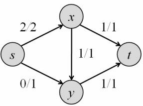

# Algorithm #

## 1. 数据结构相关 ##

### 1.1 图的最短路径 ###

### 1.2 图的最小生成树 ###

## 2. 排序 ##

排序算法总览

 

### 2.1 插入排序 & 希尔排序

### 2.2 选择排序 & 堆排序

### 2.3 冒泡排序 & 快速排序

### 2.4 归并排序

### 2.5 计数排序 & 桶排序 & 基数排序

## 3. 查找 ##

### 3.1 顺序查找 ###

无序数组顺序查找长度为N的链表的平均查找长度为 $\frac{N + 1}{2}$ ，时间复杂度 O(n) 。

### 3.2 二分查找 ###

二分查找的时间复杂度 O(log n) 。二分查找效率是一定的，但基于对插入删除的需求有不同数据结构的实现。

**有序数组**

有序数组是最简单的排序结构，查找的时间复杂度可以达到 O(log n) ，但插入一个元素的时间复杂度却为 O(n) 。为了减小插入的时间复杂度，引入二叉查找树。

**二叉查找树**

二叉查找树由于在插入的过程中不能保持好的形态，导致可能退化会顺序查找，所以引入了二叉平衡树。

**二叉平衡树**

二叉平衡树因为平衡性的要求所以不存在退化为顺序查找的问题，但由于插入删除保持平衡需要旋转操作而带来性能损耗过高，所以有了红黑树。

**红黑树**

红黑树的原型可以看作 2,3,4-树 ，其用颜色不同代替了2,3,4结点的表示。

>**几种查找树的差异**
>
>|      |                       AVL树                        |      2,3,4-树（B/B+树相同）      |                  红黑树                   |
>| ---- | :------------------------------------------------: | :------------------------------: | :---------------------------------------: |
>| 查找 |                     A+（略优）                     |                A                 |                     A                     |
>| 插入 |   平衡因子修正：O(log2 N) 次<br />旋转：最多2次    | 切分和结点类型转换：O(log2 N) 次 | 颜色转变：O(log2 N) 次<br />旋转：最多2次 |
>| 删除 | 平衡因子修正：O(log2 N) 次<br />旋转：O(log2 N) 次 |    借父节点合并：O(log2 N) 次    | 颜色转变：O(log2 N) 次<br />旋转：最多3次 |
>
>上述原因更具体的分析可以参见[数据结构文档——树](./DataStructures.md)相关章节。
>
>红黑树的查询性能略微逊色于AVL树，但是，红黑树在插入和删除上完爆avl树，插入时红黑树颜色转换操作要比平衡因子修正操作要更快（颜色转换只需要修改一个属性，平衡因子需要查询左右子树高度两个属性，并且还可能要更新高度属性），删除操作红黑树更是直接完胜。

### 3.3 字符串查找匹配子串

#### 3.3.1 暴力算法（BF 算法）

#### 3.3.2 哈希匹配（HK 算法）

#### 3.3.3 KMP 算法

#### 3.3.4 Boyer-Moore 算法

#### 3.3.5 Sunday 算法

### 3.4 回文子串查找

前两种算法首先要保证源串是一个奇数长串，可以用插空法在源串中插入n+1个特殊字符（特殊是指源串中不会出现），这样构造后的串长度为2n+1为奇数。

为什么需要奇数长的字符串呢？因为以下前两种算法都是是分别统计以某个字符为中心的最长回文子串，而偶数回文串不存在中心字符，通过以上插空法构造字符串，使得构造后的字符串也不会改变源字符串的回文性质。并且，当最后求得的最长回文子串的中心为插入的特殊字符时，说明对应的源回文（即去除特殊字符后）是偶数长的子串；当中心是源字符串中的字符时，对应的源回文是奇数长的子串。

#### 3.4.1 暴力算法

直接以每个字符串为中心，搜索左右最长的相等长度。

**代码示例**

```JAVA
String s; // s为构造后的新串

int iMax = 0;

for(int i = 0; i < s.length(); ++i) {

  while(s.charAt(i - p[i]) == s.charAt(i + p[i]) && i + 1 - p[i] >=0 && i + p[i] <= s.length())
    ++p[i];

  if(p[i] > p[iMax])
    iMax = i;
}

//[iMax - (p[iMax] - 1), iMax + (p[iMax] - 1)] 除去特殊字符即为最长回文串

```

#### 3.4.2 Manacher 算法

Manacher算法可以在O(n)的时间内求出一个字符串的最长回文子串。    

**思路**

细心就会发现暴力方法有很多重复的计算。利用回文的性质，回文关于中心对称的两个点，以这两个点为中心的回文子串，在对称中心回文串的范围内应该有相同的表现，可以根据此改进方法如下：

```java
// p[iRMax] + iRMax > i && i > iRMax，那么
p[i] = Math.min(p[iRMax - (i - iRMax)],iRMax + p[iRMax] - i);
//p[i]最终的值必定大于上面的值，这相当于给p[i]一个初值
```

对构造串求最长回文串，iRMax记录当前向右扫描最远的最长回文子串中心下标。

**代码示例**

```java
String s; // s为构造后的新串，可以在首尾增加哨兵检查越界，如1234 -> ^1#2#3#4#
int iRMax = 0;
int i = 0;
p[i++] = 1;

for(; i < s.length(); ++i) {
  int r;
  if(i < iRMax + p[iRMax]) {
    p[i] = Math.min(p[iRMax - (i - iRMax)],iRMax + p[iRMax] - i);
  }
  
  while(s.charAt(i - p[i]) == s.charAt(i + p[i])) //利用首尾哨兵检查越界
    ++p[i];

  if(i + p[i] > p[iRMax])
    iRMax = i;
}

//[iMax - (p[iMax] - 1), iMax + (p[iMax] - 1)] 找到最大的半径p[iMax]，除去特殊字符即为最长回文串

```

### 3.5 摩尔投票（Boyer-Moore 算法）

查找出现频率超过一定次数的数，比较典型的是求解出现频率超过一半的数。

借助哈希表很容易解决这个问题，但是需要 O(n) 的空间。使用**摩尔投票**的方法，只需要 O(1) 空间即可，其思想为，假设频率超过一半的数一定存在，那么每次从集合内削去两个不同的数，最后剩下的数一定是所求的数。

**一个题解示例**

```cpp
int moore(int arr[]) {
  int count = 0;
  int item;

  foreach(int a : arr) {
    if(count == 0) {
      item = a;
      ++count;
    }
    else {
      count = (item == a) ? count + 1 ： count - 1;
    }
  }

  return item;
}
```

**问题拓展一**

上个问题要求必须存在出现频率大于1/2的元素，如果可能不存在这样的元素时，怎么求解？

仍然使用典型问题的求解方法，不同的是，上面的求解方法可能返回空，也可能返回一个元素。当返回空时，显然不存在所求元素，当返回一个元素时，重新遍历数组验证它出现的次数。

**问题拓展二**

现在的问题是，求解一个数组内出现频率大于1/3的元素。

我们可以知道，频率大于1/3的元素最多为2个。可以将数组的元素每3个不同的一组删除，直到数组中不存在3个不同的元素，然后把得到的每个元素再去原数组统计一次出现频率，验证是否出现频率大于1/3。

对照 1/2 的求解方法，我们可以遍历一遍数组，使用两个变量来记录当前扫描到两个不同的元素，并用两个整型变量分别统计次数，当统计次数都大于0，且扫描到与这两个元素都不同时，统计次数分别减一，当有统计次数为零时，重新统计元素。最后对统计次数大于0的元素的出现频率进行验证。


## 4. 图论 ##

### 3.2 最小生成树 ###

### 3.8 二分图

**二分图完美匹配**

假设二分图有两个顶点集V、K，V 与 K 存在完美匹配的充要条件是，V 的任意子集的大小**大于等于**在 K 中邻接顶点集合的大小（邻接是指两个顶点有直连边）。

### 3.9 网络流 ###

#### 3.9.1 最大流问题 ####

如下所示，有一个含有源点 s 和汇点 t 的图，每条边上的数字表示此条边的最大流量，求解从 s 到 t 的最大流量。 

<div align=center></div>

求解最大流的基础算法是增广路算法，算法思想很简单，从零流（所有边的流量均为0）开始不断增加流量，保持每次增加流量后都满足容量限制（每条边流量不超过容量）、斜对称性（flow(u,v) 等于 - flow(v, u)）和流量平衡（s 流出等于 t 流入）3个条件。具体就是通过残量网络（有每条边容量减流量得到）和反向边的使用，不断寻找增广路，直到找不到增广路，即达到最大流量。

找增广路就是在残量图中找路径，找任意最简单的办法无疑是用 DFS，但很容易找出让它很慢的例子。一个稍微好一些的方法是使用 BFS （大多数情况下，BFS 要比 DFS更快的找到汇点，如`s -> a -> t` 要比`s-> c -> b -> t`更快找到，但当所有增广路径长度都相同时，BFS 和 DFS 并无区别），它足以应对数据不刁钻的网络流题目。这就是**Edmonds-Karp算法**。

**Edmonds-Karp算法**

```cpp
//c++版
struct Edge {
	int from, to, cap, flow; // 边起点，边终点，容量，流量
	Edge(int u, int v, int c, int f):from(u),to(v),cap(c),flow(f) {}
};
struct EdmondsKarp {
	int n, m; // 结点数和边数
	vector<Edge> edges; //边数的两倍
	vector<int> G[maxn]; //邻接表，G[i][j]表示结点i的第j条边在e数组中的序号
	int a[maxn]; //当起点到i的可改进量
	int p[maxn]; //最短路树上p的入弧编号
    
    void init(int n) {
        for(int i = 0; i < n; i++) G[i].clear();
        edges.clear();
    }
    //每条弧和其反向弧保存在一起，如0和1，2和3都是一对反向弧，
    //这样编号位i的反向弧编号可以通过i^1得到
    void AddEdge(int from, int to, int cap) {
        edges.push_back(Edge(from, to, cap, 0));
        edges.push_back(Edge(to, from, 0, 0)); //反向弧
        m = edges.size();
        G[from].push_back(m-2);
        G[to].push_back(m-1);
    }
    int Maxflow(int s, int t) {
    	int flow = 0;
        for(;;) {
            memset(a, 0, sizeof(a)); //初始化每个点增量为0
            queue<int> Q;	//队列实现宽度优先搜索
            Q.push(s);
            a[s] = INF; //源点不再遍历
            
            while(!Q.empty()) {
                int x = Q.front(); Q.pop();
                for(int i = 0; i < G[x].size(); i++) {//遍历所有出边
                	Edge& e = edges[G[x][i]];
                    if(!a[e.to] && e.cap > e.flow) {//若还未遍历，且是残余边
                        p[e.to] = G[x][i]; //记录前向狐
                        a[e.to] = min(a[x], e.cap-e.flow);
                        Q.push(e.to);
                    }
                }
                if(a[t]) break; //找到一条增广路
            }
            if(!a[t]) break; //不存在增广路
            for(int u = t; u != s; u = edges[p[u]].from) {
            	edges[p[u]].flow += a[t];
            	edges[p[u]^1].flow -= a[t];
            }
            flow += a[t];
        }
     	return flow;
    }
};
```

上面的代码和普通的BFS并没有太大的不同。唯一需要注意的是，在扩展结点的同时还需递推出从 s 到每个结点 i 的路径上的最小残量 a[i]（同时根据其是否为0判断是否已经遍历过），则a[t]就是整条s-t道路上的最小残量。

**最大流最小割定理**

有一个与最大流关系密切的问题：最小割。如下图所示，虚线把所有顶点分成两个集合S和T=V-S，其中源点s在集合S中，汇点t在集合T中。


割的大小定义为：$C(S, T) = \sum_{u∈S, v ∈T}c(u,v)$ ，即起点在S中，终点在T中的所有边的容量和。即起点在S中，终点在T中的所有边的容量和（反向边按负值计算）。由于 s 到 t 的流量会经过任意割，所以有$f(s,t) <= C(S, T)$。

当 BFS 没有找到任何增广路时道路时，把已标号结点（a[u]>0的结点u）集合看成S，令T=V-S，则在残量网络中S和T分离，因此在原图中跨越S和T的所有弧均满载（这样的边才不会存在于残量网络中），且没有从T回到S的流量，因此此时等号成立：$f(s,t) == C(S, T)$。即最大流量时切过所有满流边的割最小，这就是最大流最小割定理。

#### 3.9.2 最大流增广路算法 ####

Edmonds-Karp算法是最大流的基础算法，很好理解，但实践中一般不用这个算法，而是使用效率更高的Dinic算法或者ISAP算法。

**Dicnic多路增广算法**

**ISAP增广算法**

该算法基于这样一个事实，每次增广之后，任意结点到汇点的最短距离（这里的距离指的是路径上边的数目）都不会减小。这样用一个函数 d(i) 表示这个最短距离，每次指沿着 d(i) = d(j) + 1 的弧 (i,j) 走，这样走的路径必是最短距离。当找不到 d(i) = d(j) + 1 的弧 (i,j) 时，重新遍历 i 的所有出边计算新的 d(i) 值。

算法的大体步骤：

1. 从汇到源进行 BFS 得到每个结点的 d(i) 值
2. 从源开始每次沿着 d(i) = d(j) + 1 的弧 (i,j) 走，直到走到汇点，找到一条增广路
3. 当某个结点找不到 d(i) = d(j) + 1 的弧 (i,j)  时，重新阶段该结点的 d(i) ，并下一步从该结点的前向结点开始遍历
4. 当 d(s) 大于等于 n 时，说明不再存在增广路


#### 3.9.3 最小费用最大流问题 ####

下面给网络流增加一个因素：费用。假设每条边除了有一个容量限制外，还有一个单位流量所需的费用（cost）。下面第一个图中分别用c和a来表示每条边的容量和费用，而第二个图给出了一个在总流量最大的前提下，总费用最小的流（费用为10），即最小费用最大流。另一个最大流是从s分别运送一个单位到x和y，但总费用为11，不是最优。

<div align=center>


</div>

限于篇幅，这里直接给出最小费用路算法。和Edmonds-Karp算法类似，但每次用
**Bellman-Ford算法**而非BFS找增广路。只要初始流是该流量下的最小费用可行流，每次增
广后的新流都是新流量下的最小费用流。另外，费用值是可正可负的。在下面的代码中，
为了减小溢出的可能，总费用cost采用long long来保存。

**Bellman-Ford算法（连续最短路算法）**

思想：增广时，每次选择最小花费的路径，即最短路径，达到最大流时的花费就是最小费用。

Bellman-Ford最短路径算法描述：

1. 初始化：将除源点外的所有顶点的最短距离估计值 d[v] ——>+∞, d[s]——>0;
2. 迭代求解：反复对边集E中的每条边进行松弛操作，使得顶点集V中的每个顶点v的最短距离估计值逐步逼近其最短距离；（运行|v|-1次）

迭代求解时，至少有一个顶点达到源点的最短距离，松弛的过程中可能有一些顶点会反复进队松弛，当一个顶点进队松弛 n-1 次后还能进队说明存在负圈，这也是Bellman-Ford算法的一个重要应用。

```cpp
//c++版
struct Edge {
    int from, to, cap, flow, cost;
    Edge(int u, int v, int c, int f, int w):from(u),to(v),cap(c),flow(f),cost(w)
    {}
};
struct MCMF { //Min Cost Max Flow
	int n, m, s, t;
	vector<Edge> edges;
	vector<int> G[maxn];
	int inq[maxn]; //是否在队列中，避免重复遍历
	int d[maxn]; //Bellman-Ford
	int p[maxn]; //上一条弧
	int a[maxn]; //可改进量
    
    void init(int n) {
    	this->n = n;
    	for(int i = 0; i < n; i++) G[i].clear();
    		edges.clear();
    }
    //邻接边表示方法和前面的算法相同
    void AddEdge(int from, int to, int cap, int cost) {
        edges.push_back(Edge(from, to, cap, 0, cost));
        edges.push_back(Edge(to, from, 0, 0, -cost));
        m = edges.size();
        G[from].push_back(m-2);
        G[to].push_back(m-1);
    }
    
	bool BellmanFord(int s, int t, int& flow, int &cost) {
		for(int i = 0; i < n; i++) d[i] = INF; //初始距离为最大
		memset(inq, 0, sizeof(inq));
		d[s] = 0; inq[s] = 1; p[s] = 0; a[s] = INF;
		queue<int> Q;
		Q.push(s);

        while(!Q.empty()) {
            int u = Q.front(); Q.pop();
            inq[u] = 0;
            for(int i = 0; i < G[u].size(); i++) {
                Edge& e = edges[G[u][i]];
                if(e.cap > e.flow && d[e.to] > d[u] + e.cost) {//BFS时每当找到更短的距离（花费）
                    d[e.to] = d[u] + e.cost;
                    p[e.to] = G[u][i];
                    a[e.to] = min(a[u], e.cap - e.flow);
                    if(!inq[e.to]) { Q.push(e.to); inq[e.to] = 1; }
                }
            }
        }
        if(d[t] == INF) return false;
        flow += a[t];
        cost += (long long)d[t] * (long long)a[t];
        for(int u = t; u != s; u = edges[p[u]].from) {
            edges[p[u]].flow += a[t];
            edges[p[u]^1].flow -= a[t];
        }
        return true;
    }
	
    //需要保证初始网络中没有负权圈
    int MincostMaxflow(int s, int t) {
        int flow = 0; cost = 0;
        while(BellmanFord(s, t, flow, cost));
        return flow;
    }
};
```

SPFA算法也是一种连续最短路算法，它对Bellman-Ford进行了队列优化。每次出队时，都将队列中距离最小的结点出队。这样避免了一些结点反复进队。

#### 3.9.4 最小费用最大流算法 ####

**dijkstra算法**

**zkw算法**

## 5. 博弈算法 ##

### 5.1 Nim 取子游戏

通常的Nim游戏的定义是这样的：有若干堆石子，每堆石子的数量都是有限的，两个人交替取走石子，合法的取法是“选择一堆石子并拿走若干颗（不能不拿）”，如果轮到某个人时所有的石子堆都已经被拿空了，则判负（因为他此刻没有任何合法的移动）。假设两个人每次都采用最优解。

思路：

考虑只有 1 堆石子，则先手必胜。
考虑 2 堆数量相同的石子，则先手必败。不论先手取多少石子，后手只需每次取相同数量的石子维持 2 堆石子数量相同即可获胜。
考虑 2 堆数量不同的石子，可以取走石子使得取走后两堆石子数量相同，则此种情况先手必胜。
考虑 3 堆数量相同的石子，先手必胜，第一次取光一堆即可。

由于任意整数都有对应的二进制数，所以可以把任意数量的一堆石子，分成若干个 2 的幂次方数量的子堆。分析知道，每 2 个相同次幂的 2 次方子堆必定是先手必败的，假设所有堆的 2 的幂次方子堆，都为偶数个，也就是成对出现的，那么此种情形必定是先手必败的，后手只需在与先手对应的 2 次方子堆取相同数量的石子即可获胜；假如存在奇数个 2 的幂次方子堆，则先手总能找到一种取法使得所有2的幂次方堆为偶数个，即先手必胜。

转换为数学关系就是：

1. 所有堆数量异或为0 -> 所有堆的2的幂次方子堆数都为偶数个 -> 先手必败
2. 所有堆数量异或不为0 -> 存在奇数个2的幂次方子堆数 -> 先手必胜

选手必胜每次取子得策略就是使对方先手必败，及使取走后得堆数量异或和为0。具体操作就可以找到一个堆的数量大于其他堆得异或和，取走若干棋子使得这个堆数量和其他堆异或和相同。

> **证明：所有堆数量异或不为0时，必然存在一个堆的石子数量大于其他所有堆的异或值**
>
> 弱 2 的最高次幂子堆若为奇数个，则其中任意一个子堆所在的堆数量都大于其他堆的异或，若为偶数个则比较 2 的次高次幂子堆，若次高次幂子堆还为偶数个，则继续比较次次高次幂子堆，总会找一个最高的奇数子堆，否则所有堆石子数量的异或值必为 0，得证。

## 6. 递归与分治 ##

## 7. 贪心 ##

## 8. 动态规划 ##

动态规划实质：找转移方程和边界条件。

### 8.1 背包问题

#### 8.1.1 0-1背包问题

**问题描述**

给定 n 种物品和一个容量为 C 的背包，物品 i 的重量是 $w_i$，其价值为 $v_i$ 。

问：应该如何选择装入背包的物品，使得装入背包中的物品的总价值最大？

**解析**

$dp[v][i]$ 表示前i种物品可以达到的最大价值，那么有转移方程

$$ dp[v][i] = max(dp[v - v_i][i - 1] +v_i, dp[v][i - 1]$$

表示体积v时，拿了物品i和不拿物品i时的价值取较大值。

**伪代码**

```
int bag(int v[],int w[],int n) {
    for i in [0,n)
    	for v in [vMax,v[i]]
    		dp[v][i] = max(dp[v - v[i]][i - 1] + w[i], dp[v][i - 1])

    return dp[vMax][n - 1]
}
```

若要求得具体拿了哪些物品，可以倒推回去

```
void traceback(int dp[][], int v[], int n){
	int x[n];
	
	for i in (n, 1]
		if (dp[v][i] == dp[v][i - 1]) //未拿i
			x[i] = 0
		else
			x[i] = 1
			v -= v[i]
	x[0] = dp[v][0] > 0 ? 1 : 0
   
   	for i in [0, n)
   		if(x[i] == 1)
   			printf("拿了物品id = %d\n", i)
}
```

#### 8.1.2 完全背包问题

**问题描述**

完全背包表示每个物品可以取无限次，只要加起来总容量不超过V就可以。 

**解析**

解法基本一致，只是每次需要将 i 物品放若干次直到放不下位置。转移方程

$$ dp[v][i] = max(dp[v - v_i * k] + w_i * k, dp[v][i - 1]) $$

**伪代码**

```
int bag(int v[],int w[],int n) {
    for i in [0,n)
    	for v in [vMax,v[i]]
    		for k in [0,vMax/v[i]]
    			dp[v][i] = max(dp[v - k * v[i]][i - 1] + k * w[i], dp[v][i])

    return dp[vMax][n - 1]
}
```

很容易知道如果每个物品有数量限制，只需要控制 k 得范围即可。

### 8.2 丑数动态规划

**问题描述**

质因子只有2、3、5的整数称之为丑树，此外1也规定为丑数，从小到大前10位丑数分别为1、2、3、4、5、6、8、9、10、12，求第n个丑数。

**解析**

显然，后面的丑数可以通过前面的丑数乘以 2、3 或 5 得来，初始化丑数数组a的`a[0] = 1`，下一个丑数必然是通过`a[0]`乘以 2、3 或 5 的来，取最小的 `1*2=2`则`a[1] = 2`，下一个丑数就为 `min{a[0]*3,a[0]*5,a[1]*2} = 3`，再下一个丑数就为 `min{a[1]*3,a[0]*5,a[1]*2} = 4`。  
设t2,t3,t5分别为2、3、5当前操作的位置，下一个丑数可表示为`min{a[t2] * 2, a[t3] * 3, a[t5] * 5}`，转移方程可表示为：

$$ arr[i] = min(arr[t2] * 2, arr[t3] * 3, arr[t5] * 5) $$

每次将取得最小值所使用得因子下标自增。

### 8.3 rmq 求区间最值

**问题描述**

给定一个长度为 n 的数组，设计一个方法求任意区间的组大值。

**解析**

使用 rmq 可以很好的解决这个问题。使用 dp\[i\]\[j\] 表示下标 i 开始长度 2^j 个元素的最大值。那么有转移方程：

$$ dp[i][j] = dp[i][j - 1], dp[i + (1 << j - 1)][j - 1] $$

这个关系很容易证明，依据转移方程很容易写出递推（时间复杂度 O(n * log n)）：

```cpp
for(i = 0; i < n; ++i)
	dp[i][0] = arr[i];
for(j = 1; 1 << j <= n; j++)
    for(i = 0;i + (1 << j) <= n;i++)
    	dp[i][j]=max(dp[i][j-1],dp[i+(1 << j-1)][j-1]);
```

查询任意区间 [l,r] 的最大值，时间复杂度 O(1)

```cpp
int find(int l, int r) {
    int k = 0;
    while(l + (1 << k + 1) <= r)
        ++k;
 	return max(dp[l][k], dp[r - (1 << k) + 1][k]);
}
```