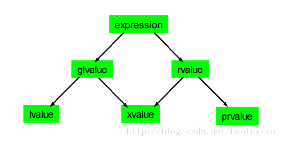

## 引言

无论什么时候接触 C++，都应该视 C++ 为一个语言联邦（这个概念来源于《Effective C++》），这个联邦的主要子语言包括：

* **C** —— C++ 是以 C 语言为基础。区块、语句、预处理器、内置数据类型、数组和指针等都来源于 C。
* **Object-Oriented C++** —— 这部分也是 C with classes 的诉求：classes（包括构造函数和析构函数）、封装、继承、多态、虚函数......等等面向对象的实施。
* **Template C++** —— 泛型编程，Template 相关考虑和设计已经弥漫到了整个 C++。
* **STL** —— STL 是个 Template 程序库。它对容器，迭代器，算法以及函数对象的规约有者极佳的紧密配合与协调。

当从一个子语言切换到另一个子语言，导致编程守则的转换应该是十分自然的，应该牢记这一点。

## 1. C++ 与 C 的交叉基础

### 1.1 预处理

预处理（或称预编译）是指在进行编译的第一遍扫描（词法扫描和语法分析）之前所作的工作。预处理指令指示在程序正式编译前就由编译器进行的操作，可放在程序中任何位置。 C++ 完全继承了 C 的预处理功能。

**文件包含**

```cpp
// 直接在包含文件目录中去查找(包含目录是由用户在设置环境时设置的include目录)
#include <文件名>
// 首先在当前源文件目录中查找，若未找到才到包含目录中去查找
#include "文件名"
```

**条件编译**

```cpp
//只有定义了宏名才编译 ifdef 定义内的语句
#ifdef 宏名
//[#else]
#endif

//只有未定义宏名才编译 ifndef 定义内的语句
#ifndef 宏名
//[#else]
#endif

//只有常量表达式非 0 才编译 if 定义内的语句
#if 常量表达式
//[#else]
#endif
```

**宏定义**

在编译预处理时，对程序中所有出现的宏名，都用宏定义中的字符串去代换，这称为宏替换或宏展开。 

使用方法如下：

```cpp
// #defind 宏名 字符串
#define MAX 100

// #defind 宏名(参数) 字符串
#define MAX(A,B) ((A) > (B) ? (A) : (B))

// 字符串化，使用 # 将字符串用双引号包围起来
// 以下两种写法作用相同
#define MAKESTR(name) #name 
#define MAKESTR(name) "name"

// 字符化，使用 #@ 将字符用单引号包围起来
// 以下两种写法作用相同
#define MAKECHAR(C) #@C 
#define MAKECHAR(C) `C`
```

宏定义的展开与先后顺序无关，预处理器是这样对宏替换的先将所有的宏定义收集起来，然后处理源代码，发现一个宏定义符就立即替换。 

而且，宏是预处理时的完全替换，没有任何语义的考虑，所以要使用括号区分歧义，否则可能就会逻辑错误。如

```cpp
#define ADD(A,B) A + B
ADD(1,2) * ADD(3,4)	//结果为11，因为宏展开为 1 + 2 * 3 + 4
```

ANSI 标准指定了 5 个内置宏定义，主要为调试使用

* \_\_LINE\_\_：当前源代码行号；
* \_\_FILE\_\_：当前源文件名；
* \_\_DATE\_\_：当前的编译日期
* \_\_TIME\_\_：当前编译时间；
* \_\_STDC\_\_：当要求程序严格遵循 ANSI C 标准时值为 1

### 1.2 头文件

最新 C++ 的标准头文件都是没有扩展名的，如 `#include <iostream>`；

C 的标准文件在 C++ 中的头文件都被转为c开头，如 `#include <cmath>`

### 1.3 注释

C++ 的标准注释是双斜杠 `//`，同时也兼容了 C 的注释 `/* */`

> C99 标准也添加了 `//` 注释

### 1.4 编译过程

1. 预处理 —— 宏展开和常量替换
2. 编译 —— 源代码生成汇编代码
3. 汇编 —— 汇编代码生成机器码
4. 连接 —— 将依赖的代码段连接起来

## 2. 变量

### 2.1 内建类型

变量的定义一般形式为 `变量类型 变量名`。

**所有内建类型**

* [unsigned] char —— 1个字节大小
* wchar_t —— 宽字符， 2个字节大小
* char16_t —— Unicode 字符，2个字节大小
* char32_t —— Unicode 字符，3个字节大小
* [unsigned] short —— 至少 2 字节大小
* [unsigned] int —— 至少和 short 一样大
* [unsigned] long —— 至少 4 字节大小，且至少和 int 一样大
* [unsigned] long long —— 至少 8 字节大小，C11新定义
* float —— 一般为 4 字节大小，浮点型的数据可以用 1.2e+10 表示，1位符号位，8位指数位，23 + 1位有效数字位
* double —— 一般为 8 字节大小，1位符号位，11位指数位，52 + 1位有效数字位
* bool —— 未定义最先尺寸，一般为 1 字节大小

### 2.2 数组 & 向量 & 字符串 

**（一）数组**

数组的一维大小可以在初始化时推断给出，高于一维的数组必须由常量指定。

```cpp
// 声明时必须给定数组大小
int arr[10];

//一维大小也可由推断得出。等号可不写
int arr[]{1,2};

//后面没有大括号的声明将不会初始化
//部分初始化，未初始化的元素将设为 0
int arr1[10];	// arr1[1] 未知，arr1[9] 未知
int arr2[10]{1, 2}; // arr2[1] 为 2，arr2[9] 为 0 
int arr2[][10]{{1,2},{2}};
```

**（二）向量 vector**

原生数组支持者静态大小，STL 提供了动态数组 vector，支持运行时指定大小和动态扩展。

vector 是一个模板类，大部分初始化方式类似数组：

```cpp
vector<int> v1; // 默认初始化
vector<int> v2{1, 2}; // 列表初始化
vector<int> v2(10); // 初始 10 个元素，每个元素默认初始化
vector<int> v3(10, 3); // 初始 10 个元素，每个元素初始化为 3
```

**二维动态数组的声明方式**

```cpp
// m, n 为整形变量，指定了二维动态数组的大小
// 第一种
int ** arr = new int *[m];
for(int i = 0; i < m; ++i)
    arr[i] = new int[n];

// 第二种
vector<vector<int>> arr(m, vector<int>(n));

// 当二维可以设为常数大小时
int (* arr)[5] = new int[n][5];
```

**（三）字符串**

```cpp
// C 风格定义字符串，以下两种定义相同，需要注意的是，若 str 不指定 `\0`，将无法预料字符串的结尾
char str1[] = "abc";
char str2[] = {'a', 'b', 'c', '\0'};

// C++ 新增的 string 类，string 内部维护了一个字符串数组，并动态扩容
string s = str1;
```

string 重载了很多操作符，使得字符串连接和复制非常方便，无需使用 strcat() 和 strcpy()。使用 s.size() 即可获得字符串大小，相当于 strlen(s.c_str())。

### 2.4 迭代器介绍

vector 和 string 除了下标访问外还支持迭代器访问，迭代器类型一般都为`{容器具体类型}::iterator`，可以通过对象的 begin() 方法获取指向第一个元素的迭代器，end() 类似 EOF ，称之为尾后迭代器。

**标准迭代器支持的方法**

* `* iter` —— 获取 iter 指向元素
* `iter->item` —— 解引用 iter 并获取元素 item，相当于 `(*iter).item`。
* `++iter / --iter` —— 自增或自减，移动迭代器指向
* `iter1 == iter2` —— 判断迭代器相等
* `iter1 != iter2` —— 判断迭代器不等

> string 和 vector 的迭代器还支持`iter +/-/+=/-=/>/</<=/<= n` 和 `iter2 - iter1` 操作。

**迭代器类型**

`{容器具体类型}::iterator` 获取的是可读可写的爹大气；

`{容器具体类型}::const_iterator` 获取的是只读的底层 const 迭代器。

当容器具体元素类型是常量的化会返回 const_iterator，否则返回 iterator。

**静态数组的迭代器**

标准库提供了 begin() 和 end() 函数，用来获取的数组的第一个元素指针，和尾后指针。

### 2.5 结构体 & 联合体 & 枚举

**结构体**

```cpp
struct MyStruct {
    int a; //成员变量
    char b;
    
    void print() { //成员函数
        //...
    }
}; //声明语句，需要结束结构体声明

// C 中使用时，必须使用 struct 关键字
struct MyStruct ms1;
// C++ 中可以省略 struct 关键字
MyStruct ms2;

//结构体的初始化方式
//使用大括号的方式给结构体成员赋值，按照定义的顺序进行
ms2 = {1, 'a'}; 
//也可使用另一个结构体去初始化
MyStruct ms3 = ms2；
```

可以看的出，C++ 的结构体在 C 的基础上进行了扩展，且行为和类很像。

结构体的大小等于所有成员的大小之和加上8字节对齐填充的大小。

> 结构体还可以指定每个成员的位长度，如下
>
> ```cpp
> struct BitStruct {
>     int SN: 4;// SN 占 4 位
>     int: 4;// 跳过 4 位
>     bool T: 1; // T 使用 1 位
> }
> 
> //赋值和使用时可以像正常类型一样使用，但在赋值时只低位匹配的位数。
> ```

**联合体**

```cpp
union MyStruct {
    int a; //成员变量
    
    void print() { //成员函数
        //...
    }
};
```

联合体的大小等于所有成员的中的最大的成员大小加上8字节对齐填充的大小。联合体使用初始列表时只能初始化第一个成员。

**枚举**

```cpp
enum E {a,b,c} //默认 a b c 整数值为 0 1 2
enum E2 {a = 10, b , c} //这时 a b c 的整数值为 10 11 12
enum E3 {a, b = 0, c} //这时 a b c 的整数值为 0 0 1，枚举的整数值允许重复
```

将枚举当作整数值计算不会有任何问题，但是将一个整数值赋给一个枚举是需要考虑的。所以枚举也没有自增操作。

通常将一个整形值强转为枚举值，在枚举范围内是被允许的，即便这个枚举值没有对应的元素。将一个整形值枚举的取值范围由枚举元素的最大整数值和最小整数值决定，范围上界为大于最大整数值的最小 2 次幂减 1，对于范围下界，当最小整数值大于等于 0 是，下界为0，否则，与寻找上界方式相同，但加上负号。如最大整数值 6，最小整数值为 -6，对应的上下界为 [7,-7]。对于有些编译器，可能并没有限制枚举范围。

### 2.6 复合类型

**（一）指针类型**

使用任意类型和 * 组合起来表示一个类型的指针类型，如 `int * p`，表示 p 是整型指针。

指针类型在声明时需要注意以下两点。

const 遇 * 截断修饰（也可以认为是优先级低，这里只是为了方便理解而定义）——意思就是当 const 遇到  * 时会把 * 和其之后的所有声明段看成整体来修饰。如：
```cpp
int a;
// 以下两种写法相同，const 修饰 *p，表示 *p 不能进行赋值操作（a 的值仍可改变，只是不能通过 *p）
int const * p = &a;
const int * p = &a;
// 下面的 const 修饰 p，表示 p 不能进行赋值，即 p 不能指向其他变量了
int * const p = &a;
```
\* 不能在声明时向后传递，如 `int * a, b;` ，a 是指针，b是整形。

**（二）引用类型**

关于左值和右值可以参考表达式章节

**左值引用类型**

使用任意类型和 & 组合起来表示一个类型的左值引用类型，如 `int & p`，表示 p 是引用类型，引用类型在声明时必须初始化。引用类型变量相当于原变量的一个别名，用法和原变量完全一样，因为它们的地址完全相同。

一旦引用初始化后，就不能成为其他变量的引用了。所以 & 和 const 的没有顺序上的影响，无论 const 在什么位置，都表示引用变量不能进行赋值操作。

& 也不能在声明时向后传递。

当引用类型作为返回类型时需要注意不能返回一个临时变量的引用。

**右值引用类型**

使用任意类型和 && 组合起来表示一个类型的右值引用类型。右值引用可以用来接住右值实参，也可以用来接住一个右值返回值。从而避免拷贝构造函数的调用。

### 2.7 变量

**变量名的要求**

- 由数字、字母和下划线组成，但不能以数字开头
- 双下划线开头和单下划线和大写开头的名称一般作为保留名称，留给编译器等使用
- C++ 没有长度要求，C 则最多智能识别 63 个字符，超过会阶段

**变量作用域**

当变量被定义在一个花括号内时，它的作用域就是它最接近（最内部）的花括号块，这样的变量一般称之位局部变量。

当变量不位于花括号之内时，也就一定不位于函数内，这样的变量称之为全局变量，在当前文件的所有函数内部都有效。当与局部变量重名时，可以使用 "双冒号+全局变量名" 显示访问全局变量。

### 2.8 变量初始化

**声明与定义**

声明：告知编译器有一个某个类型的变量

定义：将对象实体值和变量关联，即赋值

通过 extern 来声明一个变量，来引入一个外部文件的全局变量，如：

```cpp
extern int i; // 声明

//可以声明并定义
int k = 2;

//但是对 extern 赋值，将退化为定义
extern int y = 3; // 定义
```

**变量初始化** 

* 值初始化，如：`int a = 1`

* 构造初始化，使用圆括号的方式调用构造函数，支持所有类型：`int a(2)`；

* 列表初始，支持数组，动态数组vector，字符串，结构体。列表初始化若存在精度丢失的风险将会报错，如将 浮点数赋给整形。

  ```cpp
  //数组，列表中未指定的用 0 值初始化
  int arr[10]{1,1};
  vector<int> arr2{1,2,3};
  vector<int> arr3(10,2); // 构造初始化为 10 个大小数字，每个元素被初始化为 2，
  						// 当第 2 个参数为结构体或类时，会调用拷贝构造函数
  
  //字符串
  char str[] = "hi"; //自动添加 '\0'
  
  // 结构体
  struct Node {
      int a, b;
      char c;
  };
  
  Node n{1,2,'a'};//按照成员变量顺序赋值
  ```

**默认初始化**

对于内建类型来说，全局变量将被默认初始化为0，局部变量将不初始化。

对于结构体或类对象来说，将使用默认构造函数初始化。

对于枚举来说将默认初始化值为 0。

对于联合体来说，若第一个变量为内建类型将不会初始化，对象类型是否初始化比较复杂，一般可以认为使用默认构造函数初始化。

全局静态变量会在程序文件加载时初始化。

局部静态变量会在第一被执行到时初始化，如果没有指定初始化值将会初始化为默认值。

> 总结起来就是，内建类型除非是静态的，否则没有默认初始化行为。而对象不指定初始化总是会使用默认构造函数初始化。

**字面量值**

* 十进制整型——1
* 十六进制整型——0x10 == 16
* 八进制整型——010 == 8
* 浮点型 —— 3.14
* 浮点型科学表示 —— 3.14E0
* 字符 —— 'A'
* 转义字符 —— '\n\r\t\'；16 进制表示ascii 字符 —— '\x0f'；8 进制表示 ascii 字符 ——'\12'
* 字符串 —— “abc”；

> 整形字面量后缀
>
> u/U —— unsigned；l/L —— long；ll/LL —— long long
>
> 浮点型字面量后缀
>
> f/F —— float；d/D —— double
>
> 字符字面量前缀
>
> u —— char16_t；U —— char32_t；L —— wchar_t
>
> 字符串字面前缀
>
> u8 —— utf8 字符串

### 2.10 指针和引用

**指针 —— ***

有两个作用：

- 在类型符后使用，表示是指针类型。具体查阅后面复合类型的章节。
- 在变量前使用，表示解引用。

> **数组指针**
>
> 首先看下数组的指针和指针的数组表示方法：`type (* variable_name)[...]`。
>
> 对于一维数组指针就是 `int (* p)` 去掉括号即 `int * p`；因为 p 之后是空白，括号打开不影响语义。
>
> 对于二维数组指针就是 `int (* p)[10]` ，必须指定第二维大小，高维数组大小必须指定各维度大小，第一维除外，也无法指定。同时括号不能少，打开括号 p 会先和后面的整体结合，而使 p 成为一个数组名，元素类型为` int *`。
>
> 下面是具体的示例和解读：
>
> ```cpp
> //int * 表示一个整形指针，直线一个 int 大小的区域
> //int (*)[5] 表示一个数组指针，该指针指向一块 int[5] 大小的区域
> //int (*)[5][5] 也是一个数组指针，该指针指向一块 int[5][5] 大小的区域
> int a[5]; 一维数组，数组名作指针时长度为一个 int 大小，即 int * 型
> int b[5][5]; 二维数组，数组名作指针时长度为 int[5] 大小，即 int (*)[5] 型
> int c[5][5][5]; 三维数组，数组名作指针时长度为 int[5][5] 大小，即 int (*)[5][5] 型
> 
> // 数组指针变量
> int (* pa) = a;// int (* pa) 也即 int * pa
> int (* pb)[5] = b;// 可以理解为 (* pb) == b[0] == (* b)
> int (* pc)[5][5] = c;
> 
> // 根据以上我们能够知道下面的赋值是错误的
> int ** pb2 = b; // 编译出错，类型不匹配，pb2 是一个 int 的二级指针，它的长度为一个 int * 大小
> 
> // 对于形参，数组参数的第一维 p[] 就相当于 (* p)
> void fa(int pa[]); // 相当于 fa(int (* pa));
> fa(a); // 调用正确
> void fb(int pb[][5]); // 相当于 fa(int (* pb)[5]);
> fb(b); // 调用正确
> void fc(int pc[][5][5]); // 相当于 fa(int (* pc)[5][5]);
> fc(c); // 调用正确
> 
> // 我们现在应该也能判断除下面的调用是不正确的
> void f(int * p[]); // 相当于 f(int * (* p));
> f(b);// 编译错误，类型不匹配
> 
> //以下是一个稍复杂的数组指针例子
> int ** (*b)[2]; // b 是一个二维数组指针，每个数组元素是 int ** 类型
> ```
>
> **函数指针**
>
> 函数指针的表示方法 `return_type (* variable_name)(type1 param1, type2 param2, ...)`。
>
> 其中括号也不能省，打开括号就不是指针定义了。因为 variable_name 会首先和参数列表结合，使得上式变成一个返回类型为 `return_type *` 的函数声明。
>
> 来看具体的示例和解读：
>
> ```cpp
> // 先声明一个函数
> void a();
> 
> // 一个合法的函数指针
> void (*pa)() = a;
> 
> // 一个错误的定义
> void * pa2() = a; // 左值不是一个变量，而是一个函数声明
> 
> //需要注意的使，C++ 为了更广泛的兼容，以下两种函数访问方式都正确
> (* pa)();
> pa();
> ```
>
> **两个比较复杂的指针使用**
>
> 第一个：
>
> ```cpp
> int   *(*p(int))[3];
> ```
>
> ()的优先级最高，因此p先与()结合，说明p首先是个函数，
>
> 再与括号内的int结合，说明函数的参数为一个int,
>
> 再与p前面的*结合，说明函数的返回值为一个指针A，
>
> 再与后面的[]结合，说明该指针A指向的内容是一个数组，
>
> 再与第一个*结合，说明数组里面的元素是指针B，
>
> 再与前面的int结合，说明指针B指向的内容是一个int。
>
> 第二个：
>
> ```cpp
> int (*(*p)(int))(int);
> ```
>
> ()的优先级最高，因此p先与*结合，说明p首先是个指针A，
>
> 再与后面()结合，说明该指针A指向的内容是一个函数A，
>
> 再与括号中的int结合，说明该函数的参数是一个int,
>
> 再与(*p)前面的*结合，说明该函数的返回值是一个指针B，
>
> 再与最后面的()结合，说明该指针B指向的内容提要是一个函数B，
>
> 再与括号中的int结合，说明该函数B的参数是一个int，
>
> 再与前面的float结合，说明函数B的返回值为float。

**引用——&**

& 有三个作用：

- 在类型符后使用，表示引用类型。具体查阅后面复合类型的章节
- 在变量前使用，表示取地址。
- 在两个整形变量之间使用，表示按位与。

> **数组引用**
>
> 数组引用和同数组指针定义类似：`type (& variable_name)[...]`。如:
>
> ```cpp
> int a[5];
> int b[5][5];
> 
> //数组引用变量定义，必须指定大小，包括一维
> int (& ra)[5] = a;
> int (& rb)[5][5] = b;
> ```
>
> 数组引用的语义和数组名的语义完全相同，而数组指针的语义仅仅是一个指针的语义。

### 2.11 const & constexpr

const 修饰的变量不能进行赋值操作，需要注意的是当 const 遇到 * 时会修饰 * 和后面整个声明。

不能把一个 const 指针、引用或变量赋给一个非 const 指针或引用。

以下是 const 使用举例：

```cpp
//普通类型的 const
const int a = 1; // 不能对 a 赋值

// const 与指针
const int *b = 1; //底层const，const 修饰的变量其指向内容不能赋值
int * const c = 2; //顶层const，const 修饰的变量本身不能赋值

// const 与引用
const int &d = a; //d 不能进行赋值行为
```

> 形参指针应该尽可能的使用 const，好处是：
>
> - 可以避免以外改变
> - const 可以接收 const 和非 const，而非 const 不能接收 const。

常量表达式是指编译器期间就可以确定值的表达式。字面量就是常量表达式，用常量表达式初始化的 const 对象也是常量表达式，如：

```cpp
const int a = 2; // 常量表达式
const int b = a + 1; // 常量表达式
const int d = size(); // 只有当size() 返回常量表达式才是常量表达式
```

可以看出，const 修饰的表达并不总是常量表达式，C11 增加了 constexpr 关键字来声明一个常量表达式，所以 constexpr 是忽略星号的，其修饰的变量总是一个顶层 const，如：

```cpp
constexpr  int a = 2; // 正确
constexpr  int b = a + 1; // 正确
constexpr  int d = size(); // 只有当size() 返回常量表达式才是正确，否则编译出错
```

constexpr 表达式必须要在编译期间计算出值，所以必须限定其类型，不能够太复杂。目前只有内建类型，指针和引用类型可以声明为 constexpr。并且 constexpr 和 const 可以共用，如：

```cpp
constexpr int c = 2;
constexpr const int * a = &c; // a 不能赋值，*a 也不能赋值
```

***注意：***常量表达式可以在编译期间计算出值，也会在编译期间把相应常量直接用值替换。所以，即便可以通过其他方式改变常量表达式内存的值，也不能改变该常量使用位置的值。

### 2.12 类型别名 & auto & decltype

**类型别名**

C 风格别名：typedef char * pchar;

C11 新标准：using pchar = char *;

区别在于 using 可以指定模板的别名，而 typedef 不支持。

需要注意的是，别名并不是可以完全原位替换的，如：

```cpp
using pint = int *;
int a = 1;
const pint b = &a;//顶层const
const int * c = &a;//底层const
```

**auto**

C++ 支持通过表达式来自定义推断定义，使用 auto 关键字代替类型即可。

但是并不是编译器始终可以推断出我们想要的类型，auto 会忽略掉顶层const，如：

```cpp
const int a = 1;
auto b = a; // b 只是一个普通变量，可以赋值
const auto c = a;// 这样可以使 c 推断为 const int； 
```

**decltype**

decltype 可以不计算表达式只获取表达式的类型，这个获取的类型一般 auto 推断相同。使用示例：

```cpp
decltype(size()) a;// a 的类型为 size() 返回类型
auto b = size();// 类型与 a 完全相同

//但在推断数组的时候会有不同
int a[10];
auto b(a); //b 是一个 int * 的指针，sizeof(b)== 8
decltype(a) c;// c 是一个数组名，sizeof(a)== 40
```

## 3. 表达式和语句

### 3.1 左值 & 纯右值 & 将亡值

下图中，glvalue 为范左值，rvalue 为右值，lvalue 为左值，xvalue 为将亡值，prvalue 为右值。



通俗来说，可以放在等号左边的值称为左值，只能放在等号右边的值称为右值。等号左边就是一般意义上我们可以赋值的变量名。但是以上的定义只在 C 语言中是正确，在 C++ 中有些左值并不能放在等号左边。所以 C++ 中左值更准确的定义为**可以取地址的表达式为左值**，否则右值。把可以接住右值的右值引用值称之为将亡值。下面给出准确的定义和示例：

* lvalue —— 可以取地址的的所有表达式。如：

  ```cpp
  //具名变量
  int a;
  //返回左值引用的函数调用，
  A & f(A & a) {return a}; f(a);
  //前置自增或自减
  ++i,--i;
  //各种赋值表达式
  a = b;
  a += b;
  //解引用表达式
  (*p) = b;
  //字符串字面量
  cout << &"abc";
  ```

* prvalue —— 非字符串字面量表达式，不具名（编译前）的临时变量。如：

  ```cpp
  //非字符串字面量
  1，'a'；
  //返回非引用类型的函数调用
  A f(A a) {return a};f(a);
  //后置自增或自减
  i++, i--;
  //算术/逻辑/比较表达式
  a+b, a&b, a<<b;
  a&&b, a||b, ~a;
  a==b, a>=b, a <b ;
  //取地址表达式
  &a;
  ```

* xvalue —— 将亡值，用右值引用表达式引用的值。如：

  ```cpp
  //直接接住右值, a 为右值引用变量，但是是一个左值
  A && a = f();
  //左值转换为右值
  std::move(), tsatic_cast<X&&>(x);
  //std::move() 调用时比较危险的，必须确认移动源不再使用才可以
  ```

### 3.2  移动语义 & 完美转发 & 通用引用

**右值引用的应用 —— 转移构造函数（移动语义）**

假如有下面的调用：

```cpp
A f(A a) {
    return a;
}

int main() {
    A aa;
    A bb = f(aa);
}
```

bb 赋值语句的执行过程：首选，实参 aa 拷贝构造形参 a；返回时形参 a 拷贝构造临时变量；最后临时变量拷贝构造 bb。bb 赋值的伪编译代码：

```cpp
A temp;//仅分配空间，不进行任何构造
f(aa, temp);// 函数变为 A f(A a, A & temp); 
a(aa); // 拷贝构造
temp(a); // 拷贝构造
bb(temp); // 拷贝构造
```

对于 temp(a) 的拷贝构造，当 a 成为非引用返回值时，由于函数执行完毕，形参 a 就被视为右值，所以这时若 A 存在转移构造函数时就可以优化为浅拷贝。而这时如果用 `A && bb = f(aa);` 接住临时变量，就又可以减少一次拷贝。这个过程就是右值引用对程序的优化（可以减少一次拷贝，且把一次深拷贝转为浅拷贝）。

可以看出，转移构造函数相当于把一个对象的内容移动到另一个对象中去，所以把这样的语义称之为引用语义

**完美转发**

使用 `std::forward<T>(t)` 可以保持形参 t 原有的实参类型将其转发出去。

```cpp
template<typename T>
void relay(T && t) { // t 接收一个右值，但自身是左值
    cout << "in relay " << endl;
    func(std::forward<T>(t)); // 将 t 作为右值转发除去
}
```

**通用引用**

简单来说通用引用值得是模板形参为 `T &&` 的引用参数。

之所以能完美转发，是因为通用引用的存在，通用引用可以绑定任何类型的变量。通用引用只存在两种定义：

* auto && a = f()
* f(T && a); 函数模板

上述两种定义的共同点是 a 的类型需要推断而来，这个推断的规则就是**引用折叠**：

```cpp
T & & => T&
T && & => T&
T & && => T&
T && && => T&&
```

对于 `T && a` 来说只用看第2条和第4条规则，就是传进来的如果是左值引用那就是左值引用，如果是右值引用那就是右值引用。所以 `std::forward<T>(t)`  就可以逆推出实参类型，从而进行类转为相应的类型。

所以只有在通用引用中才需要完美转发，非通用引用的类型都是确定的。

但是注意，这个合成规则用户是不允许使用的，只有编译器才能够使用这种合成规则。这就是为什么上面的通用引用当中有一条要求是类型必须可以自动推导。

### 3.3 优先级 & 结合律 & 求值顺序

复合表达式的值的运算顺序由优先级和结合律决定。

**优先级**：运算符的优先级高，那么该运算符的操作数会优先计算结果。如 `1 + 2 *3` 先算乘法。

运算符优先级：自增成员解地址，算位关逻条赋逗；

**结合律**：当运算符优先级相同的情况下，结合律决定哪个运算符优先计算结果。如 `3 - 2 - 1`从左往右算。

右结合运算符：单条赋，移位运算符除外。其他都是左结合。

**求值顺序：**优先级和结合律与运算对象求值顺序（注意运算顺序和求值顺序不是一个概念）没有任何关系。如：

```cpp
int a = f1() + f2() * f3() + f4();
```

上述4个函数的求值顺序是不可预知的，依赖于具体的编译器。优先级和结合律只是决定有了值以后的计算顺序。

### 3.4 运算符

作用域运算符：`::` 。

成员运算符：`.`、`->` 、`[]`（下标）、`()` （函数调用或类型构造）。

自增运算符：`++`、`--` 。

地址运算符：`*`（解引用）、`&`（取地址）。

功能运算符：`sizeof` 、`new`、`delete`。

以上为大部分一元运算符。

算术运算符：`+`（正）、`-`（负）、`*`（乘）、`/`（除）、`%`（取余）、`+`（加）、`-`（减）。

位运算符：`~`（按位反）、`<<`（左移）、`>>`（右移）、`&`（按位与）、`|`（按位或）、`^`（按位异或）。

关系运算符：`<`（小于）、`<=`（小于等于）、`>`（大于）、`>=`（大于等于）、`==`（等于）、`!=`（不等）。

逻辑运算符：`!`（逻辑非）、`&&`（逻辑与）、`||`（逻辑或）。

条件运算符：`? :`

赋值运算符：`=`。扩展 `+=`、`-=`、`*=`、`/=`、`%=`、`>>=`、`<<=`、`&=`、`|=`、`^=`、

逗号运算符：`,`。表达式值为最后一个逗号之后的。

以上运算符从上到下优先级逐渐降低（一元运算符除外），同一行左边的运算符优先大于等于右边。

**sizeof 运算符**

sizeof 运算符返回类型或变量所占内存字节数的大小，特别需要注意的是，`sizeof 数组名` 值为整个数组的大小。

### 3.5 类型转换

有些时候当类型不严格匹配时会发生隐式类型转换，这些转换可以由编译器自动完成。

**隐式转换的时机**

* 大多数表达式中，比 int 类型小的整形会首先提升为 int
* 条件表达式，非布尔值转化为布尔值
* 赋值语句或函数调用
* 算术运算或关系运算

**隐式类型转换**

- 数值型 -> 布尔型，非 0 转为 true

- 布尔型 -> 数值型，true 转为 1

- 浮点 -> 整形，忽略小数点后的值

- 整形 -> 浮点，小数点后都为 0

- 无符号数赋值超范围，高出的位数截断

- 符号数超出范围，结果标准未给出定义

- 有符号转无符号，位模式不变

- const 转换规则：

  -  const 类型可以接收 const 类型和非 const 类型

  - 非 const 不能接收 const 类型

  - auto 会丢失顶层 const 语义

  - `const T &&` 和 ` T &&` 只能使用`T 类型的右值` 赋值 ;

    `const T &` 可以使用 `const T && `、` T &&` 、`const T &` 以及 `T 类型的左值 `赋值 ;

    `T &` 只能使用 `T 类型的左值` 赋值 ;

    `T` 可以接收 `T 类型的左右值` 。

**强制类型转换**

C 风格：`(int) 1.2`，C++ 中仍可使用这种风格

C++ 新式风格 `int(1.2)`，更像是函数调用

此外c++还有四种转换形式：

* `dynamic_cast<T>` —— 动态识别类型转换，T 的类型只能时指针或引用。若为指针，方法实参必须为指针，这时转换失败返回 null，若为引用，则实参是左值，这时转换失败抛异常。有两种情况会转换成功，一种是由子类向父类转换；一种是父类向子类转换，且父类指针或引用原本（初始化时）就是指向该子类的。使用第二种情况可以判断父类原来指向哪个子类，只有当是原来的子类类型才会转换成功。

* `static_cast<T>` —— 除了不可转换掉底层 const，强转可以的它都可以。转换失败会报错。转换成功的情况包括基本类型间的转换，父子类间引用或指针的转换，void * 转换为其他指针等。

  ```cpp
  const char * s = "hi";
  char * s1 = static_const<char *>(s);// 错误,不能去掉顶层const
  string s2 = static_const<string>(s);// 正确
  ```

* `const_cast<T>` ——T 只能为指针或引用，将非底层 const 转为 const，或者逆过来，逆过来转换时可以成功的，但是修改会报错。不能转换时报错。

* `reinterpret_cast<T>` —— 以新的位模式重新解释变量，如把整形转为指针。

### 3.6 语句

语句大体可分为：

1. 声明语句
2. 赋值语句
3. 消息语句
4. 函数原型
5. 函数调用语句
6. 返回语句

语句内部可以嵌套语句，主语句结束需要有结束标记；C++ 与 C 都以分号 `;` 为一条语句的结束。

语句可存在于函数块，循环块，逻辑执行块内部，声明语句还可以存在于函数外部表示全局变量，使用 `extern` 关键字还可拓展变量范围至所有引入文件。

**空语句**

单独一个分号`;`即是一个空语句，一般用在不需要循环体的 while 语句。

**语句块**

使用大括号括起来的语句集合称为语句块，语句块内定义的变量只在当前块内有效。if，while，for 等控制结构内定义的变量也只在对于语句块内有效。

### 3.7 条件语句

以下为具体的条件和循环语句

**if**

```cpp
if(test-expression) {
    
} else if(test-expression) {
    
} else {
    
}
```

**三元操作符**

```cpp
// test-expression 为真执行 expreesion1，为假执行 expreesion2
(test-expression) ? (expreesion1) : (expreesion2)；
```

**switch**

```cpp
switch(integer-expression) {
    case value:
        break;
    default:
}
//需要注意的是，当第一个case条件满足时，就不再判断后面的 case 条件，
//将会逐条执行语局，直到 break 或 块结束
```

### 3.8 循环语句

**for**

```cpp
//普通 for 循环
for(initializtion; test-expression; update-expression) {
    //body
}

//foreach 
for(arg : set-type) {
    //body
}

```

**while**

```cpp
while(test-expression) {
    //body
}

do {
    //body
} while (test-expression);
```

### 3.9 跳转语句

跳出整个循环：break;

跳出当前循环：continue；

### 3.10 try 语句块和异常处理

throw 语法：

```cpp
if(a == b)
	throw runtime_error("msg");
```

try语法：

```cpp
try {
	//...    
} catch (runtime_error err) {
    
}
// cpp 没有 finally，当异常所有的 catch 都没捕获到会转到 terminate 的标准库函数，该库函数行为与系统有关。
```

**标准异常**

标准异常位于头文件 \<stdexcerpt\> 中，包括：

* exception —— 通用
* runtime_error —— 运行时才能监测异常，同 JAVA 的受检异常相同
* range_error —— 结果超出有意义的范围
* overflow_error —— 计算结果上溢
* underflow_error —— 计算结果下溢
* logic_error —— 逻辑错误，同 JAVA 的运行时异常
* domain_error —— 逻辑错误：参数对应的结果不存在
* invalid_argument —— 逻辑错误：参数无效
* length_error —— 逻辑错误：试图创建一个超出该类型最大长度的对象
* out_of_range —— 逻辑错误：使用的值超过有效范围

**段错误**

一旦一个程序发生了越界访问，cpu 就会产生相应的保护，于是 segmentation fault 就出现了，通过上面的解释，**段错误应该就是访问了不可访问的内存**，这个内存区要么是不存在的，要么是受到系统保护的，还有可能是缺少文件或者文件损坏。 

产生原因：

1. 访问不存在的地址

   ```cpp
   int * p= nullptr;
   * p = 1; // 段错误
   ```

2. 访问受系统保护的地址

   ```CPP
   int * p= (int *) 0;
   * p = 1; // 段错误
   ```

3. 对只读的地址写操作

   ```cpp
   char *ptr = "test"; // ptr 指针指向一块只读区域
   strcpy(ptr, "TEST");
   ```

## 4. 函数

C++ 的函数大体与 C 相同。只是多了一些新特性。

函数声明（或称为函数原型）仍是由返回值、函数名称以及参数类型列表组成，如`int func(int, char);`

函数定义与声明多了大括号括起来的函数体：`int func(int n, char c){ //... }`。可以在声明的同时定义。

在使用函数之前，可以不进行函数定义，但必须有函数声明。

**C++ 的标准入口函数**

```cpp
//不带命令行参数的
int main(){
    return 0;
}

//带命令行参数的
//@param argc 值为 argv 的数组长度，至少为1，详见 argv[0]
//@param argv 至少含有一个 argv[0] 为程序的绝对路径，argv[1] 为程序的第一个参数，依此类推
int main(int argc, char[] argv) {
    
}
```

### 4.1 函数参数

有两种传递方式：

1. pass-by-value
2. pass-by-reference

函数参数默认都是**按值传递**，如

```cpp
int f(int n);

int main() {
    int a = 1;
    f(a);
}
```

f(a) 在调用时，会先分配好形参 n 的空间，然后将实参 a 的值赋给 n，所以函数体内 n 的改变不会影响到 a。

当传递数组名时，会把数组名解释为指针传给形参。所以，形参不会把该指针解释为数组（尽管它们指向同一个地址），这个可以又 sizeof 来验证，所以无法使用 sizeof 传进来的数组地址形参来获取数组长度，必须使用一个变量来传数组长度。

> 对于多形参，一般情况下编辑器是从右向左压栈的

但是对于一个大的结构体或类来说，按值传递就效率比较低了，而又是指针传递写起来比较麻烦，且会改变数组名的语义，这时可以使用**按引用传递**。

```cpp
int f(int &n); // 引用不分配形参空间，直接在原地址上操作
int farr(int (&arr)[10]); // 仍然保持数组名的语义，但必须传进来的是 10 大小的数组
```

> **引用符号与数组联合使用时的语义**
>
> int (&arr)[10] —— arr 是一个10大小数组的引用，数组的每个元素类型为 int
>
> int &(arr[10]) —— arr 是一个10大小的数组名，数组的每个元素类型为 int &，这种数组编译器一般不支持
>
> 由于[] 的优先级高于 & 所以，数组的引用必须加括号
>
> **const 引用与临时变量**
>
> 当实参和引用形参变量类型不一致时，如形参为 `int &` 实参为 `long`，形参为 `long &` 实参为 `int`，这都是不被编译器允许的。但是，当引用形参为 const 时，实参如果可以强转为形参，那么这样的调用是允许的。原理就是，强转生成对应类型的匿名临时变量，引用形参指向这个匿名变量，这个匿名变量的生命周期和函数调用周期一致。
>
> 其他当实参不具有名字是，其传给 const 引用形参也都会生成一个匿名临时变量。比如实参直接通过字面量或计算得来，如 `f(5),f(a + 2)`

使用 pass-by-reference （按引用传递）的原因主要有两个：

- 要修改数据对象
- 数据对象过大，为了提升效率，传引用

**函数参数使用建议**

对于实参只做使用不做修改的：

- 如果对象很小，则按值传递
- 如果对象是数组，则使用指针，这也是唯一的选择
- 如果对象较大，则使用 const 引用或 const 指针，以提高效率
- 如果对象是类对象，则使用 const 引用

对于实参要做修改的：

- 如果对象是内置数据类型，则使用指针
- 如果对象是数组，则只能使用指针
- 如果对象是结构体，则使用引用或指针
- 如果对象是类对象，则使用引用

以上只是建议，具体如何使用还要看具体需求。

#### 4.1.1 数组传参

**参数为一维数组**

当传一个一维数组参数时可以这样写：

```cpp
int f(int arr[]，int size)；
//访问可以使用 *(arr + i)
//也可以使用 arr[i] ，等价于 *(arr + i);
```

不过需要注意的是，arr虽然后面跟了数组的中括号，但其实是一个指针，所以必须有参数传入数组大小。

不能让数组传引用吗？当然可以，但是必须数组引用必须指定数组的大小，如：

```cpp
int f(int (&arr)[10]);

//下面的写法是错误的
int f(int (&arr)[]);
```

所以，数组传引用就会使参数很局限，不能传其他大小的数组，更多的时候，还是使用指针来传数组。

**参数为多维数组**

参数为多维数组时，我们可以将多维数组除第一维外直接指定为固定大小，第一维长度通过参数传递。如：

```cpp
int f(int arr[][10], n); //这样编译器就知道一个 arr之指针指向一块大小为 10 * sizeof(int) 字节的区域
//访问 arr[i][j] 等价于 *(*(arr + i) + j), arr 可以正确的使用指针加法
```

也可以使用多个参数将多个维度传进来。如：

```cpp
//下面这种传递访问就只能用 arr[i * m + j]来访问了，而不能用 arr[i][j]，因为此时arr是一维数组
//实参arr[][] 参数要传 arr[0]
int f(int * arr, int n, int m);

//以下的传递方式传递 arr[][] 都是非法的
int f(int **arr, int n, int m); //int ** 与 int[][] 不同，根本原因是二维大小为指定，原因参见本段代码后的解释
int f(int * arr[],int n, int m); // 二维大小未指定
```

> **\[\] 与 \* 和 \[\]\[\] 与 \*\***
>
> `arr[n]` 与` * p`，可以相互进行转换，编译器认为是无关紧要的转换
>
> 但 `arr[n][m]` 与 `** p` 则属于两种无法转换的类型，因为 `* p` 是一个指针，其长度定义与 [m] 不匹配，
>
> 那么如何声明一个多维数组的指针变量呢？如下
>
> ```cpp
> // 必须指定二维大小
> int (*p)[10][10] = arr;// int arr[10][10][10];
> ```
>
> 左边的 p 是 `int[10][10] *`型的，即 p 是一个指针，单位大小为 `int[10][10]`，这和 `arr[]` 同义，即 `arr[]` 要转换为 `* p`，而它们属于无关紧要的转换。

**使用 const 保护数组**

当我们不需要需改数组的元素值时，就应当使用 const 将数组保护起来，避免数据被修改，如：

```cpp
int f(const int arr[]); // 这样就无法通过arr[i]的方式修改数组元素了。
```

#### 4.1.2 C 风格字符串传参

传递 C 风格字符串的方式可以认为有两种：

1. char 数组指针
2. 字面量

不论哪种方式，由于 C 风格字符串规定必须以 `\0` 结尾，所以一般我们可以不用传 char 数组的长度，就可以判断字符串的结尾位置。

当不希望或者不需要改变字符串内容时，应当定义形参为 const 从而把字符串保护起来。

#### 4.1.3 给 main 函数传参

在生成可执行文件后，通过执行在命令行执行可执行文件并附加参数，可以将参数传给 main 函数使用。

```cpp
// argc 是数组 argv 的个数
// argv 为参数数组，argv 的第一个参数 argv[0] 为文件名或空字符串。所以 argc 至少为 1。
int main(int argc, char * argv[]);
```

### 4.2 默认参数 & 可变参数

**（一）默认参数**

C++ 允许指定默认参数，方法是在函数原型中指出，方法定义时可以不指出。如：

```cpp
void f(char, int a = 1);

f('c');// 不传a, a默认是1
```

默认参数只能出现在参数列表的最右边。

**（二）可变参数**

C11 提供了两种方式传递可变参数，一种是使用 initializer_list 模板类，一种是可变参数模板（参见模板章节）。

**initializer_list 模板类**

initializer_list 由于是泛型模板，所以一个列表只能传一种类型。提供了begin() 和 end() 迭代器，以及 size() 方法。还有默认构造方法和列表构造方法，以及拷贝构造方法。使用示例：

```cpp
int f(int n, initializer_list<char> ll);

//使用
f(5, {'1','2','f'});
```

**省略符形参**

C 语言使用省略符实现可变参数，但是省略符对 C++ 的支持却不是很好，尤其在类对象传递时大多数都不能正确拷贝。其原理很简单，就是根据参数列表算出参数在栈中的位置，然后读取。

所以只有当需要和 C 兼容时才考虑使用省略符形参。

```cpp
#include <stdio.h> 
#include <stdarg.h> 

void ArgFunc(const char *str, ... ) { 
    va_list ap; // 首先需要定义形参列表变量

    int n = 3; 
    char *s = NULL; 
    int d = 0; 
    double f = 0.0; 

    va_start(ap, str); // 先指定参数列表中可变参数的起始位置，即过滤掉 str 

    s = va_arg(ap, char*); //从左向右读
    d = va_arg(ap, int); 
    f = va_arg(ap, double);

    va_end(ap); 

    printf("%s is %s %d, %f", str, s, d, f); 
}
```

### 4.3 函数的返回值

**（一）非引用类型返回**

对于不超过 4 字节的返回值，一般存在 EAX 寄存其中。

对于结构体或类等较大的类型，则一般使用一个临时区域存放，这个临时区域的生成一般由编译器生成一个临时变量，并把这个变量作为额外的引用参数来调用，最后再把这个临时变量的值赋给需要的变量。如：

```cpp
//源调用
a = f();
// 将会被编译器转化为
T temp;
void f(T& temp) {
    T ret;
    //do sth
    temp = ret; //调用拷贝构造函数
    return;
}
a = temp; // 调用拷贝构造函数

//源调用2
f().p();
//将会被编译器转化为
T temp;
(f(T& temp), temp).p();
```

从上面的可以看的出来，获取一个返回值经过了两次拷贝函数的调用，这将严重影响效率。怎么解决呢？

1. 在使用者层面做优化，利用构造函数做优化

   ```cpp
   //源代码
   T bar(const X & z) {
       return T(z);
   }
   //编译器转化
   void bar( T & temp，const X & z) {
       temp.T::T(z);	//直接调用，无需拷贝
   	return;
   }
   ```

2. 在编译器层面做优化，有个优化操作称为 Named Return Value，将局部返回值变量直接用传入的引用取代

   ```cpp
   //源调用
   a = f();
   // 将会被编译器NRV优化为
   T temp;
   void f(T& temp) {
       temp.T::T();
       //do sth
       return;
   }
   a = temp; // 调用拷贝构造函数
   ```

经过上述介绍，应该知道下面几种写法的优劣：

```cpp
X x(1); // 此种效率最高
X x = X(1); // 需要生成临时变量
X x = (X) 1; // 需要创建临时变量，仍然调用的是 X(1) 构造函数。
```

**（二）引用类型返回**

当返回一个引用时，编译器就不需要生成临时变量了，应为可以直接使用引用值，所以避免由返回值向临时变量的拷贝。

但要注意的是，不能返回一个局部变量的引用。或者说，返回的引用必须在函数调用完成之后仍然存在且可以正常访问。

**（三）后置返回值**

当需要返回一个二维数组时，可以这样写：

```cpp
int (* func())[10];
```

也可以采用后置的形式，看起来更加清晰

```cpp
auto func() -> int (*)[10];
```

### 4.4 函数指针

C++ 支持函数式编程，所以可以定义函数指针的变量，定义时需要指明函数的返回值和参数列表，如

```cpp
// 下面定义了一个函数返回值为 double ，参数为 int 和 char 的函数指针
// fd 必须使用括号括号括起来的指针形式，因为 fd 优先与后面的参数列表结合会造成语义错误
double (*fd)(int, char) f;

// 调用，以下两种方法都在C++中合法。因为 fd 和 *fd 值完全相同
(* fd)(1, 'a');
fd(1, 'a');
```

### 4.5 函数重载

重载也是方便函数调用的一种方式。当两个函数名字相同，但参数列表不同，它们会被视为重载。

但是类型引用和类型本身将不会被视为重载，而会被视为相同的函数，编译器也不允许这样两个函数出现。如:

```cpp
int f(int);
int f(int &); // 编译时报错
```

当默认参数导致和函数重载相同时，也会报错。如：

```cpp
int f(int a, int b = 1);
int f(int a); // 编译时报错
```

**编译器如何选择重载版本**

这个策略可能会相对复杂，但大体上分三步：

1. 创建候选列表。将所有同名函数作为候选。

2. 选择出可行函数函数列表。可行函数包括了直接调用的和经过隐式类型转换可以匹配的函数列表。

   隐式转换主要指的是类型提升的转换（如 int 提升为 long，float 提升为 double）或模板提升匹配

3. 确定最佳可行函数。

下面主要介绍最佳可行函数顺序：

1. 完全匹配

   完全匹配包括了不转换，和一些无关紧要的转换，以及通过默认函数后的完全匹配。下面列出了一些无关紧要的转换

   |   从形参    |       到实参       | 从形参 |   到实参    |
   | :---------: | :----------------: | :----: | :---------: |
   |      T      |        T &         |   T    |   const T   |
   |     T &     |         T          |   T    | volatile T  |
   |     T[]     |        \* T        |  T \*  | const T \*  |
   | T(arg-list) | T  (\*) (arg-list) |  T \*  | volatile \* |

   这些无关紧要的转换函数如果存在多个（包括不转换的函数），编译器将报错

2. 提升转换

   类似于 int 提升为 long，float 提升为 double

3. 标准转换

   指 int 转为 char，long 转为 double 等

4. 用户定义的转换

   如类声明中定义的转换

多个参数的重载顺序更为复杂，大体准则为，最优的函数的所有参数全优于其他参数，或至少有一个参数优于其他函数。

### 4.6 命名空间

可以为函数指定命名空间，来防止重名

```cpp
//定义
namespace ns1 {
    namespace ns2 {
        int func() {
            //...
        }
    }
}

//使用方式 1
ns1::ns2::func();

//使用方式 2
//先指定默认的命名空间
using namespace ns1::ns2;
func();
```

### 4.7 内联函数 & constexpr 函数

**内联函数**

内联函数在编译时直接将函数在当前位置展开，避免了函数调用寻找函数地址的消耗，当然，缺点的是会多占用内存空间，不易不适合太长的函数。

内联函数在声明和定义时均需要在函数名前添加 inline 关键字。

**constexpr 函数**

constexpr 函数指能返回常量表达式，且有且只有一条返回语句的函数，示例如下:

```cpp
constexpr int getSize() {
    return 1;
}

//也允许不返回常量
constexpr int getN(int n) {
    return getSize() * n;
}

// 当 n 是常量表达式时，返回的是常量表达式，否则不是
int arr[getN(2)]; //正确，2 是常量表达式
int a = 2;
int arr[getN(a)]l //错误，a 不是常量表达式
```

## 5. 类——面向对象

### 5.1 类的基本元素

类的基本元素是成员变量和成员函数，下面是一个基本的类定义

```cpp
class Person {
	string name;	//成员变量
    string getName() { // 成员函数
        return name; 
    }
};
```

更多的时候我们会把声明和定义分开：

```cpp
// .h 文件
class Person {
    string name;
    string getName();
}

// .cpp 文件
string Person::getName() {
    return name;
}
```

### 5.2 访问控制

访问控制实现了面向对象的封装特性。

**访问修饰符**

* public —— 公有，任何地方都可以访问
* protected —— 保护，只有自己和子类和访问
* private —— 只有自己可以访问

struct 默认的访问修饰符是 public，而类默认是 private（这也是它们唯一的区别），所以上述类无法在类外操作 name 成员变量。

**常成员函数**

当不希望一个函数通过 this 改变成员的内容时，可以在方法声明时在结尾加上 const，这样这个方法内部的 this 指针就是一个底层 const 指针。

常成员函数看作传入了类型为 `const A * this` 变量的函数，因此它和不带 const 的同名函数是可以重载的，因为底层 const 不算无关紧要的转换。

**类的非成员函数**

当一个函数需要读写一个类的对象时，就可以看作是类的非成员函数，非成员指的是它定义在类的外部。如：

```cpp
// .h 文件
class Person {
public:		//指明公有
    string name;
    string getName();
}

// .cpp 文件
string Person::getName() {
    return name;
}

void printName(Person p) {	// 非成员函数
    cout << p.name << endl;
}
```

**友元函数**

类的非成员函数由于在类外定义，是不能访问类的私有属性的，有时我们不想改变成员的访问限制，又想让一些函数能够访问类的私有属性，c++ 提供了友元函数的解决方案，关键字为 friend ，使用方法是使用该关键在类内部声明一个函数为友元函数。

友元关系不能传递，也不能继承，每个类控制自己的友元（自己的成员变量和成员方法）。不能传递可以理解为 A 对象含有成员对象 B，A 的友元不能方法访问 B 的私有成员。

```cpp
// .h 文件
class Person {
    friend void printName(const Person &); // 友元声明，不等于函数声明
    friend void A::print(const Person &); // 也可声明其他类成员函数为友元
    
    string name; //私有
}

// .cpp 文件

void printName(const Person & p) {	// 非成员函数
    cout << p.name << endl;
}
```

### 5.3 继承 & 类作用域

C++ 提供三种方式的继承：

* public 继承（struct 默认） —— 父类的 public, protected 成员继承到子类仍是 public, protected 的。
* protected 继承 —— 父类的 public, protected 成员继承到子类都是 protected 的。
* private 继承 （class 默认）—— 父类的 public, protected 成员继承到子类都是 private 的。

私有成员是无法被子类访问的。

示例：

```cpp
class A {
    int a;
public:
    int b;
protected:
    int c;
}

class B :public A{
}

class B_Visit :public B{
    B_Visit() {
        int i = a; // 出错，A类私有不能访问
        int j = b; // 正确，父类的成员 b 为 public
        int k = c; // 正确，父类的成员 c 为 proteced
    }
}

class C :protected A{
}

class C_Visit :public C{
    C_Visit() {
        int i = a; // 出错，A类私有不能访问
        int j = b; // 正确，父类的成员 b 为 proteced
        int k = c; // 正确，父类的成员 c 为 proteced
    }
}

class D : A{
}

class D_Visit :public D{
    D_Visit() {
        int i = a; // 出错，A类私有不能访问
        int j = b; // 出错，父类的成员 b 为 private
        int k = c; // 出错，父类的成员 c 为 private
    }
}
```

**基类指针或引用何时能向子类对象**

1. 当子类公有继承父类，那么无论在何处，父类指针或引用都能够指向子类。
2. 在子类的成员和友元中，无论继承方式如何，父类指针或引用都能够指向子类。
3. 在子类的子类（以下称为孙类）中，若子类是公有或保护继承父类，那么孙类的成员和友元中父类指针或引用都能够指向子类。若是私有继承则不可以。

对于第 2 和 3 条可以这样理解，子类中是可以访问子类所有属性，但是不能访问原本在父类就是私有的属性，但是可以访问父类非私有但由于继承而变成私有的属性，所以子类中的使用父类指针指向子类对象是有访问意义的。而孙类中，若子类是私有继承父类，那么孙类中用父类指针是没有任何访问意义的，因为一定什么都访问不到。

**继承中的类作用域**

每个类都有自己的作用域，子类的作用域嵌套在父类内。当一个变量在子类中找不到，才会去父类查找。查找会以名字优先，当在本作于找到一个名字，就不会去父作用域再找了。这样的机制对子类和父类的重载是由影响的。

<u>子类的同名函数和父类的同名函数不是重载关系。子类的同名函数会隐藏父类的同名函数。无论是不是虚函数。</u>

### 5.4 构造函数 & 拷贝构造 & 转移构造

构造函数指定了类的初始化方式，不能设置返回值，也不能是 const 的。

<u>当调用构造函数时，构造函数会先初始化成员变量（初始化成员会在下一节有详细讲解），然后执行函数体</u>。

下面为一个讲解示例：

```cpp
class A {
    A();
    A(int a);
    explicit A(char c); // explicit 将使 = 号无法隐式调用
    A(int a, b);
};

int main() {
    A a;
    A a1 = 1;//正确，会隐式的调用A(1)
    A a2 = 'c'; // 出错，不能隐式调用 explicit 构造函数 A('c')
    A a22('c'); //正确
    A a3(1, 2); //正确，多参数时就无法使用等号了
}
```

**默认构造函数**

当初始化一个类对象且没有指定任何参数时，编译器会调用默认构造函数初始化，默认构造函数是指没有参数的构造函数。

<u>当类没有任何构造函数时，编译器会生成一个合成的默认的构造函数。当类有其他带参构造函数，那么就不会生成合成的默认构造函数</u>。这时若仍希望有合成的默认构造函数，可以使用` ClassName() = default `的方式手动告诉编译器生成合成的默认构造函数。

当默认构造时，编译器找不到默认构造函数就会报错。

**拷贝构造**

拷贝构造一般用深拷贝实现，当对象传参是会默认调用。

下面是拷贝构造的函数原型：

```cpp
class A {
    A() = default;
    A(const & A);
    & A operator=(const & A);// 一般设置了拷贝构造，就应该同时重载相应赋值符号
}
```

**合成拷贝构造函数**

当没有自己定义拷贝构造函数时，编译器会自动生成一个，称之为合成的拷贝构造函数。一般合成的拷贝构造函数会直接拷贝非对象成员，对于成员变量调用相应的拷贝构造函数。对于数组，将会逐个拷贝数组的每个元素。

有些情况下合成拷贝构造函数是删除的，具体规则见本节的最后一小节。

当没有定义拷贝构造函数的，编译器始终会自动生成合成的拷贝构造函数，无论有没有其他构造函数。

**转移构造**

转移构造一般用浅拷贝实现，主要用来借助右值引用转移临时对象的数据。

```cpp
class A {
    A() = default;
    A(const && A);
    & A operator=(const && A);// 设置了转移构造，也应该同时重载相应赋值符号
}
```

**合成转移构造函数**

与合成拷贝构造函数不同，编译器不会总会生成合成转移构造函数，只有当不存在自定义拷贝构造函数，且所有成员都是可移动（存在移动构造函数）的情况下，编译器才会生成合成转移构造函数。

**合成构造函数规则**

当一个类的某个成员不能默认构造，拷贝和销毁，那么对应的构造函数就是删除的，如：

1. 类的某个成员的**析构函数**是删除的或者私有的，那么该类的**合成析构函数**是删除的。
2. 类的某个成员的**拷贝构造函数**或**析构函数**是删除的或者私有的，那么该类的**合成拷贝构造函数**是删除的。
3. 类的某个成员的的**拷贝赋值运算符**是删除或私有的，或类有一个 const 成员或引用成员，那么该类的**合成拷贝赋值运算符**是删除的。
4. 类的某个成员的**析构函数**是删除的或者私有的，或类有一个没有类内初始化值的引用成员变量，或者有一个没有类内初始化的 const 成员（且 const 对象成员没有默认构造函数），那么该类的**合成默认构造函数**是删除的。

总结一下：

成员的**析构函数删除**或私有会导致该类的**合成默认构造函数**，**合成拷贝构造函数**和**合成析构函数**的删除。

成员的**拷贝构造函数删除**或私有会导致该类的**合成拷贝构造的删除**。

成员的**拷贝赋值运算符删除**或私有会导致该类的**合成拷贝赋值运算符的删除**。

引用或 const 成员会导致**合成拷贝赋值运算符的删除**。

成员的默认构造函数不存在或私有，且成员没有类内初始化值，会导致合成默认构造函数的删除。（有待查证）

引用或 const 成员未类内初始化，且 const 对象也无法默认构造会导致**合成默认构造函数的删除**。

口诀：析删全，贝删贝，赋值构造看常引。

**手动指定合成和删除**

```cpp
// default 为生成合成的，但究竟能不能生成合成的，还要满足上一小节的规则，否则生成的仍是删除的
class A{
    A() = default;
    A(const & A) = default;
    A(const && A) = default;
};

class A1{
    A1() = delete; //禁用
    A1(const & A) = delete; //禁用
    A1(const && A) = delete; //禁用
};
```

### 5.5 成员变量初始化 & 初始化列表 & 初始化顺序

**成员变量初始化**

- **类静态成员**的初始化会在文件被加载时执行，所以生成对象之前类静态成员已经初始化好了。且初始化只能在类外指定且不能加 static 关键字。不能在初始化列表初始化，因为构造方法调用前就已经初始化好了。
- **类静态常整形成员**是唯一可以在类内初始化的静态成员。
- **普通成员变量**会在对象构造方法调用时，构造方法体之前执行。且初始化顺序只与成员变量定义的顺序有关。可以在类内初始化，也可以在初始化列表初始化。
- **常成员变量**也属于初始行为同普通成员变量一样，只是之后不能赋值。其初始化值要么在类内定义时指定，要么通过初始化列表指定。

静态成员变量当没有指定初始化值得时候会初始化为0值。

普通成员变量若没有指定初始化值，如果是结构体或类等对象（包括联合体，枚举，枚举默认初始化值为0）将会调用默认构造函数；如果内建类型则为随机值。

> 为什么静态成员需要在类外初始化，可以这样理解，静态成员被当作全局变量，在程序加载时初始化，而初始化是不依赖类的，所以通过放在类外来指定。

通过示例来看：

```cpp
class A{
public:
 	A() : c(1), e(a){} 
                                                
private:
 	int a;		// 不初始化，随机值
    int b = 1;	// 指定初始化值
 	const int c;// 这时必须用初始列表初始化
    const int d = 1; // 指定初始化值
 	int &e; 	// 这时必须用初始列表初始化
    int &f = a; // 指定初始化值
 	static int g; // 只能类外初始化
    static int h = 2; // ERROR!!编译会报错
    static const int i = 2; //整型静态常量，允许类内初始化
    static const double j = 2.1; //ERROR，非整形静态常量不允许类内初始化
    static const double k;
};

//注意下面，不能再带有static
int A::g = 0; // 静态成员变量的初始化(Integral type)
const double A::k = 99.9; // 静态常量成员变量的初始化(non-Integral type)
```

**初始化列表**

普通成员变量是按照定义顺序初始化的的，当内建类型没有设置初始化值时会跳过。初始化列表可以重新定义成员变量的初始化行为，当初始化列表重新定义了成员的初始化行为时，原有的初始化行为将不会执行，因为变量只能初始化一次。

初始化列表对于常成员变量，引用成员变量，以及使用非默认构造函数的对象成员变量的初始化很有用。

初始化列表通过在构造方法使用冒号，然后使用括号初始化符号，逗号分割来使用。示例可以参看上一小节上面的代码示例。

> 初始化列表与构造方法内初始化的区别
>
> 1. 初始化列表是初始化行为，而构造方法内实质上是赋值行为。
> 2. 只有初始化列表才能初始化常成员变量和引用类型成员变量。
> 3. 没有默认构造方法类对象的初始化。因为类的对象成员变量会在构造方法体之前初始化，而不同过初始化列表初始化，类的对象成员变量会执行默认初始化函数，这时就会因找不到默认构造函数而报错。显而易见的是，即便存在默认构造函数，构造方法体内又重新构造，这样不仅冗余，效率也大打折扣。

**委托构造**

委托构造指用同类其他构造函数完成自己的构造，也是使用初始化列表给出。

```cpp
class A {
    A():A(1); //委托
    A(int);
}
```

**继承下的初始化顺序**

存在基类的对象初始化顺序就可以总结为：基类成员初始化 -> 基类构造函数执行 -> 子类成员初始化 -> 子类构造函数执行。

再次明确，构造函数调用时会首先初始化成员变量再执行方法体。这样初始化顺序就可以简化总结为基类构造 -> 子类构造。

默认调用的是基类的默认构造方法，可以通过初始化列表指定要调用基类构造函数。

> 可以看出，JAVA 的对象初始化顺序和C完全一致。只是 JAVA 若要改变调用默认父类构造函数是在子类构造函数的第一行通过 super 指定。所不同的是 JAVA 多了若类未加载，先加载类的步骤（即先初始化父类的静态变量，再初始化子类的静态变量的步骤）。且 JAVA 所有的成员变量都有初始化值，局部变量则没有。

### 5.6 虚函数 & 纯虚函数

**虚函数**

c++ 的基类必须将两种成员方法区分开：

* 希望子类重写的
* 不希望子类重写，希望子类直接继承使用的

对于希望子类重写的将用 virtual 关键字标记，称之为虚函数，虚函数是运行时动态绑定的。子类继承的虚函数默认也是虚函数。虚函数类外定义时不用带 virtual 关键字。

我们把变量本身的类型称为**静态类型**，把变量指向的类型称为**动态类型**。

<u>对于普通函数来说，若在子类被重写，调用的方法取决于静态类型（因为编译时绑定）。</u>

<u>而对于虚函数来说，若在子类被重写，调用的方法取决于动态类型（因为运行时绑定）。</u>

举例：

```cpp
class A {
    void fa(){}
    virtual void fb(){}
}

class B : public A { // 只有公有继承才能使用 A 指针指向 B
    void fa(){}
    void fb(){}
}

int main() {
    B b;
    A * a = &b;
    
    t2.f1(); // A::fa() 调用
    t2.f2(); // B::fb() 调用
    
    return 0;
}
```

**虚函数执行的流程**

每个变量知道自己静态类型的虚函数信息，当调用方法时，这个方法如果是自己静态类型的非虚函数，那么直接调用自己静态类型的方法就可以；如果这个方法是自己静态类型的虚函数，那么需要去对象内存空间<u>虚函数表</u>查找需要调用的方法地址。

**overriode & final**

这两个关键字都是针对虚函数的。

当在子类声明了和父类虚函数一个重载函数，这是子类的虚函数表仍然指向父类的函数，但是有时我们确实是要重写虚函数本身，但是参数列表写错了，这样的错误一般是很难发现的，这是就可以在子类要重写的函数声明后加上 override 关键字，这时编译器就会检查父类是否存在被覆盖的函数，如果不存在，则会报错。如：

```cpp
class A {
public:
    virtual int f1();
    int f2();
};

class B :public A {
public:
    int f1() override;
    int f1(int) override; //报错，未在基类找到要重写的虚函数
    int f2() override; // 报错，未在基类找到要重写的虚函数
};
```

当某个类不希望子类重写某个虚函数，就可以用 final 声明符指定。

```cpp
class A {
public:
    virtual int f1();
};

class B :public A {
public:
    int f1() override final;
};

class C :public B {
public:
    int f1(); // 报错，有没有 override 关键字都会报错，因为 override 只是用来检查父类是否粗在
};
```

override 和 final 都是写在形参列表以及尾置返回类型之后的。

**回避虚函数的机制**

有时当一个变量指向一个子类类型时，这时由于虚函数机制的存在，虚函数调用的都是子类重写后的方法，如果我们仍想调用父类方法，我们可以使用作用域运算符明确指定要调用哪个类的方法。如：

```cpp
class A {
public:
    virtual int f1() { return 1 ;};
};

class B :public A {
public:
    int f1() override { return  2;}
};

int main() {
    B b;
    A &a = b;
    cout << a.f1(); // 2
    cout << a.A::f1(); // 1

    return 0;
}
```

**虚析构函数**

虚析构函数的运行机制和普通的虚函数是相同的。

当我们用基类指针或引用指向子类，并且需要通过该引用或指针析构子类时，这时的析构函数就应该定义为虚构函数。

**纯虚函数**

对应 JAVA 中抽象类的概念，因为我们不希望抽象类被实例化，而 C++ 中想把一个类变成抽象类就是让其拥有一个纯虚函数，纯虚函数不能定义，并且使用 `= 0`来说明。如：

```cpp
class A {
public:
    int func() = 0; //纯虚函数，将使 A 不能实例化
}
```

### 5.7 聚合类 & 字面值常量类

聚合类是可以使用列表初始化的类，要满足下面的条件才是聚合类：

* 成员变量全是 public 的
* 没有定义任何构造函数
* 没有类内初值
* 没有基类
* 没有虚函数

当然，可以定义指定参数的构造函数，然后也可以用列表来调用次构造参数。只是这样的类就不是聚合类了，聚合类相当于编译器默认生成了全部成员变量的构造函数。

示例：

```cpp
class A { // 聚合类
public:
	int a;
    char c;
}

class B { // 非聚合类
public:
    int a;
    char c;
    B(int _a) : a(a){}
}

int main() {
    A a = {1, 'a'}; //正确
    B b = {2}; // 正确，c 将为随机值
}
```

**字面值常量类**

尽管构造函数不可以用 const 修饰，但是可以使用 constexpr 修饰，表明这是一个字面值常量类，它必须满足下面的条件：

* 所有成员都是字面值类型
* 至少含有一个 constexpr 构造函数
* constexpr 构造函数执行后，所有的成员都必须使用常量表达式初始化了。
* 成员只能通过常量表达式初始化，可以类内初始化。

我们知道，constexpr 要求构造函数必须返回常量表达式， 而构造函数没有返回，所以构造函数体一般是空的。

### 5.8 运算符重载 & lamdba 扩展

**运算符重载分类**

重载后的运算符仍然保持内建运算符的优先级和结合律。

运算符重载可以分为两类：

* 作为成员函数重载
* 作为普通非成员函数重载

普通非成员函数的第一个操作数可以自己指定，而成员函数的第一个操作数必须是 this。

```cpp
//作为成员函数重载
class A {
    A & operator+(A &a){
        this.append(a)
        return this;
    }
};

//作为普通函数重载
A & operator+(int a, A &b){
    b.append(a);
    return b;
};
```

下面的准则有助于帮助我们做出较好的选择：

* =（赋值）、\[\]（下标）、()（调用）、->（成员访问）必须是成员函数重载。
* 复合赋值运算符，改变对象状态的运算符一般使用成员函数重载。
* 具有对称性质的操作符，如算术型，相等型，关系型，适合用普通非成员函数重载。

注意成员函数的重载个普通函数的重载若发生调用冲突，就会出现二义性错误。

**函数调用运算符的重载**

```cpp
class A{
    int operator()(int n) const {
        return A.append(n);
    }  
};

int main() {
    A a;
    a(1); // 使得对象看起来可以当作函数调用的样子
}
```

**lamdba 函数变量**

对于有名函数，我们可以使用函数变量来保存函数。但对于 lamdba 这样的匿名函数就没办法了。

可以使用 function 的新标准库类型来解决：

```cpp
function<int(int,int)> f = [](int a, int b){return a + b;};
```

**lamdba 表达式和对应捕获行为的类**

```cpp
function<bool(A &)> fn  = [sz](A & a) {return a.size() > sz;};

//上述lamdba 编译器会产生一个捕获变量 sz 的类，形如
class Capture {
    int sz;
public:
    Capture(int n) : sz(n) {}
    bool operator()(A & a) {
        return a.size() > sz;
    }
    
};

//这样lamdba 调用就相当于下面的过程
Capture cp(sz);
bool flag = cp(a); // 返回布尔值
```

### 5.9 类型转换运算符

如果想让一个类对象在与整数计算的时候能够自动转换，可以定义类的 int 转换函数：

```cpp
class A {
	int n;
public:    
  	A(int n_) : n(n_){} 
    
    operator int() const {
        return n;
    }
};

int main() {
    A a(2);
    int n = a + 3; // a会自动调用int()
}
```

上述的转换时默认进行的，一般不推荐这样的做法，因为将对象自动转为整形大多数情况下会使人感到意外。更多的使用的是**显示转换**：

```cpp
class A {
	int n;
public:    
  	A(int n_) : n(n_){} 
    
    explicit operator int() const { //编译器不会默认执行
        return n;
    }
};

int main() {
    A a(2);
    int n = static_cast<int>(a) + 3; // a显示调用int()
}
```

注意：转换和转换存在二义性或者转换和重载存在二义性都会导致报错。

### 5.10 类的内存布局

**（一）没有继承关系下的内存布局及对齐规则**

1. 对象内存的起始地址视为 0
2. 以每个成员的最大空间大小和 `#pragma pack(1|2|4|8)` 中的较小值最作为对齐单位。
3. 每个成员起始地址为（自身大小和对齐单位）的较小值的整数倍。
4. 对象大小必须是对齐单位的整数倍，即末尾会进行对齐操作。

注意：计算对象成员的对齐单位和起始地址时，取值为该对象内每个成员的最大大小。

注意：空对象的大小为1，但当继承空对象时空对象不占空间。

```cpp
#pragma pack(4)
//64位机

class A {
    char a; // 地址 [0,1)
    int b; // 地址 [4,8)
    short c; // 地址 [8,10)，需要末尾对齐
}； //总大小 12 
    
class B {
	char a; // 地址 [0,1)
	short c; // 地址 [2,4)]
    int b; // 地址 [4,8)  
}； //总大小 8

//可以看出，内存大小和书写顺序有关

class C {
	A a; // 地址 [0, 12)
	char c; // 地址 [12, 13),需要对齐
}; //总大小 16

//若设置 #pragma pack(2)，则 int 的起始地址就是 2 的整数倍，
//那么 sizeof(A) 的值为 8，sizeof(B) 的值仍为 8，sizeof(C) 的值为 10。
```

总结对象内存大小计算口诀：一算二排三填充。一算指计算对齐单位，二排指排列每个成员的起始位置，三填充指末尾的对齐填充。

**（二）继承关系下的内存布局及对齐规则**

**单继承**

单继承当存在虚函数时，如果父类已有虚函数表则子类新定义的虚函数也使用该表，否则将虚函数表指针作为第一个成员。之后会先排列父类的成员，然后排列子类的成员。成员遵循上一小节的排列准则。

```cpp
#pragma pack(4)
//64位机

class A {
    char a;
};

class B : public A {
    virtual int f();
    int n;
};

// B 的内存布局相当于下面的定义
class B {
    vtable * pvtable;//虚函数表指针
    A a; // 这里是 a 成员变量展开，即 a 末尾如果有空位可以被后面的变量使用
    int n;
};
```

**多继承**

多继承时，会把所有继承类顺序从上到下排列布局，然后排列子类的成员布局。若果存在虚函数表的类不再第一个，会把第一个存在虚函数表的类移到第一个。（这只是一种实现方法）

如果子类有虚函数，而继承类都没有虚函数，则会在首位生成一个虚函数表。

然后会从上到下顺序排列父类：

1. 虚函数表（若有）
2. 父类成员。

最后排列子类成员。成员的遵循排列本节开头的排列准则。

```cpp
#pragma pack(4)
//64位机

class A {
    char a;
};

class B {
  	virtual f();
    int b;
};

class C : puclic A, public B{
    char c;
};

//sizeof(A) == 1
//sizeof(B) == 16
//sizeof(C) == 16
//查看地址的话会发现 B::c 在 A::a 前面
```

**虚继承**

多继承情况下有可能，继承的父类可能存在重复的父基类，这时按照多继承的方法这个重复的类就会生成多份。解决这个问题C11 给出了虚继承的方法。

虚继承的类会生成一个虚基类指针，该指针指向了基类的偏移地址，所以每虚继承一个类都会生成一个虚基类指针。被虚继承的类会被在最后（子类成员之前）加载。重复的基类会多一份指针，但指针会指向同一个位置。

所以每个继承的拍好序后（保证最先存在虚表指针类在第一个，虚继承的类在最后）每个类的顺序布局为：

1. 虚函数表指针（如果有）
2. 虚基类指针（有几个虚基类就有几个指针）
3. 该类成员

最后在排列本类成员。

上面只是一种实现方式，实际具体的实现依照编译器不同而不同。比如 clang 只有当继承的父类虚继承了其他类才会生成虚基类指针。

## 6. 函数模板——泛型

### 6.1 定义模板

定义模板，首先要定义模板参数，模板参数可以作为形参或返回值的类型。如下示例：

```cpp
template <typename T> //定义模板类型变量
int cmp(const T & a, const T & b) {
    return a - b;
}

template <typename T, typename U> //定义多个模板类型变量，并能同名，也不能和作用域能变量重名
int cmp(const T & a, const U & b) {
    return a - b;
}
```

其中，typename 关键字可以替换为 class，意思完全相同。

模板参数还可以时非类型参数，如：

```cpp
template <unsigned N>	//定义非类型变量
int size(const char (&arr)[N]) { // N 的大小会在传参的适合由编译器自动推断
    return sizeof(arr);
}

int main () {
    cout << size("abc") << endl; // 输出4，末尾有 `\0`
}

```

模板也可以是类模板：

```cpp
template<typename T>
class A {
    T t;
    void f();
}

void A<T>::f() { //类外定义
    //...
}

int main() {
	//当使用类时必须指定类型
	A<int> a;
    
    return 0;
}
```

类的成员方法也可单独定义模板，使用方法和前面的函数一样。

模板类也可以先声明，而在稍后一点的位置定义。如：

```cpp
template<typename T> class A; // 前置定义，主要用来解决循环依赖
template<typename T> class B;

template<typename T> bool cmp(const & A<T>, const & B<T>); // 要求 A 在 cmp 之前定义

template<typename T> class A {
    
    friend bool cmp(const & A<T>, const & B<T>); // 要求 cmp 在 A 之前定义
    //...
}

template<typename T> class B {
    //...
}
```

类模板和友元函数模板的关系。

友元前不使用模板定义，只代表模板的类型参数和友元函数类型参数是绑定的，即 T 为 int，那么 float 的友元函数模板不是 T 为 int 的友元。

友元前使用模板定义，代表友元函数所有的类型参数都是类的友元，无论类的模板参数是什么类型。

**模板别名**

```cpp
template<typename T> using twin = pair<T, T>; // 声明别名
twin<int> = make_pair(1, 2);

//也可以只指定部分模板变量
template<typename T> using twin2 = pair<T, char>; // 声明别名
twin2<int> = make_pair(1, 'a');
```

**显示实例化模板**

默认模板实例化只在编译时被使用到时进行，当两个或多个独立编译的文件中使用了相同参数的相同模板，那么就会生成多份模板实例。可以使用显示实例化来避免这种开销。

```cpp
//实例化定义
template A<int>;

//声明
extern template A<int>;
```

当遇到实例化定义时，会去实例化模板，当遇到 extern 声明时，证明在其他文件有且存在一个定义。由于在使用一个模板时就会实例化，所以 extern 声明必须在使用之前声明。

同一个文件内重复使用同一参数的同一模板，是只会生成一份模板实例的。

### 6.2 模板实参推断

实参的匹配并不麻烦，若形参类型使用的是不同的模板参数，那么它们的类型可以不同，但是如果形参类型使用相同的类型，那么它们的类型必须完全相同，一个 int 和一个 long 都不可以。

调用泛型参数时实参的顶层 const 将被忽略，即可以把一个顶层 const 转为非 const。

```cpp
template <typename T>
void func(T a, T b);

int a = 1;
long b = 2; 
func(a, b); //错误
//我们可以显示指定形参就可以调用了
func<long>(a, b);

int arr1[5][5];
int arr2[10][9];
int arr3[10][5];
func(arr1, arr2); //错误
func(arr1, arr3); //正确
```

**引用折叠**

先明确下几种引用的接收类型

* 左值引用能接受除右值以外的所有非 const ；

* 右值引用只能接收右值
* const 左值引用可以接收所有类型
* const 右值引用只能接收右值

但是当自动推断时，右值引用可以接收左值，右值，左值引用以及右值引用，这是因为引用折叠的存在：

* 右值引用接收右值引用时将被折叠为右值引用（T && && -> T &&）
* 其他情况都被折叠为左值引用（T & &&|&& &|& -> T &&）

左值引用的折叠规则也和上面一样。

### 6.3 std::move

标准库move函数是使用右值引用的模板的一个很好的例子。标准库是这样定义std::move的：

```cpp
template <typename T>
typename remove_reference<T>::type&& move(T&& t)
{
    return static_cast<typename remove_reference<T>::type&&>(t);
}
```

我们考虑如下代码的工作过程：

```cpp
std::string s1("hi"), s2;
s2 = std::move(string("hi"));    // 正确，从一个右值移动数据
s2 = std::move(s1);                // 正确，但是在赋值之后，s1的值是不确定的
```

在第一个赋值中，实参是string类型的右值，因此过程为：

- 推断T的类型为 string
- remove_reference\<string> 的 type 成员是 string
- move 返回类型是 string&&
- move 的函数参数t的类型为 string&&

因此，这个调用实例化 move\<string>，即函数

```cpp
string && move(string && t)
```

在第二个赋值中，实参是一个左值，因此：

- 推断T的类型为 string&
- remove_reference\<string&> 的 type 成员是 string
- move 返回类型是 string&&
- move 的函数参数t的类型为 string& &&，会折叠成 string&

因此，这个调用实例化 move\<string&>，即

```cpp
string && move(string & t)
```

　　通常情况下，static_cast 只能用于其他合法的类型转换。但是有一条针对右值的特许规则：虽然不能隐式的将一个左值转换成右值引用，但我们可以用static_cast显示的将一个左值转换为一个右值。

### 6.4 模板与重载

```cpp
template<typename T>
int func(T & t);

template<typename T>
int func(T * t);
```

上面的两个模板将构成重载，当T 为引用是会选择上面的模板，T 为指针会选择下面的模板。

模板和模板之间的重载，模板和非模板之间的重载，当有多个可行方法时，一般不会报错，而是选择最具特例化的那个可行解，可以理解为需要转变最少的可行解。如若不需要类型转换，非模板方法是优于模板方法的。

## 7. 内存分布

C++内存分为5个区域（堆栈全常代）：

1. 堆 heap ：
   由new分配的内存块，其释放编译器不去管，由我们程序自己控制（一个new对应一个delete）。如果程序员没有释放掉，在程序结束时OS会自动回收。涉及的问题：“缓冲区溢出”、“内存泄露”
2. 栈 stack ：
   是那些编译器在需要时分配，在不需要时自动清除的存储区。存放局部变量、函数参数。
   存放在栈中的数据只在当前函数及下一层函数中有效，一旦函数返回了，这些数据也就自动释放了。
3. 全局/静态存储区 （.bss段和.data段） ：
   全局和静态变量被分配到同一块内存中。在C语言中，未初始化的放在.bss段中，初始化的放在.data段中；在C++里则不区分了。
4. 常量存储区 （.rodata段） ：
   存放常量，不允许修改（通过非正当手段也可以修改）
5. 代码区 （.text段） ：
   存放代码（如函数），不允许修改（类似常量存储区），但可以执行（不同于常量存储区）

**内存地址分配**


从上到下依次是：栈--空--堆--全局/静态变量（bss 是未初始化的，GVAR 是初始化的）--代码段。常量已在预编译阶段替换了。

**对 C++ 自由存储区的认识解读**

当我问你C++的内存布局时，你大概会回答：

> “在C++中，内存区分为5个区，分别是堆、栈、自由存储区、全局/静态存储区、常量存储区”。

如果我接着问你自由存储区与堆有什么区别，你或许这样回答：

> “malloc在堆上分配的内存块，使用free释放内存，而new所申请的内存则是在自由存储区上，使用delete来释放。”

这样听起来似乎也没错，但如果我接着问：

> 自由存储区与堆是两块不同的内存区域吗？它们有可能相同吗？

事实上，我在网上看的很多博客，划分自由存储区与堆的分界线就是new/delete与malloc/free。然而，尽管C++标准没有要求，但很多编译器的new/delete都是以malloc/free为基础来实现的。那么请问：借以malloc实现的new，所申请的内存是在堆上还是在自由存储区上？

从技术上来说，堆（heap）是C语言和操作系统的术语。堆是操作系统所维护的一块特殊内存，它提供了动态分配的功能，当运行程序调用malloc()时就会从中分配，稍后调用free可把内存交还。而自由存储是C++中通过new和delete动态分配和释放对象的抽象概念，通过new来申请的内存区域可称为自由存储区。基本上，所有的C++编译器默认使用堆来实现自由存储，也即是缺省的全局运算符new和delete也许会按照malloc和free的方式来被实现，这时藉由new运算符分配的对象，说它在堆上也对，说它在自由存储区上也正确。但程序员也可以通过重载操作符，改用其他内存来实现自由存储，例如全局变量做的对象池，这时自由存储区就区别于堆了。我们所需要记住的就是：

> 堆是操作系统维护的一块内存，而自由存储是C++中通过new与delete动态分配和释放对象的抽象概念。堆与自由存储区并不等价。

## 8. 动态内存 TODO

### 8.1 malloc & free

```cpp
//申请空间但不初始化，申请失败是返回 NULL
int * p = (int *) malloc(100); // p 指向一个大小为 100 字节的内存的地址
int * p = (int *) malloc(25*sizeof(int)); // p 指向一个 25 个 int 整型空间的地址

//申请空间并且全部初始化为0，失败返回 NULL
int * p = (int *) alloc(10, sizeof(int)); // p 指向一个 10 个 int 整型空间的地址

//重新分配空间
//如果扩大内存，则原来的内存块保持不变，在内存尾部增加新的内存块，且不进行初始化。
//如果原先的内存块无法扩充，则新开辟一块内存，并复制原先的内存的内容，原先内存块失效无法再进行访问。
//如果缩小内存，则原来内存块从尾部进行删减。
int * p = (int *) realloc(p, 10);// 调整为10字节大小
   
free(p);// 释放空间
```

### 8.2 new & delete

```cpp
//申请单个空间，申请失败抛出 bac_alloc 异常。
int * pi = new int; // 未初始化
int * pi = new int();// 初始化为 0
int * pi = new int(1024);// 初始化为 1024
int const * pi = new const int(1); // 可以 new const，但必须初始化

delete pi; pi = nullptr; //释放单个空间

//申请数组空间
int * pi = new int[n]; // 未初始化
int * pi = new int[n](); // 全部初始化为 0
int * pi = new int[n]{1}; // 第一个元素初始化为1，其余初始化为 0 

delete [] pi; // 释放数组空间
```

**malloc 与 new 的区别**

- 属性—— new/delete是C++关键字，需要编译器支持。malloc/free是库函数，需要 C 头文件支持。
- 参数—— 使用new操作符申请内存分配时无须指定内存块的大小，编译器会根据类型信息自行计算。而malloc则需要显式地指出所需内存的尺寸。 
- 返回类型—— new操作符内存分配成功时，返回的是对象类型的指针，类型严格与对象匹配，无须进行类型转换，故new是符合类型安全性的操作符。而malloc内存分配成功则是返回void * ，需要通过强制类型转换将void*指针转换成我们需要的类型。 
- 分配失败—— new 内存分配失败时，会抛出bac_alloc异常。malloc分配内存失败时返回NULL。
- 对类的支持——new 会先调用operator new函数，申请足够的内存（通常底层使用malloc实现）。然后调用类型的构造函数，初始化成员变量，最后返回自定义类型指针。delete先调用析构函数，然后调用operator delete函数释放内存（通常底层使用free实现）。malloc/free是库函数，只能动态的申请和释放内存，无法强制要求其做自定义类型对象构造和析构工作。
- 重载—— C++允许重载new/delete操作符，特别的，布局new的就不需要为对象分配内存，而是指定了一个地址作为内存起始区域，new在这段内存上为对象调用构造函数完成初始化工作，并返回此地址。而malloc不允许重载。 
- 内存区域—— new操作符从自由存储区（free store）上为对象动态分配内存空间，而malloc函数从堆上动态分配内存。自由存储区是C++基于new操作符的一个抽象概念，凡是通过new操作符进行内存申请，该内存即为自由存储区。而堆是操作系统中的术语，是操作系统所维护的一块特殊内存，用于程序的内存动态分配，C语言使用malloc从堆上分配内存，使用free释放已分配的对应内存。自由存储区不等于堆，如上所述，布局new就可以不位于堆中。 

> 在C++中，内存区分为5个区，分别是堆、栈、自由存储区、全局/静态存储区、常量存储区；
>
> 在C中，C内存区分为堆、栈、全局/静态存储区、常量存储区；

## 8.3 智能指针

智能指针在\<memory\> 有三种

* shared_ptr，共享指针。
* unique_ptr，独占指针。
* weak_ptr，弱引用，指向 shard_ptr 所管理的对象。

shared_ptr 和 unique_ptr 默认初始化都指向空指针。它们都支持的方法：

* `p` —— 变量本身可以当布尔值使用，当指向空时为false
* `*p` —— 解引用
* `p->` —— 调用指向的成员
* `p.get()` —— 获取直接指针。若智能指针释放了内存，该方法已获取的指针访问可能会出错。
* `swap(p,q)/p.swap(q)` —— 交换指针

shared_ptr 独有的操作：

* `make_shared<T>(args)` —— 创建一个共享指针，args 必须对应 T 的一个构造函数。
* `shared——ptr<T> p(q)` —— 共享指针 q 给 p，会增加引用计数
* `p = q` —— p 转换为  q 的指向，p 的引用计数减一，q 的引用计数加一。
* `p.unique()` —— 返回引用计数是否为一。
* `p.use_count()` —— 返回引用计数
* `p.reset(new int(4))` —— 释放一个引用计数并重置指针

## 9. IO（输入与输出）

标准输入输出重定向

```cpp
freopen("input.txt", "r", stdin);
freopen("output.txt", "w", stdout);
```

### 1.7.1 scanf & printf

**（一）scanf**

以下是三个格式化输入函数：

```cpp
#include<cstdio> 

int scanf( const char* format, … ); // 从标准输入输入
int fscanf( std::FILE* stream, const char* format, … ); //从文件输入
int sscanf( const char* buffer, const char* format, … ); //从字符串输入
```

返回值：成功读入数据域（如一个 `%d`  ）的个数。

**一个输入数据域的开始和结束**

- **%c**——读入一个字节，无论是什么字节字符
- **%[abcd]**——读取到非格式内的其他字符结束，也可以取反 %\[^abcd\]，表示读取到格式内的任意字符结束
- 其他如 %d,%o,%x,%f,%s 的结束判断（这些数据域的开始会忽略空白字符）
  - 遇到空白字符
  - 遇到宽度结束
  - 遇到非法输入

**当数据域类型不匹配时**

直接返回当前 scanf，之前已匹配到的数据可以正常读取。

> scanf 每次从缓冲区匹配一个数据域，无论类型匹配与否，都会把缓冲区的指针后移。

**其他注意事项**

- scanf 读入 string 需要使用`scanf("%s",s.c_str())`；
- scanf 遇到空白字符结束读入，这个空白字符仍保留在输入流当中。
- 有时程序会没有判断输入结束。在Windows下，输入完毕后先按Enter键，再按Ctrl＋Z键，最后再按Enter键，即可结束输入。在Linux下，输入完毕后按Ctrl＋D键即可结束输入。

**（二）printf**

#### 1.7.2 getchar & putchar

```cpp
char c = getchar(); //输入，只读取缓存区的第一个字符，无论是什么字符，其他字符仍保留在缓存区
putchar(c);//输出
```

#### 1.7.3 gets & puts

```cpp
char s[1024];
gets(s);//输入，从缓存区第一个字符（任何字符）开始，一直到遇到个回车符，然后末尾加 `\0`
puts(s);
```

众所周知，gets 方法不安全。

#### 1.7.4 cin & cout

**cin**

使用 cin 的流输入，每个输入项都是第一个非空白字符开始，遇到空白字符结束，当然，char 仍然只读一个字符。

其他方法：

* `cin.get()` 获取一个字符，效果等同 getchar()
* `cin.get(char)` 同时，只是使用引用返回
* `cin.get(array, length)`，接收长度为 length - 1的字符串（任何字符），最后一个位置存 `'\0'`
* `cin.getline()` 获取一行，效果等同gets()

**cout**

流输出，若要让扩展支持的类型，需要实现下面的友元方法

```cpp
friend ostream & operator<<(ostream &, const T &);
```

# 参考文档

1. 《Effective c++》中文第三版
2. 《C++ Primer》第五版