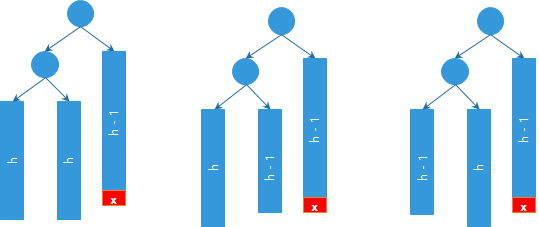
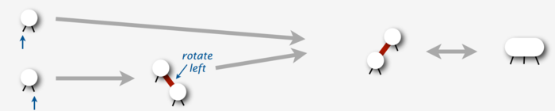
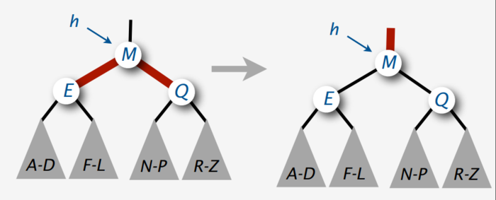
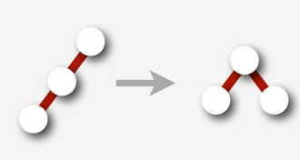
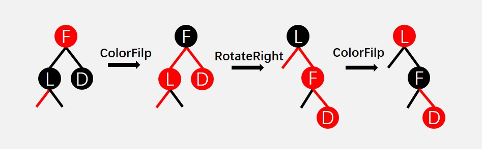

# 数据结构

收录所有数据结构和数据结构相关的简单算法

## 1. 数组与链表

### 1.1 数组

**定义**

所有同类元素存在一块地址连续的区域。

**优点**

* 适合随机访问——因为地址连续

**缺点**

* 插入和删除效率低——需要移动插入和删除位置之后的元素
* 不利于扩展——因为需要预先申请空间

### 1.2 链表

**定义**

所有元素通过指针连接在一起，彼此存放位置可以任意指定。

**优点**

* 适合插入和删除——只需要修改指针即可
* 扩展方便——只要内存空间足够，数据可所以增删

**缺点**

* 不适合随机访问——因为地址不连续，无法获得其他元素的访问地址

**单向链表 & 双向链表 & 循环链表** 

* 单向链表——每个结点只有后向指针
* 双向链表——每个结点同时前向指针和后向指针，方便获取前一个结点
* 循环链表——链表首尾相连

#### 1.2.1 跳表

## 2. 队列

**定义**

满足先进先出的线性结构。

**链表实现**

* 入队——在链表的尾节点后插入
* 出队——从链表的头节点处删除并返回结点

**循环数组实现**

* 入队——使用一个下标 rear 保存队尾（下一个入队元素的位置），每次入队后 rear = （rear + 1）% n
* 出队——使用一个下标 head 保存队尾，每次入队后 head =  (head + 1) % n
* 队空——rear == head
* 队满—— (rear + 1) % n == head

所以仅仅使用首位下标实现循环数组的队列，n 大小的数组最多存 n - 1 个结点。如果辅助一个 size 变量表示当前队列长度时，则循环数组最多可以存 n 个。

### 2.1 单调队列

单调队列就是队列结点都是满足一种单调性的队列。在顺序遍历序列的过程中，借助单调队列可以获取某个固定窗口大小的单调子序列。

**特性**

队内相邻两结点的值都大于这两个结点之间未在队内的结点的值。

队尾和队首保持不超过窗口大小。

**何时使用单调队列**

* 当要求解指定窗口大小的局部最优时，也即需要从头部出队时

**典型问题：**给定一个 n 个数的数列，从左至右输出每个长度为 m 的数列段内的最大数。

**解决方案：**维护一个单调递减队列，从左向右遍历数列，每次入队当前结点，然后出队队首过期结点（队首不在 m 长度范围内），当前队首结点就是 m 窗口内的最大结点。

## 3. 栈

**定义**

满足先进后出的线性结构

**链表实现**

* 入栈——从链表的头结点处插入
* 出栈——从链表的头节点处删除并返回结点

**数组实现**

* 入栈——从数组的尾部插入
* 出栈——从数组的尾部返回结点并使尾指针前移

### 3.1 单调栈

单调栈就是栈内结点都是满足一种单调性的栈。

在顺序遍历序列的过程中，借助单调栈可以获取以当前结点为结束的单调子序列，这个子序列的起始点为起始点到当前结点（含）的最值，单调递增栈就是最小值，单调递减栈就是最大值。

**特性**

栈内相邻两结点的值都大于这两个结点之间未在栈内的结点的值。

单调递增栈栈底之前的结点值都大于栈底的结点值；单调递减栈底之前的结点值都小于栈底的结点值。

**何时使用单调栈**

* 求需要局部最值参与计算的局部最优，
* 违反单调性时，只需要尾部出栈，且出栈的结点都是终结结点（不需要再参与计算）

## 4. 树

### 4.1 二叉查找树

二叉查找树是这样一棵二叉树：对于任意一个结点 E，其左子树上的所有结点都小于 E，其右子树上的所有结点都大于E。

**插入操作：**每次插入新元素是，只需要顺着一条路径找到一个空叶子结点插入即可。这样二叉查找树的插入时间复杂度和查找时间复杂同基本相同。

**删除操作：**若被删除的结点只有一颗子树，则直接删除该结点，在将子树直接替补上来即可；若被删除的结点有两颗子树，则可以替换左子树的最大值到此结点，或替换右子树的最小值到此结点，然后删除替换后位置的当前结点即可。

**范围查找操作：**中序遍历

**二叉查找树优缺点**

理想情况下二叉查找树的查找、插入和删除的时间复杂度都为O(log n)，但动态插入的二叉查找树其形状与关键字插入的先后顺序息息相关。如1、2、3三个关键子按照2-1-3的顺序构建二叉查找树其形状为一颗2层的满二叉树，而按照1-2-3或3-2-1的顺序其形状就为一条线，即退化为链表，要避免这样的退化，就有了二叉平衡树。

### 4.2 平衡二叉树（AVL树）

平衡二叉树（Balanced Binary Tree）又被称为AVL树（有别于AVL算法），且具有以下性质：<u>它是一 棵空树或它的左右两个子树的高度差的绝对值不超过1，并且左右两个子树都是一棵平衡二叉树。</u>这个方案很好的解决了二叉查找树退化成链表的问题，把插入，查找，删除的时间复杂度最好情况和最坏情况都维持在O(log n)。但是频繁旋转会使插入和删除牺牲掉O(log n)左右的时间，不过相对二叉查找树来说，时间上稳定了很多。

**插入不平衡解决方案**

平衡二叉树插入结点时一定是在叶子节点上。插入后不平衡的结点一定在插入结点的父辈结点中，从而需要递归父辈结点进行 rebalance 操作，假设插入结点 x，从 x 找父节点，有两种情况：

- 平衡因子未改变，rebalance 操作完成；
- 平衡因子改变，若因子改变后仍平衡，继续递归 rebalance 此节点的父节点；若不平衡，旋转使平衡，rebalance 操作完成。

更细分有两种不平衡情况：需要单旋转情况（LL 或 RR），需要双旋转情况（LR 或 RL）。LL 意为第一个不平衡父结点的左子树高度大于右子树，且左子树根节点的左子树高度大于其右子树；同理，LR 意为第一个不平衡父结点的左子树高度大于右子树，且左子树根节点的右子树高度大于其左子树。

单旋转情况：


 

上图是左左的情况，k2结点不满足平衡性，它的左子树k1比右子树z深两层，k1子树中更深的是k1的左子树x，因此属于左左情况。

为了恢复平衡，我们把x上移一层，并把z下移一层，但此时实际已经超出了AVL树的性质要求。为此，重新安排结点以形成一颗等价的树。为使树恢复平衡，我们把k2变成这棵树的根节点，因为k2大于k1，把k2置于k1的右子树上，而原本在k1右子树的Y大于k1，小于k2，就把Y置于k2的左子树上，这样既满足了二叉查找树的性质，又满足了平衡二叉树的性质。

双旋转情况：

对于左右和右左两种情况，单旋转不能解决问题，要经过两次旋转。


对于上图情况，为使树恢复平衡，我们需要进行两步，第一步，把k1作为根，进行一次右右旋转，旋转之后就变成了左左情况，所以第二步再进行一次左左旋转，最后得到了一棵以k2为根的平衡二叉树。

**删除不平衡的解决方案**

先找到被删除的结点，有两种情况：若被删除的结点最多有一颗子树，那么直接删除该节点，用其子树替补该节点位置即可；若被删除的结点有两颗子树，则在较高一颗子树上找到最大值（左子树较高）或最小值（右子树较高）与待删除结点值交换，然后删除交换后的待删除结点。所以删除结点也可以看作只在最多一个子结点的结点上进行。

结点删除后有可能会破坏树的平衡条件，找到高度不平衡的结点进行旋转再平衡。具体操作（假如删除结点 x）：从 x 找父节点，有两种情况：

- 平衡因子未改变，rebalance 操作完成；
- 平衡因子改变，若不平衡，旋转使平衡，然后递归 rebalance 此结点的父节点。

更详细一点，右子树上删除一个结点造成不平衡的情形只可能是以下三种情况：



分清楚所有可能的结果，编写代码就更容易。

**平衡二叉树优缺点**

平衡二叉树的查找、插入和删除的时间复杂度都为O(log2 n)，但动态插入和删除中维护二叉树平衡需要花费比较大的代价去旋转 rebalance 操作，尤其删除时有可能需要多次 rebalance 操作。为了降低这个代价，我们稍稍放松完美平衡的要求，引入 2,3-查找树。

### 4.3 2,3-查找树

将有两颗子树的结点称为 2- 结点，有三颗子树额结点称为 3- 结点。2,3-查找树就是一个结点可以有2颗子树或三颗子树的查找树，并且这棵树叶子结点都在一层上。同平衡二叉树相同，2,3-查找树上每个键左边的子树上的所有值都小于该键值，右边子树上的所有值都大于该键值。

2,3-查找树查找过程类似与平衡二叉树，时间复杂度为O(log2 n) ~ O(log3 n)。

**插入**

先查找插入位置，找到后有两种情况：该结点只有一个键，直接插入即可；该节点已有2个键，插入后变为3个键，则进行分裂操作，中间的键值进入到父结点，若父结点此时变为3个键，则继续分裂，递归直到根或不需要再分裂。可以看出，2,3-查找树的生长是从下往上的。

插入S示例：


**删除**

先将删除结点替换到最底层结点上：

- 若此时结点处于3-node中直接删除，
- 若处于2-node中，根据兄弟结点分两种情况
  - 兄弟结点为3-node，则从兄弟结点借一个结点（以父节点未中介）成为3-node后再删除，
  - 兄节点为2-node，则从父结点一个结点，若父节点也是2-node，则递归构造父节点为3-node

**2,3-查找树优缺点**

一颗含有十亿结点的2,3-树高度再19到30之间，也就是说查找和插入一个结点最多只需要30次，这个效率已经很惊人了。2,3-树的效率比平衡二叉树要好，但是问题在于，2,3-树并不好实现：

- 首先，我们需要用两种不同类型的节点代表2-,3-node 
- 然后，在插入节点的时候，我们可能需要进行大量的切分3-node的工作
- 我们可能也需要频繁的在两种节点之间进行转换

为了更好的利用2,3-树平衡高度的特点，同时又更好的便于实现，我们就引入了红黑树。

### 4.4 红黑树

将2,3-查找树的 2- 结点标记为黑色， 3- 结点中的右边结点标记为黑色，左边结点标记为红色并作为右边结点的左孩子，这样就可以把2,3-查找树转化为一颗二叉树，且用红黑颜色标记结点，称为红黑树，要保证红黑树是一颗 2,3-树满足以下条件即可（以下条件要求的红黑树实质上是一颗 2,3,4-树，满足以下条件并且满足红结点只能是左孩子或只能是右孩子的二叉树的红黑树实质才是2,3-树）：

1. 每个结点为红色或黑色
2. 根节点为黑色
3. 叶子结点（nil）为黑色
4. 没有两个相连的红色结点
5. 从根节点到所有叶子节点黑色结点数目相同

红黑树就是一颗二叉树，因此查找复杂度为O(log2 n)

**红黑树插入**

插入结点始终要保证红黑树的5条性质。标记插入结点为红色结点，有以下情形：

- 插入结点为根节点，直接涂黑即可。
- 插入结点的父节点为黑色，不用作任何操作。
- 插入结点父节点为红色，此时祖父一定是黑色，分下面三种情况：
  - 叔叔结点为红色，将父节点和叔叔结点涂黑，祖父涂红，将祖父节点作为插入节点递归调用插入操作
  - 叔叔结点为黑色，父节点涂黑，祖父涂红，以祖父结点为高点，父节点为次高点进行旋转，使祖父节点成为父节点的一个子节点。（具体实现时可将插入节点是否左右孩子及父节点是否左右孩子四种情形化为两种情形，如当前节点为左孩子父节点为右孩子，将当前结点和父结点向右旋转，原父结点成为当前结点的右孩子，以原父节点为插入结点就化为了插入节点为右孩子，父结点为右孩子的情形）

**左倾红黑树插入**

尽可能只让红结点出现再左孩子的红黑树称之为左倾红黑树（下面采用的是严格左倾红黑树，即所有红结点都是左孩子）。这里使用左倾红黑树只是便于讲解（/* **TODO**  有时间为此文档增加普通红黑树插入删除文档*/>），实际使用中多使用普通红黑树，普通红黑树可以让插入操作保证在2次旋转之内，删除操作保证在3次旋转之内。

首先，我们先介绍如何对红黑树的一些节点进行转换操作：

- **左旋操作**，左旋操作就是将右倾的3-node变成左倾的3-node

  

  左旋操作实现：

  ```java
  private Node rotateLeft(Node h) {
  	Node x = h.right;
  	h.right = x.left;		//交换中间分支
  	x.left = h;				//并互换父子关系
  	x.color = x.left.color; //交换颜色
  	x.left.color = RED;		//交换颜色
  	return x;				//返回新父结点
  }
  ```

- **右旋操作**，与左旋相反，直接看实现

  ```java
  private Node rotateRight(Node h) {
      Node x = h.left;
      h.left = x.right;		//交换中间分支
      x.right = h;			//并互换父子关系
      x.color = x.right.color;//交换颜色
      x.right.color = RED;	//交换颜色
      return x;				//返回新父结点
  }
  ```

下面对插入操作详细分析，对2-,3-插入分别进行分析。

 2- 结点的插入情况：

- 如果插入左孩子，直接插入
- 如果插入右孩子，需要进行一个左旋操作



3- 结点的插入情况：

- 如果插入左倾红结点的左孩子，一次右旋，生成一个临时 4- 结点
- 如果插入左倾红结点的右孩子，一次左旋然后再一次右旋，生成一个临时 4- 结点
- 如果插入黑结点的右孩子，生成一个临时 4- 结点


临时 4- 结点的处理：

只需要对 4- 结点进行一次 colorFlip 操作（互换父和左右孩子的颜色）即可，如下图，colorFilp 操作后E和Q都变成了黑色结点，然后以M为插入结点递归调用插入操作



我们可以把上面这些插入操作总结，然后实现一个统一适用的插入算法：

1. 首先，若向空节点插入结点，直接插入即可

2. 若有右倾结点则进行旋转

   

3. 若有连续的两个红节点进行转换

   

4. 若出现了临时4-结点，则进行colorFilp

   

左倾红黑树插入实现：

```java
public Node insert(Key key, Value value) {
    root = insert(root, key, value);
    root.setColor(BLACK);
}

private Node insert(Node head, Key key, Value value) {
    if (head == null) return new Node(key, val, RED); //步骤1
    
    
    int cmp = key.compareTo(head.key);
    if (cmp < 0) head.left = insert(head.left, key, val); //左支插入
    else if (cmp > 0) h.right = insert(head.right, key, val);//右支插入
    else head.val = val;
         
    if (isRed(head.right)) head = rotateLeft(head);//步骤2
    if (isRed(head.left) && isRed(head.left.left)) head = rotateRight(head);//步骤3
    if (isRed(head.left) && isRed(head.right)) colorFlip(head);//步骤4
    return head;
}
```

**左倾红黑树的删除**

红黑树的删除结点第一步和普通的平衡二叉树相同，如果删除有左右两个孩子的结点，则需要先将待删除结点与左支最大值交换或与右支最小值交换。交换后的结点最多只有一个孩子，直接删除该节点，孩子结点直接向上补位。所以首先分析如何删除最大值或最小值。

删除最大值：

最大值即从根一直向右走直到边界即可，即最右边的结点。如果删除结点在 3-node 中，直接删除最右边值即可。麻烦的是 2-node，删除就可能破坏红黑树，所以我们再删除之前，要进行一定的变换，变成3-node，也就是借一个或者两个结点过来。所以这里的删除方法采用递归调用删除的方式，从根开始调用，始终将右孩子转变为3-node，这样每次对右孩子递归调用删除方法时，每次递归的当前结点始终为3-node，也即始终为红色。这样右孩子会有以下几种情况（假设当前结点为head）：

1. 当前结点的右孩子为3-node（head.right.left为红色）
2. 当前结点的右孩子为2-node（head.right.left为黑色）
3. 当前结点的右孩子为nil

下面具体讨论。

若**当前结点的右孩子为3-node**时，只需要把左倾3-node转为右倾3-node （对右孩子右旋），因为根节点也可能需要这个转换操作，我们把这个旋转操作放在每次递归操作开始（就变成了对当前结点右旋）：


若**当前结点的右孩子为2-node**时，根据左孩子是否2-node分两种情形：

- 第一种情形就是左孩子不是2-node，就可以直接从左孩子借一个节点过来。（左孩子最大值移动到父结点，父节点最大值移动到右孩子）。红黑树操作表示如下图：

  

- 第二种情形就是左孩子是2-node，则从父节点中借一个过来，然后和右孩子合并成一个临时4-node。红黑树表示如下图：

  

若**当前结点的右孩子为nil**时，那么当前结点的左孩子也一定为nil，因为每次递归前已经将左倾3-node转变为右倾3-node。此时直接删除当前结点即可。

删除操作完成后，递归完成前需要恢复左倾红黑树的姿态，对以上所有操作的结果进行分析，需要处理的只有2种情形：


综合以上，删除最大值的操作总结为：

1. 若当前结点为左倾3-node，则旋转当前结点为右倾3-node
2. 若右孩子为nil，删除当前结点
3. 若右孩子为2-node，且
   - 左孩子不是2-node，对当前根进行 ColorFlip -> RotateRight -> ColorFlip
   - 左孩子是2-node，对当前根进行 ColorFlip
4. 递归对右孩子进行删除最大值操作
5. 恢复左倾红黑树姿态

删除最大值实现：

```java
public void deleteMax() {

    if(!isRed(root.left)) root.setColor(RED);
    root = deleteMax(root);
    if(root != null) root.setColor(BLACK);
}

private Node deleteMax(Node head) {
    if(isRed(head.left)) rotateRight(head);				//步骤1
    if(head.right == null) return null;					//步骤2
    if(!isRed(head.right) && !isRed(head.right.left)) {	//步骤3
        colorFlip(head);
        if(isRed(head.left.left)) {
            head = rotateRight(head);
            colorFlip(head);
        }
    }
    head.right = deleteMax(head.right);					//步骤4
 
 	//调整为左倾红黑树
    if (isRed(head.left) && isRed(head.right)) colorFlip(head);
 	else if (isRed(head.right)) head = rotateLeft(head);
	
	return head;
}
```

删除最小值：

同删除最大值思想还是一样的。首先，不变量，就是保证head或者head的left一定是红色的。遇到底部的红节点，就直接删除了。

同样左孩子会有以下几种情况（假设当前结点为head）：

1. 当前结点的左孩子为3-node（head.left.left为红色）
2. 当前结点的左孩子为2-node（head.left.left为黑色）
3. 当前结点的左孩子为nil

下面具体讨论。

若**当前结点的左孩子为3-node**时，左倾红黑树，3-node都是左倾的所以不需要任何操作。

若**当前结点的左孩子为2-node**时，根据右孩子是否2-node分两种情形：

- 第一种情形就是右孩子不是2-node，就可以直接从右孩子借一个节点过来。（右孩子最小值移动到父结点，父节点最小值移动到左孩子）。红黑树操作表示如下图：

  

- 第二种情形就是右孩子是2-node，则从父节点中借一个过来，然后和左孩子合并成一个临时4-node。红黑树表示如下图：

  

若**当前结点的左孩子为nil**时，那么当前结点的右孩子也一定为nil，因右孩子不是nil就是黑节点，左孩子为nil右孩子若是黑节点就破坏的了红黑树性质。此时直接删除当前结点即可。

最后需要恢复左倾红黑树姿态，也只有2种情形需要处理：


综合以上，删除最小值的操作总结为：

1. 若左孩子为nil，删除当前结点
2. 若左孩子为2-node，且
   - 右孩子不是2-node，对当前根进行 ColorFlip，对当前根的右结点进行 RotateRight，再对当前根进行 RotateLeft-> ColorFlip
   - 右孩子是2-node，对当前根进行 ColorFlip
3. 递归对左孩子进行删除最小值操作
4. 恢复左倾红黑树姿态

删除最小值实现：

```java
public void deleteMin() {

    if(!isRed(root.left)) root.setColor(RED);
    root = deleteMin(root);
    if(root != null) root.setColor(BLACK);
}

private Node deleteMin(Node head) {
    if(head.left == null) return null;					//步骤1
    if(!isRed(head.left) && !isRed(head.left.left)) {	//步骤2
        colorFlip(head);
        if(isRed(head.right.left)) {
            head.right = rotateRight(head.right)
            head = rotateLeft(head);
            colorFlip(head);
        }
    }
    head.left = deleteMin(head.left);					//步骤3
 
 	//调整为左倾红黑树
    if (isRed(head.left) && isRed(head.right)) colorFlip(head);
 	else if (isRed(head.right)) head = rotateLeft(head);
	
	return head;
}
```

删除任意值：

实现了删除最大值和最小值，删除任意值就很容易了，只要找到删除的值K，然后将K与左支的最大值交换或与右支的最小值交换，然后删除左支的最小值或右支的最大值即可。这里用删除左支最大值实现：

```java
private void delete(Key) {
    delete(root, key);
}
private Node delete(Node h, Key key) {

    int cmp = key.compareTo(h.key);
    if (cmp <= 0) {
        if(cmp == 0 && h.left == null)
            return null;
        if(h.left == null) return h;	//删除值不存在
        if(!isRed(h.left) && !isRed(h.left.left)) {	//删除最小值步骤2
            colorFlip(h);
            if(isRed(h.right.left)) {
                head.right = rotateRight(h.right)
                head = rotateLeft(h);
                colorFlip(h);
            }
        }
        if(cmp == 0) {
            h.key = max(h.left);
            h.value = get(h.left, h.key);
            h.left = deleteMax(h.left);
        }
        h.left = delete(h.left, key);
    }
    else {
        if(isRed(h.left)) rotateRight(h);				//删除最大值步骤1
        if(h.right == null) return h;	//删除值不存在
        if (!isRed(h.right) && !isRed(h.right.left)) {  //删除最大值步骤3
            colorFlip(h);
            if(isRed(h.left.left)) {
                h = rotateRight(h);
                colorFlip(h);
            }
        }
        
        h.right = delete(h.right, key);
    }
    
    //调整为左倾红黑树
    if (isRed(h.left) && isRed(h.right)) colorFlip(h);
 	else if (isRed(h.right)) h = rotateLeft(h);

	return h;
}
```

**红黑树的最差情形**

最差情况下，红黑树严重偏向一边，导致若到叶子结点最长路径为h，则最短路径可到h/2，达到最差情形，高度为 O(2 * log2 n)，因此查找复杂度也为 O(2 * log2 n)。

**红黑树优缺点**

红黑树对比2,3-树优点在结构上更加简单，且插入工作也比较简单，2,3-树插入需要结点的切分（严重影响性能）和结点类型转化，红黑树插入只需要颜色的变化加上旋转。

**几种查询结构操作时间复杂度的比较**

|                            |  平均查找  |    平均插入     | 最坏查找 |    最坏插入     |
| -------------------------- | :--------: | :-------------: | :------: | :-------------: |
| 顺序查询（无序链表或数组） |    N/2     | 1(链表)/N(数组) |    N     | 1(链表)/N(数组) |
| 二分查找（有序数组）       |   log2 N   |       N/2       |  log2 N  |        N        |
| 二叉查找树                 | 1.39log2 N |   1.39log2 N    |    N     |        N        |
| 平衡查找树（AVL树）        |   log2 N   |     log2 N      |  log2 N  |     log2 N      |
| 2,3,4-查找树（红黑树）     |   log2 N   |     log2 N      | 2log2 N  |     2log2 N     |

时间复杂度并不能完全反映这几种查询结构的差别，需要更详细的分析。

### 4.5 AVL树 *VS* 2,3,4-树 *VS* 红黑树

查询操作比较：

- AVL树：log2 N，左右子树高度最多差1
- 2,3,4-树：log2 N，左右子树高度最多差一倍，将3,4-node结点的多次比较看成树高
- 红黑树：同2,3-树

因为AVL树严格平衡，其查询性能会略优一点。有说法为最差情况下红黑树查找仅比AVL树多一次，待有时间证明。

插入操作比较：

- AVL树：log2 N，插入后需要维护从插入结点到不平衡父结点的平衡因子，最差情况需要维护到根，即最多需要 O(log2 N) 复杂度的平衡因子维护操作，然后进行最多两次旋转（LL和RR旋转一次，LR和RL旋转两次）
- 2,3,4-树：log2 N，插入时可能需要切分结点（伴随着类型转换），最差情况需要从插入结点一直切分到根，最差需要 O(log2 N) 复杂度的切分结点操作
- 红黑树：log2 N，实质为2,3,4-树的红黑树，插入需要若干次颜色变换（最多 log2 N 次，颜色变换操作费时极少），和最多两次旋转操作。

删除操作比较：

- AVL树：log2 N，删除后需要维护从被删除结点父结点到不平衡父结点的平衡因子，最差情况需要维护到根，每次维护需要进行最多两次旋转，最差需要 O(log2 N) 复杂度的旋转
- 2,3,4-树：log2 N，删除时可能需要向父节点借结点合并，最差需要 O(log2 N) 复杂度的结点合并操作
- 红黑树：log2 N，实质为2,3,4-树的红黑树，删除需要若干次颜色变换（最多 log2 N 次，颜色变换操作费时极少），和最多三次的旋转操作。

从表格上可以更直观的看出它们在**最差**情况下的优劣：

|      |                       AVL树                        |             2,3,4-树             |                  红黑树                   |
| ---- | :------------------------------------------------: | :------------------------------: | :---------------------------------------: |
| 查找 |                     A+（略优）                     |                A                 |                     A                     |
| 插入 |   平衡因子修正：O(log2 N) 次<br />旋转：最多2次    | 切分和结点类型转换：O(log2 N) 次 | 颜色转变：O(log2 N) 次<br />旋转：最多2次 |
| 删除 | 平衡因子修正：O(log2 N) 次<br />旋转：O(log2 N) 次 |    借父节点合并：O(log2 N) 次    | 颜色转变：O(log2 N) 次<br />旋转：最多3次 |

红黑树的查询性能略微逊色于AVL树，但是，红黑树在插入和删除上完爆avl树，插入时红黑树颜色转换操作要比平衡因子修正操作要更快（颜色转换只需要修改一个属性，平衡因子需要查询左右子树高度两个属性，并且还可能要更新高度属性），删除操作红黑树更是直接完胜。

### 4.6 B树

树中所有节点的孩子节点的最大值就是B树的阶。通常用M表示，从查找效率来看， 通常取 M >= 3。一个M阶的B树的定义如下： 
该树或者是空树， 或者满足如下条件：

- 树中每个结点最多含有m个孩子（m>=2）；
- 除根结点和叶子结点外，其它每个结点至少有[ceil(m / 2)]个孩子（其中ceil(x)是一个取上整的函数）；
- 若根结点不是叶子结点，则至少有2个孩子；
- 所有叶子结点都出现在同一层，叶子结点不包含任何关键字信息(可以看做是外部接点或查询失败的接点，实际上这些结点不存在，指向这些结点的指针都为nil)；
- 每个非终端结点中包含有n个关键字信息：[ceil(m / 2)-1]<= n <= m-1。

B树的查找、插入和删除操作都与 2,3-查找树类似，不再赘述。

**B树优点**

与红黑树相比,在相同的的节点的情况下，一颗B/B+树的高度远远小于红黑树的高度。B/B+树上操作的时间通常由存取磁盘的时间和CPU计算时间这两部分构成，而CPU的速度非常快,所以B树的操作效率取决于访问磁盘的次数，关键字总数相同的情况下B树的高度越小（假设每次访问一层，红黑树可以使用多层访问替代，但实质上就是B树了），磁盘I/O所花的时间越少。

因此，B树最大的优点时提高了IO性能。

### 4.7 B+树

B+-tree：是应文件系统所需而产生的一种B-tree的变形树。 
一棵m阶的B+树和m阶的B树的不同点在于：

- 所有的叶子结点中包含了全部关键字的信息，及指向含有这些关键字记录的指针，且叶子结点本身依关键字的大小自小而大的顺序链接
- 所有的非终端结点可以看成是索引部分，结点中仅含有其子树根结点中最大（或最小）关键字。

**B+树的优点** 

- B+-tree的磁盘读写代价更低 
  B+-tree的内部结点并没有指向关键字具体信息的指针。因此其内部结点相对B 树更小。如果把所有同一内部结点的关键字存放在同一盘块中，那么盘块所能容纳的关键字数量也越多。一次性读入内存中的需要查找的关键字也就越多。相对来说IO读写次数也就降低了。 
  举个例子，假设磁盘中的一个盘块容纳16bytes，而一个关键字2bytes，一个关键字具体信息指针2bytes。一棵9阶B-tree(一个结点最多8个关键字)的内部结点需要2个盘快。而B+ 树内部结点只需要1个盘快。当需要把内部结点读入内存中的时候，B 树就比B+ 树多一次盘块查找时间(在磁盘中就是盘片旋转的时间)。 
- B+-tree的查询效率更加稳定 
  由于非终结点并不是最终指向文件内容的结点，而只是叶子结点中关键字的索引。所以任何关键字的查找必须走一条从根结点到叶子结点的路。所有关键字查询的路径长度相同，导致每一个数据的查询效率相当。

**为什么说B+tree比B树更适合实际应用中操作系统的文件索引和数据索引**

B+树应用于文件系统原因在于内部结点小，一次性读入内存的需要查找的关键字也就越多,相对IO读写次数就降低了。且查找效率稳定。

普遍认为数据库索引采用B+树的主要原因是：B树在提高了IO性能的同时并没有解决元素遍历的我效率低下的问题，正是为了解决这个问题，B+树应用而生，B+树只需要去遍历叶子节点就可以实现整棵树的遍历。而且在数据库中基于范围的查询是非常频繁的，而B树不支持这样的操作（或者说效率太低）

> **各种查找树的应用场景**
>
> 那么什么时候用红黑树，什么时候用 B 树和 B+ 树呢?
>
> 从之前性能对比的表格来分析，B/B+ 树的插入和删除性能是低红黑树较多的，所以能用红黑树肯定用红黑树。但是当需要用到只有 B/B+ 树才有的特性时就要用 B/B+ 树了。
>
> 比如：B/B+ 树主要用在文件系统以及数据库做索引，由于所有索引可能不能一次读入内存，所以需要多次 IO 操作。B/B+ 天然的分层使得拆分索引文件很容易。因为 B/B+ 树的层数少（假设每次读取一层），需要的磁盘 IO （非常耗时）就少。B+ 树相对 B树索引项更小，可同时读入的索引就更多，同时，叶节点相连使得范围查找相率更高，且可利用内存的预读机制（当读取一个数据时，会把相连的地址数据也读入内存页）。
>
> **红黑树应用**
>
> - 广泛用于C++的STL中,map和set都是用红黑树实现的.
> - 著名的linux进程调度[Completely Fair Scheduler](https://en.wikipedia.org/wiki/Completely_Fair_Scheduler),用红黑树管理进程控制块,进程的虚拟内存区域都存储在一颗红黑树上,每个虚拟地址区域都对应红黑树的一个节点,左指针指向相邻的地址虚拟存储区域,右指针指向相邻的高地址虚拟地址空间.
> - IO多路复用epoll的实现采用红黑树组织管理sockfd，以支持快速的增删改查.
> - ngnix中,用红黑树管理timer,因为红黑树是有序的,可以很快的得到距离当前最小的定时器.
> - java中TreeMap的实现.
>
> **B树和B+树应用**
>
> B和B+树主要用在文件系统以及数据库做索引.比如Mysql;

### 5.8 字典树（Trie 树）

Trie树，即字典树，又称单词查找树或键树，是一种树形结构，是一种哈希树的变种。典型应用是用于统计和排序大量的字符串（但不仅限于字符串），所以经常被搜索引擎系统用于文本词频统计。它的优点是：最大限度地减少无谓的字符串比较，查询效率比哈希表高。 

**性质**

1. 根节点不包含字符，除根节点外每一个节点都只包含一个字符。
2. 从根节点到某一节点，路径上经过的字符连接起来，为该节点对应的字符串。
3. 每个节点的所有子节点包含的字符都不相同。

### 5.9 线段树

线段树可以看作树的每个结点都保存了一个线段区间的最值，它的两个子节点分别保存了左右两个子线段的最值。所有的子节点都保存了一个最小子段的最值。通过线段树很容易快去求出任意线段区间的最值。

线段树不止可以解决区间最值得问题，也可以解决跟区间有关得其他问题。

**（一）常规线段树**

如果端点是离散得情况下，一把用常规的线段树会节省空间，但是查询的时候就只能查询离散端点区间的值。

插入方法可以用递归实现，即左右子区间可以判断插入的端点是否在自己管辖的区间内，如果是，则需要根据端点重新生成子线段，如：

```cpp
//区间最大值的线段树
struct TreeNode {
    int begin, end;
    int value;
    TreeNode * left, * right;
}

insert(TreeNode * root, int k, int value) { //向第 k 位置插入 v
    if(!root || k < root->begin || k > root->end)
        return;
    if(root->value < value)
        root->value = value;
    
    if(root->left) {
        insert(root->left, k, value);
        insert(root->right, k, value);
    } else if (root->begin < k) {
        root->left = new TreeNode{root->begin, k - 1, INT32_MIN, nullptr, nullptr};
        root->right = new TreeNode{k, root->end, value, nullptr, nullptr};
        insert(root->right, k, value);
    } else if (root->end > k) {
        root->left = new TreeNode{k, k, value, nullptr, nullptr};
        root->right = new TreeNode{k + 1, root->end, INT32_MIN, nullptr, nullptr};        
    }
    
}

// start, end 只能是插入过的 k 值，因为现在树中只有这些端点
int find(TreeNode *root, int start, int end) {
    if(!root || start > root->end || end < root->start)
        retutn INT32_MIN;
    
    if(start <= root->start && root->end <= end)
        return root->value;

    int lMax = find(root->left, start, end);
    int rMax = find(root->right, start, end);
    return max(lMax, rMax);
}
```

**（二）数组线段树示例**

数组线段树一般用于数组的区间最值查找。下图为一个数组 [2, 5, 1, 4, 9, 3] 构造的最小值线段树：

 

当要查询区间 [2 - 4] 的最小值时，只需从根查到 [2 - 2] 和 [3 - 4] 即可得出。

**构造线段树（复杂度 O(n)）**

线段树没有度为 1 的结点，所以线段树的总结树 = 2 * 线段树区间个数n - 1，所以复杂度为 O(n)。

```cpp
// 构造最大线段树
void build(int tree[], int arr[], n) { // tree 数组需要开 arr 的 4 倍大小
    buildCore(0, tree, arr, 0, n - 1);
}

// cur 为树当前结点的指针
void buildCore(int cur, int &tree[], int &arr[], int l , int r) {
    if(l == r) {
        tree[cur] = arr[l];
        return;
    }
    
    int mid = (l + r) / 2;
    int lChild = 2 * cur + 1;
    int rChild = 2 * cur + 2;
    buildCore(lChild, tree, arr, l, mid);
    buildCore(rChild, tree, arr, mid + 1, r);
    tree[cur] = tree[lChild] > tree[rChild] ? tree[lChild] : tree[rChild] ;
    
}
```

**在线段树上查询（复杂度：O(log n) ）**

```cpp
int find(int tree[], int s, int t) {
    return findCore(0, tree,  s , t, 0, n - 1);
}

int findCore(int cur, int &tree[], int &s, int &t, int l, int r) {
    if(s <= l && r <= t)
        return tree[cur];
    
    int mid = (l + r) / 2;
    int lMax > = 0x80000000, rMax = 0x80000000;
    if(s <= mid)
        lMax = findCore(2 * cur + 1, tree, s, t, l, mid);
    if(mid < t)
        rMax = findCore(2 * cur + 2, tree, s, t, mid + 1, r);
    return lMax > rMax ? lMax : rMax;
}
```

> 另外一种求区间最值得方法是 rmq，详见算法文档的动态规划章节。
>
> rmq 的缺点是对动态修改的区间最值效率较低，每次修改需要修改的信息很大，而线段树可以很好的优化动态插入和修改。

## 5. 图