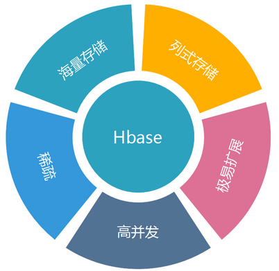
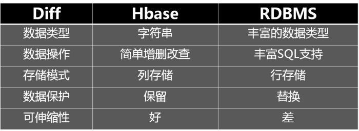
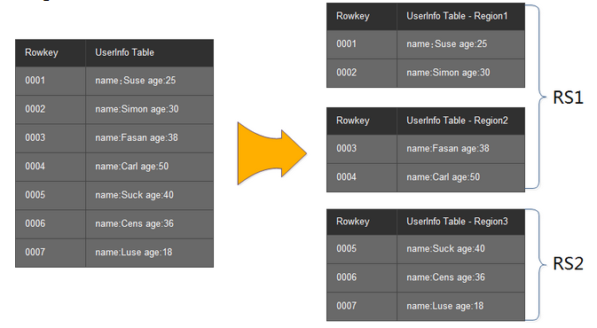
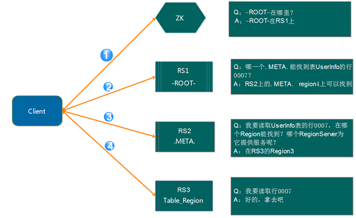
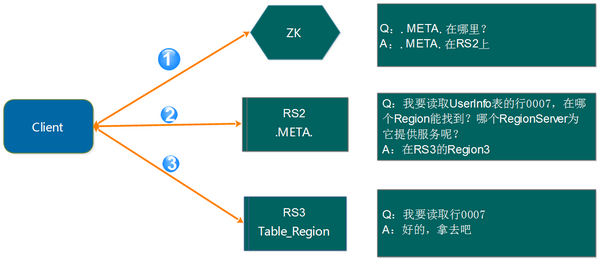
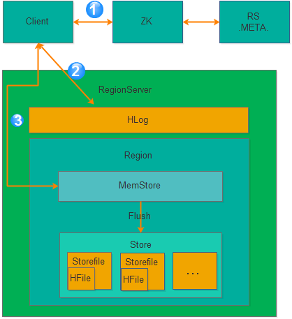
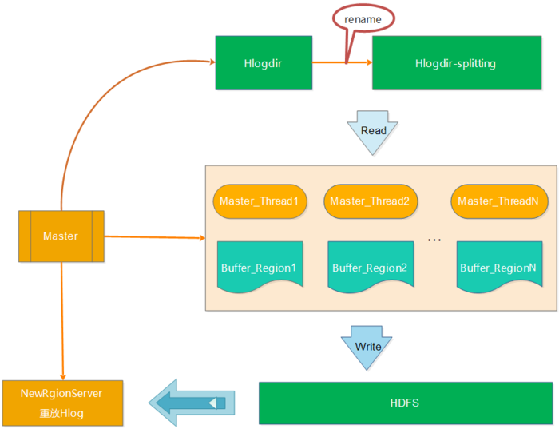
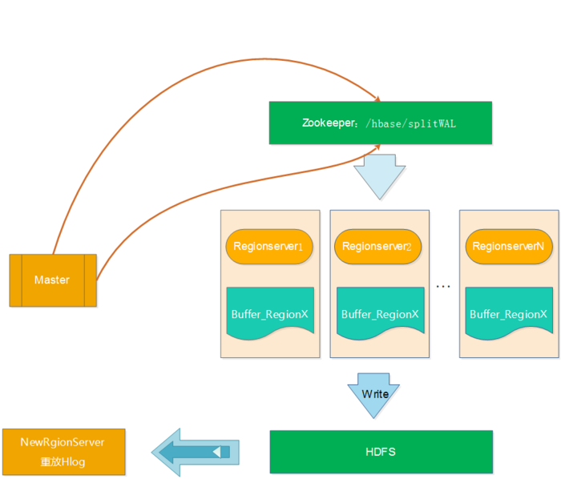

# HBase

## 1. 概述

### 1.1 什么是 HBase？

Apache HBase官方给出了这样的定义：

> Apache HBase™ is the Hadoop database, a distributed, scalable, big data store.

即：Apache HBase 是基于 Hadoop 构建的一个分布式的、可伸缩的海量数据存储系统。

### 1.2 HBase的特点

 

**海量存储**

Hbase适合存储PB级别的海量数据，在PB级别的数据以及采用廉价PC存储的情况下，能在几十到百毫秒内返回数据。这与Hbase的极易扩展性息息相关。正式因为Hbase良好的扩展性，才为海量数据的存储提供了便利。

**列式存储**

这里的列式存储其实说的是列族存储，Hbase是根据列族来存储数据的。列族下面可以有非常多的列，列族在创建表的时候就必须指定。为了加深对Hbase列族的理解，下面是一个简单的关系型数据库的表和Hbase数据库的表：

RDBMS的表：

 

Hbase的表：

 

下图是针对Hbase和关系型数据库的基本的一个比较：

 

**极易扩展**

Hbase的扩展性主要体现在两个方面，一个是基于上层处理能力（RegionServer）的扩展，一个是基于存储的扩展（HDFS）。

通过横向添加RegionSever的机器，进行水平扩展，提升Hbase上层的处理能力，提升Hbsae服务更多Region的能力。

备注：RegionServer的作用是管理region、承接业务的访问，这个后面会详细的介绍

通过横向添加Datanode的机器，进行存储层扩容，提升Hbase的数据存储能力和提升后端存储的读写能力。

**高并发**

由于目前大部分使用Hbase的架构，都是采用的廉价PC，因此单个IO的延迟其实并不小，一般在几十到上百ms之间。这里说的高并发，主要是在并发的情况下，Hbase的单个IO延迟下降并不多。能获得高并发、低延迟的服务。

**稀疏**

稀疏主要是针对Hbase列的灵活性，在列族中，你可以指定任意多的列，在列数据为空的情况下，是不会占用存储空间的。

### 1.3 HBase 的几个概念

 

 **Column Family的概念**

Column Family又叫列族，Hbase通过列族划分数据的存储，列族下面可以包含任意多的列，实现灵活的数据存取。刚接触的时候，理解起来有点吃力。我想到了一个非常类似的概念，理解起来就非常容易了。那就是家族的概念，我们知道一个家族是由于很多个的家庭组成的。列族也类似，列族是由一个一个的列组成（任意多）。

Hbase表的创建的时候就必须指定列族。就像关系型数据库创建的时候必须指定具体的列是一样的。

Hbase的列族不是越多越好，官方推荐的是列族最好小于或者等于3。

**Rowkey的概念**

Rowkey 的概念和 mysql 中的主键是完全一样的，Hbase 使用 Rowkey 来唯一的区分某一行的数据。

由于Hbase只支持3中查询方式：

* 基于Rowkey的单行查询
* 基于Rowkey的范围扫描
* 全表扫描

因此，Rowkey 对 Hbase 的性能影响非常大，Rowkey 的设计就显得尤为的重要。设计的时候要兼顾基于 Rowkey的单行查询也要键入 Rowkey 的范围扫描。具体 Rowkey 要如何设计后续会整理相关的文章做进一步的描述。这里大家只要有一个概念就是R owkey 的设计极为重要。

**Region的概念**

Region的概念和关系型数据库的分区或者分片差不多。

Hbase会将一个大表的数据基于Rowkey的不同范围分配到不通的Region中，每个Region负责一定范围的数据访问和存储。这样即使是一张巨大的表，由于被切割到不通的region，访问起来的时延也很低。

**TimeStamp的概念**

TimeStamp 对 Hbase 来说至关重要，因为它是实现 Hbase 多版本的关键。在 Hbase 中使用不同的 timestame 来标识相同 Rowkey 行对应的不通版本的数据。

在写入数据的时候，如果用户没有指定对应的 timestamp，Hbase 会自动添加一个 timestamp，timestamp 和服务器时间保持一致。

在 Hbas e中，相同 Rowkey 的数据按照 timestamp 倒序排列。默认查询的是最新的版本，用户可同指定timestamp 的值来读取旧版本的数据。

### 1.4 HBase 的架构

 Hbase的架构图如下图所示： 

 

 

 从图中可以看出Hbase是由Client、Zookeeper、Master、HRegionServer、HDFS等几个组建组成，下面来介绍一下几个组建的相关功能：

**Client**

Client包含了访问Hbase的接口，另外Client还维护了对应的cache来加速Hbase的访问，比如cache的.META.元数据的信息。

**Zookeeper**

Hbase通过Zookeeper来做master的高可用、RegionServer的监控、元数据的入口以及集群配置的维护等工作。具体工作如下：

通过Zoopkeeper来保证集群中只有1个master在运行，如果master异常，会通过竞争机制产生新的master提供服务

通过Zoopkeeper来监控RegionServer的状态，当RegionSevrer有异常的时候，通过回调的形式通知Master RegionServer上下限的信息

通过Zoopkeeper存储元数据的统一入口地址

**Hmaster**

master节点的主要职责如下：

为RegionServer分配Region

维护整个集群的负载均衡

维护集群的元数据信息

发现失效的Region，并将失效的Region分配到正常的RegionServer上

当RegionSever失效的时候，协调对应Hlog的拆分

**HregionServer**

HregionServer直接对接用户的读写请求，是真正的“干活”的节点。它的功能概括如下：

管理master为其分配的Region

处理来自客户端的读写请求

负责和底层HDFS的交互，存储数据到HDFS

负责Region变大以后的拆分

负责Storefile的合并工作

**HDFS**

HDFS为Hbase提供最终的底层数据存储服务，同时为Hbase提供高可用（Hlog存储在HDFS）的支持，具体功能概括如下：

提供元数据和表数据的底层分布式存储服务

数据多副本，保证的高可靠和高可用性

> **HBase中的数据为何不直接存放于HDFS之上？**
>
> HBase中存储的海量数据记录，通常在几百Bytes到KB级别，如果将这些数据直接存储于HDFS之上，会导致大量的小文件产生，为HDFS的元数据管理节点(NameNode)带来沉重的压力。
>
> **文件能否直接存储于HBase里面？**
>
> 如果是几MB的文件，其实也可以直接存储于HBase里面，我们暂且将这类文件称之为小文件，HBase提供了一个名为MOB的特性来应对这类小文件的存储。但如果是更大的文件，强烈不建议用HBase来存储，关于这里更多的原因，希望你在详细读完本系列文章所有内容之后能够自己解答。

### 1.5 HBase 使用场景

1. Hbase是一个通过廉价PC机器集群来存储海量数据的分布式数据库解决方案。它比较适合的场景概括如下：

   * 数据量大（百T、PB级别）
   * 查询简单（基于rowkey或者rowkey范围查询）
   * 不涉及到复杂的关联

   有几个典型的场景特别适合使用Hbase来存储：

   * 海量订单流水数据（长久保存）
   * 交易记录
   * 数据库历史数据

## 2. Hbase 的 Region 介绍

前面已经介绍了Region类似于数据库的分片和分区的概念，每个Region负责一小部分Rowkey范围的数据的读写和维护，Region包含了对应的起始行到结束行的所有信息。master将对应的region分配给不同的RergionServer，由RegionSever来提供Region的读写服务和相关的管理工作。这部分主要介绍Region实例以及Rgeion的寻找路径：

### 2.1 region实例

上图模拟了一个Hbase的表是如何拆分成region，以及分配到不同的RegionServer中去。上面是1个Userinfo表，里面有7条记录，其中rowkey为0001到0002的记录被分配到了Region1上，Rowkey为0003到0004的记录被分配到了Region2上，而rowkey为0005、0006和0007的记录则被分配到了Region3上。region1和region2被master分配给了RegionServer1（RS1），Region3被master配分给了RegionServer2（RS2）

### 2.2 Region的寻址

既然读写都在RegionServer上发生，我们前面有讲到，每个RegionSever为一定数量的region服务，那么client要对某一行数据做读写的时候如何能知道具体要去访问哪个RegionServer呢？那就是接下来我们要讨论的问题

**老的Region寻址方式**

在Hbase 0.96版本以前，Hbase有两个特殊的表，分别是-ROOT-表和.META.表，其中-ROOT-的位置存储在ZooKeeper 中，-ROOT-本身存储了 .META. Table的RegionInfo信息，并且-ROOT-不会分裂，只有一个region。而.META.表可以被切分成多个region。读取的流程如下图所示：

第1步：client请求ZK获得-ROOT-所在的RegionServer地址

第2步：client请求-ROOT-所在的RS地址，获取.META.表的地址，client会将-ROOT-的相关信息cache下来，以便下一次快速访问

第3步：client请求.META.表的RS地址，获取访问数据所在RegionServer的地址，client会将.META.的相关信息cache下来，以便下一次快速访问

第4步：client请求访问数据所在RegionServer的地址，获取对应的数据

从上面的路径我们可以看出，用户需要3次请求才能直到用户Table真正的位置，这在一定程序带来了性能的下降。在0.96之前使用3层设计的主要原因是考虑到元数据可能需要很大。但是真正集群运行，元数据的大小其实很容易计算出来。在BigTable的论文中，每行METADATA数据存储大小为1KB左右，如果按照一个Region为128M的计算，3层设计可以支持的Region个数为2^34个，采用2层设计可以支持2^17（131072）。那么2层设计的情况下一个集群可以存储4P的数据。这仅仅是一个Region只有128M的情况下。如果是10G呢? 因此，通过计算，其实2层设计就可以满足集群的需求。因此在0.96版本以后就去掉了-ROOT-表了。

**新的Region寻址方式**

如上面的计算，2层结构其实完全能满足业务的需求，因此0.96版本以后将-ROOT-表去掉了。如下图所示：

访问路径变成了3步：

第1步：Client请求ZK获取.META.所在的RegionServer的地址。

第2步：Client请求.META.所在的RegionServer获取访问数据所在的RegionServer地址，client会将.META.的相关信息cache下来，以便下一次快速访问。

第3步：Client请求数据所在的RegionServer，获取所需要的数据。

总结去掉-ROOT-的原因有如下2点：

其一：提高性能

其二：2层结构已经足以满足集群的需求

这里还有一个问题需要说明，那就是 Client 会缓存 .META. 的数据，用来加快访问，既然有缓存，那它什么时候更新？如果 .META. 更新了，比如 Region1 不在 RerverServer2 上了，被转移到了 RerverServer3 上。client 的缓存没有更新会有什么情况？

其实，Client 的元数据缓存不更新，当 .META. 的数据发生更新。如上面的例子，由于 Region1 的位置发生了变化，Client 再次根据缓存去访问的时候，会出现错误，当出现异常达到重试次数后就会去 .META. 所在的RegionServer 获取最新的数据，如果. META. 所在的 RegionServer 也变了，Client 就会去 ZK 上获取 .META. 所在的 RegionServer 的最新地址。

## 3. Hbase的写逻辑

Hbase的写逻辑涉及到写内存、写log、刷盘等操作，看起来简单，其实里面又有很多的逻辑，下面就来做详细的介绍

### 3.1 Hbase写入逻辑

Hbase的写入流程如下图所示：

从上图可以看出分为 3 个步骤：

第1步：Client获取数据写入的Region所在的 RegionServer

第2步：请求写 Hlog

第3步：请求写 MemStore

只有当写 Hlog 和写 MemStore 都成功了才算请求写入完成。MemStore 后续会逐渐刷到 HDFS 中。

备注：Hlog 存储在 HDFS，当 RegionServer 出现异常，需要使用 Hlog 来恢复数据。

### 3.2 MemStore 刷盘

为了提高 Hbase 的写入性能，当写请求写入 MemStore 后，不会立即刷盘。而是会等到一定的时候进行刷盘的操作。具体是哪些场景会触发刷盘的操作呢？总结成如下的几个场景：

**全局内存控制**

这个全局的参数是控制内存整体的使用情况，当所有 memstore 占整个 heap 的最大比例的时候，会触发刷盘的操作。这个参数是 hbase.regionserver.global.memstore.upperLimit，默认为整个 heap 内存的 40%。但这并不意味着全局内存触发的刷盘操作会将所有的 MemStore 都进行刷盘，而是通过另外一个参数hbase.regionserver.global.memstore.lowerLimit 来控制，默认是整个heap内存的35%。当 flush 到所有memstore 占整个 heap 内存的比率为 35% 的时候，就停止刷盘。这么做主要是为了减少刷盘对业务带来的影响，实现平滑系统负载的目的。

**MemStore 达到上限**

当 MemStore 的大小达到 hbase.hregion.memstore.flush.size 大小的时候会触发刷盘，默认128M大小

**RegionServer 的 Hlog 数量达到上限**

前面说到 Hlog 为了保证 Hbase 数据的一致性，那么如果 Hlog 太多的话，会导致故障恢复的时间太长，因此Hbase 会对 Hlog 的最大个数做限制。当达到 Hlog 的最大个数的时候，会强制刷盘。这个参数是hase.regionserver.max.logs，默认是 32 个。

**手工触发**

可以通过 hbase shell 或者 java api 手工触发 flush 的操作。

**关闭RegionServer 触发**

在正常关闭 RegionServer 会触发刷盘的操作，全部数据刷盘后就不需要再使用 Hlog 恢复数据。

**Region 使用 HLOG 恢复完数据后触发**

当 RegionServer 出现故障的时候，其上面的 Region 会迁移到其他正常的 RegionServer 上，在恢复完Region的数据后，会触发刷盘，当刷盘完成后才会提供给业务访问。

### 3.3 Hlog

**Hlog 简介**

Hlog 是 Hbase 实现 WAL（Write ahead log）方式产生的日志信息，内部是一个简单的顺序日志。每个RegionServer 对应 1 个 Hlog（备注：1.x版本的可以开启 MultiWAL 功能，允许多个 Hlog），所有对于该RegionServer 的写入都被记录到 Hlog 中。Hlog 实现的功能就是我们前面讲到的保证数据安全。当 RegionServer出现问题的时候，能跟进 Hlog 来做数据恢复。此外为了保证恢复的效率，Hbase 会限制最大保存的 Hlog 数量，如果达到 Hlog 的最大个数（hase.regionserver.max.logs参数控制）的时候，就会触发强制刷盘操作。对于已经刷盘的数据，其对应的 Hlog 会有一个过期的概念，Hlog 过期后，会被监控线程移动到.oldlogs，然后会被自动删除掉。

Hbase 是如何判断 Hlog 过期的呢？要找到这个答案，我们就必须了解 Hlog 的详细结构。

**Hlog结构**

下图是 Hlog 的详细结构（图片来源[http://hbasefly.com/](https://link.jianshu.com?t=http://hbasefly.com/)）：

从上图我们可以看出多个 Region 共享一个 Hlog 文件，单个 Region 在 Hlog 中是按照时间顺序存储的，但是多个Region 可能并不是完全按照时间顺序。

每个 Hlog 最小单元由 Hlogkey 和 WALEdit 两部分组成。Hlogky 由 sequenceid、timestamp、cluster ids、regionname 以及 tablename 等组成，WALEdit 是由一系列的 KeyValue 组成，对一行上所有列（即所有KeyValue）的更新操作，都包含在同一个WALEdit 对象中，这主要是为了实现写入一行多个列时的原子性。

注意，图中有个 sequenceid 的东东。sequenceid 是一个 store 级别的自增序列号，这东东非常重要，region 的数据恢复和 Hlog 过期清除都要依赖这个东东。下面就来简单描述一下 sequenceid 的相关逻辑。

Memstore 在达到一定的条件会触发刷盘的操作，刷盘的时候会获取刷新到最新的一个 sequenceid 的下一个sequenceid，并将新的 sequenceid 赋给 oldestUnflushedSequenceId，并刷到 Ffile 中。有点绕，举个例子来说明：比如对于某一个 store，开始的时候 oldestUnflushedSequenceId 为NULL，此时，如果触发 flush 的操作，假设初始刷盘到 sequenceid 为10，那么 hbase 会在 10 的基础上 append 一个空的 Entry 到 HLog，最新的sequenceid 为 11，然后将 sequenceid 为 11 的号赋给oldestUnflushedSequenceId，并将oldestUnflushedSequenceId 的值刷到 Hfile 文件中进行持久化。

Hlog 文件对应所有 Region 的 store 中最大的 sequenceid 如果已经刷盘，就认为 Hlog 文件已经过期，就会移动到.oldlogs，等待被移除。

当 RegionServer 出现故障的时候，需要对 Hlog 进行回放来恢复数据。回放的时候会读取 Hfile 的oldestUnflushedSequenceId 中的 sequenceid 和 Hlog 中的 sequenceid 进行比较，小于sequenceid的就直接忽略，但大与或者等于的就进行恢复。回放完成后，就完成了数据的恢复工作。

**Hlog的生命周期**

Hlog 从产生到最后删除需要经历如下几个过程：

1. 产生
   所有涉及到数据的变更都会先写 Hlog，除非是你关闭了 Hlog
2. 滚动
   Hlog 的工作时长通过参数 hbase.regionserver.logroll.period 控制，默认是1个小时，时间达到hbase.regionserver.logroll.period 设置的时间，Hbase 会创建一个新的 Hlog 文件。这就实现了 Hlog 滚动的目的。Hbase 通过 hbase.regionserver.maxlogs 参数控制 Hlog 的个数。滚动的目的，为了控制单个Hlog文件过大的情况，方便后续的过期和删除。
3. 过期
   前面我们有讲到 sequenceid 这个东东，Hlog 的过期依赖于对 sequenceid 的判断。Hbase 会将 Hlog 的sequenceid 和 Hfile 最大的 sequenceid（刷新到的最新位置）进行比较，如果该 Hlog 文件中的 sequenceid 比刷新的最新位置的 sequenceid 都要小，那么这个 Hlog 就过期了，过期了以后，对应 Hlog 会被移动到 .oldlogs 目录。
   这里有个问题，为什么要将过期的 Hlog 移动到 .oldlogs 目录，而不是直接删除呢？
   答案是因为 Hbase 还有一个主从同步的功能，这个功能依赖 Hlog 来同步 Hbase 的变更，有一种情况不能删除 Hlog，那就是 Hlog 虽然过期，但是对应的 Hlog 并没有同步完成，因此比较好的做好是移动到别的目录。再增加对应的检查和保留时间。
4. 删除
   如果 Hbase 开启了 replication，当 replication 执行完一个 Hlog 的时候，会删除 Zoopkeeper 上的对应 Hlog 节点。在 Hlog 被移动到 .oldlogs 目录后，Hbase 每隔 hbase.master.cleaner.interval（默认60秒）时间会去检查 .oldlogs 目录下的所有 Hlog，确认对应的 Zookeeper 的 Hlog 节点是否被删除，如果 Zookeeper 上不存在对应的 Hlog 节点，那么就直接删除对应的Hlog。
   hbase.master.logcleaner.ttl（默认10分钟）这个参数设置 Hlog 在 .oldlogs 目录保留的最长时间。

## 4. RegionServer的故障恢复

我们知道，RegionServer 的相关信息保存在 ZK 中，在 RegionServer 启动的时候，会在 Zookeeper 中创建对应的临时节点。RegionServer 通过 Socket 和 Zookeeper 建立 session 会话，RegionServer 会周期性地向Zookeeper 发送 ping 消息包，以此说明自己还处于存活状态。而 Zookeeper 收到 ping 包后，则会更新对应session 的超时时间。

当 Zookeeper 超过 session 超时时间还未收到 RegionServer 的 ping 包，则 Zookeeper 会认为该 RegionServer出现故障，ZK 会将该 RegionServer 对应的临时节点删除，并通知 Master，Master 收到 RegionServer 挂掉的信息后就会启动数据恢复的流程。

Master 启动数据恢复流程后，其实主要的流程如下：

RegionServer 宕机---》ZK 检测到 RegionServer 异常---》Master 启动数据恢复---》Hlog 切分---》Region 重新分配---》Hlog 重放---》恢复完成并提供服务

故障恢复有3中模式，下面就一一来介绍。

### 4.1 LogSplitting

在最开始的恢复流程中，Hlog 的整个切分过程都由于 Master 来执行，如下图所示：

a、将待切分的日志文件夹进行重命名，防止 RegionServer 未真的宕机而持续写入 Hlog

b、Master 启动读取线程读取 Hlog 的数据，并将不同 RegionServer 的日志写入到不同的内存 buffer 中

c、针对每个 buffer，Master 会启动对应的写线程将不同 Region 的 buffer 数据写入到 HDFS 中，对应的路径为 /hbase/table_name/region/recoverd.edits/.tmp。

d、Master 重新将宕机的 RegionServer 中的 Rgion 分配到正常的 RegionServer 中，对应的 RegionServer 读取Region 的数据，会发现该 region 目录下的 recoverd.edits 目录以及相关的日志，然后 RegionServer 重放对应的Hlog 日志，从而实现对应Region数据的恢复。

从上面的步骤中，我们可以看出 Hlog 的切分一直都是 master 在干活，效率比较低。设想，如果集群中有多台RegionServer 在同一时间宕机，会是什么情况？串行修复，肯定异常慢，因为只有 master 一个人在干 Hlog 切分的活。因此，为了提高效率，开发了 Distributed Log Splitting 架构。

### 4.2 Distributed Log Splitting

顾名思义，Distributed Log Splitting是LogSplitting的分布式实现，分布式就不是master一个人在干活了，而是充分使用各个RegionServer上的资源，利用多个RegionServer来并行切分Hlog，提高切分的效率。如下图所示：

上图的操作顺序如下：

a、Master 将要切分的日志发布到 Zookeeper 节点上（/hbase/splitWAL），每个 Hlog 日志一个任务，任务的初始状态为 TASK_UNASSIGNED

b、在 Master 发布 Hlog 任务后，RegionServer 会采用竞争方式认领对应的任务（先查看任务的状态，如果是TASK_UNASSIGNED，就将该任务状态修改为TASK_OWNED）

c、RegionServer 取得任务后会让对应的 HLogSplitter 线程处理 Hlog 的切分，切分的时候读取出 Hlog 的对，然后写入不同的 Region buffer 的内存中。

d、RegionServer 启动对应写线程，将 Region buffer 的数据写入到 HDFS 中，路径为 /hbase/table/region/seqenceid.temp，seqenceid 是一个日志中该 Region 对应的最大 sequenceid，如果日志切分成功，而 RegionServer 会将对应的 ZK 节点的任务修改为 TASK_DONE，如果切分失败，则会将任务修改为TASK_ERR。

e、如果任务是 TASK_ERR 状态，则 Master 会重新发布该任务，继续由 RegionServer 竞争任务，并做切分处理。

f、Master 重新将宕机的 RegionServer 中的 Rgion 分配到正常的 RegionServer 中，对应的 RegionServer 读取Region 的数据，将该 region 目录下的一系列的 seqenceid.temp 进行从小到大进行重放，从而实现对应 Region数据的恢复。

从上面的步骤中，我们可以看出 Distributed Log Splitting 采用分布式的方式，使用多台 RegionServer 做 Hlog 的切分工作，确实能提高效率。正常故障恢复可以降低到分钟级别。但是这种方式有个弊端是会产生很多小文件（切分的 Hlog 数 * 宕机的 RegionServer 上的Region数）。比如一个 RegionServer 有 20 个 Region，有50个Hlog，那么产生的小文件数量为 20*50 = 1000 个。如果集群中有多台 RegionServer 宕机的情况，小文件更是会成倍增加，恢复的过程还是会比较慢。由次诞生了Distributed Log Replay模式。

### 4.3 Distributed Log Replay

Distributed Log Replay 和 Distributed Log Splitting 的不同是先将宕机 RegionServer 上的 Region 分配给正常的RegionServer，并将该 Region 标记为 recovering。再使用 Distributed Log Splitting 类似的方式进行 Hlog 切分，不同的是，RegionServer 将 Hlog 切分到对应 Region buffer 后，并不写 HDFS，而是直接进行重放。这样可以减少将大量的文件写入 HDFS 中，大大减少了 HDFS 的 IO 消耗。如下图所示：

## 5. Region的拆分

### 5.1 Hbase Region 的三种拆分策略

Hbase Region 的拆分策略有比较多，比如除了 3 种默认的策略，还有 DelimitedKeyPrefixRegionSplitPolicy、KeyPrefixRegionSplitPolicy 、DisableSplitPolicy 等策略，这里只介绍 3 种默认的策略。分别是ConstantSizeRegionSplitPolicy 策略、IncreasingToUpperBoundRegionSplitPolicy 策略和 SteppingSplitPolicy策略。

**ConstantSizeRegionSplitPolicy**

ConstantSizeRegionSplitPolicy 策略是0.94版本之前的默认拆分策略，这个策略的拆分规则是：当 region 大小达到 hbase.hregion.max.filesize（默认10G）后拆分。

这种拆分策略对于小表不太友好，按照默认的设置，如果1个表的Hfile小于10G就一直不会拆分。注意 10G 是压缩后的大小，如果使用了压缩的话。

如果 1 个表一直不拆分，访问量小也不会有问题，但是如果这个表访问量比较大的话，就比较容易出现性能问题。这个时候只能手工进行拆分。还是很不方便。

**IncreasingToUpperBoundRegionSplitPolicy**

IncreasingToUpperBoundRegionSplitPolicy 策略是 Hbase 的 0.94~2.0 版本默认的拆分策略，这个策略相较于ConstantSizeRegionSplitPolicy 策略做了一些优化，该策略的算法为：min(r^2*flushSize，maxFileSize )，最大为maxFileSize 。

从这个算是我们可以得出flushsize为128M、maxFileSize为10G的情况下，可以计算出Region的分裂情况如下：

第一次拆分大小为：min(10G，1*1*128M)=128M

第二次拆分大小为：min(10G，3*3*128M)=1152M

第三次拆分大小为：min(10G，5*5*128M)=3200M

第四次拆分大小为：min(10G，7*7*128M)=6272M

第五次拆分大小为：min(10G，9*9*128M)=10G

第五次拆分大小为：min(10G，11*11*128M)=10G

从上面的计算我们可以看到这种策略能够自适应大表和小表，但是这种策略会导致小表产生比较多的小region，对于小表还是不是很完美。

**1.3、SteppingSplitPolicy**

SteppingSplitPolicy 是在 Hbase 2.0 版本后的默认策略，，拆分规则为：If region=1 then: flush size *= 2 else: MaxRegionFileSize。

还是以flushsize为128M、maxFileSize为10场景为列，计算出Region的分裂情况如下：

第一次拆分大小为：2*128M=256M

第二次拆分大小为：10G

从上面的计算我们可以看出，这种策略兼顾了ConstantSizeRegionSplitPolicy策略和IncreasingToUpperBoundRegionSplitPolicy策略，对于小表也肯呢个比较好的适配。

### 5.2 Hbase Region拆分的详细流程

Hbase的详细拆分流程图如下：

备注图片来源（[https://zh.hortonworks.com/blog/apache-hbase-region-splitting-and-merging/](https://link.jianshu.com?t=https://zh.hortonworks.com/blog/apache-hbase-region-splitting-and-merging/)）

从上图我们可以看出Region切分的详细流程如下：

第 1 步会ZK的/hbase/region-in-transition/region-name下创建一个Znode，并设置状态为SPLITTING

第 2 步 master 通过 watch 节点检测到 Region 状态的变化，并修改内存中 Region 状态的变化

第 3 步 RegionServer 在父 Region 的目录下创建一个名称为.splits的子目录

第 4 步 RegionServer 关闭父 Region，强制将数据刷新到磁盘，并这个 Region 标记为 offline 的状态。此时，落到这个 Region 的请求都会返回 NotServingRegionException 这个错误

第 5 步 RegionServer 在 .splits 创建 daughterA 和 daughterB，并在文件夹中创建对应的 reference 文件，指向父 Region 的 Region 文件

第 6 步 RegionServer 在 HDFS 中创建 daughterA 和 daughterB 的 Region 目录，并将 reference 文件移动到对应的 Region 目录中

第 7 步在.META.表中设置父Region为offline状态，不再提供服务，并将父Region的daughterA和daughterB的Region添加到.META.表中，以表名父Region被拆分成了 daughterA 和 daughterB 两个Region

第 8 步 RegionServer 并行开启两个子 Region，并正式提供对外写服务

第 9 步 RegionSever 将 daughterA 和 daughterB 添加到.META.表中，这样就可以从 .META .找到子Region，并可以对子 Region 进行访问了

第 10 步 RegionServer修改 /hbase/region-in-transition/region-name 的 znode 的状态为 SPLIT

备注：为了减少对业务的影响，Region的拆分并不涉及到数据迁移的操作，而只是创建了对父Region的指向。只有在做大合并的时候，才会将数据进行迁移。

那么通过reference文件如何才能查找到对应的数据呢？如下图所示：

由于 reference 文件的命名规则为前半部分为父 Region 对应的 File 的文件名，后半部分是父 Region 的名称，因此读取的时候也根据前半部分和后半部分来识别

根据 reference 文件的内容来确定扫描的范围，reference的内容包含两部分，一部分是切分点 splitkey，另一部分是 boolean 类型的变量（true或者false）。如果为 true 则扫描文件的上半部分，false 则扫描文件的下半部分

接下来确定了扫描的文件，以及文件的扫描范围，那就按照正常的文件检索了

## 6. Region的合并

Region的合并分为小合并和大合并，下面就分别来做介绍：

### 6.1 小合并（MinorCompaction）

由前面的刷盘部分的介绍，我们知道当 MemStore 达到 hbase.hregion.memstore.flush.size 大小的时候会将数据刷到磁盘，生产 StoreFile，因此势必产生很多的小问题，对于 Hbase 的读取，如果要扫描大量的小文件，会导致性能很差，因此需要将这些小文件合并成大一点的文件。因此所谓的小合并，就是把多个小的 StoreFile 组合在一起，形成一个较大的 StoreFile，通常是累积到3个 Store File 后执行。通过参数hbase.hstore,compactionThreadhold 配置。小合并的大致步骤为：

分别读取出待合并的 StoreFile 文件的 KeyValues，并顺序地写入到位于./tmp目录下的临时文件中

将临时文件移动到对应的 Region 目录中

将合并的输入文件路径和输出路径封装成 KeyValues 写入 WAL 日志，并打上 compaction 标记，最后强制自行sync

将对应 region 数据目录下的合并的输入文件全部删除，合并完成

这种小合并一般速度很快，对业务的影响也比较小。本质上，小合并就是使用短时间的IO消耗以及带宽消耗换取后续查询的低延迟。

### 6.2 大合并（MajorCompaction）

所谓的大合并，就是将一个 Region 下的所有 StoreFile 合并成一个 StoreFile 文件，在大合并的过程中，之前删除的行和过期的版本都会被删除，拆分的母Region的数据也会迁移到拆分后的子Region上。大合并一般一周做一次，控制参数为 hbase.hregion.majorcompaction。大合并的影响一般比较大，尽量避免统一时间多个 Region 进行合并，因此 Hbase 通过一些参数来进行控制，用于防止多个 Region 同时进行大合并。该参数为：hbase.hregion.majorcompaction.jitter

具体算法为：

hbase.hregion.majorcompaction 参数的值乘于一个随机分数，这个随机分数不能超过hbase.hregion.majorcompaction.jitter 的值。hbase.hregion.majorcompaction.jitter 的值默认为0.5。

通过 hbase.hregion.majorcompaction 参数的值加上或减去 hbase.hregion.majorcompaction 参数的值乘于一个随机分数的值就确定下一次大合并的时间区间。

用户如果想禁用 major compaction，只需要将参数 hbase.hregion.majorcompaction 设为 0。建议禁用。

#  参考资料

https://www.jianshu.com/p/569106a3008f

http://hbasefly.com

http://hbase.apache.org/

https://zh.hortonworks.com/blog/apache-hbase-region-splitting-and-merging/

http://blog.csdn.net/u011490320/article/details/50814967

http://hbasefly.com/2016/12/21/hbase-getorscan/

http://blog.csdn.net/xgjianstart/article/details/53290155

http://blog.csdn.net/weihongrao/article/details/17281991

http://www.aboutyun.com/thread-20207-1-1.html

http://hbasefly.com/2017/08/27/hbase-split/

http://blog.csdn.net/weihongrao/article/details/17281991

http://blog.csdn.net/gaijianwei/article/details/46271011

http://blog.csdn.net/u010270403/article/details/51648462

 

 

 

 

## 