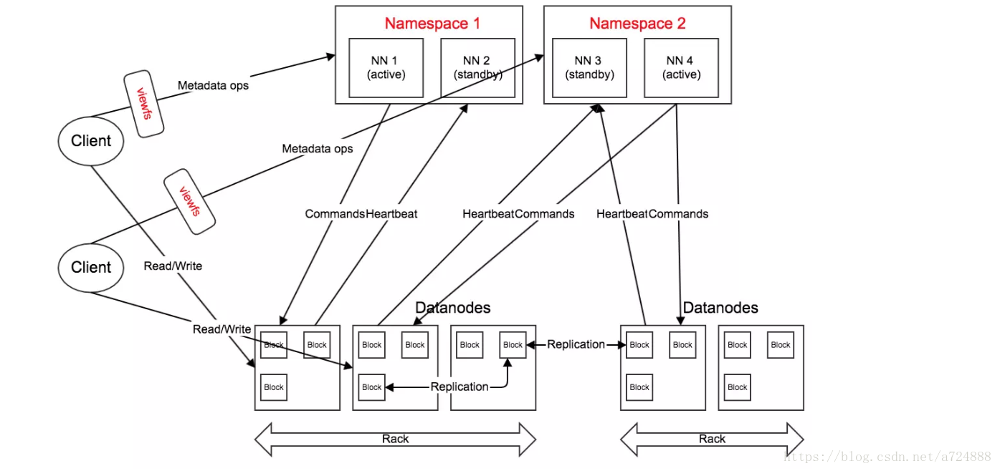
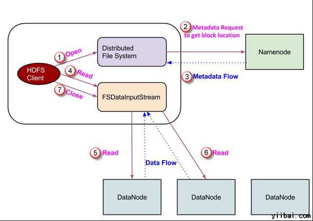
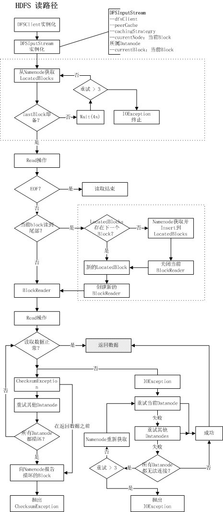
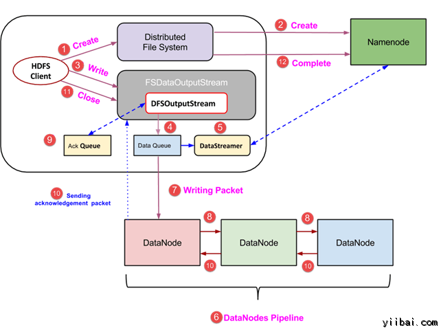
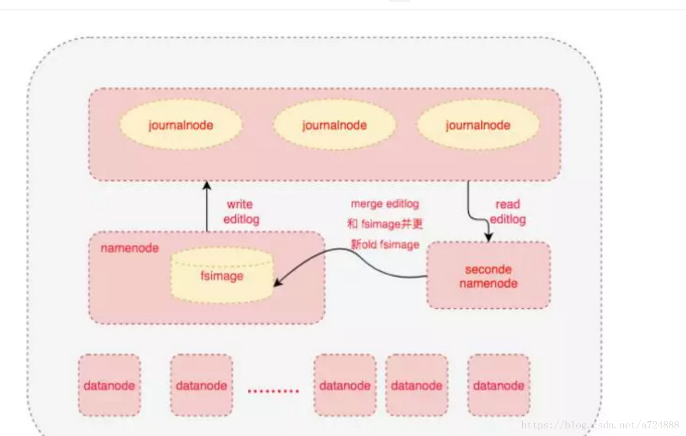

# Hadoop

[TOC]

## 1. 概述

### 1.1 什么是 Hadoop ？

Hadoop是一个开源框架，它允许在整个集群使用简单编程模型计算机的分布式环境存储并处理大数据。它的目的是从单一的服务器到上千台机器的扩展，每一个台机都可以提供本地计算和存储。 

本篇笔记记录的 hadoop 版本截止到 3.0.3。

**大数据解决方案**

在这种方法中，一个企业将有一个计算机存储和处理大数据。对于存储而言，程序员会自己选择的数据库厂商，如Oracle，IBM等的帮助下完成，用户交互使用应用程序进而获取并处理数据存储和分析。 

这种方式能完美地处理那些可以由标准的数据库服务器来存储，或直至处理数据的处理器的限制少的大量数据应用程序。但是，当涉及到处理大量的可伸缩数据，这是一个繁忙的任务，只能通过单一的数据库瓶颈来处理这些数据。 

谷歌使用一种称为MapReduce的算法谷歌解决了这个问题。这个算法将任务分成小份，并将它们分配到多台计算机，并且从这些机器收集结果并综合，形成了结果数据集。 

### 1.2 Hadoop 的架构

**在2.x以后，hadoop的体系结构主体有两部分：** 

- 加工/计算层(MapReduce)，以及
- 存储层(Hadoop分布式文件系统 HDFS)。

 

**MapReduce**

MapReduce是一种并行编程模型，用于编写普通硬件的设计，谷歌对大量数据的高效处理(多TB数据集)的分布式应用在大型集群(数千个节点)以及可靠的容错方式。 MapReduce程序可在Apache的开源框架Hadoop上运行。

**Hadoop分布式文件系统**

Hadoop分布式文件系统（HDFS）是基于谷歌文件系统（GFS），并提供了一个设计在普通硬件上运行的分布式文件系统。它与现有的分布式文件系统有许多相似之处。来自其他分布式文件系统的差别是显著。它高度容错并设计成部署在低成本的硬件。提供了高吞吐量的应用数据访问，并且适用于具有大数据集的应用程序。

除了上面提到的两个核心组件，Hadoop的框架还包括以下两个模块：

- Hadoop通用：这是Java库和其他Hadoop组件所需的实用工具。
- Hadoop YARN ：这是作业调度和集群资源管理的框架。

### 1.3 MapReduce 与关系型数据库的区别

|          | 关系型数据库 |   MapReduce    |
| -------: | :----------: | :------------: |
| 数据大小 |      GB      |       PB       |
| 数据读写 |   多次读写   | 一次写，多次读 |
| 横向扩展 |    非线性    |      线性      |

### 1.4 Hadoop 1.x 与 Hadoop 2.x

**HDFS 1.x**


主要角色：

- Namenode * 1

- 存储、管理元数据，包括文件信息、文件与数据块的映射。
- 处理与元数据相关的操作，如枚举路径、查看文件的逻辑大小等。
- 集群的协调者，如Datanode上下线、数据块的生命周期管理。

- Datanode * n

- 存储、管理数据块。
- 处理文件内容的读、写请求。

- Client * n

- 集群的使用者，通过具体的FileSystem访问集群（门面模式）。

**HDFS 2.x**

与HDFS 1.x相比，2.x新增了两个重要feature：HA、Federation。



角色变化如下：

- Namenode * 2k

- HA支持一个Active Namenode和一个Standby Namenode，以一个Namespace（或Nameservice）的形式对外服务。在active挂时，自动将将standby切换为新的active，旧的active恢复后成为standby。
- Federation将多个Namespace合并为一个视图，用户可通过viewfs访问。

- Datanode * n

- 所有节点共同对所有Namespace服务。在Datanode上，各Namespace拥有单独的目录（blockpool）。

- Client * n

- 2.x的Federation通过客户端挂载表实现，要通过ViewFileSystem访问NameNode。（这一点也算不上变化，多了一种门面而已）

HA大大加强了HDFS的可用性；Federation则将多个集群的视图合并在一起，方便用户使用。两个特性非常重要，HDFS 3.x在这两个feature上继续工作，如今HA以支持多standby，Federation支持服务器端路由。

### 1.5 Hadoop 3.x

HA以支持多standby，Federation支持服务器端路由。 

## 2. HDFS

Hadoop文件系统使用分布式文件系统设计开发。它是运行在普通硬件。不像其他的分布式系统，HDFS是高度容错以及使用低成本的硬件设计。

HDFS拥有超大型的数据量，并提供更轻松地访问。为了存储这些庞大的数据，这些文件都存储在多台机器。这些文件都存储以冗余的方式来拯救系统免受可能的数据损失，在发生故障时。 HDFS也使得可用于并行处理的应用程序。

**HDFS 的特点**

- 它适用于在分布式存储和处理。
- Hadoop提供的命令接口与HDFS进行交互。
- 名称节点和数据节点的帮助用户内置的服务器能够轻松地检查集群的状态。
- 流式访问文件系统数据。
- HDFS提供了文件的权限和验证。

**HGFS 的目标**

- 故障检测和恢复：由于HDFS包括大量的普通硬件，部件故障频繁。因此HDFS应该具有快速和自动故障检测和恢复机制。
- 巨大的数据集：HDFS有数百个集群节点来管理其庞大的数据集的应用程序。
- 数据硬件：请求的任务，当计算发生不久的数据可以高效地完成。涉及巨大的数据集特别是它减少了网络通信量，并增加了吞吐量。

### 2.1 HDFS 架构

下面给出是Hadoop的文件系统的体系结构。

 

HDFS遵循主从架构，它具有以下元素。

**名称节点 - NameNode**

NameNode可以被认为是系统的主站。它维护所有系统中存在的文件和目录的文件系统树和元数据 。具有名称节点系统作为主服务器，它执行以下任务：

- 管理文件系统命名空间。
- 规范客户端对文件的访问。
- 它也执行文件系统操作，如重命名，关闭和打开的文件和目录。

拥有大量文件的超大集群，内存成为瓶颈。所以可以用多个 NameNode 横向扩展，每个 NameNode 有自己管理的命名空间，并维护一个命名空间卷来存储，包括了命名空间元数据和一个数据块池。不同命名空间两两并不通信。

**数据节点 - DataNode**

 DataNode 作为从机，每台机器位于一个集群中，并提供实际的存储.。它负责为客户读写请求服务。 

- 数据节点上的文件系统执行的读写操作，根据客户的请求。
- 还根据名称节点的指令执行操作，如块的创建，删除和复制。

**块**

与磁盘文件系统相似，HDFS 的一个文件同样也有分块的概念，但是要大的多，默认为 128M。但是 1M 大小的文件存储在 128M 的块中时，它只会占用这个块 1M 的大小，而不是整个块。并且，一个文件的所有块可能存在不同的节点上（极端形况下，HDFS 可以只存一个文件，这个文件占满了所有块）。

> 块大小设计的比较大是为了减小寻址开销。块足够大的话，传输数据的时间会明显大于寻址开销，那么传输一个多个块的文件的开销就取决于磁盘传输速率。

对于频繁访问的块，可以显示设置块缓存，使其换缓存在内存中。默认情况下，文件的每个块只会缓存在一个Datanode 的内存中。那么让缓存的 Datanode 执行响应的任务就快得多。用户或应用可以配置给 Namenode 需要缓存哪些文件及缓存时间。

### 3.2 HDFS 读写操作

#### 3.2.1 读取

**java.net.URL 读取**

需要向 URL 注册 FsUrlStramHandlerFactory 实例，使之能解析 hdfs:// 文件系统

```java
public class URLCat {
    static {
        URL.setURLStreamHandlerFactory (new FsUrlStramHandlerFactory()); // 注册hdfs解析
    }
    
    public static void main(String[] args) {
        InputStream in;
        try {
            in = new URL(arg[0]).openStream();
            IOUtils.copyBytes(in, System.out, 4096, false);	// IOUtils 是 hadoop 的工具类
        }
        finally {
            IOUtils.closeStream(in);
        }
    }
}
```

**FileSystem API 读取**

```java
public class FileSystemCat {
    public static void main(String[] args) throw Exception {
        String uri = args[0];
        // 打开 uri 指定的文件系统
        FileSystem fs = FileSystem.get(URI.create(uri), new Configuration()); 
        InputStream in = null;
        try {
            in = fs.open(new Path(uri));	// 默认缓冲区大小 4KB
            IOUtils.copyBytes(in, System.out, 4096, false);
        }
        finally {
            IOUtils.closeStream(in);
        }
    }
}
```

`fs.open(new Path(uri))` 返回的是 FSDataInputStream，其继承了 DataInputStream，所以支持 seek(pos) 设置随机读位置。FSDataInputStream 也实现了 PositionReadable，支持从一个指定位置读取指定长度的 read() 方法。

#### 3.2.2 写入

FileSystem 类有一系列新建文件或目录的方法。最简单的是 

* create(path) ，返回一个新建文件的 FSDataOutputStream 对象。
* append(path)，返回追加文件的 FSDataOutputStream 对象。
* mkdir(path)，创建目录，返回布尔值标识是否创建成功。
* exists(path)，文件或目录是否存在

FSDataOutputStream 只支持顺序写入，不能任意位置写。

复制本地文件到 Hadoop 文件系统实例：

```java
public class FileCopy {
    public static void main(String[] args) throws Exception {
        String loadSrc = arg[0];
        String dst = args[1];       
        InputStream in = new BufferedInputStream(new FileInputStream(loadSrc));
        
        FileSystem fs = FileSystem.get(URI.create(dst), new Configuration);
        OutputStream out = fs.create(new Path(dst), new Progressable() {
            public void progress() {
                //进度报告
            }
        });
        
        IOUtils.copyBytes(in, out, 4096, true);  
    }
}
```

### 3.3 HDFS 核心类

#### 3.3.1 Configuration

org.apache.hadoop.conf.Configuration 是 Hadoop 的配置类。类似于 Jdk 的 Properties，但非线程安全。默认有两个默认配置文件： “core-default.xml” 和 “core-site.xml”。 addDefaultResource() 可以添加更多默认配置文件。最后读取的配置文件和设置的值会覆盖前面的值。

更多的配置类：

- HBaseConfiguration  额外增加默认配置文件 “hbase-default.xml” 和 “hbase-site.xml” 
- HdfsConfiguration 额外增加默认配置文件 “hdfs-default.xml” 和 “hdfs-site.xml” 
- YarnConfiguration  额外增加默认配置文件 “yarn-default.xml” 和 “yarn-site.xml” 

#### 3.3.2 FileSystem

这是 HDFS 的核心 API，我们通常使用它来操作 HDFS 文件系统。FileSystem 有多个子类，比如LocalFileSystem、FTPFileSystem、S3FileSystem，以及HDFS中最常用的 DistributedFileSystem，和HBase中的 HFileSystem 等。 

方法：

* *FileSystem get(Configuration conf)*：此方法将会导致，configuration额外的加载core、hdfs、mapred、yarn所有的配置文件，并根据 “fs.defaultFS” 配置项返回相应的文件系统：

  * 如果以“file://”开头，则返回LocalFileSystem实例，
  * 如果以“hdfs://”开头则返回DistributedFileSystem实例；其他的FileSystem类似。

  FileSystem 将使用 ServiceLoader 类加载 META-INF/services 目录下 “org.apache.hadoop.fs.FileSystem” 文件中指定的服务列表，列表中即为HDFS支持的文件系统。

* *void concat(Path target,Path[] srcs):*  将多个src文件“追加”到目标文件中，需要注意的是这个过程仅仅是blocks的逻辑移动，要求参与concat的文件都必须有相同的block大小。 

* *void copyFromLocalFile()/copyToLocalFile()*：将文件在local与remote之间互传 

#### 3.3.3 DistributedFileSystem 

HDFS文件系统的操作类，继承自 FileSystem。在 Hadoop 平台上，mapreduce、hbase等应用，都会使用此类操作 HDFS 文件系统。 DistributedFileSystem 在初始化时除了加载 “core-default.xml”、“core-site.xml”，还会实例化 HdfsConfiguration 并加载 “hdfs-default.xml”、“hdfs-site.xml” 配置文件。每个 DistributedFileSystem 内部，都会实例化一个 DFSClient 类，DFSClient 高度封装了文件系统的所有接口调用，并负责底层与 Datanode、Namenode 的 Socket 通讯。 

> **DFSClient** 
>
> 在DistributedFileSystem实例创建后，会执行一系列的初始化工作(initialize)，其中包括初始化DFSClient实例。 
>
> （1）**NameNodeProxies**：用来创建与远程Namenode通信的代理类，最终代理类使用合适的address(或者转义之后的address)与远端通讯，并在链接异常时负责重连或者Failover，在HA和non-HA模式下有所不同。 HA 模式下，可以在尝试连接 NameNode 一定次数 Failover 到下一个备用 NameNode 连接。non-HA 模式只有一个 NameNode，无法使用 Failover，这时可以开启 Retry 机制（默认关闭）。分别配置如下
>
> ```xml
> <!-- HA -->
> <property>    
>     <name>dfs.ha.namenodes.default</name>    
>     <value>com.namenode1,com.namenode2</value>    
> </property>   
> <property>    
>     <name>dfs.client.failover.proxy.provider.default</name>    
>     <value>org.apache.hadoop.hdfs.server.namenode.ha.
>         ConfiguredFailoverProxyProvider</value>    
> </property>
> 
> <!-- non-HA -->
> <property>    
>       <name>dfs.client.retry.policy.enabled</name>    
>       <value>true</value>    
> </property> 
> ```
>
> (2) **DomainSocket**：通常情况下，Client读取HDFS文件的过程是：Datanode根据blockId从本地磁盘获取文件并通过TCP流发送给Client；不过，HDFS提供了“Short-Circuit Local Reads”特性(Client与server端都需要支持)，即当Client与Block位于同一节点时，那么Client可以通过直接读取本地Block文件即可获取数据，无需通过Datanode TCP链接，这就是“Short-Circuit”(短路)，在很多情况下，这种方式可以有效提升读取性能。 
>
> ```xml
> <property>  
>     <name>dfs.client.read.shortcircuit</name>  
>     <value>true</value>  
> </property>  
> <property>  
>     <name>dfs.domain.socket.path</name>  
>     <value>/var/lib/hadoop-hdfs/dn_socket</value>  
> </property>
> ```

我们可以通过使用 DistributedFileSystem#open(Path path) 方法开打开一个文件，并获取其FSInputStream实例，此后我们即可以通过FSInputStream#read()方法依次读取文件数据。通过 FSInputStream#create/append() 新建文件和追加新的数据。

**DistributedFileSystem#open**

DistributedFileSystem#open(Path path) 方法接受一个参数bufferSize（默认4KB），并实例化一个DFSInputStream实例，DFSInputStream继承自FSInputStream，FSInputStream又继承自DataInputStream，它内部封装了实际的文件读取操作。

在实例化DFSInputStream时，首先由DFSClient向Namenode发送RPC调用，获取指定file的一定数量的Block位置，“Block位置”由LocatedBlocks类描述，它持有一个LocatedBlock对象的列表，每个LocatedBlock持有Block信息(blockId,poolId,offset起始)以及此Block被放置的Datanode列表；DFSClient初次并不获取所有Blocks位置信息，而是获取10个，这个参数可以由“dfs.client.read.prefetch.size”控制，默认为“10*blockSize”，此值建议为blockSize的整数倍。

**FSInputStream#read**

在整个 FSInputStream#read() 过程中，从Namenode获取的LocatedBlocks都会被cache在DFSClient中，当read到某个offset时，则会从LocatedBlock列表中遍历并获取持有此offset数据的LocatedBlock，如果不存在，则向Namenode重新获取并并插入到LocatedBlock列表的合适位置(保证顺序是按照offset排列)；每个LocatedBlock中Datanode列表的顺序有Namenode预先排列好的。

通常情况下，DistributedFileSystem实例在HDFS读操作中是线程安全的，我们不需要为每个file的读操作创建单独的DistributedFileSystem实例。不过在共享此实例时，在调用close方法之前，需要确定所有的文件读操作都已经结束，因为其内部将会关闭DFSClient实例。 

**FSOutputStream#create**

创建文件，此方法将返回一个DFSOutputStream，其内部只做了一件事：向Namenode发送RPC请求，并创建path有关的元数据。我们可以在创建文件时，指定blockSize、replication和Checksum算法，其中blockSize、checksum一旦指定将不能修改，replication此后可以随意调整。

create() 操作并不会触发实际的Block创建，Namenode也不会向Client返回与DataNodes Pipeline相关的信息；这些将会在有实际数据写入时延迟获取，请参见下文。

**FSOutputStream#append**

在文件尾部追加数据，此方法最终返回一个DFSOutputStream；append是HDFS唯一支持的“update”操作，我们不能对HDFS文件随机写入，这由HDFS架构的设计要求所决定。append方法与create不同的是，它将首先从Namenode上获取lastBlock的位置信息--LocatedBlock实例：它包含此Block所在的Datanodes列表以及offset等，那么此后的写入操作，将会从此Block开始。 

> ***DataStreamer***
>
> 无论是 create() 还是 append()，在创建 DFSOutputStream 实例时总会创建一个 DataStreamer 对象，它是一个守护线程，并在 DFSOutputStream 实例化后被start。在写入数据时，并不会触发实际的IO操作，DFSOuptStream 首先将数据 buffer 在 Client 端本地的缓存中，这个缓存的单位是Packet(数据包)，每个packet默认为64KB，当Packet负荷满时，将会把此packet添加到一个Queue中（底层实现为LinkedList，非阻塞）；DataStreamer 线程将从Queue中移除Packet，如果Queue为空则阻塞(wait，直到write操作将其notify)，并将packet写入到Pipeline中。
>
> **ResponseProcessor** 
>
> DataStreamer负责将Packet发送到Pipeline中，那么ResponseProcessor则负责等待Pipeline中的ACK信息；ResponseProcessor也是一个守护线程，并在Pipeline初始化是启动。当Queue中的Packet被DataStreamer移除后，将会被添加到一个ackQueue中，ackQueue就是Pipeline响应队列；DataStreamer负责向Pipeline中write数据，那么ResponseProcessor则负责从Pipeline中read数据；如果它接收到了ACK且状态为成功，那么将会从ackQueue移除packet，说明这个packet已经被Pileline中的Datanodes正确存储了。 
>
> **Datanodes Pipeline** 
>
> create方法将会导致pipeline的状态处于“PIPELINE_SETUP_CREAT”，append方法将会导致pipeline的状态为“PIPELINE_SETUP_APPEND”,DataStreamer线程启动后，将会根据此状态来初始化Datanodes pipeline。
>
> （1）“PIPELINE_SETUP_CREAT” 表明这是 create() 方法创建，此时将会向 Namenode 发送 addBlock 请求并创建当前文件的首个 Block，并返回此 Block 所在的 Datanodes 列表(有序)，Block 的创建涉及到 HDFS block 放置策略，如果 Client 部署在集群中的某个 Datanodes 上(例如 Mapreduce 程序)，那么将会优先在当前 Datanode 上创建block，否则将会根据统计信息选择一个“磁盘利用率”最低的节点。Client 将会与列表中第一个 Datanode 建立链接，并将 Datanodes 列表以及 block 信息通过 TCP 的方式发送出去，此过程为writeBlock；那么对于第一个 Datanode 而言(操作类为DataXceiver，Receiver)，将会解析出 Client 传递的Datanodes 列表，并与下一个 Datanode 建立TCP链接并将此数据原样传递下去(仍然是 writeBlock )，并且每个 Datanode 都会等待下一个节点反馈链接状态（ResponseStatus），最终将结果响应给 Client，此时Pipeline 构建成功。如果 Pipeline 构建过程中出现网络异常，那么 Client 将会 abandonBlock （放弃block），并继续重试上述过程；如果仍然失败，将会抛出 IOException。
>
> （2）“PIPELINE_SETUP_CREAT”表明这是有 append 方法创建，它和 “PIPELINE_SETUP_CREAT 的最大区别就是当前文件已经存在Block，因为它不能像create操作那样 “addBlock” 或者随意的 “abandonBlock”，而是根据 lastBlock 的信息构建Pipeline。构建过程基本相同，只不过在构建时如果某个 Datanode 失效，将会把此Datanodes 从 pipeline中 移除，并重新构建。这里还涉及到pipeline中Datanodes的排除策略、recovery机制等。过程及其复杂，源码阅读起来苦不堪言，在此就不多介绍。 
>
> （3） HDFS为了严格控制每个block的尺寸必须符合设定，那么有可能在临近block的尾部时，Client发送的packet并不是完整的(65526个字节)；Client在write数据时，每次都会比较block尾部剩余空间与Packet的大小，如果不足一个完整的packet，那么将创建一个和剩余空间一样大的Packet并写入，以确保block完整。因为内部设计的原因(其中包括checksum值为8字节数字)，那么要求blockSize的大小以及chunk的大小必须是8的倍数。
>
> 如果一个Packet是当前Block的最后一个Packet，那么当此Packet发送完毕之后，DataStreamer将会阻塞，直到ResponseProcessor获取了此前已发送的所有Packet的ACK响应为止，接下来关闭ResponseProcessor，并继续为下一个新的Block构建Pipeline。
>
> （4）每个Packet在创建时都会制定一个自增的ID，用来标记Client发送的packet序列，它可以帮助ResponseProcessor来判定ACK属于哪个packet，如果出现乱序，则会导致Client直接异常退出。
>
> （5）Pipeline中的每个Datanode在接收到数据后，保存并转发给下一个节点依次传递下去，每个Datanode都封装下一个节点返回的ACK状态并依次向上传递，只有Pipeline中所有的节点都保存成功(dfs.replication.min)，那么才能认定此次写入是正常的。如果某个datanode发生故障，那么将会导致pipeline被关闭，那些尚未发送成功的Packet将会添加到queue的顶端；正常的Datanodes将会对Block重新生成标识(重命名)，并发送给Namenode，这个动作就回导致那些故障的Datanodes上不完整的blocks将会在数据恢复(或心跳报告)后被删除。Client端将会从Pipeline中移除那些故障的Datanodes，并重建Pipeline，并重发Packets。因为Datanodes故障的原因，可能导致Block的replication不足，Namenode将会在稍后分配其他replication的创建。

### 3.4 HDFS 读写流程

#### 3.4.1 在HDFS读操作

数据读取请求将由 HDFS，NameNode和DataNode来服务。让我们把读取器叫 “客户”。下图描绘了文件的读取操作在 Hadoop 中。


1. 步骤1 - 步骤3：客户端启动通过调用文件系统  DistributedFileSystem  对象的 open() 方法发起读取请求。open() 方法使用 RPC 连接到 namenode 确定文件起始块的地址，并获取的文件的第一批块信息，然后返回持有这些块的 DataNode 列表（并按照距离从小到大排列）。一旦客户端接收到 DataNodes 的地址，open() 方法返回一个 FSDataInputStream 类型的一个对象。该对象包含了一个 DFSInputStream 对象，DFSInputStream（DFSClient） 负责与 DataNode 和 NameNode 通信。
2. 步骤4 - 步骤6：客户端调用 FSDataInputStream 的 read() 方法。 read() 方法与最近的可用 DataNode 通信获取数据。反复调用 read() 直到第一个块读取完成，DFSInputStream 关闭与此 DateNode 的通信，并从 NameNode 出获得下一批块的 DataNode 列表，继续读取。而这一切对客户端是透明的，只需要一直调用 read() 方法即可。
3. 一旦客户端已读取完成后，它会调用 close()方法。

下图描述了更详细的读路径：

 

#### 3.4.2 HDFS写操作

在本节中，我们将了解如何通过的文件将数据写入到 HDFS。


1. 步骤1 - 步骤2：客户端通过调用 DistributedFileSystem对象的 create() 方法，其使用 RPC 调用连接到 NameNode。NameNode 的首先责任是验证文件不存在和权限足够，否则抛出 IOException 到客户端，然后记录创建信息到INode 中。然后 DFSClient 生成一个 DFSOutputStream。形成 Pipeline 之前向 NameNode发送 AddBlock 请求 获取到 block 及其 DateNode 节点，依照节点顺序建立 pipeline。最后write 返回一个 FSDataOutputStream 对象。
2. 步骤3 - 步骤10：write() 方法写入的数据会封装成固定大小（默认64k）的 packet ，然后把 packet 放入 DataQueue 就返回。DataStreamer 会启动一个守护线程，用于消费 DataQueue。消费后的 packet 会放入 ackQueue，由ResponseProcessor 负责 packet 确认接收消息，并从 ackQueue 移除响应 packet。只有当所有的 DataNode 都得到了对应确认信息才算这个 packet 写入完成。
3. 步骤11 - 步骤12：在客户端的数据写入完成后，它会调用close()方法，会发送完所有的 packet 并得到 ack，然后告知 NameNode 块写入完成。

> **一致性**
>
> HDFS并不保证文件在新建后就能立即打开，也不能保证数据在写入后就能立即读取。只有当一个块整个都写完并通知到 Name‘Node 时，这个块中的数据才能对外可见。所有 HDFS 提供了 hflush() 方法，强行将当前所有数据信息通知给 NameNode 使之对外可见，但这些数据可能并没有保存在磁盘上，有些还在内存中，所以很容易发生丢失。HDFS 又提供了 hsync() 方法，在 hflush() 的基础上，强制刷新到磁盘上。响应的 hsync() 要消耗比 hflush() 更多的性能。

>**副本放置策略**
>
>第一个副本选择，客户端若是 DataNode 则选择此 DataNode，否则随机选择一个负载较低的。
>
>另外两个副本选择与第一个副本不同的一个机架的两个 DataNode 中。

#### 3.5.3 命令 -get 与 -put 流程

**get**

1. 解析 -get 命令，找到 copyToLocal 方法
2. 建立 HDFS 文件输入流。DistributedFileSystem#open()
3. 建立本地文件的输出流。本地文件系统的create() 方法。
4. IOUtils.copyBytes() 拷贝输入流到输出流。即输入流的 read() 方法与输出流的 write() 方法交替执行。直到 read() 完执行输入输出的 close() 方法。

**put**

1. 解析 -put 命令，找到 copyFileToTarget 方法。
2. 建立本地文件输入流。本地文件系统的open() 方法。
3. 建立 HDFS 文件的输出流。DistributedFileSystem#create() 方法。
4. IOUtils.copyBytes() 拷贝输入流到输出流。即输入流的 read() 方法与输出流的 write() 方法交替执行。直到 read() 完执行输入输出的 close() 方法。

### 3.5 HDFS 容错

**故障类型**

1. 节点宕机
2. 网络故障
3. 数据损坏

**故障检测**

节点检测：如DataNode 故障检测，DataNode 默认每 3 秒会发送心跳包给 NameNode，若超过一定时间（10分钟）没有收到 DataNode 的心跳，NameNode 就认为 DataNode 挂掉了。

通信检测：只要发送数据，接收方就会返回确认码，当几次尝试后仍然没收到验证码，就认为对方挂掉了。

数据检测：每次发送数据会同时发送校验和，对方收到后会验证校验和。每次存储时也会存储校验和。DataNode 会定期检验自己所有块的校验和，并将所有正确区块的信息报告 NameNode，NameNode 会和自己的记录信息比较，就可以知道 DataNode 的哪些数据块丢失了。

**写容错**

在 pipeline 写数据时，每个 DataNode 收到每个 packet 都要向客户端发送确认。如果客户端没有收到某个确认，就认为这个 DataNode 挂了，就会 pipeline 绕过此节点，这样就会导致备份数量减少，但是随后 NameNode 会处理并补上备份块。

**读容错**

读文件时，NameNode 会发送每个数据块的所有存储 DataNode 节点列表。当读一个节点失败会使用下一个节点失败。

**备份容错**

NameNode 保存了两张表：

1. 数据块列表，key 为每个数据块，value 为存有该数据块的 DataNode 列表。
2. DataNode 列表，key 为每个DataNode，value 为其上的数据库列表。

NameNode 会持续更新这两张表，如果某个数据块存在错误，会更新第一张表（删除块的错误DataNode）；如果时 DataNode 失效，会同时更新这两张表。

NameNode 会定期检查第一张表，当某个数据块的备份数量不足时进行备份补足。

### 3.6 HDFS 高可用（HA）


从上图中我们可以看到，启动的时候，主备选举是利用 zookeeper 来实现的， hdfs  namenode节点上的 ZKFailoverController 进程， 主要负责控制主备切换，监控 namenode进程是否还活着， 连接 zookeeper进行选举，并且控制本机的 namenode 的行为，如果发现zookeeper的锁节点还没有被抢占创建，就创建锁节点，并把本机的 namenode 变成 active 节点， 如果发现锁节点已经创建，就把 本机的namenode变成standby节点。

如果 ZKFailoverController 发现本机的 namenode 已经挂掉了， 就删除zookeeper上的节点，standby 上的ZKFailoverController感知到删除事件， 就升级本机的namenode成为主节点。

如果 active节点超过 Zookeeper Session Timeout 参数配置的时间没有连接 zookeeper， 同样被认为主节点已经挂了， standby 节点也会升级成为主节点。

**HDFS 的主备切换**



与单机文件系统相似，HDFS对文件系统的目录结构也是按照树状结构维护，Namespace保存了目录树及每个目录/文件节点的属性。除在内存常驻外，这部分数据会定期flush到持久化设备上，生成一个新的FsImage文件，方便NameNode发生重启时，从FsImage及时恢复整个Namespace。

上图我们可以看到基于 journalnode 进行共享元数据，  jounalnode中保存着 editlog，也就是对文件元数据的操作日志，比如用户（hdfs dfs rm /a.txt）删除一个文件， 就产生了一条操作日志，作用到命名空间后，a.txt 这个文件就被干掉了，这个日志就类似于数据库中的 redo 日志， standby节点 周期性的从journalnode中拉取 editlog， 然后从上一次checkpoint的位置开始重放，在内存中将操作结果合并到老的fsimage（命名空间），  并更新checkpoint位置。 最后把合并后的fsimage 上传到 active namenode 保存替换老的fsimage文件，

NameNode 处于 active和standby状态时候，扮演的角色是很不同的，

- active 角色， 把用户对命名空间的操作作为 editlog 写入 journalnode 集群
- standby 角色，EditLogTailer 线程 从 journalnode 上拉取 editlog日志， StandbyCheckpointer 线程把 editlog合并到 fsimage， 然后把 fsimage 文件上传到 active namenode 节点

active 挂的时候，  standby 感知后， 转换为 active 角色， 生成一个新的 epoch（就是每次主备切换就加一， 表明现在谁是老大，在谁的任期内），因为 standby 是阶段性拉取 editlog的，所以肯定最新的一段editlog还没有作用于 fsimage， 需要拉取重放， 因为写 editlog 到 journal的时候， 只要大多数（比如总5个点，要成功写入3个点，总共3个点，要成功写入2个点）写入成功就认为成功了， 这样在拉取恢复的时候，各个journalnode 节点上的数据有可能不一致， 这时候就必须找到大多数里面 事务id最大的点作为基准， 这个事务id就类似于数据库中的 Log sequence number（简称LSN）， 简单来讲， 就是要把 上一次checkpoint 的（LSN） 到 redo 日志里面最大的 （LSN）这之间的 日志进行重放redo，合并到fsimage。

假设一种情况，  老的active节点，是因为网络问题，连接不上 zookeeper， 然后被认为已经死了，其实是假死，这时候网络恢复了， 还认为自己是 leader， 往 journalnode里面写editlog日志， 发现现在已经是别人的天下了（epoch number已经加1了），自己的epoch number已经过时了，就把自己降级为 standby，做standby 角色该干的事情。

为什么要在 secondnamnode 上合并， 主要是为了减轻 namenode的压力， namenode有很多其他的事情要干呢。

**操作验证上述流程**

- hadoop-daemon.sh start journalnode， 启动  journalnode 集群，会根据你配置文件里面配置的机器上去启动 journalnode 集群
- hdfs namenode -format，  格式化 namenode 命名空间
- hadoop-daemon.sh start namenode，nn1 上启动 namenode
- hdfs namenode -bootstrapStandby，  nn2 同步nn1的元数据信息， 会把主节点上的 fsimage editlog目录拷贝过来
- hadoop-daemon.sh start namenode，  nn2 上启动 namenode
- 启动 zk 集群  hdfs zkfc -formatZK 格式化 zkfc zk 中的目录  hadoop-daemon.sh start zkfc   各个namenode节点上启动dfszk failover controller, 先在哪台机器上启动，哪台就是active namenode
- hadoop-daemon.sh start datanode 上传文件 测试 读写文件
- 测试  ha 将 active namenode进程kill，    jps  进程号， kill，    将active namenode机器断开网络  service network stop

我们对集群进行以上的测试， 观察日志，会发现hdfs干的事情基本上就是前面描写的流程。

## 3. MapReduce

MapReduce是一种处理技术和程序模型基于Java的分布式计算。 MapReduce算法包含了两项重要任务，即Map 和 Reduce。Map采用了一组数据，并将其转换成另一组数据，其中，各个元件被分解成元组(键/值对)。其次，减少任务，这需要从Map 作为输入并组合那些数据元组成的一组小的元组输出。作为MapReduce暗示的名称的序列在Map作业之后执行reduce任务。

MapReduce主要优点是，它很容易大规模数据处理在多个计算节点。下面MapReduce模型中，数据处理的原语被称为映射器和减速器。分解数据处理应用到映射器和减速器有时是普通的。但是编写MapReduce形式的应用，扩展应用程序运行在几百，几千，甚至几万机集群中的仅仅是一个配置的更改。这个简单的可扩展性是吸引了众多程序员使用MapReduce模型。

### 3.1 再谈配置

上一章简单介绍了配置类，这节来详细描述配置的使用和设置。

**命令行配置文件的读取**

hadoop 命令默认会从 HADOOP_CONFIG_DIR 或 （前者没配置）HADOOP_HOME/etc/hadoop 目录下加载核心配置文件 core-site.xml，也可以在命令行指定核心配置文件：

```sh
hadoop -conf ./xxx.xml
```

**应用内配置文件的读取**

```java
Configuration.addDefaultResource("anothor-default-config.xml");// 会直接加载到配置。

Configuration conf = new Configuation(); // 已完成默认配置
conf.addResource("anothor-config.xml"); // 加载配置到当前配置对象
```

**应用内执行命令行命令**

Hadoop 提供了 GenericOptionsParser 解析常用的 hadoop 命令。但通常不直接使用，更方便的是实现 Tool 接口，通过 ToolRunner 来运行应用程序，在其内部调用 GenericOptionsParser。

```java
// Tool 继承了 Configuable，Configured 实现了 Configuable
public class ConfiguarionPrinter extend Configured implements Tool { 
    static {
    	Configuration。addDefaultResource("hdfs-default.xml");
        Configuration。addDefaultResource("hdfs-site.xml");
    }
    
    @Override
    public int run(String[] args) {
        //命令执行完，自定义输出
    }
    
    public static void main(String[] args) {
        int exitcode = ToolRunner.run(new ConfiguarionPrinter(), args);
        System.exit(exitcode);
    }
}
// 命令行运行
// hadoop ConfiguarionPrinter -conf xxx.xml
// hadoop ConfiguarionPrinter -Dkey=value
```

**启动 mapreduce 任务**

```
# 首先打包 mapreduce 程序为 jar， 依赖的库存放在 jar/lib 中

# 命令行运行 <ClassName> jar 内的全限定名
hadoop jar xxx.jar <ClassName> <input> <output>
# 也可以用 HADOOP_CLASSPATH=xxx.jar 指定默认 jar
hadoop <ClassName> <input> <output>
```

### 3.1 MapReduce 流程

- MapReduce计划分三个阶段执行，即映射阶段，shuffle阶段，并减少阶段。
  - 映射阶段：映射或映射器的工作是处理输入数据。一般输入数据是在文件或目录的形式，并且被存储在Hadoop的文件系统（HDFS）。输入文件被传递到由线映射器功能线路。映射器处理该数据，并创建数据的若干小块。
  - 减少阶段：这个阶段是：Shuffle阶段和Reduce阶段的组合。减速器的工作是处理该来自映射器中的数据。处理之后，它产生一组新的输出，这将被存储在HDFS。
- 在一个MapReduce工作，Hadoop的发送Map和Reduce任务到集群的相应服务器。
- 框架管理数据传递例如发出任务的所有节点之间的集群周围的详细信息，验证任务完成，和复制数据。
- 大部分的计算发生在与在本地磁盘上，可以减少网络通信量数据的节点。
- 给定的任务完成后，将群集收集并减少了数据，以形成一个合适的结果，并且将其发送回Hadoop服务器。

**MapReduce 流程图示**

假设有以下的输入数据到 MapReduce 程序，统计以下数据中的单词数量：

Welcome to Hadoop Class

Hadoop is good

Hadoop is bad


**详细过程**

1. 映射每个分割输入
2. Map任务输出结果到本地磁盘的个节点上。（主要因为任务完成，映射输出就可以扔掉了）
3. 若有节点故障，Hadoop 重新运行另一个节点在映射上的任务，并重新创建的映射输出
4. 每个 Map 任务的输出在每个机器输出合并，然后传递到用户定义的 Reduce 函数 
5. Reduce 输出存储在 HDFS

### 3.2 MapReduce 协调工作

完整的执行流程（执行 Map 和 Reduce 任务）是由两种类型的实体的控制，称为

1. JobTracker：协调任务在不同的数据节点上运行
2. TaskTracker：周期性发送心跳给 JobTracker 报告任务状态。

### 3.2 输入和输出（Java透视图）

MapReduce框架上的<key, value>对操作，也就是框架视图的输入工作作为一组<key, value>对，并产生一组<key, value>对作为作业的输出可以在不同的类型。

键和值类在框架连载的方式，因此，需要实现接口。此外，键类必须实现可写，可比的接口，以方便框架排序。MapReduce工作的输入和输出类型：（输入）<k1, v1> ->映射 - ><k2, v2>-> reduce - ><k3, v3>（输出）。

|        | 输入           | 输出            |
| ------ | -------------- | --------------- |
| Map    | <k1, v1>       | list (<k2, v2>) |
| Reduce | <k2, list(v2)> | list (<k3, v3>) |

# 附录

## 1. Hadoop 安装

### 1.1 单机安装

**准备工作**

添加 hadoop 用户和 hadoop 用户组

```sh
sudo groupadd hadoop	# 新建hadoop组
sudo useradd -g hadoop hadoop	# 新建hadoop用户，并设置主用户组hadoop
sudo passwd hadoop # 设置密码
```

授权 ssh 免密，authorized_keys 的所有者和所属组都要是hadoop

```sh
su hadoop	# 切换用户
ssh-keygen -t rsa -P ""	# 创建密钥
cat /home/hadoop/.ssd/id_rsa.pub >> /home/hadoop/.ssh/authorized_keys # 授权ssh免密
```

官网下载一个hadoop的编译版，如

```sh
wget http://www-us.apache.org/dist/hadoop/common/hadoop-3.0.3/hadoop-3.0.3.tar.gz #下载

# 解压后，将hadoop的bin目录添加到PATH中
```

在`$HADOOP_HOME/etc/hadoop/hadoop-env.sh ` 文件中修改或添加

```sh
export JAVA_HOME = <JAVA安装目录>
```

**配置 Hadoop**

在 `$HADOOP_HOME/etc/hadoop/core-site.xml` 文件中有两个参数需要设置： 

```xml
<configuration>
	<property>
        <name>hadoop.tmp.dir</name>
        <value>/app/hadoop/tmp</value> <!-- 设置存储数据文件的目录，建议 750 权限 -->
        <!-- 上面的目录最终会是 $HADOOP_HOME/etc/hadoop/app/hadoop/tmp -->
        <description>Parent directory for other temporary directories.</description>
    </property>
    <property>
        <name>fs.defaultFS </name>
        <value>hdfs://localhost:54310</value> <!-- 设置默认的文件系统 -->
        <description>The name of the default file system. </description>
    </property>
</configuration>
```

**配置 MapReduce**

创建 `/etc/profile.d/hadoop.sh` 并赋给执行权限 `sudo chmod a+x /etc/profile.d/hadoop.sh`

```sh
export HADOOP_HOME=/usr/local/installed/hadoop-3.0.3 # 也可以在 Hadoop-env.sh 中配置
```

复制文件 `$HADOOP_HOME/etc/hadoop/mapred-site.xml.template`

```sh
sudo cp $HADOOP_HOME/etc/hadoop/mapred-site.xml.template $HADOOP_HOME/etc/hadoop/mapred-site.xml
```

在 `$HADOOP_HOME/etc/hadoop/mapred-site.xml` 文件中添加或修改

```xml
<property>
    <name>mapreduce.jobtracker.address</name>
    <value>localhost:54311</value> <!-- 设置jobtracker -->
    <description>MapReduce job tracker runs at this host and port.</description>
</property>
```

在 `$HADOOP_HOME/etc/hadoop/hdfs-site.xml ` 文件中添加或修改

```xml
<property>
    <name>dfs.replication</name>
    <value>1</value> <!-- 副本数量 -->
    <description>Default block replication.</description>
</property>
<property>
    <name>dfs.datanode.data.dir</name> 
    <!-- datanode 目录 -->
    <!-- 需要创建并更改用户和组为hadoop，并给与750权限 -->
    <value>/home/hadoop/hdfs</value> 
</property>
```

**格式化HDFS**

在第一使用 Hadoop 之前，需要先格式化 HDFS，使用下面的命令 

```sh
$HADOOP_HOME/bin/hdfs namenode -format
```

**启动/停止单节点集群**

使用hadoop用户启动 / 停止

```sh
$HADOOP_HOME/sbin/start-dfs.sh
$HADOOP_HOME/sbin/start-yarn.sh
$HADOOP_HOME/sbin/stop-dfs.sh
$HADOOP_HOME/sbin/stop-yarn.sh
```

## 2. 常用命令

HDFS 命令基本与 linux 命令行相同，`./hdfs dfs ` 与 ` ./hadoop fs` 相同

```
./hdfs dfs -help ls		# 显示命令帮助
./hdfs dfs -ls[r] [<dir/file>]		# r 递归显示
./hdfs dfs -du	[<dir/file>]		# 文件大小
./hdfs dfs -mv <cur> <dest>
./hdfs dfs -cp <sour> <dest>
./hdfs dfs -rm[r] <dir/file>		# r 递归删除
./hdfs dfs -put <local> <remote>
./hdfs dfs -copyFromLocal <local> <remote>
./hdfs dfs -moveFromLocal <local> <remote>
./hdfs dfs -get [-ignoreCrc] <remote> <local>
./hdfs dfs -copyToLocal [-ignoreCrc] <remote> <local>
./hdfs dfs -moveToLocal [-ignoreCrc] <remote> <local>
./hdfs dfs -getmerge <remote> <local> 	# <remote> 的多个文件合并成一个文件输出到本地
./hdfs dfs -cat <file>
./hdfs dfs -mkdir <dir>
./hdfs dfs -touchz <file>
./hdfs dfs -cat <file> | grep <data>
```

## 3. JAVA API

### 3.1 Mapper

Mapper 需要继承 org.apache.hadoop.mapreduce.Mapper，需要实现的核心方法 map() 。
如果使用默认的 TextInputformat 和 FileInputformat 则 KIN, VIN 必须是 LongWriteable 与 Text。

```java
public class E_EMapper extends Mapper<LongWritable , Text, Text, IntWritable> {  
      
      @Override
      public void map(LongWritable key, Text value, Context context) 
          						throws IOException, InterruptedException {

         context.write(key,value); 
      } 
   } 
```

map的参数中，Key 和 Value 的值由 Job 传入的 InputFormat 实现类决定，以下为 InputFormat  接口：

```java
public abstract class InputFormat<K, V> {
    
    // 将文件分片并返回分片列表，每个分片将分给一个 Mapper
    // 每一个分片类似于这样一个元组 <input-file-path, start, offset>
  	public abstract List<InputSplit> getSplits(
      				JobContext context ) throws IOException, InterruptedException; 
    
    // 解析 Key，Value 给 Mapper, Key 一般为起始字符长度便宜量
  	public abstract RecordReader<K,V> createRecordReader(
      				InputSplit split, TaskAttemptContext context 
    				) throws IOException, InterruptedException;
}
```

常用的有 InputFormat 实现类有

* FileInputFormat  将文件逻辑分片，每片交给一个 Mapper。默认大于块大小（64M）就会分片。跨越同步标识的片将分给前一个片。解析的 Value 为整片。

* TextInputFormat 继承自  FileInputFormat ：记录结束的同步标识为换行符，所以解析的 Value 为整行。

* NLineInputFormat：以固定行数为 Value，通过 mapreduce.input.lineinputformat.linespermap 指定 N

* KeyValueTextInputFormat：前三个输入格式 key 都是偏移，一般不会特别有用。KeyValueTextInputFormat 通过 mapreduce.input.keyvaluelinerecorder.key.value.separator 指定分隔符，解析出 Key、Value。

  

### 3.2 Reducer

Reducer 也需要继承 org.apache.hadoop.mapreduce.Mapper，需要实现的主要方法 reduce() ：

```java
public class MyReducer extends Reducer<Text, IntWritable, Text, IntWritable> {

        public void reduce(Text key, Iterator<IntWritable> values,Context context) 
            							throws IOException, InterruptedException {

            
        }
    }
```

