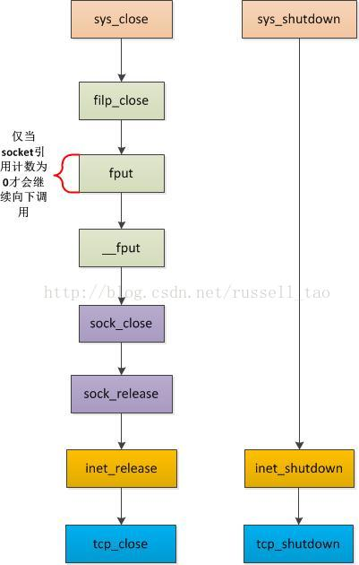
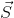
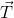

# 计算机网络

## 1. 概述

### 1.1 网络体系结构

 

### 1.2 数据在各层之间的传递过程

 

### 1.3 TCP/IP

它只有四层，相当于五层协议中数据链路层和物理层合并为网络接口层。

现在的 TCP/IP 体系结构不严格遵循 OSI 分层概念，应用层可能会直接使用 IP 层或者网络接口层。

 

TCP/IP 协议族是一种沙漏形状，中间小两边大，IP 协议在其中占用举足轻重的地位。

## 2. 应用层

### 2.1 HTTP

`HTTP`是超文本传输协议的缩写，是基于`TCP/IP`通信协议来传输数据。

**HTTP1.1新增**

1. 长连接，并默认启用，即当`Connection`字段为`Keep-Alive`时，Response后不会立即关闭而是会等待一段时间。
2. `HOST`域，且必须传送，不传送会报400错误
3. `Range`域，表示只请求资源的一个部分，其值为请求的长度范围或位置，即可以据此实现断点续传功能，服务器增加了`Content-Range`标明了这次传送的范围和总长度。
4. `Cache-Control`域，针对的是`HTTP1.0 Expire`由于服务器和客户端时间不一致导致的问题

**HTTP2将新增**

1. 多路复用请求；
2. 对请求划分优先级；
3. 压缩HTTP头；

**特点**

无状态，所以应答快。   
`HTTP1.0`使用非持续连接，`HTTP1.1`使用持续连接，一个连接可以传送多个`Web`对象。
`HTTP1.0`只有`GET`、`POST`、`HEAD`三种请求类型，其他请求都是`HTTP1.1`新增的。

**HTTP工作流程**

一般为四个步骤：

1. 用户点击超链接或浏览器直接访问
2. 客户端主动向服务器建立TCP连接并发送Request给服务器
3. 服务器接收请求并发送Response给客户端，若connection模式为close则立即关闭TCP，若为Keepalive则会等待一段时间再关闭
4. 客户端接收消息并显示

**HTTP之Request**

`Request`报文分为四个部分：

第一部分：请求行，包括请求类型，URI，协议版本    
第二部分：请求头部，用来说明服务端要使用的附加信息，如HOST，User-Agent，Content-Type、Content-Length、Accept，Refer，Accept-Encoding，Accept-Language   
第三部分：空行
第四部分：正文

**HTTP之Response**

`Response`报文分为四个部分：

第一部分：响应行，包括协议版本，状态码，状态消息    
第二部分：响应头部，用来说明客户端要使用的附加信息，如Date，Content-Type、Content-Length
第三部分：空行
第四部分：正文

**HTTP之状态码**

1xx：指示信息--表示请求已接收，继续处理   
2xx：成功--表示请求已被成功接收、理解、接受    
3xx：重定向--要完成请求必须进行更进一步的操作  
4xx：客户端错误--请求有语法错误或请求无法实现   
5xx：服务器端错误--服务器未能实现合法的请求   

常用的：   
200 Ok //成功   
400 Bad Request //请求语法有错   
403 Forbidden  //服务器收到请求，但拒绝服务   
404 Not Found   //请求资源不存在    
500 Internal Server Error  //服务器未知错误   
503 Server Unavailable   //服务不可用，一段时间后可能恢复正常   

**HTTP之请求方法**

HTTP1.0定义了三种请求方法：`GET`、`POST`和`HEAD`方法。   
HTTP1.1新增了五种请求方法：`OPTIONS`、`PUT`、`DELETE`、`TRACE`和`CONNECT`方法。

- GET 请求页面信息，参数位于URL后
- POST 请求页面信息，参数位于请求Body中
- HEAD 同GET，但只返回请求头
- PUT 添加或更新数据
- DELETE 删除数据
- TRACE 回显请求，主要用于测试或诊断
- CONNECT HTTP1.1预留方法，打算用于管道代理服务器
- OPTIONS 请求服务端可以接受的其他请求方法

**HTTP之缓存**

强制缓存，`HTTP1.0`通过`Expires`完成，`HTTP1.1`通过`Cache-Control`完成，当`Cache-Control`为`max-age=XXX`时，客户端会计算这个时间加上第一次资源请求的时间是否超时，没超时就直接命中缓存。（Expires直接指定一个GMT格式的绝对时间做为过期时间，这样做会有服务器和客户端时差问题。）

协商缓存，由服务器根据`request`的`If-Modified-Since`(客户端根据服务端的`Last-Modified`产生)和`If-None-Match`(客户端根据服务端的`ETag`产生)自己判断是否让客户端使用缓存（返回304），或直接返回资源（返回200）.

## 3. 传输层

### 3.1 TCP

#### 3.1.1 报文格式

 

#### 3.1.2 TCP的建立

**TCP建立的完整过程**

假设A与B之间建立`TCP`连接，A为主动方（客户端），主动向B（服务端）发起连接。

连接建立：

A（`CLOSED` -> `SYN_SEND`）发出`SYN`、`SEQ`给B   
B（`LISTEN` -> `SYN_RCVD`）接收到SYN后，发送`SYN`、`ACK`、`SEQ`给A   
A（`SYN_SEND` -> `ESTABLISHED`）接收到`SYN`后，发送`ACK`、`SEQ`给B   
B（`SYN_RCVD` -> `ESTABLISHED`）接收到`ACK`后，连接建立完成   

A状态变化：`CLOSED` -> `SYN_SEND` -> `ESTABLISHED`   
B状态变化：`CLOSED` -> `SYN_RCVD` -> `ESTABLISHED`

特殊情况：连接建立的过程中，A发送完`SYN`后，进入`SYN_SEND`的状态，B有可能在接收`SYN`之前，也想主动建立连接而发送`SYN`给A，B也进入`SYN_SEND`状态，此后的状态转换为A和B在收到`SYN`后都由`SYN_SEND`状态转换为`SYN_RCVD`状态，并发送相应信息，然后正常建立连接。

> **DDOS 攻击之 SYN FLOOD 攻击**
>
> 利用三次握手中的半连接状态，迫使服务器存在大量的半连接而没有法办继续创建其他连接，进而拒绝服务。半连接的存在是因为攻击者伪造 ip 发起握手，服务器将数据包回应给真实的 ip 完成第二次握手，由于真实 ip 并没有发起握手，所以会忽略该数据包，此时服务器就一直得不到下一次握手（直到重试超时），而半连接会占用 TCB（TCP Control Block ），而每个服务器的 TCB 是有有限的，当达到上限就会拒绝新的连接。
>
> 解决方法一：当 TCB 满时，清除最旧的半连接。缺点是有可能关闭的是真正的连接。（比如有时真的存在大量访问）
>
> 解决方法二：延迟分配 TCP，完成二次握手的链接先将信息保存起来，等到第三次握手来时才分配 TCB。

连接断开：

A（`ESTABLISHED` -> `FIN_WAIT_1`）A发送`FIN`、`SEQ`给B   
B（`ESTABLISHED` -> `CLOSE_WAIT`）B接收到`FIN`后，很可能手头还有任务，所以先进入`CLOSE_WAIT`状态，同时发送`ACK`、`SEQ`给B   
A（`FIN_WAIT_1` -> `FIN_WAIT_2`）A收到`ACK`   
B（`CLOSE_WAIT` -> `LAST_ACK`）B手头任务完成后，发送`FIN`、`SEQ`给A   
A（`FIN_WAIT_2` -> `TIME_WAIT`）A接收到`FIN`后，发送`ACK`、`SEQ`给B，A不会立即`CLOSED`因为B收到最后这条消息需要时间，因要保证它们同时关闭   
B（`LAST_WAIT` -> `CLOSED`）B收到`ACK`，进入`CLOSED`状态   
A（`TIME_WAIT` -> `CLOSED`）A等待一段时间，确认B不会再发信息后，进入`CLOSED`状态。连接断开完成。   

A状态变化：`ESTABLISHED` -> `FIN_WAIT_1` -> `FIN_WAIT_2` - > `TIME_WAIT` -> `CLOSED`   
B状态变化：`ESTABLISHED` -> `CLOSE_WAIT` -> `LAST_ACK` -> `CLOSED`

特殊情况，A和B同时发出FIN信号，即A和B可能在FIN_WAIT_1状态收到FIN，这时直接进入CLOSED状态关闭连接就可以了。

**为什么需要三次握手，两次可以吗？**

两次握手可能会导致错误打开连接。比如，主动方发送连接请求后，请求阻塞在网络很长时间没有到达对方，然后请求方放弃了连接请求，而过了一段时间这个请求又到达了对方，由于两次握手，对方认为连接建立，而此时请求方已经不存在了，就造成了对方的资源浪费。三次握手可以很大程度上保证，连接时双方都在线。

**为什么需要四次挥手？**

FIN_WAIT_2 状态的存在是因为被动关闭方还需要处理资源，还不想关闭，主动关闭方在等待对方发送FIN请求。所以 FIN_WAIT_1 表示的是主动关闭方不需要在传数据了，正在告诉对方这条信息（未收到确认）。而一般对方收到 FIN 数据包后，无论处于何种状态都应该尽快回复 ACK，所以 FIN_WAIT_1 一般很少长时间存在。FIN_WAIT_2 状态就表示对方已经直到自己不再发送数据了，但是对方仍可能还会发送数据过来。

**TIME_WAIT 存在的意义**

1）为了实现TCP全双工的安全释放

假如主动关闭方发送的最后ACK连接在传输中丢失了，那么被动方会重发FIN，这是主动关闭方如果没有等待TIME_WAIT，而是直接关闭了，TCP就会使用RST回应，那么被动方就会认为发生了错误而关闭。而实际上只是正常的关闭过程。

2）为了使旧的数据包在网路中因过期而消失

由于（local_ip, local_port, remote_ip,remote_port）四元组可标识一条TCP连接，若没有TIME_WAIT，主动关闭方关闭后立即创建了一个四元组相同的新连接，此时假设网络中存在之前被动方发送的未达数据包（比如重传成功之前的数据包），这时若新连接收到这些不属于它的旧数据上传到应用层就可能发生一些奇怪的异常现象。

**TCP 关闭之 CLOSE 与 SHUTDOWN**

下面是操作系统 sys_close 与 sys_shutdown 的关闭过程。

可以看到 close 会监测 sokcet 引用计数，只有引用计数为 0 才进入下面的关闭流程，而这个引用计数就是有多少进程持有这个 socket。所以 close 在多进程下是当所有持有连接的进程都调用了 close 才会进入连接；而 shutdown 则是无论运行环境如何，只要调用了就会试图去关闭连接。所以得出区别一。

**区别一：** close() 在单线程和多线程中行为一致，而在单进程和多进程环境中行为不一致，只有当进程共享的同一个 socket 都条用了 close() 才会真正去关闭连接。而 shutdown() 则无论环境如何，只有调用就会试图去按需（关闭读或写）关闭连接。

TCP连接的关闭过程有两种，一种是优雅关闭（graceful close），一种是强制关闭（hard close 或 abortive close）。所谓优雅关闭是指，如果发送缓存中还有数据未发出则其发出去，并且收到所有数据的ACK之后，发送FIN包，开始关闭过程。而强制关闭是指如果缓存中还有数据，则这些数据都将被丢弃，然后发送RST包，直接重置TCP连接。 

shutdown() 可以设置参数指定关闭读，关闭写或同时关闭读写。

* 关闭读时，如果当前接收缓存中仍有未取出数据或者以后再有数据到达，则TCP会向发送端发送RST包，将连接重置。 
* 关闭写时，TCP会将发送缓存中的数据都发送完毕并收到所有数据的ACK后向对端发送FIN包，表明本端没有更多数据发送。这个是一个优雅关闭过程。 
* 同时关闭读写，则会先查看接收缓冲区时候是有数据，若有直接发送 RST。否则再执行关闭写的操作。

close() 时会隐含触发 TCP 连接的同时关闭读写过程，然后关闭连接句柄。具体是优雅的关闭还是强制关闭取决于 SO_LINGER  选项。

* 当 SO_LINGER  关闭时，close() 会立即返回。如果此时缓冲区中有未发送数据，则系统会在后台将这些数据发送完毕后关闭TCP连接，是一个优雅关闭过程，但是这里有一个副作用就是socket的底层资源会被保留直到TCP连接关闭，这个时间用户应用程序是无法控制的。 
* 当 SO_LINGER  打开，但 l_linger 为 0。close() 也会立即返回并关闭句柄。但是如果此时缓冲区中有未发送数据，TCP会发送RST包重置连接，所有未发数据都将丢失，这是一个强制关闭过程。 
* 当 SO_LINGER  打开，但 l_linger 非 0。close() 会阻塞。此时如果缓冲区中有未发送数据，如果TCP在l_linger表明的时间内将所有数据发出，则发完后关闭TCP连接，这时是优雅关闭过程；如果如果TCP在l_linger表明的时间内没有将所有数据发出，则会丢弃所有未发数据然后TCP发送RST包重置连接，此时就是一个强制关闭过程了。 

**区别二：**close() 会关闭连接句柄，shutdown 仅仅关闭连接，并且可以选择关闭读或写。

#### 3.1.3 TCP运行机制

**滑动窗口**

滑动窗口协议是接收方控制流量额一种措施，主要防止发送方发送的数据太多而自己接收不过来。具体是接收方每次回复确认报文时，除了确认号外还会带上接收串口大小，当接收方接收到此报文时就可以直到最多可以发送多少报文，比如接收到6大小的接收窗口，而已经发送的报文还有2个还没确认，那么此时最多只能发送6-2个报文。

**计时器**

TCP有四种计时器：重传计时器，

重传计时器：每当发送一个报文启动一个重传计时器，收到确认报文时取消，当计时器到时后仍未收到确认报文，便启动重传，并重新计时。   
坚持计时器：每当发送方收到一个零窗口通告后启动，计时结束后重新询问接收方的接收窗口大小。为了避免接收方在之后有了接收报文能力而发送一个非零窗口通告给发送方，不幸的是该报文丢失了，若没有坚持计时器，发送方只能“傻傻”的等。   
保活计时器：连接空闲时，每隔两小时发送一个探测报文探测对方是否仍旧存活，存活则重新计时，否则关闭连接，释放资源。
2MSL计时器：主动释放连接的一方TIME_WAIT阶段启用。确保FIN的确认报文送达对方，否则当对方没接受到确认报文时会重新发送FIN报文，而此时本方已关闭，TCP会回应一个RST报文，那么对方会认为有错误发生。

**拥塞控制**

拥塞控制方法有：慢开始，拥塞避免，快重传，快恢复。

**慢开始**是指TCP在最开始传输报文时，将拥塞窗口设置为最小值一个MSS（最大报文段），当发出的报文全部接收成功后，雍塞窗口加倍   
**拥塞避免**是指当拥塞窗口达到慢开始门限，每次发出报文全部接收成功，拥塞窗口线性加一
**快重传**要求接收方每收到一个失序报文，需要立即发送出失序报文之前一个报文的重复确认，当发送方收到三个重复确认报文后应当立即重传而不必等到重传计时器生效。
**快恢复**：由于发送方认为现在网络很可能没有发生拥塞，因此不执行慢开始算法，而是在快重传发生时，将慢开始门限设为快重传发生时拥塞窗口的一半，并将拥塞窗口设置为慢开始门限开始拥塞避免算法。新的`TCP Reno`开始采用快恢复算法，快重传之后的采用慢开始算法已基本废弃。慢开始算法只在TCP建立时和网络出现超时时才启用。

接收方也会根据自己的接收能力将接口窗口写在字段中（也就是滑动窗口协议），发送方发送的发送窗口取接收窗口和拥塞窗口中的较小值。

**流量控制**

滑动窗口机制来控制流量。

### 3.2 UDP

**报文格式**

 

### 3.3 TCP与UDP区别

1. TCP提供面向连接的传输，通信前要先建立连接（三次握手机制）；UDP提供无连接的传输，通信前不需要建立连接。
2. TCP提供可靠的传输（有序，无差错，不丢失，不重复）；UDP提供不可靠的传输。
3. TCP面向字节流的传输，因此它能将信息分割成组，并在接收端将其重组；UDP是面向数据报的传输，没有分组开销。
4. TCP提供拥塞控制和流量控制机制；UDP不提供拥塞控制和流量控制机制。

综上，TCP更加可靠，还拥有流量控制机制；而UDP没有复杂的可靠机制和控制流程，所以UDP更快，性能更高。

**使用TCP或UDP典型协议**

* TCP一般用在面向连接的服务，这些服务需要高度的可靠性，如：   

  **Telnet**协议，**FTP**协议，**SMTP**协议，**POP3**协议，**HTTP**协议

* UDP一般用在面向查询的服务，如：  

  **DHCP**协议，**DNS**协议(发送和接收域名数据库时会用到TCP)，**TFTP**协议，**SNMP**协议（网络管理协议），**NTP**协议(网络时间协议)，**BOOTP**协议

### 3.4 TCP和UDP应用的典型问题

#### 3.4.1 视频直播应该使用哪个协议

一般视频直播会允许有1分钟或以上的延时，就可以使用TCP传输来确保视频的传输质量。而如果时现场直播或互动性很强的直播，则应该使用UDP比较好（同时也可以在自己附加实现UDP轻量级的可靠传输）。

#### 3.4.2 视频聊天应该使用哪个协议

视频聊天对实时性要求很高，一般用户可容忍画面出现一些质量损失，但不能容忍延时过长。所以UDP会比较好。

## 4. 网络层

IP，ICMP，IGMP，RIP，ARP，RARP

### 4.1 IP

#### 4.1.1 IP数据报格式

 

- **版本** : 有 4（IPv4）和 6（IPv6）两个值；

- **首部长度** : 占 4 位，因此最大值为 15。值为 1 表示的是 1 个 32 位字的长度，也就是 4 字节。因为首部固定长度为 20 字节，因此该值最小为 5。如果可选字段的长度不是 4 字节的整数倍，就用尾部的填充部分来填充。

- **区分服务** : 用来获得更好的服务，一般情况下不使用。

- **总长度** : 包括首部长度和数据部分长度。

- **生存时间** ：TTL，它的存在是为了防止无法交付的数据报在互联网中不断兜圈子。以路由器跳数为单位，当 TTL 为 0 时就丢弃数据报。

- **协议** ：指出携带的数据应该上交给哪个协议进行处理，例如 ICMP、TCP、UDP 等。

- **首部检验和** ：因为数据报每经过一个路由器，都要重新计算检验和，因此检验和不包含数据部分可以减少计算的工作量。

- **标识** : 在数据报长度过长从而发生分片的情况下，相同数据报的不同分片具有相同的标识符。

- **片偏移** : 和标识符一起，用于发生分片的情况。片偏移的单位为 8 字节。

   

#### 4.1.2 IP地址编址方式

IP 地址的编址方式经历了三个历史阶段：

- 分类
- 子网划分
- 无分类

**分类**

由两部分组成，网络号和主机号，其中不同分类具有不同的网络号长度，并且是固定的。

IP 地址 ::= {< 网络号 >, < 主机号 >}

 

**子网划分**

通过在主机号字段中拿一部分作为子网号，把两级 IP 地址划分为三级 IP 地址。注意，外部网络看不到子网的存在。

IP 地址 ::= {< 网络号 >, < 子网号 >, < 主机号 >}

要使用子网，必须配置子网掩码。一个 B 类地址的默认子网掩码为 255.255.0.0，如果 B 类地址的子网占两个比特，那么子网掩码为 11111111 11111111 11000000 00000000，也就是 255.255.192.0。

**无分类**

无分类编址 CIDR 消除了传统 A 类、B 类和 C 类地址以及划分子网的概念，使用网络前缀和主机号来对 IP 地址进行编码，网络前缀的长度可以根据需要变化。

IP 地址 ::= {< 网络前缀号 >, < 主机号 >}

CIDR 的记法上采用在 IP 地址后面加上网络前缀长度的方法，例如 128.14.35.7/20 表示前 20 位为网络前缀。

CIDR 的地址掩码可以继续称为子网掩码，子网掩码首 1 长度为网络前缀的长度。

一个 CIDR 地址块中有很多地址，一个 CIDR 表示的网络就可以表示原来的很多个网络，并且在路由表中只需要一个路由就可以代替原来的多个路由，减少了路由表项的数量。把这种通过使用网络前缀来减少路由表项的方式称为路由聚合，也称为 **构成超网** 。

在路由表中的项目由“网络前缀”和“下一跳地址”组成，在查找时可能会得到不止一个匹配结果，应当采用最长前缀匹配来确定应该匹配哪一个。

#### 4.1.3 单播、组播与广播

**单播**

一对一的单点通信

**广播**

一对全部，全部指本地同一网络端内所有主机。

优点：实现简单，服务器流量负载低（每个数据只用发送一次）

缺点：不能单对单提供个性服务；只能局域网内广播。

> 在网络中不能长时间出现大量的广播包，否则就会出现所谓的“广播风暴”。广播风暴就是网络长时间被大量的广播数据包所占用，正常的点对点通信无法正常进行，外在表现为网络速度奇慢无比。出现广播风暴的原因有很多，一块有故障的网卡，就可能长时间向网络上发送广播包而导致广播风暴。 

**组播**

一对一组的一对多通信，通过组播地址控制组播（224.0.0.0至239.255.255.255 ）。也就是加入了同一个组的主机可以接受到此组内的所有数据，网络中的交换机和路由器只向有需求者复制并转发其所需数据。主机可以向路由器请求加入或退出某个组，网络中的路由器和交换机有选择的复制并传输数据，即只将组内数据传输给那些加入组的主机。 

优点：每条数据也只用发送一次，负载低；可以在 internet 上传输。

缺点：与单播相比没有纠错机制，发生丢包错包后难以弥补，但可以通过一定的容错机制和QOS加以弥补。 

### 4.2 ARP

网络层实现主机之间的通信，而链路层实现具体每段链路之间的通信。因此在通信过程中，IP 数据报的源地址和目的地址始终不变，而 MAC 地址随着链路的改变而改变。

 

ARP 实现由 IP 地址得到 MAC 地址。

 

每个主机都有一个 ARP 高速缓存，里面有本局域网上的各主机和路由器的 IP 地址到硬件地址的映射表。

如果主机 A 知道主机 B 的 IP 地址，但是 ARP 高速缓存中没有该 IP 地址到 MAC 地址的映射，此时主机 A 通过广播的方式发送 ARP 请求分组，主机 B 收到该请求后会发送 ARP 响应分组给主机 A 告知其 MAC 地址，随后主机 A 向其高速缓存中写入主机 B 的 IP 地址到 MAC 地址的映射。

 

### 4.3 网际控制报文协议 ICMP

ICMP 是为了更有效地转发 IP 数据报和提高交付成功的机会。它封装在 IP 数据报中，但是不属于高层协议。

 

ICMP 报文分为差错报告报文和询问报文。

 ICMP应用：

**Ping**

Ping 是 ICMP 的一个重要应用，主要用来测试两台主机之间的连通性。

Ping 发送的 IP 数据报封装的是无法交付的 UDP 用户数据报。

**Traceroute**

Traceroute 是 ICMP 的另一个应用，用来跟踪一个分组从源点到终点的路径。

- 源主机向目的主机发送一连串的 IP 数据报。第一个数据报 P1 的生存时间 TTL 设置为 1，当 P1 到达路径上的第一个路由器 R1 时，R1 收下它并把 TTL 减 1，此时 TTL 等于 0，R1 就把 P1 丢弃，并向源主机发送一个 ICMP 时间超过差错报告报文；
- 源主机接着发送第二个数据报 P2，并把 TTL 设置为 2。P2 先到达 R1，R1 收下后把 TTL 减 1 再转发给 R2，R2 收下后也把 TTL 减 1，由于此时 TTL 等于 0，R2 就丢弃 P2，并向源主机发送一个 ICMP 时间超过差错报文。
- 不断执行这样的步骤，直到最后一个数据报刚刚到达目的主机，主机不转发数据报，也不把 TTL 值减 1。但是因为数据报封装的是无法交付的 UDP，因此目的主机要向源主机发送 ICMP 终点不可达差错报告报文。
- 之后源主机知道了到达目的主机所经过的路由器 IP 地址以及到达每个路由器的往返时间。

### 4.4 虚拟专用网 VPN

由于 IP 地址的紧缺，一个机构能申请到的 IP 地址数往往远小于本机构所拥有的主机数。并且一个机构并不需要把所有的主机接入到外部的互联网中，机构内的计算机可以使用仅在本机构有效的 IP 地址（专用地址）。

有三个专用地址块：

- 10.0.0.0 ~ 10.255.255.255
- 172.16.0.0 ~ 172.31.255.255
- 192.168.0.0 ~ 192.168.255.255

VPN 使用公用的互联网作为本机构各专用网之间的通信载体。专用指机构内的主机只与本机构内的其它主机通信；虚拟指“好像是”，而实际上并不是，它有经过公用的互联网。

下图中，场所 A 和 B 的通信经过互联网，如果场所 A 的主机 X 要和另一个场所 B 的主机 Y 通信，IP 数据报的源地址是 10.1.0.1，目的地址是 10.2.0.3。数据报先发送到与互联网相连的路由器 R1，R1 对内部数据进行加密，然后重新加上数据报的首部，源地址是路由器 R1 的全球地址 125.1.2.3，目的地址是路由器 R2 的全球地址 194.4.5.6。路由器 R2 收到数据报后将数据部分进行解密，恢复原来的数据报，此时目的地址为 10.2.0.3，就交付给 Y。

 

### 4.5 网络地址转换 NAT

专用网内部的主机使用本地 IP 地址又想和互联网上的主机通信时，可以使用 NAT 来将本地 IP 转换为全球 IP。

在以前，NAT 将本地 IP 和全球 IP 一一对应，这种方式下拥有 n 个全球 IP 地址的专用网内最多只可以同时有 n 台主机接入互联网。为了更有效地利用全球 IP 地址，现在常用的 NAT 转换表把运输层的端口号也用上了，使得多个专用网内部的主机共用一个全球 IP 地址。使用端口号的 NAT 也叫做网络地址与端口转换 NAPT。

 

### 4.6 路由器

#### 4.6.1 路由器的结构

路由器从功能上可以划分为：路由选择和分组转发。

分组转发结构由三个部分组成：交换结构、一组输入端口和一组输出端口。

 

#### 4.6.2 路由器分组转发流程

- 从数据报的首部提取目的主机的 IP 地址 D，得到目的网络地址 N。
- 若 N 就是与此路由器直接相连的某个网络地址，则进行直接交付；
- 若路由表中有目的地址为 D 的特定主机路由，则把数据报传送给表中所指明的下一跳路由器；
- 若路由表中有到达网络 N 的路由，则把数据报传送给路由表中所指明的下一跳路由器；
- 若路由表中有一个默认路由，则把数据报传送给路由表中所指明的默认路由器；
- 报告转发分组出错。

 

#### 4.6.3 路由选择协议

路由选择协议都是自适应的，能随着网络通信量和拓扑结构的变化而自适应地进行调整。

互联网可以划分为许多较小的自治系统 AS，一个 AS 可以使用一种和别的 AS 不同的路由选择协议。

可以把路由选择协议划分为两大类：

- 自治系统内部的路由选择：RIP 和 OSPF
- 自治系统间的路由选择：BGP

**内部网关协议 RIP**

RIP 是一种基于距离向量的路由选择协议。距离是指跳数，直接相连的路由器跳数为 1，跳数最多为 15，超过 15 表示不可达。

RIP 按固定的时间间隔仅和相邻路由器交换自己的路由表，经过若干次交换之后，所有路由器最终会知道到达本自治系统中任何一个网络的最短距离和下一跳路由器地址。

距离向量算法：

- 对地址为 X 的相邻路由器发来的 RIP 报文，先修改报文中的所有项目，把下一跳字段中的地址改为 X，并把所有的距离字段加 1；
- 对修改后的 RIP 报文中的每一个项目，进行以下步骤：
- 若原来的路由表中没有目的网络 N，则把该项目添加到路由表中；
- 否则：若下一跳路由器地址是 X，则把收到的项目替换原来路由表中的项目；否则：若收到的项目中的距离 d 小于路由表中的距离，则进行更新（例如原始路由表项为 Net2, 5, P，新表项为 Net2, 4, X，则更新）；否则什么也不做。
- 若 3 分钟还没有收到相邻路由器的更新路由表，则把该相邻路由器标为不可达，即把距离置为 16。

RIP 协议实现简单，开销小。但是 RIP 能使用的最大距离为 15，限制了网络的规模。并且当网络出现故障时，要经过比较长的时间才能将此消息传送到所有路由器。

**内部网关协议 OSPF**

开放最短路径优先 OSPF，是为了克服 RIP 的缺点而开发出来的。

开放表示 OSPF 不受某一家厂商控制，而是公开发表的；最短路径优先表示使用了 Dijkstra 提出的最短路径算法 SPF。

OSPF 具有以下特点：

- 向本自治系统中的所有路由器发送信息，这种方法是洪泛法。
- 发送的信息就是与相邻路由器的链路状态，链路状态包括与哪些路由器相连以及链路的度量，度量用费用、距离、时延、带宽等来表示。
- 只有当链路状态发生变化时，路由器才会发送信息。

所有路由器都具有全网的拓扑结构图，并且是一致的。相比于 RIP，OSPF 的更新过程收敛的很快。

**外部网关协议 BGP**

BGP（Border Gateway Protocol，边界网关协议）

AS 之间的路由选择很困难，主要是因为互联网规模很大。并且各个 AS 内部使用不同的路由选择协议，就无法准确定义路径的度量。并且 AS 之间的路由选择必须考虑有关的策略，比如有些 AS 不愿意让其它 AS 经过。

BGP 只能寻找一条比较好的路由，而不是最佳路由。

每个 AS 都必须配置 BGP 发言人，通过在两个相邻 BGP 发言人之间建立 TCP 连接来交换路由信息。

## 5. 数据链路层

### 5.1 基本问题

**封装成帧**

将网络层传下来的分组添加首部和尾部，用于标记帧的开始和结束。

 

**透明传输**

透明表示一个实际存在的事物看起来好像不存在一样。

帧使用首部和尾部进行定界，如果帧的数据部分含有和首部尾部相同的内容，那么帧的开始和结束位置就会被错误的判定。需要在数据部分出现首部尾部相同的内容前面插入转义字符，如果出现转义字符，那么就在转义字符前面再加个转义字符，在接收端进行处理之后可以还原出原始数据。这个过程透明传输的内容是转义字符，用户察觉不到转义字符的存在。

 

**差错检测**

目前数据链路层广泛使用了循环冗余检验（CRC）来检查比特差错。

### 5.2 信道分类

**广播信道**

一对多通信，一个节点发送的数据能够被广播信道上所有的节点接收到。

所有的节点都在同一个广播信道上发送数据，因此需要有专门的控制方法进行协调，避免发生冲突（冲突也叫碰撞）。

主要有两种控制方法进行协调，一个是使用信道复用技术，一是使用 CSMA/CD 协议。

**点对点信道**

一对一通信。

因为不会发生碰撞，因此也比较简单，使用 PPP 协议进行控制。

### 5.3 信道复用技术

#### 5.3.1 频分复用

频分复用的所有主机在相同的时间占用不同的频率带宽资源。

 

#### 5.3.2 时分复用

时分复用的所有主机在不同的时间占用相同的频率带宽资源。

 

使用频分复用和时分复用进行通信，在通信的过程中主机会一直占用一部分信道资源。但是由于计算机数据的突发性质，通信过程没必要一直占用信道资源而不让出给其它用户使用，因此这两种方式对信道的利用率都不高。

#### 5.3.3 统计时分复用

是对时分复用的一种改进，不固定每个用户在时分复用帧中的位置，只要有数据就集中起来组成统计时分复用帧然后发送。

 

#### 5.3.4 波分复用

光的频分复用。由于光的频率很高，因此习惯上用波长而不是频率来表示所使用的光载波。

 

#### 5.3.5 码分复用

为每个用户分配 m bit 的码片，并且所有的码片正交，对于任意两个码片  和  有

 

为了讨论方便，取 m=8，设码片  为 00011011。在拥有该码片的用户发送比特 1 时就发送该码片，发送比特 0 时就发送该码片的反码 11100100。

在计算时将 00011011 记作 (-1 -1 -1 +1 +1 -1 +1 +1)，可以得到

 

 

其中  为  的反码。

利用上面的式子我们知道，当接收端使用码片  对接收到的数据进行内积运算时，结果为 0 的是其它用户发送的数据，结果为 1 的是用户发送的比特 1，结果为 -1 的是用户发送的比特 0。

码分复用需要发送的数据量为原先的 m 倍。

 

### 5.4 CSMA/CD 协议 **

CSMA/CD 表示载波监听多点接入 / 碰撞检测。

- **多点接入** ：说明这是总线型网络，许多主机以多点的方式连接到总线上。
- **载波监听** ：每个主机都必须不停地监听信道。在发送前，如果监听到信道正在使用，就必须等待。
- **碰撞检测** ：在发送中，如果监听到信道已有其它主机正在发送数据，就表示发生了碰撞。虽然每一个主机在发送数据之前都已经监听到信道为空闲，但是由于电磁波的传播时延的存在，还是有可能会发生碰撞。

记端到端的传播时延为 τ，最先发送的站点最多经过 2τ 就可以知道是否发生了碰撞，称 2τ 为 **争用期** 。只有经过争用期之后还没有检测到碰撞，才能肯定这次发送不会发生碰撞。

当发生碰撞时，站点要停止发送，等待一段时间再发送。这个时间采用 **截断二进制指数退避算法** 来确定，从离散的整数集合 {0, 1, .., (2k-1)} 中随机取出一个数，记作 r，然后取 r 倍的争用期作为重传等待时间。

 

### 5.5 PPP 协议

互联网用户通常需要连接到某个 ISP 之后才能接入到互联网，PPP 协议是用户计算机和 ISP 进行通信时所使用的数据链路层协议。

 

在 PPP 的帧中：

- F 字段为帧的定界符
- A 和 C 字段暂时没有意义
- FCS 字段是使用 CRC 的检验序列
- 信息部分的长度不超过 1500

### 5.6 以太网 **

以太网是一种星型拓扑结构局域网。

早期使用集线器进行连接，它是一种物理层设备，作用于比特而不是帧，当一个比特到达接口时，集线器重新生成这个比特，并将其能量强度放大，从而扩大网络的传输距离。之后再将这个比特向其它所有接口。特别是，如果集线器同时收到同时从两个不同接口的帧，那么就发生了碰撞。

目前以太网使用交换机替代了集线器，它不会发生碰撞，能根据 MAC 地址进行存储转发。

以太网帧：

- **类型** ：标记上层使用的协议；
- **数据** ：长度在 46-1500 之间，如果太小则需要填充；
- **FCS** ：帧检验序列，使用的是 CRC 检验方法；
- **前同步码** ：只是为了计算 FCS 临时加入的，计算结束之后会丢弃。

 

### 5.7 交换机 **

交换机具有自学习能力，学习的是交换表的内容。交换表中存储着 MAC 地址到接口的映射。下图中，交换机有 4 个接口，主机 A 向主机 B 发送数据帧时，交换机把主机 A 到接口 1 的映射写入交换表中。为了发送数据帧到 B，先查交换表，此时没有主机 B 的表项，那么主机 A 就发送广播帧，主机 C 和主机 D 会丢弃该帧。主机 B 收下之后，查找交换表得到主机 A 映射的接口为 1，就发送数据帧到接口 1，同时交换机添加主机 B 到接口 3 的映射。

 

它是一种即插即用即用的设备，不需要网络管理员干预。

## 6. 常见问题

### 6.1 数据包传送全过程

如机器A要向机器C发送数据包：

* IP协议发现A与C处于同一网段，于是通过ARP协议获取C的MAC地址，然后封装成以太网包发送给C。
* IP协议现A与C不在一个网段，于是通过ARP协议获取A的网管MAC地址，然后封装成以太网包发送给A的网关。A的网关收到数据包后，查询去往C的IP地址的路由，然后再次查询要发往IP的MAC地址，然后发送数据。

也就是说，数据包发送时需要（源IP，源MAC，目的IP，目的MAC）这四个信息，其中（源IP，源MAC，目的IP）在数据包发送时就已经确定了且传输过程中不会改变，而目的MAC地址则每一跳传输都需要替换成本跳的目的MAC地址（因为目前网卡只识别MAC地址），经过若干跳传输之后最终到达目的主机。

数据链路层上是根据MAC地址传输的，而IP地址则对指导传输有很大的作用。

> 那么，只要MAC地址或IP地址可以吗？
>
> MAC地址是制造商给予设备的身份证，只用MAC地址理论上通信肯定是可以，但长距离的通信过程就会变得比较复杂。
>
> 只用IP地址肯定也是可以的，但需要网卡支持根据IP接收数据包，这样的话网络层相当于绑定了IP协议，只能通过IP协议通讯了。
>
> 现在的网络传输模式就是让MAC传输工作在链路层，让IP工作在网络层，使设计上更加灵活，链路层和网络层的实现都可以单独更改。

### 6.2 交换机与路由器

交换机内部维护了一个MAC地址与端口的映射表，使得端口间交换数据不必通过广播的形式来传输（早期的集线器HUB就是通过广播传输的，不仅效率低，还占用了更多的带宽）。

不接WAN的路由器和交换机完全相同。路由器相当于交换机加路由功能。

### 6.3 TCP 的粘包与拆包

TCP 并不了解应用的数据包大小，可能会把一个大包拆开发送，也可能把几个小包合并发送。接收方接到数据时，TCP 并不能区分数据包的分界线。产生以上情况的最主要原因是 TCP 采用流式传输。

**粘包和拆包会出现的情况**

1. 先接收到data1的部分数据,然后接收到data1余下的部分以及data2的全部.
2. 先接收到了data1的全部数据和data2的部分数据,然后接收到了data2的余下的数据.
3. 一次性接收到了data1和data2的全部数据.

**粘包产生原因**

1. 发送端需要等缓冲区满才发送出去，造成粘包
2. 接收方不及时接收缓冲区的包，造成多个包接收

**拆包产生原因**

1. 要发送的数据大于TCP发送缓冲区剩余空间大小。
2. 待发送数据大于MSS（最大报文长度），TCP在传输前将进行拆包。

**粘包拆包解决方法**

1. 消息定长
2. 在头部标记消息的总长度
3. 消息结尾使用特殊标记，需要对消息内特殊标记转义

采用以上方案可以就可以区分出消息边界了，然后一种比较周全的对策是：接收方创建一预处理线程，对接收到的数据包进行预处理，将粘连的包分开，将拆开的包进行组装。 

> **UDP 保护信息边界**
>
> 保护消息边界，就是指传输协议把数据当作一条独立的消息在网上传输，接收端只能接收独立的消息。也就是说存在保护消息边界，**接收端一次只能接收发送端发出的一个数据包**。而面向流则是指无保护消息保护边界的，如果发送端连续发送数据，接收端有可能在一次接收动作中，会接收两个或者更多的数据包。
>
> 例如，我们连续发送三个数据包，大小分别是2k，4k ，8k,这三个数据包，都已经到达了接收端的网络堆栈中，如果使用 UDP 协议，不管我们使用多大的接收缓冲区去接收数据，我们必须有三次接收动作，才能够把所有的数据包接收完.而使用 TCP 协议，我们只要把接收的缓冲区大小设置在14k以上，我们就能够一次把所有的数据包接收下来，只需要有一次接收动作。
>
> **结论**
>
> （1）TCP为了保证可靠传输，尽量减少额外开销（每次发包都要验证），因此采用了流式传输，面向流的传输，相对于面向消息的传输，可以减少发送包的数量，从而减少了额外开销。但是，对于数据传输频繁的程序来讲，使用TCP可能会容易粘包。当然，对接收端的程序来讲，如果机器负荷很重，也会在接收缓冲里粘包。这样，就需要接收端额外拆包，增加了工作量。因此，这个特别适合的是数据要求可靠传输，但是不需要太频繁传输的场合（两次操作间隔100ms，具体是由TCP等待发送间隔决定的，取决于内核中的socket的写法）
>
> （2）UDP，由于面向的是消息传输，它把所有接收到的消息都挂接到缓冲区的接受队列中，因此，它对于数据的提取分离就更加方便，但是，它没有粘包机制，因此，当发送数据量较小的时候，就会发生数据包有效载荷较小的情况，也会增加多次发送的系统发送开销（系统调用，写硬件等）和接收开销。因此，应该**最好设置一个比较合适的数据包的包长，来进行UDP数据的发送**。（**UDP最大载荷为1472，因此最好能每次传输接近这个数的数据量，这特别适合于视频，音频等大块数据的发送，同时，通过减少握手来保证流媒体的实时性**）

